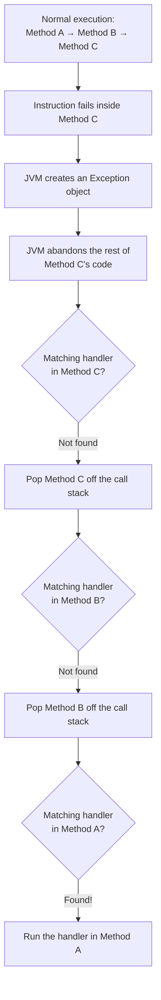
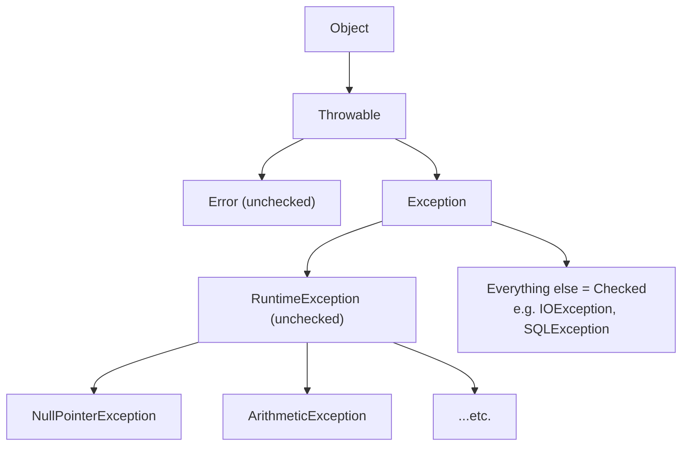
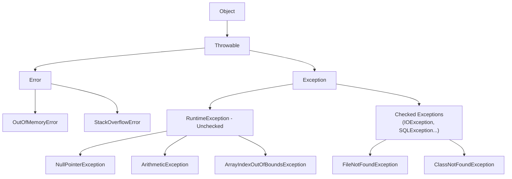
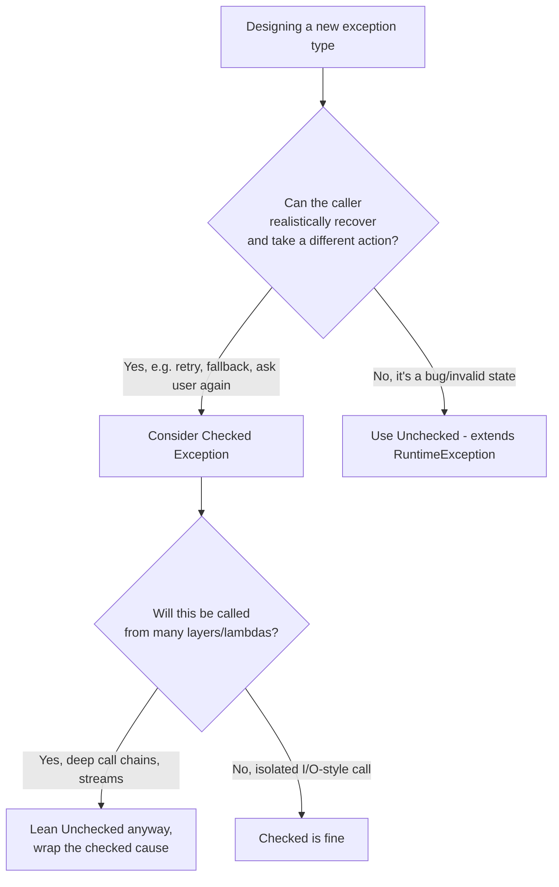
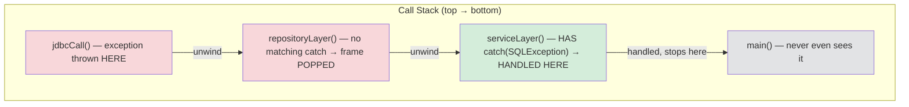
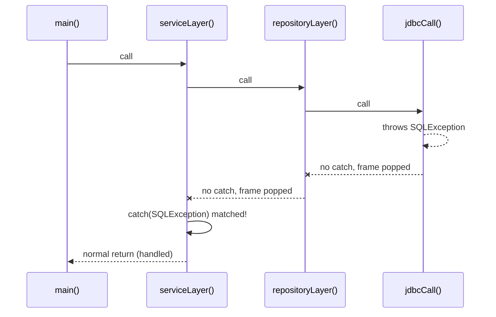
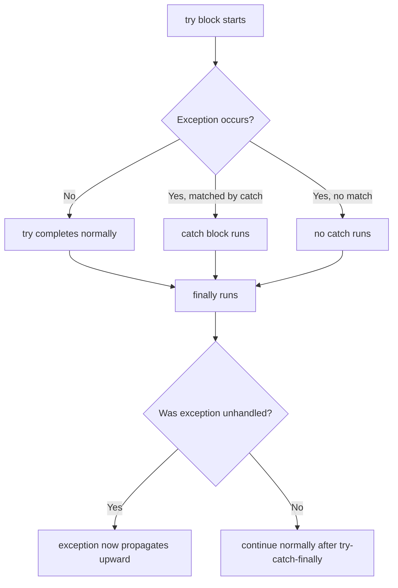
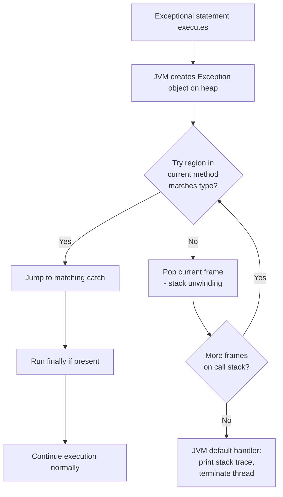
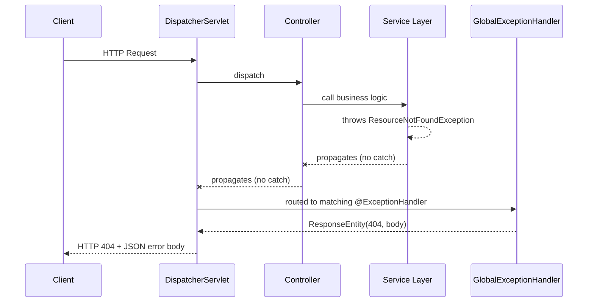
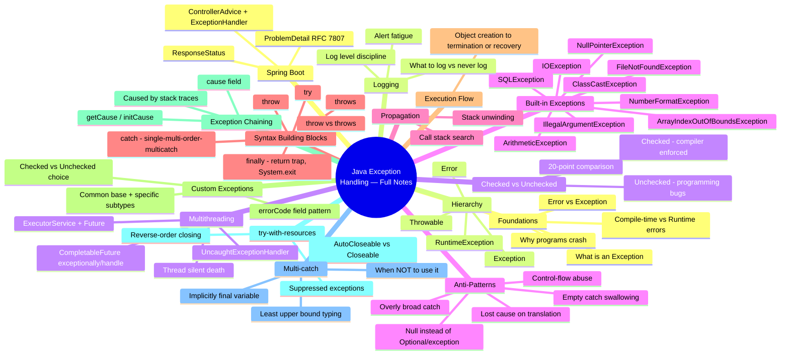

# Java Exception Handling —

---

## 📑 Table of Contents

**Foundations**

1. [Why Programs Crash](#1-why-programs-crash)
2. [Compile-Time Errors vs Runtime Errors](#2-compile-time-errors-vs-runtime-errors)
3. [What is an Exception?](#3-what-is-an-exception)
4. [Error vs Exception](#4-error-vs-exception)
5. [Exception Hierarchy](#5-exception-hierarchy)
6. [Checked Exceptions](#6-checked-exceptions)
7. [Unchecked Exceptions](#7-unchecked-exceptions)
8. [Checked vs Unchecked — Full Comparison](#8-checked-vs-unchecked-exceptions)
9. [Common Built-in Exceptions](#9-common-built-in-exceptions)
10. [Exception Propagation](#10-exception-propagation)
11. [try Block](#11-try-block)
12. [catch Block](#12-catch-block)
13. [finally Block](#13-finally-block)
14. [throw Keyword](#14-throw-keyword)
15. [throws Keyword](#15-throws-keyword)
16. [throw vs throws](#16-throw-vs-throws)
17. [Complete Execution Flow](#17-complete-execution-flow)

**Practical & Production**

18. [Custom (User-Defined) Exceptions](#18-custom-user-defined-exceptions)
19. [Exception Chaining](#19-exception-chaining)
20. [try-with-resources — Full Depth](#20-try-with-resources--full-depth)
21. [Multi-Catch Deep Dive & Pitfalls](#21-multi-catch-deep-dive--pitfalls)
22. [Exception Handling in Spring Boot REST APIs](#22-exception-handling-in-spring-boot-rest-apis)
23. [Logging Exceptions Correctly](#23-logging-exceptions-correctly)
24. [Exception Handling in Multi-threaded Code](#24-exception-handling-in-multi-threaded-code)
25. [Production Case Studies & Anti-Pattern Gallery](#25-production-case-studies--anti-pattern-gallery)

**Revision**

26. [Complete Revision Material](#26-complete-revision-material-full-series)

---

## 1. Why Programs Crash

### 1.1 What is it?

A program "crashes" when it reaches a state it has no instructions for — the CPU/JVM is told to do something impossible
or undefined (divide by zero, read memory that doesn't exist, call a method on something that isn't there), and
execution cannot sanely continue, so the runtime abandons the current path.

### 1.2 Why does this matter / why was handling needed?

Before structured exception handling existed (C, early assembly-level programming), a crash meant one of two things:

- The OS killed the process (segmentation fault), losing all in-memory state, or
- The programmer had manually checked *every single operation's return code* (`if (result == ERROR) { ... }`) to avoid
  ever hitting the crash path.

Neither is acceptable for a backend server handling thousands of requests. You cannot let **one bad request kill the
entire server process** (crash), and you cannot realistically hand-check every operation's return code across a
million-line codebase (error-code checking, C-style).

### 1.3 Real-Life Analogy

Think of a **call-center**, not a bank. A customer support agent (a thread executing your method) is on a call (
executing a method). If the agent suddenly doesn't know what to do — the customer asks something totally outside their
script — the whole call center doesn't shut down. The call gets escalated up the chain of command (supervisor →
manager → floor head) until someone knows how to handle it, or the call gets disconnected gracefully with an apology.
The call center (JVM/server process) keeps running for every other call in progress. This escalation-up-the-chain is
*exactly* how exception propagation works.

### 1.4 Internal Working — What Actually Happens



This "popping frames off the stack while searching for a handler" is called **stack unwinding** — covered in full detail
in Section 10.

### 1.5 Memory Perspective

- Every method call pushes a **stack frame** onto the **call stack** (local variables, parameters, return address).
- When a crash-causing statement runs, the JVM does not corrupt memory — it creates a normal **object** (the exception
  object) on the **heap**, just like any other object.
- Stack frames between the failure point and the handler are **discarded (popped)** — their local variables become
  eligible for garbage collection once unreferenced.

### 1.6 Backend Perspective

In a backend service, an unhandled crash-equivalent (an uncaught exception on a request thread) should **never take down
the whole server**. Frameworks like Spring Boot wrap every controller call so that even if your code throws something
unexpected, only *that one HTTP request* fails (with a 500 response) — the server (and every other in-flight request)
survives. This is only possible because Java has structured exception handling instead of raw OS-level crashes.

### 1.7 Code Example

```java
public class CrashDemo {
    public static void main(String[] args) {
        System.out.println("Server starting...");
        int result = divide(10, 0); // this line will fail
        System.out.println("This line never runs");
    }

    static int divide(int a, int b) {
        return a / b; // ArithmeticException: / by zero
    }
}
```

**Output:**

```
Server starting...
Exception in thread "main" java.lang.ArithmeticException: / by zero
    at CrashDemo.divide(CrashDemo.java:9)
    at CrashDemo.main(CrashDemo.java:4)
```

**Dry Run:** `main` pushes a frame → calls `divide`, pushing another frame → `a/b` evaluates `10/0` → JVM cannot produce
a mathematically valid `int` result → creates an `ArithmeticException` object on the heap → no `try/catch` exists
anywhere → JVM prints the **stack trace** and terminates only the `main` thread (in a real server, only the request
thread — the server process itself keeps running for other threads).

> **⚠️ Warning Box:** An uncaught exception on the *main* thread of a plain Java program ends the program. But an
> uncaught exception on *one request-handling thread* in Tomcat/Spring Boot does **not** end the server — this distinction
> is a favorite interview trap.

### 1.8 Interview Perspective

- **Q: Does an unhandled exception always crash the JVM?** No — it terminates only the thread that threw it, unless it's
  the sole/main thread with nothing else keeping the JVM alive.
- **Q: Why doesn't Java use error codes like C?** Error codes are easy to ignore (a programmer can just not check the
  return value); exceptions force a decision — you either handle them or explicitly declare/propagate them (for checked
  exceptions), and even unchecked ones are impossible to silently "lose" the way a return code can be.

### 1.9 Common Mistakes

- Beginners assume any exception anywhere kills the whole application — leads to overly defensive, unreadable code.
- Beginners don't realize each thread has its own independent crash boundary.

### 1.10 Best Practices

- Never let request-processing threads die silently without logging — always have a top-level handler (e.g., Spring's
  `@ControllerAdvice`) as a safety net.

---

## 2. Compile-Time Errors vs Runtime Errors

### 2.1 What is it?

- **Compile-time error:** the `javac` compiler refuses to produce a `.class` file because the code violates Java's
  grammar or type rules (missing semicolon, undeclared variable, type mismatch, unhandled checked exception).
- **Runtime error:** the code compiles fine (it's grammatically and type-correct) but fails while actually executing,
  because of data/state the compiler cannot predict (division by zero, null reference, bad array index).

### 2.2 Why does the distinction matter?

Java is a **statically typed, compiled language** — this was a deliberate design choice so that entire categories of
bugs are caught **before** the program ever runs, dramatically reducing production incidents compared to purely
dynamic/interpreted languages. Runtime errors are the ones that slip through this net because they depend on **actual
data** the compiler can't know in advance (what a user types, what's in a database row, what an external API returns).

### 2.3 Real-Life Analogy

Compile-time checking is like a **flight pre-check inspection** — checked before the plane ever leaves the gate (fuel
levels, door seals, instrument calibration — all things known in advance). A runtime error is like **turbulence
mid-flight** — something the ground inspection could never have predicted, discovered only once you're airborne, and the
crew has procedures (seatbelt signs, autopilot correction) to handle it without crashing the plane. Exception handling
is the mid-flight procedure.

### 2.4 Comparison Table

| #  | Aspect                     | Compile-Time Error                | Runtime Error                            |
|----|----------------------------|-----------------------------------|------------------------------------------|
| 1  | Detected by                | `javac` compiler                  | JVM during execution                     |
| 2  | When found                 | Before program runs               | While program is running                 |
| 3  | Also called                | Syntax/semantic error             | Runtime exception                        |
| 4  | Blocks `.class` generation | Yes                               | No                                       |
| 5  | Example                    | `int x = "hello";`                | `int x = 10/0;`                          |
| 6  | Depends on data            | No                                | Usually yes                              |
| 7  | Fixable by                 | Editing source code               | Handling with try-catch or fixing logic  |
| 8  | Cost to fix                | Cheapest (caught early)           | Expensive (may reach production)         |
| 9  | Related Java feature       | Static typing, checked exceptions | Exception classes, `Throwable` hierarchy |
| 10 | Backend relevance          | CI/CD build fails                 | Production incident / 500 error          |

### 2.5 Code Example

```java
// Compile-time error example
public class Demo {
    public static void main(String[] args) {
        int x = "hello"; // ERROR: incompatible types
    }
}
```

```
Demo.java:3: error: incompatible types: String cannot be converted to int
        int x = "hello";
                ^
```

```java
// Runtime error example
public class Demo2 {
    public static void main(String[] args) {
        int[] arr = new int[3];
        System.out.println(arr[5]); // compiles fine, fails at runtime
    }
}
```

```
Exception in thread "main" java.lang.ArrayIndexOutOfBoundsException: Index 5 out of bounds for length 3
```

### 2.6 Backend Perspective

Compile-time errors block your CI pipeline before deployment (good — cheap to catch). Runtime errors are the ones that
show up as **500 Internal Server Error** in production logs because they only manifest with real, unpredictable data (a
malformed JSON payload, a missing DB row, a `null` from a third-party API).

### 2.7 Interview Perspective

- **Q: Can a checked exception be a compile-time "error"?** Not exactly — an *unhandled checked exception* causes a
  compile-time **error** (won't compile), but the exception itself is still a runtime concept; the compiler is just
  enforcing that you acknowledge it.

### 2.8 Common Mistakes

Beginners call every red underline in the IDE a "runtime error" — it's almost always a compile-time issue caught before
running.

### 2.9 Best Practices

Treat every compiler warning/error as free debugging — it's the cheapest bug you'll ever fix compared to the same issue
reaching production.

---

## 3. What is an Exception?

### 3.1 What is it?

An **exception** is an *object* representing an abnormal event that disrupted the normal flow of a program's
instructions. In Java, it is literally an instance of a class (extending `Throwable`) carrying information: a message,
the type of problem, and a stack trace of exactly where it happened.

### 3.2 Why was it introduced?

Older/procedural languages returned **error codes** (an `int` like `-1` or `errno`) from functions to signal failure.
This had severe problems:

- The programmer could **ignore** the return value entirely — nothing forces you to check it.
- Error codes carry **no context** — `-1` doesn't tell you *why*, *where*, or *what data* caused it.
- Propagating an error up multiple layers meant manually checking and re-returning the code at **every single function
  call** — extremely repetitive and error-prone.
- No standard way to attach a human-readable message or the original cause.

Java's designers introduced **exception objects + automatic propagation** so failure information is rich (a full object
with a message and stack trace), impossible to silently ignore for checked exceptions, and automatically bubbles up
through as many layers as needed without manual re-checking at every level.

### 3.3 Real-Life Analogy

An exception is like an **incident report filed at a factory**, not just an alarm bell. An alarm bell (an error code)
only tells you *something* is wrong. An incident report tells you *what* failed (the exception type), *where* on the
factory floor it happened (the stack trace), *when* (timestamp), and *why*, according to the worker who filed it (the
message) — and it automatically gets escalated to the shift supervisor, then plant manager, until someone with the
authority to act receives it.

### 3.4 Internal Working

```java
throw new ArithmeticException("/ by zero");
```

1. `new ArithmeticException(...)` allocates an object on the **heap**.
2. Its constructor captures the current call stack into a `stackTrace` field (an array of `StackTraceElement`).
3. `throw` hands this object to the JVM's exception-dispatch mechanism, which starts searching for a matching `catch`.

### 3.5 Memory Perspective

The exception object lives on the **heap** like any other object. The **reference** to it is what gets passed around
during propagation (through the JVM's internal mechanism, not a normal variable) until a `catch` block captures it into
a local variable, at which point it behaves like a normal heap-referenced object subject to normal garbage collection
once no longer reachable.

### 3.6 Backend Perspective

Every REST API framework's error response (`{"status": 404, "message": "User not found"}`) is typically built by
catching a specific exception type and reading its message/fields — e.g., a `UserNotFoundException` thrown from a
service layer, caught centrally, and translated into an HTTP response.

### 3.7 Code Example

```java
public class ExceptionDemo {
    public static void main(String[] args) {
        try {
            int[] arr = new int[2];
            arr[3] = 10;
        } catch (ArrayIndexOutOfBoundsException e) {
            System.out.println("Caught: " + e.getMessage());
        }
    }
}
```

**Output:** `Caught: Index 3 out of bounds for length 2`

**Dry run:** `arr[3] = 10` attempts to write beyond the array's allocated memory → JVM creates an
`ArrayIndexOutOfBoundsException` object with message `"Index 3 out of bounds for length 2"` → since we're inside a
`try`, the JVM checks the matching `catch` immediately (no stack unwinding needed since it's in the same method) →
prints the message.

### 3.8 Interview Perspective

- **Q: Is an exception an error in the OS sense?** No — it's a normal Java **object**; nothing "breaks" at the OS/memory
  level when it's created.
- **Q: What's inside an exception object?** A detail message, an optional `cause` (chained exception), and a stack trace
  array.

### 3.9 Common Mistakes

Treating exception messages as optional/skippable — a `catch` block that swallows `e` without logging the message throws
away the "incident report."

### 3.10 Best Practices

Always give exceptions **meaningful messages** when throwing them yourself —
`throw new IllegalArgumentException("age must be positive, got: " + age)`, not just
`throw new IllegalArgumentException()`.

---

## 4. Error vs Exception

### 4.1 What is it?

Both `Error` and `Exception` are subclasses of `Throwable` — both are "throwable" objects — but they represent
fundamentally different categories of problems.

- **`Error`**: A serious problem, usually **outside your application's control**, typically related to the
  JVM/environment itself (out of memory, stack overflow, linkage failure). Your application code is generally **not
  expected to catch or recover** from these.
- **`Exception`**: A problem that occurs **within your application logic** that you are expected to anticipate and
  handle (bad input, missing file, network failure, business rule violation).

### 4.2 Why was this split introduced?

If everything throwable were treated identically, developers would write `catch` blocks trying to "recover" from things
that are fundamentally unrecoverable — e.g., catching `OutOfMemoryError` and attempting to continue as if nothing
happened, when the JVM itself may already be in a corrupted/unstable state. Java's designers separated the hierarchy so
tooling, frameworks, and developers have a clear signal: `Exception` = "handle me, I'm expected"; `Error` = "the
environment is failing, don't pretend you can fix this."

### 4.3 Real-Life Analogy

An `Exception` is like a **customer complaint** at a restaurant — annoying, but part of normal operations, and staff are
trained (handlers exist) to resolve it (wrong order, slow service). An `Error` is like the **building's power grid
failing** — not something a waiter can "handle" with better customer service; the whole restaurant's operating
environment is compromised, and the correct response is evacuation/shutdown, not a fix from within.

### 4.4 Comparison Table

| #  | Aspect                   | Error                                    | Exception                             |
|----|--------------------------|------------------------------------------|---------------------------------------|
| 1  | Package                  | `java.lang.Error`                        | `java.lang.Exception`                 |
| 2  | Cause                    | JVM/environment (memory, stack, linkage) | Application logic / external input    |
| 3  | Recoverable?             | Generally no                             | Generally yes                         |
| 4  | Should you catch it?     | Usually no                               | Yes, when meaningful                  |
| 5  | Checked or unchecked?    | Unchecked                                | Can be either                         |
| 6  | Examples                 | `OutOfMemoryError`, `StackOverflowError` | `IOException`, `NullPointerException` |
| 7  | Common cause             | JVM resource exhaustion, native failures | Bad input, missing resources, bugs    |
| 8  | Typical backend response | Restart the instance / alert on-call     | Return proper HTTP error response     |
| 9  | Compiler enforcement     | None                                     | Enforced for checked subclasses       |
| 10 | Extends                  | `Throwable`                              | `Throwable`                           |

### 4.5 Code Example

```java
public class ErrorDemo {
    public static void main(String[] args) {
        recurse(1); // triggers a StackOverflowError
    }

    static void recurse(int n) {
        recurse(n + 1); // no base case
    }
}
```

```
Exception in thread "main" java.lang.StackOverflowError
    at ErrorDemo.recurse(ErrorDemo.java:5)
    ... (repeated thousands of times)
```

**Dry run:** Each call to `recurse` pushes a new stack frame; since there's no base case, frames keep piling up until
the JVM's fixed-size call stack is exhausted → JVM throws `StackOverflowError` — technically catchable, but catching it
is almost never meaningful because the call stack (and often broader JVM health) is already in a degraded state.

### 4.6 Backend Perspective

In production, an `OutOfMemoryError` on a Spring Boot service is treated as an **infrastructure incident** (the
pod/container is killed and restarted by Kubernetes), not something the application catches and "handles" gracefully —
because by the time you're out of memory, you often can't even safely allocate the objects needed to log the failure
well.

### 4.7 Interview Perspective

- **Q: Can you catch an `Error`?** Syntactically yes (`catch (Error e)`), but it's considered bad practice except in
  rare framework-level scenarios (e.g., logging before a controlled shutdown).
- **Q: Is `Error` checked or unchecked?** Unchecked — the compiler never forces you to declare or catch it.

### 4.8 Common Mistakes

Catching `Throwable` broadly (`catch (Throwable t)`) to "catch everything" — this silently swallows `Error`s too, hiding
critical JVM-level failures.

### 4.9 Best Practices

Only ever catch `Exception` (or specific subtypes) in application code. Never catch `Error` or bare `Throwable` unless
you're writing framework-level infrastructure code with a very specific reason (e.g., a top-level thread guard that logs
and re-throws).

---

## 5. Exception Hierarchy

### 5.1 What is it?

Every throwable object in Java descends from a single root class, forming a strict tree:



### 5.2 Why was it designed this way?

Java needed a **single common type** so that generic catch-handling infrastructure (like a JVM default handler, or a
framework's global error interceptor) can be written once against `Throwable` and still work for anything thrown. Then,
splitting into `Error` vs `Exception` separates "environment failures" from "application-level problems" (see Section
4). Finally, splitting `Exception` into `RuntimeException` (unchecked) vs everything else (checked) lets the compiler
enforce handling **selectively** — for problems that are almost always recoverable/expected (missing file, DB down) the
compiler forces acknowledgment; for problems that are usually programming bugs (`null` dereference, bad array index)
forcing a `try/catch` everywhere would be noise, since bugs should be fixed, not routinely "handled."

### 5.3 Real-Life Analogy

Think of a company's **escalation org-chart**. `Throwable` is "any issue that can be raised at all." `Error` branches
off to Facilities/IT (building-level failures nobody on a project team can personally fix). `Exception` branches to
normal business issues. Within that, `RuntimeException` is like a **process violation caught by a manager on the spot
** (didn't follow the checklist — a bug), while checked exceptions are like **externally-caused delays that must be
formally logged in the project plan** (a vendor didn't deliver, a permit was denied) — things everyone agrees must be
explicitly accounted for in planning.

### 5.4 Class Details

| Class              | Role                                                                                    |
|--------------------|-----------------------------------------------------------------------------------------|
| `Throwable`        | Root of everything catchable/throwable. Holds message + stack trace + cause.            |
| `Error`            | Serious JVM/environment problems. Unchecked. Not meant to be caught.                    |
| `Exception`        | Application-level problems. Root for both checked & unchecked (via `RuntimeException`). |
| `RuntimeException` | Unchecked subtree — typically programming bugs (null refs, bad casts, bad indices).     |

### 5.5 Mermaid Diagram



### 5.6 Code Example

```java
public class HierarchyDemo {
    public static void main(String[] args) {
        try {
            throw new RuntimeException("custom runtime issue");
        } catch (Exception e) {          // catches it — RuntimeException IS-A Exception
            System.out.println("Caught by Exception handler: " + e.getMessage());
        }
    }
}
```

**Output:** `Caught by Exception handler: custom runtime issue`

This works because `catch (Exception e)` matches **any subclass** of `Exception`, per normal Java polymorphism rules
applied to the throwable hierarchy.

### 5.7 Backend Perspective

Spring's `@ExceptionHandler(Exception.class)` on a `@ControllerAdvice` class is a common **catch-all safety net** —
because `Exception` sits above both checked and unchecked branches, a single handler can catch almost everything your
application might throw (excluding `Error`), which is exactly why frameworks are designed around this hierarchy.

### 5.8 Interview Perspective

- **Q: Is `RuntimeException` checked or unchecked?** Unchecked — despite extending `Exception`.
- **Q: Why does `RuntimeException` extend `Exception` and not `Error`, if it's unchecked like `Error`?** Because
  conceptually it's still an *application*-level problem (a bug in your logic), not a JVM/environment failure — the
  checked/unchecked split is a compiler-enforcement detail, not the primary conceptual split.
- **Q: Can you create your own exception hierarchy?** Yes — extend `Exception` for a custom checked exception, or
  `RuntimeException` for a custom unchecked one.

### 5.9 Common Mistakes

Assuming "unchecked" and "Error" are the same category — they're not; `RuntimeException` is unchecked but still lives
under `Exception`, not `Error`.

### 5.10 Best Practices

When designing custom exceptions for a backend service, decide checked vs unchecked deliberately based on whether
callers can realistically recover (see Sections 6–8).

---

## 6. Checked Exceptions

### 6.1 What is it?

A **checked exception** is any subclass of `Exception` that is **not** a subclass of `RuntimeException`. The Java *
*compiler** checks — hence the name — that these are either caught (`try/catch`) or explicitly declared as escaping the
method (`throws`). Examples: `IOException`, `SQLException`, `ClassNotFoundException`.

### 6.2 Why was it introduced?

Java's designers wanted a category of failures that are **entirely predictable and expected** for certain operations (
reading a file that might not exist, calling a database that might be down, connecting to a network that might time out)
to be **impossible to accidentally ignore**. In C/C++, forgetting to check whether a file-open call failed was one of
the most common real-world bug sources. Checked exceptions make the compiler your safety net: you *cannot* compile code
that calls `new FileReader("x.txt")` without either catching `FileNotFoundException` or declaring `throws IOException` —
the compiler literally will not let you forget.

### 6.3 Advantages

- Forces explicit acknowledgment of foreseeable failure modes at compile time.
- Self-documents a method's contract — anyone calling it can see from the signature which failures to expect.
- Impossible to silently swallow at the type-system level (you must at least write *some* handling code, even if
  minimal).

### 6.4 Disadvantages

- Leads to **boilerplate** — deeply nested call chains require every layer to either catch or re-declare `throws`,
  cluttering method signatures.
- Encourages **anti-patterns** like catching broadly and doing nothing (`catch (IOException e) {}`) just to satisfy the
  compiler.
- Poor fit for **functional-style code** (lambdas, streams) since checked exceptions don't compose well with functional
  interfaces like `Function<T,R>`.
- This is a real, ongoing controversy in Java's design — many modern JVM languages (Kotlin, Scala) deliberately dropped
  checked exceptions.

### 6.5 Backend Usage

- `IOException` when reading/writing files, streams, or sockets.
- `SQLException` from raw JDBC calls (though Spring's `JdbcTemplate` wraps these into unchecked `DataAccessException`s
  specifically to avoid the boilerplate problem).
- `MessagingException` in JMS-based messaging.

> **📌 Backend Note:** Spring deliberately converts most checked exceptions from lower-level libraries (JDBC, etc.) into
> its own **unchecked** exception hierarchy (`DataAccessException` and subclasses) — a direct, real-world acknowledgment
> of Disadvantage #2/#3 above at massive industry scale.

### 6.6 Interview Discussion

- **Q: Name 3 checked exceptions.** `IOException`, `SQLException`, `ClassNotFoundException`.
- **Q: Why does Spring avoid checked exceptions in its own APIs?** To reduce boilerplate and keep method signatures
  clean, letting developers opt into handling only where it's meaningful rather than at every call site.

---

## 7. Unchecked Exceptions

### 7.1 What is it?

An **unchecked exception** is any subclass of `RuntimeException` (or `Error`, though that's a separate category — see
Section 4). The compiler does **not** force you to catch or declare these.

### 7.2 Why introduced / Runtime Philosophy

The Java designers' reasoning: some failures are **programming bugs**, not foreseeable external conditions. A
`NullPointerException` almost always means *your code* dereferenced something it shouldn't have — the fix is to *
*correct the code**, not to wrap every single line in a `try/catch`. Forcing a `throws NullPointerException` on nearly
every method in existence (since almost any object access could theoretically NPE) would make the checked-exception
mechanism meaningless noise. So the philosophy is: **checked = foreseeable external failure you should plan for;
unchecked = a defect that should be fixed at the source, not defensively caught everywhere.**

### 7.3 Design Reasoning

This is effectively a **cost/benefit split**:

- If nearly *every* method could throw it (e.g., NPE), checked-declaring it everywhere provides zero signal — unchecked.
- If only *specific* operations can fail for *external, expected* reasons (file I/O, network, DB), checked-declaring is
  a useful, rare, meaningful signal — checked.

### 7.4 Backend Usage

- `NullPointerException` — accessing a field/method on a `null` reference (e.g., an entity not found but not
  null-checked).
- `IllegalArgumentException` / `IllegalStateException` — thrown deliberately by validation code for bad input or invalid
  object state.
- Nearly all Spring runtime exceptions (`DataAccessException`, `HttpClientErrorException`) are unchecked by design (see
  Section 6.5).

### 7.5 Code Example

```java
public class UncheckedDemo {
    public static void main(String[] args) {
        String s = null;
        System.out.println(s.length()); // NullPointerException — no throws needed, compiles fine
    }
}
```

This compiles without any `try/catch` or `throws` declaration — proof that unchecked exceptions impose zero compile-time
obligation.

### 7.6 Interview Perspective

- **Q: Why is `NullPointerException` unchecked?** Because it can occur almost anywhere any object reference is used, so
  mandatory declaration everywhere would be meaningless — it's treated as a bug to fix, not a condition to plan around.

---

## 8. Checked vs Unchecked Exceptions

### 8.1 Full Comparison Table (20+ points)

| #  | Aspect                                   | Checked Exception                                         | Unchecked Exception                                          |
|----|------------------------------------------|-----------------------------------------------------------|--------------------------------------------------------------|
| 1  | Parent class                             | `Exception` (excluding `RuntimeException`)                | `RuntimeException` (or `Error`)                              |
| 2  | Compiler enforcement                     | Must catch or declare (`throws`)                          | No enforcement at all                                        |
| 3  | Checked at                               | Compile time                                              | Not checked at compile time                                  |
| 4  | Represents                               | Foreseeable external failure                              | Programming bug / logic error                                |
| 5  | Examples                                 | `IOException`, `SQLException`                             | `NullPointerException`, `ArithmeticException`                |
| 6  | Typical cause                            | File missing, network down, DB unreachable                | Null dereference, bad cast, bad index                        |
| 7  | Recovery expectation                     | Often recoverable (retry, fallback)                       | Usually requires a code fix, not recovery                    |
| 8  | Method signature impact                  | Forces `throws` declaration if not caught                 | No signature change required                                 |
| 9  | Boilerplate                              | High (nested try/catch or throws chains)                  | Low                                                          |
| 10 | Functional interfaces (lambdas)          | Poor fit — doesn't compose                                | Fits naturally                                               |
| 11 | Spring's philosophy                      | Wrapped into unchecked equivalents                        | Preferred throughout Spring APIs                             |
| 12 | Testing                                  | Must explicitly set up/catch in tests                     | Can occur unexpectedly in tests too                          |
| 13 | Where declared                           | `throws IOException` in signature                         | Rarely declared explicitly (though allowed)                  |
| 14 | Introduced to solve                      | Silently-ignored external failures (like C's error codes) | Avoid excessive mandatory handling for bugs                  |
| 15 | Common criticism                         | "Boilerplate hell" in large codebases                     | Can crash silently if genuinely unhandled                    |
| 16 | Custom exception design                  | `extends Exception`                                       | `extends RuntimeException`                                   |
| 17 | Caught by generic `catch (Exception e)`? | Yes                                                       | Yes (since `RuntimeException` IS-A `Exception`)              |
| 18 | Typical layer thrown from                | I/O, DB, network layers                                   | Service/validation/business logic layers                     |
| 19 | Forces documentation                     | Yes, via signature                                        | No — must rely on Javadoc/comments                           |
| 20 | Real-world example                       | `FileNotFoundException` reading a config file             | `IllegalArgumentException` for bad user input in a validator |
| 21 | Kotlin/Scala stance                      | Both dropped mandatory checking entirely                  | N/A — matches Java's unchecked behavior                      |
| 22 | Impact on API evolution                  | Adding a new checked exception breaks all callers         | Adding a new unchecked exception doesn't break compilation   |

### 8.2 Decision Tree — Which Should *You* Use When Designing a Custom Exception?



---

## 9. Common Built-in Exceptions

> For each exception: **Why it occurs → Real backend example → How to prevent it → Interview questions**

### 9.1 `ArithmeticException` (unchecked)

- **Why:** An illegal arithmetic operation — most commonly integer division/modulo by zero. (Note: floating-point
  division by zero does *not* throw this — it yields `Infinity`/`NaN`.)
- **Backend example:** Calculating an average (`totalScore / numberOfAttempts`) when `numberOfAttempts` is `0` because a
  user hasn't submitted anything yet.
- **Prevention:** Validate divisors before dividing; guard clause `if (count == 0) return 0;`.
- **Interview Q:** *Does `10.0 / 0` throw an exception?* No — it evaluates to `Infinity` since it's floating-point, not
  integer, division.

### 9.2 `NullPointerException` (unchecked)

- **Why:** Calling a method or accessing a field on a reference that currently holds `null`.
- **Backend example:** `userRepository.findById(id).getName()` — if `findById` returns `null` (rather than the modern
  `Optional`) for a missing user, `.getName()` throws NPE.
- **Prevention:** Use `Optional<T>` for methods that may not find a result; validate DTOs before use; use
  `Objects.requireNonNull()` early to fail fast with a clear message.
- **Interview Q:** *What is a "Helpful NullPointerException" (JEP 358)?* A JVM feature (Java 14+) that prints exactly
  *which* variable was null in the expression, not just the line number.

### 9.3 `ArrayIndexOutOfBoundsException` (unchecked)

- **Why:** Accessing an array index `< 0` or `>= array.length`.
- **Backend example:** Parsing a CSV/pipe-delimited line into fields by fixed index (`parts[4]`) when a malformed row
  has fewer columns than expected.
- **Prevention:** Check `array.length` before indexing, or use collection APIs (`List.get()` with bounds already
  validated) and defensive length checks after splitting external input.
- **Interview Q:** *Is this checked or unchecked, and why?* Unchecked — it's a `RuntimeException` subclass, treated as a
  programming/logic bug (off-by-one, bad assumption about input shape).

### 9.4 `NumberFormatException` (unchecked — subclass of `IllegalArgumentException`)

- **Why:** `Integer.parseInt("abc")` or similar — a `String` doesn't represent a valid number in the expected format.
- **Backend example:** Parsing a query parameter (`?page=abc`) that a client sent incorrectly in a REST API.
- **Prevention:** Validate the string format (regex or try/catch at the boundary) before parsing; return a
  `400 Bad Request` rather than letting it propagate as a `500`.
- **Interview Q:** *Why does it extend `IllegalArgumentException` rather than a totally separate class?* Because a
  malformed numeric string IS conceptually an illegal argument — Java reuses the existing hierarchy for semantic
  accuracy.

### 9.5 `ClassCastException` (unchecked)

- **Why:** Attempting to cast an object to a type it isn't actually an instance of, e.g.
  `Object o = "hi"; Integer i = (Integer) o;`.
- **Backend example:** Casting a value pulled from a generic `Map<String, Object>` (common in JSON-deserialized payloads
  or cache stores) to the wrong expected type.
- **Prevention:** Use `instanceof` checks before casting, or prefer generics/typed DTOs over raw `Object` maps wherever
  possible.
- **Interview Q:** *Why doesn't generics fully eliminate this?* Due to **type erasure** — generic type info is stripped
  at runtime, so unsafe casts through raw types or `Object` can still slip past the compiler.

### 9.6 `IllegalArgumentException` (unchecked)

- **Why:** Thrown *deliberately* by methods to signal a caller passed an invalid/unsupported argument.
- **Backend example:** A service method `setDiscount(double percent)` throwing this if `percent < 0 || percent > 100`.
- **Prevention:** N/A from the caller's side — the prevention is on the *caller* to validate/sanitize input before
  calling; from the API design side, document valid ranges clearly.
- **Interview Q:** *Is this typically thrown by the JVM or by developers?* Mostly thrown deliberately by developers as
  part of input validation — unlike NPE/AIOOBE which the JVM throws automatically.

### 9.7 `IOException` (**checked**)

- **Why:** A general failure during input/output operations — file not found mid-read, disk full, network stream broken.
- **Backend example:** Reading an uploaded file's contents in a file-upload endpoint, where the underlying disk write
  fails.
- **Prevention:** Use try-with-resources to guarantee stream closure; validate file existence/permissions upfront; wrap
  with retries for transient I/O issues.
- **Interview Q:** *Why is `IOException` checked while `NullPointerException` isn't?* I/O failure is an expected,
  external, foreseeable condition (Section 6–7 philosophy) — not a bug in your logic.

### 9.8 `FileNotFoundException` (**checked** — subclass of `IOException`)

- **Why:** Attempting to open a file for reading that doesn't exist (or for writing where it can't be created).
- **Backend example:** Loading a configuration or template file whose path was misconfigured in a deployment.
- **Prevention:** Check `file.exists()` before opening (though this has a TOCTOU race in theory); prefer classpath
  resources for bundled config over filesystem paths.
- **Interview Q:** *Why is this a separate class instead of just `IOException`?* To let callers catch this specific,
  common, actionable case (missing file) separately from more general I/O failures if they want different handling.

### 9.9 `SQLException` (**checked**)

- **Why:** Any failure during a JDBC database operation — connection lost, constraint violation, invalid SQL, timeout.
- **Backend example:** A raw JDBC `INSERT` violating a unique-key constraint (duplicate email registration).
- **Prevention:** Validate uniqueness at the application layer before insert where feasible; use connection pooling with
  proper timeout config; let Spring's `DataAccessException` wrapping convert it to unchecked at the framework boundary.
- **Interview Q:** *How does Spring make working with `SQLException` less painful?* `JdbcTemplate`/Spring Data catch
  every `SQLException` internally and rethrow as an appropriate unchecked `DataAccessException` subtype, removing the
  checked-exception boilerplate from application code.

### 9.10 Summary Table

| Exception                        | Checked/Unchecked | Typical Root Cause       |
|----------------------------------|-------------------|--------------------------|
| `ArithmeticException`            | Unchecked         | Divide by zero (integer) |
| `NullPointerException`           | Unchecked         | Dereferencing `null`     |
| `ArrayIndexOutOfBoundsException` | Unchecked         | Bad array index          |
| `NumberFormatException`          | Unchecked         | Invalid numeric string   |
| `ClassCastException`             | Unchecked         | Invalid type cast        |
| `IllegalArgumentException`       | Unchecked         | Bad method argument      |
| `IOException`                    | Checked           | I/O failure              |
| `FileNotFoundException`          | Checked           | Missing file             |
| `SQLException`                   | Checked           | DB operation failure     |

---

## 10. Exception Propagation

### 10.1 What is it?

**Propagation** is the process by which an exception, if not caught in the method where it occurred, automatically
travels back up through the chain of method calls (the call stack) until it finds a matching `catch` block, or reaches
the very top with none found.

### 10.2 Why does Java do this automatically?

Without automatic propagation, every single method in a call chain would need explicit code to check "did the method I
just called fail?" and manually re-throw/return that failure upward — exactly the error-code pattern Java was designed
to avoid (Section 3.2). Automatic propagation means only the layer that can *meaningfully* handle a problem needs a
`catch` — everything in between can stay clean.

### 10.3 Real-Life Analogy

Like a **broken elevator request in a high-rise office**: an employee on floor 3 reports it (throws), it's not something
floor 3's front-desk can fix (no catch there), so it's escalated to floor 5 facilities coordinator (still can't fix — no
catch), then to the building manager's office who actually has a maintenance contract (catch found, handled). Nobody in
between needed to *personally* solve the elevator — they just passed it along, exactly like Java's stack unwinding.

### 10.4 Internal Working — Stack Unwinding, Step by Step

`main()` calls `serviceLayer()` calls `repositoryLayer()` calls `jdbcCall()`. Here's the call stack, from top (most
recently called) to bottom, and what happens to each frame:





### 10.5 Code Example

```java
public class PropagationDemo {
    public static void main(String[] args) {
        serviceLayer();
        System.out.println("main continues normally");
    }

    static void serviceLayer() {
        try {
            repositoryLayer();
        } catch (ArithmeticException e) {
            System.out.println("Handled in serviceLayer: " + e.getMessage());
        }
    }

    static void repositoryLayer() {
        jdbcCall(); // no try/catch here — propagates upward
    }

    static void jdbcCall() {
        int x = 5 / 0; // exception originates here
    }
}
```

**Output:**

```
Handled in serviceLayer: / by zero
main continues normally
```

**Dry Run:** `jdbcCall()`'s frame is popped (no catch) → `repositoryLayer()`'s frame is popped (no catch) →
`serviceLayer()`'s `catch` matches → handled → `main()` proceeds completely normally, never even aware an exception
occurred three calls deep.

### 10.6 Backend Perspective

This is precisely why a **single global exception handler** (Spring's `@ControllerAdvice` + `@ExceptionHandler`) works
for an entire application: an exception thrown deep in a repository or service layer, with no local `catch`, will
automatically propagate all the way up to the framework's dispatcher servlet, which is where the global handler
intercepts it — you don't need a `catch` block in every controller method.

### 10.7 Interview Perspective

- **Q: What happens if propagation reaches `main()` with no catch anywhere?** The JVM's default handler prints the stack
  trace and terminates the thread (Section 1).
- **Q: Does `finally` run during propagation even if the exception isn't caught in that method?** Yes — `finally` always
  runs for its own `try` before the frame is popped, regardless of whether that method catches the exception (see
  Section 13).

### 10.8 Common Mistakes

Catching exceptions too early/too deep (e.g., inside a low-level DB helper) just to log and immediately rethrow with no
other purpose — this clutters low layers instead of letting propagation do its job up to a single, centralized handler.

### 10.9 Best Practices

Catch at the layer that has enough **context to make a decision** (retry? fallback? return an HTTP error?) — not
necessarily the layer closest to where it occurred.

---

## 11. try Block

### 11.1 What is it?

A `try` block wraps a section of code that **might** throw an exception, telling the JVM "watch this region; if
something goes wrong inside here, look for a handler instead of crashing the thread immediately."

### 11.2 Why was it introduced?

Before structured `try`, error checking was interleaved with normal logic line-by-line (`if (openFile() == ERROR) {...}`
after every risky call), making it hard to visually separate "the happy path" from "the error-handling path." `try`
cleanly **isolates** risky code into one visually distinct block, and separates the recovery logic (`catch`) into its
own block, dramatically improving readability.

### 11.3 Real-Life Analogy

A `try` block is like a **safety-netted trapeze rehearsal zone** in a circus — performers attempt risky maneuvers only
within the netted area; if they fall (an exception), the net (catch) is right there ready to catch them within that
designated zone, rather than the fall being handled ad-hoc wherever it happens.

### 11.4 Internal Working

At the bytecode level, the compiler generates an **exception table** attached to the method — a table of
`(start_pc, end_pc, handler_pc, exception_type)` entries. When an exception is thrown, the JVM checks the *currently
executing method's* exception table to see if the current instruction pointer falls within any `try` region whose
declared type matches — this is how `try` is implemented, not via runtime "watching," but via a static lookup table
checked at throw-time.

### 11.5 Memory Perspective

A `try` block itself allocates **no extra memory** at runtime beyond the normal stack frame — the exception table lives
in the compiled `.class` file's method metadata, not as runtime objects.

### 11.6 Backend Perspective

Every controller method that calls a service, every service that calls a repository, wraps the "risky" call (DB access,
external API call, file I/O) in a `try`, keeping validation/business logic outside it clean and separate from recovery
logic.

### 11.7 Code Example

```java
try{
int result = 100 / 0;
    System.out.

println("Never printed: "+result);
}catch(
ArithmeticException e){
        System.out.

println("Recovered: "+e.getMessage());
        }
```

**Execution flow:** JVM enters the `try` region → `100/0` throws → JVM immediately abandons the rest of the `try`
block (the `println` never runs) → checks the exception table → finds a matching `catch` → jumps there.

### 11.8 Interview Perspective

- **Q: Can a `try` block exist without `catch`?** Yes, if followed by `finally` (`try { } finally { }` is valid).
- **Q: Can you have a `try` with no `catch` and no `finally`?** No — a `try` must be followed by at least one `catch` or
  a `finally`.

### 11.9 Common Mistakes

Wrapping far too much code in one giant `try` block, making it unclear which specific line could throw which specific
exception — hurts both readability and precision of handling.

### 11.10 Best Practices

Keep `try` blocks as **narrow as possible** — wrap only the specific risky operation(s), not entire methods, so the
handler's intent is unambiguous.

---

## 12. catch Block

### 12.1 What is it?

A `catch` block is the **handler** — code that runs when an exception matching its declared type is thrown inside the
corresponding `try`. It receives the exception object as a parameter, letting you inspect, log, recover from, or
translate it.

### 12.2 Why was it introduced?

`catch` is the direct counterpart to `try` — separating *what to do when things go wrong* into its own clearly-scoped
block, rather than mixing recovery logic inline with normal logic (the old error-code style).

### 12.3 Real-Life Analogy

If `try` is the netted trapeze zone, `catch` is the **specific rescue crew member trained for a specific type of fall
** — one crew member specializes in catching a fall from the high bar, another for falls from the tightrope. Multiple
`catch` blocks are like having multiple specialized crew members, each responsible only for the type of incident they're
trained for.

### 12.4 Single Catch

```java
try{
riskyOperation();
}catch(
IOException e){
        log.

error("I/O failed",e);
}
```

### 12.5 Multiple Catch

```java
try{
processPayment(order);
}catch(
InsufficientFundsException e){

notifyUserFundsIssue(e);
}catch(
PaymentGatewayTimeoutException e){

retryPayment(order);
}catch(
Exception e){
        log.

error("Unexpected payment failure",e);
}
```

Only the **first matching** `catch`, top to bottom, executes — the rest are skipped entirely, even if the exception
would technically also match a lower one.

### 12.6 Order of Catch Blocks — Why It Matters

Java requires **more specific (subclass) exception types before more general (superclass) types**. If a broader type is
listed first, the compiler flags an **unreachable code** error for any subclass listed after it, because the broader
catch would always match first, making the narrower one dead code.

```java
// COMPILE ERROR — IOException is a superclass of FileNotFoundException
catch(IOException e){...}
        catch(
FileNotFoundException e){...}   // ❌ unreachable — error
```

```java
// CORRECT — specific first, general last
catch(FileNotFoundException e){...}   // ✅
        catch(
IOException e){...}             // ✅ catches everything else IOException-related
```

### 12.7 Internal Working

At the bytecode level, when an exception is thrown, the JVM walks the method's exception table **top to bottom**,
checking `instanceof`-style compatibility between the thrown object's actual runtime type and each `catch` clause's
declared type, using the **first** entry whose range covers the current instruction and whose type matches (or is a
supertype of) the thrown exception.

### 12.8 Multi-Catch (Java 7+)

```java
try{
doWork();
}catch(IOException |
SQLException e){   // single block handles both
        log.

error("Resource or DB failure",e);
}
```

> **📌 Backend Note:** The variable `e` in a multi-catch is implicitly `final` and typed as the **least upper bound** of
> the listed types — you cannot reassign it, and its static type for method calls is the common supertype's API surface.

### 12.9 Backend Perspective

A Spring `@ExceptionHandler`-annotated method is essentially a **centralized, framework-managed `catch` block** applied
across an entire application, mapping specific exception types to specific HTTP status codes/response bodies.

### 12.10 Interview Perspective

- **Q: What happens if no catch block matches?** The exception propagates further up the call stack (Section 10),
  skipping this `try/catch` entirely (though `finally`, if present, still runs).
- **Q: Can a catch block itself throw a new exception?** Yes — this is common when translating a low-level exception
  into a higher-level, more meaningful one for the caller.

### 12.11 Common Mistakes

- **Catch order errors** — listing supertype before subtype (compile error, as shown above).
- **Swallowing exceptions** — `catch (Exception e) {}` with an empty body, silently discarding failure information.

### 12.12 Best Practices

Catch the **most specific type you can meaningfully act on**; use a final broad `catch (Exception e)` only as a
last-resort safety net with proper logging, never as your primary handling strategy.

---

## 13. finally Block

### 13.1 What is it?

A `finally` block contains code that is **guaranteed to execute** after the `try` (and any matching `catch`) completes —
whether the try succeeded, an exception was caught, or an exception is about to propagate uncaught. It's designed for *
*cleanup** that must happen no matter what.

### 13.2 Why was it introduced?

Before `finally`, cleanup code (closing a file, releasing a database connection, releasing a lock) had to be duplicated
at **every possible exit point** of risky code — after the normal path, and again inside every catch block, and it was
easy to forget one path, causing **resource leaks**. `finally` centralizes cleanup into a single guaranteed location.

### 13.3 Real-Life Analogy

`finally` is like the mandatory **"return your safety harness to the rack"** step at a climbing gym — whether the
climber successfully finished the route, fell partway (an exception was caught), or even had to be pulled off due to an
emergency (exception propagating out), the harness gets returned before anyone leaves the area. That step happens
unconditionally.

### 13.4 Execution Order & When It Runs



### 13.5 Cases Where `finally` Does NOT Execute

| Case                                                 | Why                                                               |
|------------------------------------------------------|-------------------------------------------------------------------|
| `System.exit()` called inside try/catch              | Terminates the JVM immediately — no further Java code runs at all |
| JVM crash (native crash, power failure, `kill -9`)   | The JVM process itself dies before any more bytecode executes     |
| Infinite loop inside `try` before reaching `finally` | Control never reaches the point where `finally` would trigger     |
| Daemon thread killed abruptly when JVM shuts down    | Daemon threads don't get guaranteed cleanup on JVM exit           |

### 13.6 Return Statement Behavior — A Classic Interview Trap

```java
static int test() {
    try {
        return 1;
    } finally {
        System.out.println("finally runs even after return!");
    }
}
```

**Output:** `finally runs even after return!` then the method returns `1`. The `return` value is **computed and staged
**, then `finally` runs, and *only then* control actually leaves the method.

**The dangerous trap — overriding the return value:**

```java
static int trap() {
    try {
        return 1;
    } finally {
        return 2;   // ⚠️ this SILENTLY overrides the try's return value!
    }
}
// trap() returns 2, NOT 1 — the try's return is discarded entirely
```

> **⚠️ Warning Box:** A `return` (or `throw`) inside `finally` **completely discards** any pending return value or
> in-flight exception from the `try`/`catch`. This is one of Java's most notorious footguns and a frequent interview
> question. **Never put a `return` inside `finally`.**

### 13.7 finally + System.exit()

```java
try{
        System.out.println("in try");
    System.

exit(0);
}finally{
        System.out.

println("this will NOT print");
}
```

`System.exit()` halts the JVM immediately — `finally` never gets a chance to run.

### 13.8 Backend Perspective

`finally` is the traditional mechanism for releasing JDBC `Connection`/`Statement`/`ResultSet` objects, closing file
streams, or releasing distributed locks (e.g., a Redis lock) — though modern Java strongly prefers **try-with-resources
** (Java 7+, using `AutoCloseable`) over manual `finally`-based cleanup, since it's less error-prone:

```java
// Preferred modern approach — no explicit finally needed
try(Connection conn = dataSource.getConnection();
PreparedStatement stmt = conn.prepareStatement(sql)){
        stmt.

executeUpdate();
}catch(
SQLException e){
        log.

error("DB operation failed",e);
}
// conn and stmt are automatically closed, in reverse order, even on exception
```

### 13.9 Interview Perspective

- **Q: Does `finally` always run?** Almost always — except `System.exit()`, JVM crash, or infinite loop before reaching
  it.
- **Q: What happens if both `catch` and `finally` throw exceptions?** The exception thrown by `finally` **wins** and
  propagates; the one from `catch` is suppressed (though accessible via `Throwable.getSuppressed()` in some
  resource-management contexts).
- **Q: Why is try-with-resources preferred over manual finally?** It automatically closes resources in the correct (
  reverse) order, handles multiple resources cleanly, and correctly preserves the original exception (attaching
  close-failures as *suppressed* exceptions) rather than silently overwriting it the way a careless manual `finally`
  can.

### 13.10 Common Mistakes

Putting `return`/`throw`/`break`/`continue` inside `finally` — silently discards the original outcome (Section 13.6).

### 13.11 Best Practices

Use `finally` only for cleanup, never for control flow; prefer try-with-resources for anything implementing
`AutoCloseable`.

---

## 14. throw Keyword

### 14.1 What is it?

`throw` is a **statement** used to explicitly signal that an exception has occurred *right now*, at this exact line —
either by throwing a newly-created exception object, or by re-throwing one you already have (e.g., inside a `catch`
block).

### 14.2 Why was it introduced?

Not every exceptional situation is detected automatically by the JVM (like `10/0` or a `null` dereference).
Business/domain rules — "a withdrawal amount exceeds account balance," "a discount code has expired" — are things **only
your code knows about**. `throw` gives developers a way to signal these self-detected failure conditions using the exact
same mechanism (propagation, catching) as JVM-detected ones.

### 14.3 Syntax

```java
throw new SomeExceptionType("descriptive message");
```

`throw` must be given an object that is an instance of `Throwable` (or a subclass) — you cannot `throw` an arbitrary
object or primitive.

### 14.4 Real Examples

```java
public void withdraw(double amount) {
    if (amount > balance) {
        throw new IllegalStateException(
                "Insufficient balance: requested " + amount + ", available " + balance);
    }
    balance -= amount;
}
```

```java
public User findUserOrThrow(String id) {
    return userRepository.findById(id)
            .orElseThrow(() -> new UserNotFoundException("No user with id: " + id));
}
```

### 14.5 Memory Behavior

`throw new SomeException(...)` performs a normal object allocation on the heap (like any `new`), then immediately hands
the reference to the JVM's exception-dispatch mechanism instead of assigning it to a variable and continuing
sequentially — execution of the current method **stops at that line**; nothing after `throw` in the same block ever
runs (making code after an unconditional `throw` **unreachable**, flagged by the compiler).

### 14.6 Backend Perspective

`throw` is how service-layer business rules signal violations — e.g., `throw new DuplicateEmailException(...)` during
user registration, later translated by a global exception handler into a `409 Conflict` HTTP response.

### 14.7 Interview Perspective

- **Q: Can you `throw` a checked exception from anywhere?** Only if the enclosing method either catches it or declares
  it via `throws` (for checked types) — this is enforced at compile time.
- **Q: Can `throw null` compile?** It compiles, but throws a `NullPointerException` at runtime instead of whatever you
  intended.

### 14.8 Common Mistakes

Throwing overly generic exceptions (`throw new Exception("error")`) instead of specific, meaningful custom types — makes
it impossible for callers to `catch` selectively.

### 14.9 Best Practices

Always throw the **most specific applicable type**, with a message containing the actual problematic value(s) for easier
debugging/logging.

---

## 15. throws Keyword

### 15.1 What is it?

`throws` is a **method-signature clause** (not a statement) declaring which checked exception(s) a method **might**
propagate to its caller, without handling them itself.

### 15.2 Why was it introduced?

This is the compiler-enforcement mechanism underpinning checked exceptions (Section 6) — it's how a method **advertises
its failure contract** to every caller, so the compiler can force them to acknowledge it too.

### 15.3 Purpose — Method Contracts

```java
public void readConfig(String path) throws IOException {
    Files.readAllLines(Paths.get(path));
}
```

This signature is a contract: "calling me might result in an `IOException`; you must catch it or declare it yourself."

### 15.4 Why Backend Developers Use It

In layered backend architectures, low-level I/O/DB methods often declare `throws SQLException`/`throws IOException`,
letting each layer decide: catch-and-translate here, or propagate further up to a layer with more context (see Section
10.9).

```java
// Repository layer — declares, doesn't handle
public Connection getConnection() throws SQLException {
    return dataSource.getConnection();
}

// Service layer — catches and translates into a domain-specific unchecked exception
public User getUser(String id) {
    try (Connection conn = getConnection()) {
        ...
    } catch (SQLException e) {
        throw new DataAccessException("Failed to fetch user " + id, e);
    }
}
```

### 15.5 Multiple Exceptions

```java
public void process() throws IOException, SQLException {
    ...
}
```

---

## 16. throw vs throws

| #  | Aspect                     | `throw`                                                          | `throws`                                                                       |
|----|----------------------------|------------------------------------------------------------------|--------------------------------------------------------------------------------|
| 1  | Type                       | Statement                                                        | Clause in method signature                                                     |
| 2  | Location                   | Inside a method/block body                                       | After method name, before `{`                                                  |
| 3  | Purpose                    | Actually raises an exception, right now                          | Declares a possible future exception                                           |
| 4  | Followed by                | A single exception **object** (`throw new X()`)                  | One or more exception **class names**                                          |
| 5  | Number allowed             | Exactly one object per `throw` statement                         | Multiple types, comma-separated                                                |
| 6  | Applies to                 | Runtime execution                                                | Compile-time contract                                                          |
| 7  | Used with                  | Any throwable object                                             | Method/constructor declarations only                                           |
| 8  | Effect on control flow     | Immediately transfers control (like a jump)                      | No runtime effect at all — purely declarative                                  |
| 9  | Checked exceptions         | Can throw a checked exception only if caught or declared         | Used specifically to declare checked exceptions (unchecked ones don't need it) |
| 10 | Mandatory?                 | Only when you want to signal a failure yourself                  | Only mandatory if the method has an unhandled checked exception internally     |
| 11 | Can appear multiple times  | Yes, in different branches/lines                                 | No — appears once in the signature (though listing multiple types)             |
| 12 | Example                    | `throw new IOException("bad");`                                  | `void read() throws IOException`                                               |
| 13 | Analogy                    | Actually raising your hand to report the problem                 | The pre-printed warning label saying "this job *can* involve X risk"           |
| 14 | Relationship               | Inside a method that (usually) also declares `throws` if checked | Declares what internal `throw` (or propagated calls) might produce             |
| 15 | Compile-time keyword check | N/A — it's an executable statement                               | Purely a declaration, no bytecode execution                                    |

---

## 17. Complete Execution Flow

### 17.1 The Full Journey of an Exception

Step by step, from the moment an exceptional statement runs to the moment the program either recovers or the thread
terminates:

1. **Exceptional statement executes** — e.g. `int x = 5 / 0;`
2. **JVM detects the illegal operation.**
3. **JVM instantiates the Exception object on the HEAP** — its constructor captures a snapshot of the current call stack
   into the object's `stackTrace` field.
4. **JVM consults the current method's exception table** — does the throw point fall inside a `try` region whose
   declared type matches (or is a supertype of) this exception?
    - **If yes** → jump to the matching `catch` block; run its handler code.
    - **If no** → **stack unwinding**: pop this method's stack frame entirely (its local variables become GC-eligible),
      move up to the caller's frame, and repeat this check for that caller — this repeats until a handler is found, or
      the stack is empty.
5. **`finally` (if any) runs regardless** of whether a handler was found.
6. **Outcome:**
    - If a handler was found → execution continues normally after the `try-catch-finally`.
    - If no handler was found anywhere → the JVM's default handler runs: it prints the stack trace and terminates the *
      *thread** (not necessarily the whole process — see Section 1.7).

### 17.2 Mermaid Version



### 17.3 Backend Perspective

Understanding this flow is exactly why a **global exception handler** placed at the outermost layer (Spring's
`DispatcherServlet` boundary via `@ControllerAdvice`) works reliably — it's simply the final, guaranteed-to-be-reached
`catch` at the top of the propagation chain for every request thread.

---

---

## 18. Custom (User-Defined) Exceptions

### 18.1 What is it?

A custom exception is a class **you write yourself**, extending `Exception` (checked) or `RuntimeException` (unchecked),
to represent a failure condition specific to *your* application's domain — something the built-in JDK exceptions can't
name precisely (`InsufficientFundsException`, `SeatAlreadyBookedException`, `InvalidCouponException`).

### 18.2 Why was this needed?

Built-in exceptions like `IllegalArgumentException` or `IllegalStateException` are generic — throwing them everywhere
tells a caller "something was wrong" but not **what business rule** was violated, so the caller (or a global handler)
can't map the failure to a precise, meaningful response. Java lets any class extend `Exception`/`RuntimeException`
specifically so teams can build a **domain-specific vocabulary of failures** that reads clearly in stack traces, logs,
and `catch` clauses, and that a global handler can map 1:1 to HTTP status codes or business responses.

### 18.3 Real-Life Analogy

Built-in exceptions are like a hospital's **generic triage categories** ("non-critical," "critical") — usable everywhere
but not diagnostic. A custom exception is like a **specific diagnosis code** (a specific ICD code) — precise enough that
the right department, the right specialist, and the right treatment protocol can be triggered automatically, instead of
a generalist having to re-investigate every time.

### 18.4 Internal Working

A custom exception is a completely ordinary class at the bytecode level — there is **no special JVM support** for "
user-defined" vs "built-in" exceptions. The JVM only cares about the inheritance chain up to `Throwable`. Extending
`RuntimeException` vs `Exception` purely changes what the **compiler** enforces (Section 6–8) — it has zero runtime
performance or JVM-internal difference.

### 18.5 Memory Perspective

Identical to any object — allocated on the heap when `new`'d, subject to normal GC once unreachable. Custom fields you
add (e.g., an `orderId` field) simply become extra instance fields on the heap object, exactly like any POJO.

### 18.6 Backend Perspective — Designing a Custom Exception Hierarchy

A common, production-proven pattern:

```java
// 1. A common abstract base for ALL your app's business exceptions
public abstract class ApplicationException extends RuntimeException {
    private final String errorCode;

    protected ApplicationException(String errorCode, String message) {
        super(message);
        this.errorCode = errorCode;
    }

    protected ApplicationException(String errorCode, String message, Throwable cause) {
        super(message, cause);
        this.errorCode = errorCode;
    }

    public String getErrorCode() {
        return errorCode;
    }
}

// 2. Specific, meaningful subtypes
public class ResourceNotFoundException extends ApplicationException {
    public ResourceNotFoundException(String resource, String id) {
        super("RESOURCE_NOT_FOUND", resource + " not found with id: " + id);
    }
}

public class InsufficientFundsException extends ApplicationException {
    public InsufficientFundsException(double requested, double available) {
        super("INSUFFICIENT_FUNDS",
                "Requested " + requested + " but only " + available + " available");
    }
}
```

> **📌 Backend Note:** Extending `RuntimeException` (unchecked) for business exceptions is the dominant modern
> convention — it avoids `throws` boilerplate cascading through every service/controller layer (Section 6.4), and a global
> handler (Section 5 below) catches them centrally regardless.

### 18.7 Code Example — End-to-End

```java
public class BankAccount {
    private double balance;

    public void withdraw(double amount) {
        if (amount > balance) {
            throw new InsufficientFundsException(amount, balance);
        }
        balance -= amount;
    }
}

public class Demo {
    public static void main(String[] args) {
        BankAccount acc = new BankAccount();
        try {
            acc.withdraw(500);
        } catch (InsufficientFundsException e) {
            System.out.println("Error code: " + e.getErrorCode());
            System.out.println("Message: " + e.getMessage());
        }
    }
}
```

**Output:**

```
Error code: INSUFFICIENT_FUNDS
Message: Requested 500.0 but only 0.0 available
```

### 18.8 Interview Perspective

- **Q: Should custom exceptions be checked or unchecked?** Depends on recoverability (Section 8.2) — but modern backend
  convention strongly favors unchecked for business-rule violations, reserving checked for genuinely low-level,
  foreseeable I/O-style operations.
- **Q: Why add an `errorCode` field instead of just relying on the exception class name?** Because error codes are
  stable, serializable identifiers safe to expose in an API response body or log/alert on — class names can change
  during refactors and shouldn't be a public contract.
- **Q: Should you override `toString()` on a custom exception?** Rarely necessary — `Throwable.toString()` already
  includes class name + message; only override for special formatting needs.

### 18.9 Common Mistakes

- Making every custom exception extend `Exception` "because errors are serious," without considering the
  checked-exception boilerplate cost across the whole call chain.
- Forgetting to call `super(message)` / `super(message, cause)` in the constructor — this leaves `getMessage()`
  returning `null`.
- Creating one custom exception **per method** instead of per **meaningful failure category** — leads to hundreds of
  near-duplicate classes.

### 18.10 Best Practices

- Always provide a constructor that accepts a `cause` (`Throwable`) — see Section 2.
- Keep a small, well-named **hierarchy** (a common base + specific subtypes) rather than one giant flat exception, or a
  proliferation of unrelated exceptions.
- Name them for the **failure**, not the **operation** — `OrderNotFoundException`, not `GetOrderFailedException`.

---

## 19. Exception Chaining

### 19.1 What is it?

Exception chaining is the practice of wrapping a **lower-level exception** (the "cause") inside a **higher-level, more
meaningful exception**, while preserving a reference to the original one — so nothing about the root cause is ever lost,
even as the exception is translated into a more domain-appropriate type as it moves up through layers.

### 19.2 Why was it introduced?

Before chaining was added (Java 1.4, via `initCause()` and cause-accepting constructors), developers who wanted to
translate a low-level exception into a higher-level one had only two bad options:

1. **Discard the original entirely** — `catch (SQLException e) { throw new ServiceException("DB failed"); }` — losing
   the real root cause, making production debugging nearly impossible (you'd only see "DB failed," not *why*).
2. **Stuff the original's message into a string** — `throw new ServiceException("DB failed: " + e.getMessage())` —
   losing the original stack trace and type information, which is often what you actually need to diagnose the issue.

Chaining solves both: you get a clean, meaningful exception type for callers **and** the full original stack trace/type,
accessible via `getCause()`.

### 19.3 Real-Life Analogy

Like a **police case file** that gets escalated between departments — the local precinct's detailed original report (the
root cause, with all its specific evidence) doesn't get thrown away when the case is escalated to a specialized
division; it's **attached** to the new, higher-level case summary. Anyone reviewing the case later can read the
top-level summary for the general picture, but can also drill down into the original report for full forensic detail.

### 19.4 Internal Working

`Throwable` has a `cause` field (of type `Throwable`, defaulting to itself if unset, meaning "no cause"). The
constructor `Throwable(String message, Throwable cause)` sets both `message` and `cause` in one call. `getCause()`
returns this field. When printed via `printStackTrace()`, Java automatically prints `Caused by: ...` sections
recursively for the entire chain.

### 19.5 Code Example

```java
public class ChainingDemo {
    public static void main(String[] args) {
        try {
            serviceLayer();
        } catch (ServiceException e) {
            e.printStackTrace();
        }
    }

    static void serviceLayer() throws ServiceException {
        try {
            repositoryLayer();
        } catch (SQLException e) {
            // Wrap the low-level cause into a meaningful high-level exception
            throw new ServiceException("Failed to fetch user data", e);
        }
    }

    static void repositoryLayer() throws SQLException {
        throw new SQLException("Connection refused by database");
    }
}

class ServiceException extends Exception {
    public ServiceException(String message, Throwable cause) {
        super(message, cause);
    }
}
```

**Output:**

```
ServiceException: Failed to fetch user data
    at ChainingDemo.serviceLayer(ChainingDemo.java:14)
    at ChainingDemo.main(ChainingDemo.java:4)
Caused by: java.sql.SQLException: Connection refused by database
    at ChainingDemo.repositoryLayer(ChainingDemo.java:19)
    at ChainingDemo.serviceLayer(ChainingDemo.java:12)
    ... 1 more
```

**Dry Run:** `repositoryLayer()` throws `SQLException` → `serviceLayer()` catches it, and instead of discarding it,
passes it as the second constructor argument to a new `ServiceException` → the resulting stack trace shows **both**
levels: the meaningful `ServiceException` at the top, and the original `SQLException` underneath via `Caused by:` —
the "... 1 more" line is Java deduplicating the identical shared stack frames between the two traces.

### 19.6 Backend Perspective

This is essential in layered architectures — a controller only needs to know "this failed" (via a clean, translated
exception type), but when an incident happens in production, the **on-call engineer reading the logs** needs the full
original root cause (was it a timeout? a constraint violation? a network partition?), which chaining preserves without
polluting the API-facing exception's identity.

### 19.7 Interview Perspective

- **Q: What does `getCause()` return if no cause was set?** `null`.
- **Q: What's the difference between `initCause()` and the cause-accepting constructor?** `initCause()` sets the cause
  *after* construction (useful when extending a class whose constructor doesn't accept a cause) and can only be called *
  *once** — calling it twice throws `IllegalStateException`.
- **Q: Does chaining affect performance meaningfully?** Negligible — it's just one extra object reference; the real
  cost (stack trace capture) happens regardless, on every `new Throwable`.

### 19.8 Common Mistakes

- Catching and rethrowing **without** passing the cause: `throw new ServiceException(e.getMessage())` — loses the
  original stack trace entirely, one of the most common real-world debugging killers.
- Chaining exceptions that add no real value ("wrapper for wrapper's sake") when simply letting the original propagate
  would be clearer.

### 19.9 Best Practices

Always chain when translating exception types across a layer boundary — never construct a new exception from just
another exception's `.getMessage()` string.

---

## 20. try-with-resources — Full Depth

### 20.1 What is it?

Introduced in Java 7, try-with-resources is a `try` variant that **automatically closes** one or more resources when the
block finishes — normally or via exception — without needing a manual `finally` block.

```java
try(Resource r = new Resource()){
        r.

use();
}
// r.close() is called automatically here, guaranteed
```

### 20.2 Why was it introduced?

Manual `finally`-based cleanup (Section 13) is **verbose and error-prone**, especially with multiple resources:

```java
// The OLD, error-prone way
Connection conn = null;
PreparedStatement stmt = null;
try{
conn =dataSource.

getConnection();

stmt =conn.

prepareStatement(sql);
    stmt.

executeUpdate();
}finally{
        if(stmt !=null){
        try{stmt.

close(); }catch(
SQLException e){ /* now what? */ }
        }
        if(conn !=null){
        try{conn.

close(); }catch(
SQLException e){ /* nested try/catch hell */ }
        }
        }
```

Notice the **nested try/catch inside finally** — closing itself can throw, and if it does, it can **silently overwrite**
the original exception from the `try` block (exactly the "return-in-finally" footgun from Section 13.6, but for
exceptions). Try-with-resources solves all of this automatically and correctly.

### 20.3 `AutoCloseable` vs `Closeable`

| Aspect                     | `AutoCloseable` (`java.lang`)           | `Closeable` (`java.io`)               |
|----------------------------|-----------------------------------------|---------------------------------------|
| Introduced                 | Java 7                                  | Java 5 (predates try-with-resources)  |
| `close()` throws           | `Exception` (broad)                     | `IOException` (specific)              |
| Idempotent close required? | Not mandated                            | Required (calling twice must be safe) |
| Relationship               | `Closeable extends AutoCloseable`       | Subinterface of `AutoCloseable`       |
| Typical implementers       | Custom resources, DB connections, locks | Streams, Readers, Writers             |

Any class implementing `AutoCloseable` (which just requires a `close()` method) can be used in try-with-resources — you
can make your **own** classes resource-managed this way.

### 20.4 Internal Working

The compiler **desugars** try-with-resources into the old-style pattern automatically, but done *correctly*:

```java
try(Resource r = new Resource()){
        r.

use();
}
```

compiles roughly to:

```java
Resource r = new Resource();
Throwable primaryException = null;
try{
        r.

use();
}catch(
Throwable t){
primaryException =t;
    throw t;
}finally{
        if(r !=null){
        if(primaryException !=null){
        try{
        r.

close();
            }catch(
Throwable closeException){
        primaryException.

addSuppressed(closeException); // NOT lost!
            }
                    }else{
                    r.

close();
        }
                }
                }
```

### 20.5 Suppressed Exceptions

If **both** the `try` body and the resource's `close()` throw, the `close()` exception is **not** discarded (unlike
manual `finally`'s classic footgun) — it's attached as a **suppressed exception** on the primary one, retrievable via
`getSuppressed()`.

```java
try(NoisyResource r = new NoisyResource()){
        throw new

RuntimeException("Primary failure");
}
// If r.close() also throws, that close-exception becomes a SUPPRESSED exception
// attached to "Primary failure" — visible via e.getSuppressed()
```

### 20.6 Multiple Resources

```java
try(Connection conn = dataSource.getConnection();
PreparedStatement stmt = conn.prepareStatement(sql);
ResultSet rs = stmt.executeQuery()){
        while(rs.

next()){...}
        }
```

Resources are closed in **reverse order** of declaration (`rs` first, then `stmt`, then `conn`) — the same order you'd
manually close them in nested `finally` blocks, but automatic and correct even under exceptions.

### 20.7 Backend Perspective

Nearly every JDBC operation, file-upload handler, and network-socket operation in production backend code should use
try-with-resources — it's the single most impactful change for preventing **connection pool exhaustion** and **file
descriptor leaks**, two extremely common real-world production incidents caused by forgotten manual `close()` calls on
error paths.

### 20.8 Interview Perspective

- **Q: What interface must a resource implement to be used in try-with-resources?** `AutoCloseable` (or its subtype
  `Closeable`).
- **Q: What happens if both the try body and close() throw?** The try body's exception is primary; the close() exception
  is attached as *suppressed*, not lost.
- **Q: In what order are multiple resources closed?** Reverse declaration order.
- **Q: Can you still have a catch/finally with try-with-resources?** Yes — `try (...) { } catch (...) { } finally { }`
  is fully valid; the resource-closing happens *before* the catch block runs, actually.

### 20.9 Common Mistakes

Manually calling `.close()` again inside the try body "just to be safe" — unnecessary (guaranteed already) and can throw
if the resource doesn't tolerate double-close.

### 20.10 Best Practices

Prefer try-with-resources over manual `finally` for **any** `AutoCloseable`; make your own resource-wrapping classes
implement `AutoCloseable` if they manage anything that needs guaranteed release (locks, temp files, native handles).

---

## 21. Multi-Catch Deep Dive & Pitfalls

### 21.1 Recap: What is it?

Introduced in Java 7 alongside try-with-resources, multi-catch lets a single `catch` clause handle **several unrelated
exception types** identically, using `|`:

```java
catch(IOException |
SQLException e){
        log.

error("Operation failed",e);
}
```

### 21.2 Why was it introduced?

Before Java 7, handling multiple exception types identically required **duplicated catch blocks** with copy-pasted
bodies:

```java
// OLD — duplicated logic
catch(IOException e){
        log.

error("failed",e);

notifyAdmin();
}catch(
SQLException e){
        log.

error("failed",e);   // exact same code, forced duplication

notifyAdmin();
}
```

This violates DRY and is a maintenance hazard (fixing the handler logic means updating it in N places). Multi-catch
collapses these into one block when the *handling logic* is genuinely identical.

### 21.3 The Type Rule — "Least Upper Bound"

The caught variable's **static type** is the most specific common supertype of all listed types — you can only call
methods available on **all** of them (i.e., methods declared on their common ancestor, typically inherited from
`Exception`/`Throwable` unless they share a more specific common parent).

```java
catch(FileNotFoundException |
NumberFormatException e){
        // e's static type here is Exception (their common ancestor)
        // You CANNOT call a method specific to only one of them without casting
        }
```

### 21.4 Rule: No Redundant Types

You cannot list a type and its own subclass together — the compiler rejects it as redundant, since the supertype already
covers the subtype.

```java
// COMPILE ERROR — IOException already covers FileNotFoundException
catch(IOException |
FileNotFoundException e){...}
```

### 21.5 Rule: The Variable is Implicitly Final

```java
catch(IOException |
SQLException e){
e =new

RuntimeException(); // ❌ COMPILE ERROR — e is implicitly final in multi-catch
}
```

This restriction exists because at the bytecode level, `e` might genuinely refer to objects of different, unrelated
runtime types across different executions — allowing reassignment would create ambiguity the compiler can't safely
reason about.

### 21.6 Pitfall: Overusing Multi-Catch to Avoid "Thinking"

```java
// ANTI-PATTERN — hides genuinely different failure semantics behind one generic handler
catch(InsufficientFundsException |InvalidCardException |
NetworkTimeoutException e){
        log.

error("Payment failed",e);
// ...but these need DIFFERENT business responses!
// Insufficient funds → tell user to add money
// Invalid card → tell user to check card details
// Network timeout → retry automatically
}
```

Multi-catch is appropriate only when the **recovery action is genuinely identical**. If the business response should
differ per exception type, use separate `catch` blocks instead — collapsing them into multi-catch just because "the code
looks similar" is a real anti-pattern seen in production codebases.

### 21.7 Backend Perspective

Multi-catch is most useful for **cross-cutting concerns** that are identical regardless of failure type — logging,
metrics incrementing, generic `500` responses — not for business-specific recovery logic.

```java

@ExceptionHandler({DataAccessException.class, TimeoutException.class})
public ResponseEntity<ErrorResponse> handleInfraFailure(Exception e) {
    return ResponseEntity.status(503).body(new ErrorResponse("Service temporarily unavailable"));
}
```

### 21.8 Interview Perspective

- **Q: Can multi-catch types be related by inheritance?** No — the compiler rejects redundant sub/super pairs.
- **Q: Why is the multi-catch variable implicitly final?** Because its runtime type varies across the alternative
  branches, and allowing reassignment would introduce type-safety ambiguity at the bytecode level.

### 21.9 Common Mistakes

Grouping exceptions into multi-catch purely to reduce line count, without checking whether their **appropriate recovery
logic** is actually the same.

### 21.10 Best Practices

Use multi-catch only for genuinely identical handling (logging/metrics/generic fallback); keep business-differentiated
recovery in separate catch blocks.

---

## 22. Exception Handling in Spring Boot REST APIs

### 22.1 What is it?

Spring Boot provides a **centralized exception-handling layer** so individual controllers don't need repetitive
`try/catch` blocks — exceptions thrown anywhere in the request-processing chain (controller → service → repository)
automatically propagate (Section 10) up to a **global handler**, which converts them into structured HTTP responses.

### 22.2 Why was this needed?

Without centralization, every controller method would need its own `try/catch` translating each possible exception into
an HTTP status + JSON body — massive duplication across dozens/hundreds of endpoints, and easy to get inconsistent (one
endpoint returns `{"error": "..."}`, another `{"message": "..."}`). Centralizing this logic in one place enforces *
*consistency** across the entire API surface.

### 22.3 `@ExceptionHandler` + `@ControllerAdvice`

```java

@ControllerAdvice
public class GlobalExceptionHandler {

    @ExceptionHandler(ResourceNotFoundException.class)
    public ResponseEntity<ErrorResponse> handleNotFound(ResourceNotFoundException e) {
        ErrorResponse body = new ErrorResponse(e.getErrorCode(), e.getMessage());
        return ResponseEntity.status(HttpStatus.NOT_FOUND).body(body);
    }

    @ExceptionHandler(InsufficientFundsException.class)
    public ResponseEntity<ErrorResponse> handleInsufficientFunds(InsufficientFundsException e) {
        ErrorResponse body = new ErrorResponse(e.getErrorCode(), e.getMessage());
        return ResponseEntity.status(HttpStatus.CONFLICT).body(body);
    }

    @ExceptionHandler(MethodArgumentNotValidException.class)
    public ResponseEntity<ErrorResponse> handleValidation(MethodArgumentNotValidException e) {
        String message = e.getBindingResult().getFieldErrors().stream()
                .map(f -> f.getField() + ": " + f.getDefaultMessage())
                .collect(Collectors.joining(", "));
        return ResponseEntity.badRequest().body(new ErrorResponse("VALIDATION_ERROR", message));
    }

    @ExceptionHandler(Exception.class) // catch-all safety net — last resort
    public ResponseEntity<ErrorResponse> handleGeneric(Exception e) {
        log.error("Unhandled exception", e); // ALWAYS log unexpected ones fully
        return ResponseEntity.status(HttpStatus.INTERNAL_SERVER_ERROR)
                .body(new ErrorResponse("INTERNAL_ERROR", "Something went wrong"));
    }
}
```

> **📌 Backend Note:** `@ControllerAdvice` works precisely because of **exception propagation** (Section 10) — none of
> these handler methods need to be "called"; Spring's `DispatcherServlet` automatically routes any uncaught exception from
> a controller to the matching `@ExceptionHandler`, exactly the way stack unwinding automatically finds a matching
`catch`.

### 22.4 `@ResponseStatus` — Simpler Declarative Alternative

```java

@ResponseStatus(HttpStatus.NOT_FOUND)
public class ResourceNotFoundException extends RuntimeException {
    public ResourceNotFoundException(String message) {
        super(message);
    }
}
```

Spring automatically maps this exception to a `404` without needing an explicit `@ExceptionHandler` — useful for simple
cases, though it couples the exception class itself to HTTP semantics (a design tradeoff — some teams prefer keeping
domain exceptions HTTP-agnostic and doing all mapping centrally in the `@ControllerAdvice`).

### 22.5 `ProblemDetail` (RFC 7807) — Modern Standard (Spring 6+)

```java

@ExceptionHandler(ResourceNotFoundException.class)
public ProblemDetail handleNotFound(ResourceNotFoundException e) {
    ProblemDetail pd = ProblemDetail.forStatusAndDetail(HttpStatus.NOT_FOUND, e.getMessage());
    pd.setTitle("Resource Not Found");
    pd.setProperty("errorCode", e.getErrorCode());
    return pd;
}
```

`ProblemDetail` standardizes the JSON error shape (`type`, `title`, `status`, `detail`, `instance` fields) per RFC 7807,
so API consumers get a **consistent, industry-standard** error contract instead of every team inventing its own ad-hoc
error JSON structure.

### 22.6 Exception Handling Flow in a Spring Request



### 22.7 Interview Perspective

- **Q: How does `@ControllerAdvice` "catch" exceptions without an explicit try/catch in the controller?** It relies
  entirely on automatic exception propagation (Section 10) reaching the `DispatcherServlet`, which Spring has wired to
  consult registered `@ExceptionHandler` methods.
- **Q: What's the danger of only having a catch-all `@ExceptionHandler(Exception.class)`?** It masks distinct failure
  types behind identical generic `500` responses, losing the precision that lets API clients react appropriately (retry
  vs fix input vs give up).
- **Q: Why is `ProblemDetail`/RFC 7807 preferred over a custom error JSON shape?** Standardization — client tooling, API
  gateways, and documentation generators can rely on a consistent, well-known contract across services/teams.

### 22.8 Common Mistakes

- Only handling `Exception.class` generically, losing the ability to return different status codes per failure type.
- Leaking internal details (raw stack traces, SQL fragments, internal class names) into the HTTP response body — a real
  security concern (see Section 6.4 below).

### 22.9 Best Practices

Handle **specific** exception types with precise status codes first; keep exactly one generic `Exception.class` handler
as the last-resort safety net, always logging it fully server-side while returning a generic, non-leaky message to the
client.

---

## 23. Logging Exceptions Correctly

### 23.1 What is it?

Exception logging is the practice of recording enough information about a failure — type, message, stack trace, and
relevant context — so it can be diagnosed later, without either losing critical detail or exposing sensitive/dangerous
information.

### 23.2 Why does this deserve its own section?

Logging is where most of the careful work from Sections 1–5 (chaining, custom exceptions, structured handling) either *
*pays off or gets thrown away**. A perfectly designed exception hierarchy is useless if the code that finally catches it
logs only `e.getMessage()` and discards the stack trace and cause chain — this is one of the single most common
real-world causes of "unreproducible production bugs."

### 23.3 What TO Log

| What                                                          | Why                                                                                                                     |
|---------------------------------------------------------------|-------------------------------------------------------------------------------------------------------------------------|
| The full exception object (not just `.getMessage()`)          | Logging frameworks (SLF4J/Logback) print the entire stack trace + `Caused by:` chain when you pass the throwable itself |
| Relevant business context (order ID, user ID — non-sensitive) | Lets you correlate the failure with a specific transaction/request                                                      |
| A request/correlation ID                                      | Lets you trace this failure across multiple microservices in a distributed system                                       |
| The layer/operation being attempted                           | Clarifies *what the code was trying to do* when it failed                                                               |

```java
// CORRECT
catch(SQLException e){
        log.

error("Failed to update order status for orderId={}",orderId, e); // e passed as last arg → full trace printed
}
```

```java
// WRONG — throws away the stack trace entirely
catch(SQLException e){
        log.

error("Failed to update order status: "+e.getMessage());
        }
```

### 23.4 What NEVER to Log

- **Passwords, tokens, API keys, session identifiers** — even inside an exception's message/context, if a lower-level
  library included them.
- **Full credit card numbers, national ID numbers, or other PII** — sanitize/mask before logging.
- **Raw SQL with bound parameter values** for sensitive fields, in case of injection-related exceptions.
- **Internal stack traces sent back to the client** in an HTTP response body (Section 22.8) — logs are for your team;
  API responses are for external consumers, and leaking implementation details there is a security risk (information
  disclosure).

### 23.5 Log Level Guidance

| Level   | When to Use                                                                                                                                                                                    |
|---------|------------------------------------------------------------------------------------------------------------------------------------------------------------------------------------------------|
| `ERROR` | Unexpected failures requiring investigation (unhandled business logic failures, infra failures)                                                                                                |
| `WARN`  | Recoverable/expected issues that still deserve visibility (a retried, eventually-successful operation; a deprecated API path hit)                                                              |
| `INFO`  | Expected business-flow "exceptions" that are really just alternate outcomes (e.g., "user not found" during a login attempt might just be `INFO`, not `ERROR`, depending on how expected it is) |
| `DEBUG` | Fine-grained diagnostic detail, off by default in production                                                                                                                                   |

> **⚠️ Warning Box:** Logging every caught exception at `ERROR` — including perfectly normal, expected business outcomes
> like "validation failed because the user typed a bad email" — creates **alert fatigue**, where real production incidents
> get lost in noise. Reserve `ERROR` for genuinely unexpected failures.

### 23.6 Backend Perspective

Centralized logging (via the `@ControllerAdvice` catch-all in Section 22.3) is often the **single place** unexpected
exceptions get logged with full detail — this is deliberate, so every unexpected failure across the entire API surface
is guaranteed to be captured exactly once, rather than relying on every individual catch block remembering to log
correctly.

### 23.7 Interview Perspective

- **Q: Why pass the exception object itself to the logger instead of `.getMessage()`?** Because SLF4J/Logback (and most
  logging frameworks) special-case a trailing `Throwable` argument to print the **full stack trace**, not just the
  message — string concatenation loses that entirely.
- **Q: What's "alert fatigue" and how does log-level discipline prevent it?** On-call engineers become desensitized to a
  constant stream of `ERROR`-level alerts if expected/routine failures are also logged at `ERROR`, causing them to miss
  genuinely critical incidents buried in the noise.

### 23.8 Common Mistakes

- `log.error(e.getMessage())` — discards the stack trace.
- Logging entire request/response payloads unconditionally, including sensitive fields.
- Double-logging the same exception at every layer it passes through (log pollution) instead of once, at the layer that
  finally handles it.

### 23.9 Best Practices

Log **once**, at the point where you finally handle (not just re-throw) an exception, with the full throwable object and
relevant sanitized context; never log and then silently swallow — either handle it meaningfully or let it propagate.

---

## 24. Exception Handling in Multi-threaded Code

### 24.1 What is it?

Exception handling behaves **differently across thread boundaries** — an exception thrown inside one thread does **not**
automatically propagate to another thread (like the thread that started it), which surprises many developers coming from
single-threaded mental models.

### 24.2 Why does this matter?

The propagation model (Section 10) — "bubble up the call stack until caught" — only applies **within a single thread's
call stack**. Each `Thread` has its **own** independent call stack. If a worker thread throws an uncaught exception,
that thread simply dies silently (from the main thread's perspective) unless you've explicitly set up a mechanism to
observe it — this has caused real, hard-to-diagnose production bugs where background jobs silently stop working with *
*no visible error anywhere**.

### 24.3 Real-Life Analogy

Think of the main thread as **head office**, and worker threads as **remote field agents** each on their own independent
assignment. If a field agent runs into trouble and doesn't specifically radio it in, head office has **no idea anything
went wrong** — the agent just stops reporting. Unlike a normal method call chain (a direct phone call where silence
would be immediately noticed), threads require an explicit "radio protocol" (an `UncaughtExceptionHandler` or a
`Future`) to make failures visible back at head office.

### 24.4 Plain `Thread` — Silent Death

```java
Thread worker = new Thread(() -> {
    throw new RuntimeException("Something broke in the worker!");
});
worker.

start();
System.out.

println("Main thread continues, unaware of the failure");
```

The main thread's `println` runs completely normally — the exception only prints to `System.err` via the JVM's default
uncaught-exception handler; the **main thread never knows** unless you explicitly check.

### 24.5 `Thread.UncaughtExceptionHandler`

```java
Thread worker = new Thread(() -> {
    throw new RuntimeException("Something broke!");
});
worker.

setUncaughtExceptionHandler((t, e) ->{
        log.

error("Uncaught exception in thread {}",t.getName(),e);

alertOnCallEngineer(e);
});
        worker.

start();
```

This is the explicit "radio protocol" — without it, background thread failures are invisible unless someone happens to
be watching console/log output at the exact moment.

### 24.6 `ExecutorService` + `Future` — Exceptions ARE Captured

Unlike raw `Thread`, tasks submitted to an `ExecutorService` via `submit()` **do** capture exceptions — but only
surfaced when you call `.get()` on the returned `Future`, wrapped in an `ExecutionException`.

```java
ExecutorService executor = Executors.newFixedThreadPool(4);
Future<Integer> future = executor.submit(() -> {
    return 10 / 0; // ArithmeticException
});

try{
Integer result = future.get(); // exception surfaces HERE, not at submit() time
}catch(
ExecutionException e){
Throwable actualCause = e.getCause(); // the real ArithmeticException
    log.

error("Task failed",actualCause);
}catch(
InterruptedException e){
        Thread.

currentThread().

interrupt(); // restore interrupt status — best practice
}
```

> **⚠️ Warning Box:** If you submit a task via `execute()` (not `submit()`) to an `ExecutorService`, or if you
`submit()` but **never call `.get()`** on the resulting `Future`, an exception thrown inside that task is **silently
swallowed** — one of the most notorious real-world concurrency bugs.

### 24.7 `CompletableFuture` — Modern Async Exception Handling

```java
CompletableFuture<Integer> future = CompletableFuture.supplyAsync(() -> 10 / 0)
        .exceptionally(ex -> {
            log.error("Async computation failed", ex);
            return -1; // fallback value
        });

// Or, to observe both success and failure explicitly:
CompletableFuture.

supplyAsync(() ->

callExternalApi())
        .

handle((result, ex) ->{
        if(ex !=null){
        log.

error("External API call failed",ex);
            return

fallbackResult();
        }
                return result;
    });
```

`.exceptionally()` and `.handle()` are the composable, functional-style equivalents of `try/catch` for asynchronous
pipelines — necessary because normal `try/catch` **cannot** wrap code that executes later, on a different thread, after
the surrounding method has already returned.

### 24.8 Backend Perspective

In a Spring Boot service using `@Async` methods or `CompletableFuture`-based pipelines (common for calling multiple
external APIs in parallel), **every** async task needs an explicit failure path (`.exceptionally()`, or checking
`Future.get()`) — otherwise a failing background task can silently corrupt business state (e.g., an email notification
silently never sends) with zero visible error anywhere in the logs.

### 24.9 Interview Perspective

- **Q: Does an exception in a worker thread crash the main thread?** No — each thread has an independent call stack; the
  main thread is unaffected unless you explicitly propagate the failure back.
- **Q: What's the danger of `executor.execute()` vs `executor.submit()` regarding exceptions?** `execute()` tasks that
  throw simply invoke the thread's uncaught exception handler (often just printing to stderr) with no way to retrieve
  the exception later; `submit()` at least captures it into the `Future`, retrievable via `.get()` — but only if you
  actually call `.get()`.
- **Q: How do you correctly handle `InterruptedException`?** Either handle it and **restore the interrupt status** (
  `Thread.currentThread().interrupt()`) so higher-level code can still detect the interruption, or let it propagate —
  never just swallow it silently.

### 24.10 Common Mistakes

- Submitting tasks to an `ExecutorService` and never checking the returned `Future` — exceptions vanish.
- Swallowing `InterruptedException` without restoring the interrupt flag, breaking cooperative thread cancellation
  elsewhere in the system.

### 24.11 Best Practices

Always set an `UncaughtExceptionHandler` for manually-created threads, always call `.get()` (or use `.exceptionally()`/
`.handle()`) for anything submitted to an executor, and always restore interrupt status when catching
`InterruptedException` without fully handling it.

---

## 25. Production Case Studies & Anti-Pattern Gallery

### 25.1 Anti-Pattern: The Empty Catch Block ("Swallowing")

```java
// ANTI-PATTERN
try{
        paymentGateway.charge(order);
}catch(
PaymentException e){
        // nothing here — "it'll probably be fine"
        }
```

**Real-world consequence:** A payment silently fails, the order is marked as paid in application state anyway (since
nothing signaled failure), and the business loses money with **zero trace** of what happened, until a customer complains
days later with no corresponding log entry to investigate.

**Fix:** At minimum, log with full context; ideally, propagate or explicitly handle (retry, refund, mark order as
failed).

### 25.2 Anti-Pattern: Catching `Exception` (or `Throwable`) Too Broadly, Too Early

```java
// ANTI-PATTERN
public void processOrder(Order order) {
    try {
        validateOrder(order);
        chargePayment(order);
        updateInventory(order);
        sendConfirmationEmail(order);
    } catch (Exception e) {
        log.error("Order processing failed", e);
        // but WHICH step failed? Was payment charged before the failure?
        // Was inventory already decremented? We genuinely don't know.
    }
}
```

**Real-world consequence:** A single, giant catch-all around multiple unrelated operations makes it **impossible to know
the actual system state** after a failure — did the payment go through before the email step failed? This ambiguity is a
classic source of double-charged customers or lost inventory reconciliation nightmares.

**Fix:** Narrow, per-step `try/catch` (or per-step domain exceptions with a decision at each step) so the exact failure
point — and therefore the exact partial state — is always known.

### 25.3 Anti-Pattern: Using Exceptions for Normal Control Flow

```java
// ANTI-PATTERN — using an exception as if it were a "found" signal, for cheap
try{
        for(User u :allUsers){
        if(u.

getId().

equals(targetId)){
        throw new

FoundException(u); // ab)using exceptions to "break out"
        }
                }
                }catch(
FoundException e){
        return e.

getUser();
}
```

**Why it's bad:** Exception construction captures a full stack trace (a genuinely expensive operation — Section 3) —
using this machinery for routine, expected control flow (finding an item, reaching end-of-input) is significantly slower
than a plain loop-with-return, and deeply confuses readers about what's actually "exceptional" versus what's a normal
code path.

**Fix:** Use plain control flow (`return`, `break`, `Optional`) for anything that's a genuinely expected outcome.

### 25.4 Anti-Pattern: Losing the Cause During Translation

```java
// ANTI-PATTERN
catch(SQLException e){
        throw new

ServiceException("Database error occurred"); // original 'e' discarded!
}
```

Covered in depth in Section 2.8 — repeated here because it remains one of the **most common** real-world production
debugging obstacles: a generic message with no chained cause, no stack trace pointing at the real root, in a system with
hundreds of possible SQL failure reasons.

### 25.5 Anti-Pattern: Returning `null` Instead of Throwing/Using `Optional`

```java
// ANTI-PATTERN
public User findUser(String id) {
    User u = database.query(id);
    return u; // may be null — caller has no compiler-enforced signal to check
}

// Caller, unaware:
User user = findUser("123");
user.

getName(); // NullPointerException — days later, deep in unrelated code
```

**Why it's bad:** This resurrects exactly the "silently ignorable failure" problem Java's exception system was designed
to prevent (Section 3.2) — nothing forces the caller to handle the missing-user case, and the resulting
`NullPointerException` occurs far from the actual root cause, at whatever line happens to dereference the `null` first.

**Fix:** Return `Optional<User>` (forces explicit handling) or throw a specific `UserNotFoundException` if "missing" is
genuinely an error condition rather than a normal possible outcome.

### 25.6 Case Study: A Real Debugging Timeline (Composite Failure)

A production incident that combines several of the mistakes above, and how correct practices (from Sections 1–7) would
have prevented each stage of confusion:

| Stage                                                             | What Went Wrong                                                                             | Which Best Practice Would Have Prevented It                                |
|-------------------------------------------------------------------|---------------------------------------------------------------------------------------------|----------------------------------------------------------------------------|
| DB connection pool exhausted                                      | Connections opened via raw JDBC weren't closed on the exception path                        | try-with-resources (Section 20)                                            |
| Root cause invisible in logs                                      | Exceptions were caught and re-thrown with just a string message                             | Exception chaining (Section 19)                                            |
| On-call engineer paged for a non-issue                            | A routine, expected validation failure was logged at `ERROR`                                | Log level discipline (Section 23.5)                                        |
| Background retry job silently stopped working for a week          | Task submitted via `execute()`, exception silently swallowed by executor                    | `submit()` + checking `Future`, or `UncaughtExceptionHandler` (Section 24) |
| API clients couldn't distinguish "retry me" from "fix your input" | A single catch-all `Exception.class` handler returned identical generic 500s for everything | Specific `@ExceptionHandler`s per exception type (Section 22)              |

### 25.7 Interview Perspective

- **Q: Why is using exceptions for control flow discouraged?** Stack trace capture is expensive, and it conflates "
  expected outcomes" with "genuinely exceptional failures," hurting both performance and code clarity.
- **Q: Give a real example of how swallowing an exception caused a production incident.** (Use the payment-gateway
  example in 8.1 as a talking point — a strong interview answer demonstrates you understand the *business* consequence,
  not just the syntax.)

---

---

## 26. Complete Revision Material (Full Series)

### 26.1 Complete Mind Map



### 26.2 Revision Sheet — Full Series

| #  | Concept             | One-Line Recall                                                                        |
|----|---------------------|----------------------------------------------------------------------------------------|
| 1  | Exception           | An object representing an abnormal event, disrupting normal flow                       |
| 2  | Error               | Unrecoverable JVM/environment-level failure — don't catch                              |
| 3  | Checked             | Compiler-enforced, foreseeable, external (`IOException`)                               |
| 4  | Unchecked           | Not enforced, usually a bug (`NullPointerException`)                                   |
| 5  | Propagation         | Auto bubble-up through call stack until caught                                         |
| 6  | try                 | Marks risky code                                                                       |
| 7  | catch               | Handles a specific matched exception type                                              |
| 8  | finally             | Guaranteed cleanup, except `System.exit()`/JVM crash                                   |
| 9  | throw               | Actually raises an exception now                                                       |
| 10 | throws              | Declares a possible checked exception in the signature                                 |
| 11 | Custom exception    | Domain-specific, usually unchecked, extends a shared app base class                    |
| 12 | Chaining            | Pass the original as `cause` — never discard it during translation                     |
| 13 | try-with-resources  | Auto-closes `AutoCloseable`s, reverse order, preserves suppressed exceptions           |
| 14 | Multi-catch         | One handler for multiple unrelated types — only when handling is truly identical       |
| 15 | `@ControllerAdvice` | Global, centralized exception → HTTP response mapping via propagation                  |
| 16 | Logging             | Log the throwable object itself, once, at the point of real handling                   |
| 17 | Threads             | Each thread has its own stack — exceptions don't cross thread boundaries automatically |
| 18 | `Future.get()`      | The moment a background task's exception actually surfaces                             |

### 26.3 Cheat Sheet — Full Series

```java
// ── Basic skeleton ──────────────────────────────────────────
try{
riskyCall();
}catch(
SpecificException e){
        // most specific first
        }catch(
GeneralException e){
        // broader fallback
        }finally{
        // cleanup — never put return/throw here
        }

// ── Declaring & raising ─────────────────────────────────────
void method() throws CheckedException { ...}
throw new

CustomException("message");

// ── Multi-catch ──────────────────────────────────────────────
catch(IOException |
SQLException e){log.

error("infra failure",e); }

// ── try-with-resources (preferred over manual finally) ──────
        try(
var a = new ResourceA();
var b = new ResourceB()){
        ...
        }catch(
Exception e){
        log.

error("failed",e);
}

// ── Custom exception with chaining support ──────────────────
public class AppException extends RuntimeException {
    public AppException(String msg, Throwable cause) {
        super(msg, cause);
    }
}

// ── Spring global handler ───────────────────────────────────
@ExceptionHandler(AppException.class)
public ResponseEntity<?> handle(AppException e) { ...}

// ── Async exception handling ────────────────────────────────
CompletableFuture.

supplyAsync(this::riskyCall)
    .

exceptionally(ex ->{log.

error("failed",ex); return

fallback(); });
```

### 26.4 Interview Revision Table — Full Series

| Question Theme          | Key Point to Remember                                                       |
|-------------------------|-----------------------------------------------------------------------------|
| Error vs Exception      | Error = environment, don't catch; Exception = application, do handle        |
| Checked vs Unchecked    | Compiler enforcement is the *mechanism*; recoverability is the *reasoning*  |
| finally + return        | `return` inside `finally` silently overrides everything                     |
| Catch order             | Subclass before superclass, or compile error                                |
| Stack unwinding         | Frames popped until a matching catch or thread termination                  |
| throw vs throws         | Statement (raises) vs declaration (advertises)                              |
| Multi-catch type        | Implicitly final, type = least upper bound                                  |
| Custom exception design | Prefer unchecked + shared base class + errorCode field                      |
| Chaining                | Always pass `cause`; never just concatenate `.getMessage()`                 |
| try-with-resources      | Suppressed exceptions preserve close()-time failures instead of overwriting |
| Spring exception flow   | Relies entirely on ordinary propagation reaching `DispatcherServlet`        |
| Logging                 | Pass the throwable object, not just its message string                      |
| Threads                 | No automatic cross-thread propagation; must use Future/handler explicitly   |

### 26.5 Common Confusions — Full Series

| Confusion                                                        | Clarification                                                                 |
|------------------------------------------------------------------|-------------------------------------------------------------------------------|
| "RuntimeException is under Error"                                | False — it's under `Exception`; unchecked ≠ Error                             |
| "finally always runs, no exceptions"                             | False — `System.exit()` and JVM crashes bypass it                             |
| "throw and throws are interchangeable"                           | False — one executes, one only declares                                       |
| "10.0/0 throws ArithmeticException"                              | False — only *integer* division by zero does; floating point gives `Infinity` |
| "Catching Exception catches everything"                          | False — it doesn't catch `Error` (e.g. `OutOfMemoryError`)                    |
| "Checked exceptions are always better design"                    | False — it's a genuine, debated tradeoff (Section 6.4, Spring's approach)     |
| "try-with-resources replaces catch/finally entirely"             | False — you can still combine all three                                       |
| "Multi-catch means the types must be related"                    | False — they must be *unrelated* (no redundant sub/super pairs)               |
| "An ExecutorService automatically reports task exceptions"       | False — only if you call `.get()` on the `Future`                             |
| "Logging `e.getMessage()` is enough"                             | False — it discards the stack trace and cause chain                           |
| "`@ControllerAdvice` intercepts exceptions via reflection magic" | False — it relies on ordinary propagation reaching the dispatcher             |

### 26.6 Complete Interview Question Bank (55 Questions, No Answers — Self-Test)

**Foundations & Hierarchy (1–10)**

1. What is the difference between an Error and an Exception?
2. Why is `RuntimeException` unchecked despite extending `Exception`?
3. What determines whether an exception is checked or unchecked?
4. Why did Java's designers introduce checked exceptions at all?
5. What criticism do checked exceptions face in modern Java usage?
6. Why does Spring wrap checked exceptions like `SQLException` into unchecked ones?
7. What is stack unwinding?
8. Does an uncaught exception always crash the entire application?
9. What's the difference between a compile-time error and a runtime error?
10. Why doesn't `10.0 / 0` throw an `ArithmeticException`?

**Built-in Exceptions & Propagation (11–17)**

11. Why is `NullPointerException` unchecked?
12. What is JEP 358 ("Helpful NullPointerExceptions")?
13. Why does `ClassCastException` still occur despite generics?
14. What causes `SQLException`, and how does Spring simplify handling it?
15. Describe, step by step, what happens internally from the moment an exception is thrown to the moment it's handled or
    the thread terminates.
16. Where does an exception object live in memory (stack or heap)? Why?
17. Why is catching a bare `Throwable` considered bad practice?

**try / catch / finally / throw / throws (18–27)**

18. In what order must multiple catch blocks be arranged, and why?
19. What happens if a broader exception type is caught before a narrower one?
20. What is Java's multi-catch syntax, and what's special about the caught variable's type?
21. Does `finally` always execute? List the exceptions to this rule.
22. What happens if `return` appears in both `try` and `finally`?
23. Why is try-with-resources generally preferred over manual `finally` cleanup?
24. What's the difference between `throw` and `throws`?
25. Can you `throw` a checked exception without declaring it? Under what condition?
26. What object type must be passed to a `throw` statement?
27. How does a global exception handler (e.g., Spring's `@ControllerAdvice`) rely on propagation to work?

**Custom Exceptions & Chaining (28–34)**

28. When designing a custom exception, how do you decide checked vs unchecked?
29. Why is it common practice to include an `errorCode` field on custom exceptions?
30. What problem does exception chaining solve that a plain error message string doesn't?
31. What does `getCause()` return if no cause was ever set?
32. What's the difference between `initCause()` and a cause-accepting constructor, and what limitation does
    `initCause()` have?
33. What's the purpose of an exception's "cause" (chained exception)?
34. Why is it bad practice to catch an exception, do nothing, and continue (a "swallowed" exception)?

**try-with-resources & Multi-catch (35–41)**

35. Why was try-with-resources introduced over manual `finally`-based cleanup?
36. What interface must a class implement to be used in try-with-resources?
37. What is a suppressed exception, and when does it occur?
38. In what order are multiple resources closed in try-with-resources?
39. Why is the multi-catch variable implicitly final?
40. Why can't you list a type and its subclass together in a multi-catch?
41. When is multi-catch an anti-pattern rather than a clean simplification?

**Spring Boot & Logging (42–48)**

42. How does `@ControllerAdvice` intercept exceptions without explicit try/catch in controllers?
43. What's the difference between `@ResponseStatus` and a full `@ExceptionHandler`-based approach?
44. What is `ProblemDetail` (RFC 7807), and why is it preferred over ad-hoc error JSON?
45. Why should you pass the throwable object itself to a logger instead of just its message?
46. What is "alert fatigue," and how does log-level discipline prevent it?
47. What should you NEVER include in an exception log message?
48. Give a real backend scenario each for a checked exception and an unchecked exception, and explain why each is
    checked/unchecked.

**Multithreading & Anti-Patterns (49–55)**

49. Does an exception thrown inside a `Thread` automatically propagate to the thread that started it?
50. What's the danger of using `ExecutorService.execute()` (vs `submit()`) with a task that might throw?
51. How do you correctly handle `InterruptedException`?
52. How does `CompletableFuture.exceptionally()` differ from a normal try/catch?
53. Why is using exceptions for routine control flow (like "break out of a loop") considered an anti-pattern?
54. Give a real production consequence of swallowing an exception with an empty catch block.
55. Walk through a realistic multi-stage production incident caused by a chain of exception-handling mistakes, and
    identify which best practice would have prevented each stage.

### 26.7 What these notes had Covered

Crash mechanics → full `Throwable` hierarchy → checked/unchecked philosophy → all major built-in exceptions →
propagation/stack unwinding → try/catch/finally → throw/throws → complete execution flow → custom exceptions → exception
chaining → try-with-resources → multi-catch → Spring Boot centralized handling (`@ControllerAdvice`, `ProblemDetail`) →
logging discipline → multithreaded/async exception handling → real anti-patterns and a production case study. This
constitutes a complete beginner-to-interview-to-production arc for Java exception handling.

---