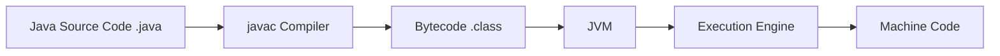
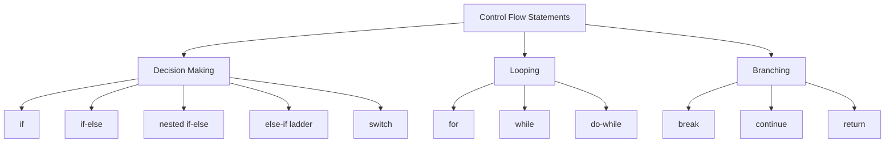
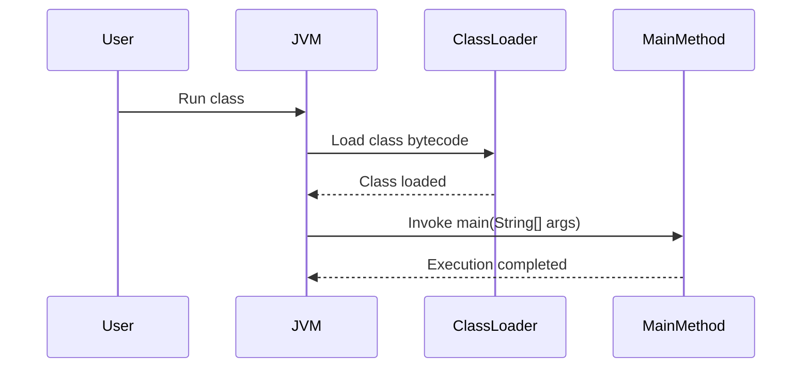

# README 1 – Java Fundamentals

> **Purpose of this part**  
> Build a rock-solid Java foundation for interviews, college revision, placements, and future backend development.

---

# Table of Contents

1. [Introduction to Java](#1-introduction-to-java)
2. [Tokens in Java](#2-tokens-in-java)
3. [Keywords](#3-keywords)
4. [Identifiers](#4-identifiers)
5. [Literals](#5-literals)
6. [Separators](#6-separators)
7. [Comments and Program Structure](#7-comments-and-program-structure)
8. [Variables and Naming Conventions](#8-variables-and-naming-conventions)
9. [Data Types](#9-data-types)
10. [Type Conversion and Type Casting](#10-type-conversion-and-type-casting)
11. [Operators in Java](#11-operators-in-java)
12. [Control Flow Statements](#12-control-flow-statements)
13. [Methods in Java](#13-methods-in-java)
14. [Memory Basics: Stack vs Heap](#14-memory-basics-stack-vs-heap)
15. [Built-in Utility Classes](#15-built-in-utility-classes)
16. [Method Chaining Basics](#16-method-chaining-basics)
17. [Common Fundamental Mistakes](#17-common-fundamental-mistakes)
18. [Interview Questions](#18-interview-questions)
19. [One-Page Revision Sheet](#19-one-page-revision-sheet)
20. [Practice Questions](#20-practice-questions)
21. [Key Takeaways](#21-key-takeaways)

---

# 1. Introduction to Java

## Definition
Java is a **high-level, object-oriented, platform-independent programming language** used to build desktop applications, web applications, enterprise systems, Android apps, and backend services.

## Why Java was introduced
Java was introduced to solve major problems seen in low-level and platform-dependent programming:
- Write once, run anywhere
- Better memory safety than C/C++
- Simpler syntax than many system languages
- Strong standard library support
- Built-in runtime environment through JVM

## Real-life analogy
Think of Java source code like writing a document in **PDF** instead of a printer-specific format. Any system with a PDF reader can open it. Similarly, any system with a **JVM** can run Java bytecode.

## Internal working


### Internal execution flow
1. You write Java code in a `.java` file.
2. `javac` compiles it into **bytecode**.
3. JVM loads that bytecode.
4. Class Loader brings classes into memory.
5. Bytecode Verifier checks safety.
6. Execution Engine interprets or JIT-compiles hot code.
7. Machine executes it.

## Beginner syntax
```java
class Hello {
    public static void main(String[] args) {
        System.out.println("Hello Java");
    }
}
```

## Output
```text
Hello Java
```

## Common mistake
```java
// Wrong file name if class is public
public class HelloWorld {
}
```
If the class is public, file name must match the class name.

## 💡 Additional Interview Insight
Java is called **platform independent** because compiled bytecode runs on JVM, but the JVM itself is platform-specific.

---

# 2. Tokens in Java

## Definition
**Tokens are the smallest meaningful parts of a program.**

This line comes directly from your material and is extremely important for interviews.

## Why this concept exists
A compiler cannot understand a full program as one giant block. It first breaks the code into manageable pieces called tokens.

## Token categories
- Keywords
- Identifiers
- Literals
- Operators
- Separators

## Example
```java
int age = 20;
```
Tokens are:
- `int` → keyword
- `age` → identifier
- `=` → operator
- `20` → literal
- `;` → separator

## Internal working
During lexical analysis, the compiler scans the source code character by character and groups characters into valid tokens.

## Real-life analogy
A sentence is made of words. A program is made of tokens.

## Interview note
> If the interviewer asks: "What is the smallest meaningful unit in a Java program?"  
> Answer: **Token**.

---

# 3. Keywords

## Definition
**Keywords are predefined compiler-aware words.**

## Why Java introduced keywords
Java needs reserved words with fixed meaning so the compiler can identify language structures reliably.

## Important notes from your material
- There are many keywords in Java.
- Keywords usually appear in lowercase.
- Keywords cannot be used as identifiers.

## Examples
```java
int, class, public, static, void, if, else, return
```

## Syntax example
```java
public class Demo {
    public static void main(String[] args) {
        int num = 10;
        if (num > 5) {
            System.out.println("Valid");
        }
    }
}
```

## Internal working
The compiler maintains a set of reserved words. If a token matches a keyword, the compiler assigns it special meaning.

## Common mistakes
```java
int class = 10;   // invalid
```
`class` is a keyword, so it cannot be used as a variable name.

## Comparison table
| Item | Meaning |
|---|---|
| Keyword | Reserved word with predefined meaning |
| Identifier | Programmer-defined name |

## Best practice
Do not use names that only differ slightly from keywords, like `ClassName` for a variable if it hurts readability.

---

# 4. Identifiers

## Definition
**Identifiers are the names given to Java components.**

These components include:
- Variables
- Methods
- Classes
- Interfaces
- Packages
- Objects

## Rules from your notes
- Identifier cannot contain keywords
- They cannot contain space in the name
- You cannot start with a number
- Allowed special characters are `_` and `$`
- Identifiers are case sensitive

## Valid examples
```java
int age;
String firstName;
double salary_2026;
int $count;
```

## Invalid examples
```java
int 2age;        // starts with number
int first name;  // contains space
int class;       // keyword
```

## Why Java introduced rules
Without naming rules, the compiler would confuse programmer-defined names with keywords or invalid symbols.

## Real-life analogy
Identifiers are like contact names in your phone. Every saved person needs a valid name so you can call the right person later.

## Internal working
Identifiers are stored in symbol tables during compilation. The compiler maps each identifier to its type, scope, and memory role.

## Case sensitivity dry run
```java
int age = 20;
int Age = 30;
System.out.println(age);
System.out.println(Age);
```
Output:
```text
20
30
```
Because `age` and `Age` are different identifiers.

## Best practices
- Use meaningful names
- Use camelCase for variables and methods
- Use PascalCase for classes
- Use uppercase with underscores for constants

## Interview tip
If asked whether `$` is allowed in identifiers, say **yes**, but avoid it in normal production code.

---

# 5. Literals

## Definition
**Literals are fixed values provided directly inside the program by the programmer.**

## Types from your notes
- Number literals
- Character literals
- String literals
- Boolean literals

## Examples
```java
10          // integer literal
3.14        // floating literal
'A'         // character literal
"Java"      // string literal
true        // boolean literal
false       // boolean literal
```

## Why Java introduced literals
Programs need a direct way to represent fixed values without calculating them every time.

## Real-life analogy
A literal is like writing a fixed address directly on a courier package instead of computing it dynamically.

## Character literal rule
From your notes:
- Character literals are enclosed in **single quotes**
- Length is always **one character**

## Internal working
- Numeric literals may be stored directly in bytecode instructions or constant pool entries.
- String literals are stored in the **String Constant Pool**.
- Boolean literals are compiler-recognized constants.

## String literal memory note
```java
String a = "Java";
String b = "Java";
```
Both can point to the same pooled string object.

## Edge cases
```java
char ch = 'AB';    // invalid, too many characters
String s = 'A';    // invalid, String must use double quotes
```

## Comparison table
| Literal Type | Example | Quotes Required |
|---|---|---|
| Number | `100` | No |
| Character | `'A'` | Single quotes |
| String | `"A"` | Double quotes |
| Boolean | `true` | No |

---

# 6. Separators

## Definition
Separators are symbols used to **separate program elements**.

## Common separators
- `;` statement terminator
- `,` separator
- `()` method call / condition grouping
- `{}` block separator
- `[]` array notation
- `.` member access

## Why Java introduced separators
They tell the compiler where one unit ends and another begins.

## Example
```java
int a = 10, b = 20;
```
Here:
- `,` separates variables
- `;` ends the statement

## Common mistake
Forgetting `;`:
```java
int a = 10
System.out.println(a);
```
This causes a compile-time error.

---

# 7. Comments and Program Structure

## Definition
Comments are notes written inside code for humans. The compiler ignores them.

## Types
```java
// single-line comment

/* multi-line
   comment */

/** documentation comment */
```

## Why comments exist
To explain intent, logic, warnings, and usage.

## Basic program structure
```java
class Demo {
    public static void main(String[] args) {
        System.out.println("Start");
    }
}
```

## Structure breakdown
- `class Demo` → class declaration
- `main()` → entry point
- `System.out.println()` → output statement

## Best practice
Comment **why**, not what. Bad comments explain obvious things.

---

# 8. Variables and Naming Conventions

## Definition
A variable is a named memory location used to store data.

## Why variables exist
Programs need storage for values that may change while execution continues.

## Syntax
```java
datatype variableName = value;
```

## Examples
```java
int age = 21;
double price = 199.99;
char grade = 'A';
boolean isActive = true;
```

## Internal working
- Variable declaration tells compiler the type and name.
- Memory is allocated based on scope and kind.
- Local primitives usually live in stack frames.
- Object references live in stack frames, but objects themselves live on the heap.

## Naming convention table
| Element | Convention | Example |
|---|---|---|
| Variable | camelCase | `studentName` |
| Method | camelCase | `calculateTotal()` |
| Class | PascalCase | `StudentRecord` |
| Constant | UPPER_CASE | `MAX_SIZE` |

## Common mistakes
- Meaningless names like `x1`, `y2`
- Using identifiers that differ only by case
- Declaring variables too early or too late

## Interview tip
Java is **strongly typed**. Variable type is checked at compile time.

---

# 9. Data Types

## Definition
A data type tells Java:
- what kind of value a variable can store
- how much memory is needed
- which operations are allowed

## Why Java introduced data types
Without data types, compiler checks, memory layout, arithmetic rules, and type safety would become unreliable.

## Classification from your notes
- **Primitive data types** → simple or single-valued data
- **Non-primitive data types** → complex or multi-valued data

## Primitive data types
| Type | Size | Typical Default Value |
|---|---:|---|
| byte | 1 byte | 0 |
| short | 2 bytes | 0 |
| int | 4 bytes | 0 |
| long | 8 bytes | 0L |
| float | 4 bytes | 0.0f |
| double | 8 bytes | 0.0d |
| char | 2 bytes | `\u0000` |
| boolean | JVM dependent representation | false |

> ⚠️ Your source notes list `char` default in a simplified way. The technically correct default value is **Unicode null character `\u0000`**.

## Non-primitive data types from your notes
Examples:
- String
- Array
- Class types
- Interface references
- Objects

## Real-life analogy
Primitive types are like **single-item containers**. Non-primitive types are like **boxes containing more structure**, references, or multiple pieces of information.

## Internal working
### Primitive
Stored as actual values.

### Non-primitive
Variables usually store **references** to objects in heap memory.

## ASCII memory diagram
```text
Stack Frame
+------------------+
| int age = 25     |
| String name -----|----+
+------------------+    |
                        v
Heap                 +---------+
                     | "Java"  |
                     +---------+
```

## Syntax examples
```java
int marks = 95;
double pi = 3.14159;
char grade = 'A';
boolean passed = true;
String course = "Java";
```

## Dry run
```java
int a = 10;
int b = 20;
int c = a + b;
System.out.println(c);
```
Execution:
1. `a` gets 10
2. `b` gets 20
3. `c` stores 30
4. output is 30

## Output
```text
30
```

## Comparison table
| Primitive | Non-Primitive |
|---|---|
| Stores actual value | Usually stores reference |
| Fixed size | Size depends on object |
| Not objects | Usually objects / references |
| Faster access | Slightly more overhead |

## Edge cases
```java
byte b = 128;    // out of range
char ch = -1;    // invalid
```

## Best practices
- Use `int` for most integer work
- Use `double` for most decimal work
- Use `boolean` only for true/false logic
- Choose smaller types only when there is a real memory reason

## Interview tip
`String` is **not primitive** even though it feels basic.

---

# 10. Type Conversion and Type Casting

## Definition
Type conversion means changing a value from one type to another.

## Why Java introduced it
Programs often mix different numeric types. Java needs rules to safely convert values.

## Types
### 1. Widening conversion
Small type → bigger compatible type
```java
int a = 10;
double b = a;
```

### 2. Narrowing conversion
Bigger type → smaller type using explicit cast
```java
double x = 10.9;
int y = (int) x;
```

## Output
```text
10
```
Fraction is lost.

## Important source connection
Your notes mention:
- compiler tries widening in primitive cases
- compound assignment helps with implicit casting in some cases

## Internal working
For widening, compiler inserts safe conversion.  
For narrowing, programmer must explicitly approve possible data loss.

## Common mistakes
```java
int x = 10.5;      // invalid
a += 10.5;         // also risky depending on type
```

## Comparison table
| Conversion | Automatic | Data Loss Risk |
|---|---|---|
| Widening | Usually yes | Low |
| Narrowing | No | High |

## Interview tip
`byte + byte` becomes `int` in arithmetic expressions.

---

# 11. Operators in Java

## Definition
Operators perform operations on values and variables.

## Why operators exist
Without operators, every calculation, comparison, or assignment would need a method or verbose syntax.

---

## 11.1 Arithmetic Operators

### Definition
Used to perform arithmetic operations.

### Operators
`+`, `-`, `*`, `/`, `%`

### Important points from your notes
- If at least one operand is String, `+` performs concatenation
- Otherwise it performs addition
- Arithmetic operators are invalid for boolean values
- Except `+`, other arithmetic operators are invalid for strings

### Example 1
```java
System.out.println(10 + 20);
```
Output:
```text
30
```

### Example 2: String concatenation
```java
System.out.println(1 + 2 + "Akash" + 5 + 3);
```
Output:
```text
3Akash53
```

### Why output occurs
1. `1 + 2` → `3`
2. `3 + "Akash"` → `"3Akash"`
3. then `+ 5` and `+ 3` continue concatenation

### Common mistake
```java
System.out.println("10" + 20 * 3);
```
Output:
```text
1060
```
Because `20 * 3 = 60`, then string concatenation happens.

---

## 11.2 Relational Operators

### Definition
Used to compare two values and produce a boolean result.

### Operators
- `==`
- `!=`
- `>`
- `<`
- `<=`
- `>=`

### Example
```java
int a = 10;
int b = 20;
System.out.println(a < b);
```
Output:
```text
true
```

### Why introduced
Relational operators help create conditions for control flow.

### Interview trap
`=` is assignment, `==` is comparison.

---

## 11.3 Logical Operators

### Definition
Used to combine conditions.

### Operators
- `&&` AND
- `||` OR
- `!` NOT

### Important notes from your source
- Used to combine or merge conditions to form complex conditions
- `&&` uses short-circuiting
- Number of checks are fewer than bitwise evaluation in condition context
- `!` cannot be used on numerical data

### Example
```java
int age = 20;
boolean hasId = true;
System.out.println(age >= 18 && hasId);
```
Output:
```text
true
```

### Short-circuit example
```java
int a = 10;
System.out.println(a < 5 && ++a > 10);
System.out.println(a);
```
Output:
```text
false
10
```
`++a` is not checked because left side is already false.

### Bitwise vs logical interview idea
Bitwise operators evaluate both sides when used with boolean operands, while short-circuit logical operators may skip evaluation.

---

## 11.4 Ternary Operator

### Definition
Ternary operator is a **decision-making and value-returning operator**.

### Syntax
```java
condition ? value1 : value2
```

### Source-based examples
```java
boolean ans = num % 2 == 0 ? true : false;
num % 2 == 0 ? 2 : 3.5;
num % 2 == 0 ? 2 : 3;
```

### Example
```java
int num = 7;
String result = num % 2 == 0 ? "Even" : "Odd";
System.out.println(result);
```
Output:
```text
Odd
```

### Why introduced
It gives a compact alternative to simple `if-else` assignments.

### Common mistake
Avoid deeply nested ternary expressions in beginner code. They reduce readability.

---

## 11.5 Assignment Operators

### Types from your notes
- Simple assignment operator
- Compound assignment operator

### Example
```java
int a = 10;
a += 5;
System.out.println(a);
```
Output:
```text
15
```

### Why compound assignment exists
Your material highlights a very useful point:
> In some cases simple assignment needs explicit typecasting, so compound assignment was introduced and can perform implicit casting.

### Example
```java
byte b = 10;
b += 5;      // valid
// b = b + 5; // invalid without cast
```

### Internal working
`b += 5` behaves roughly like:
```java
b = (byte)(b + 5);
```

---

## 11.6 Increment and Decrement Operators

### Definition
Used to increase or decrease a variable by 1.

### Rules from your notes
- Use with variables only
- Works on numerical and character data
- Cannot be used with string or boolean data
- Convert into compound assignment to decode behavior

### Types
- Pre-increment `++a`
- Post-increment `a++`
- Pre-decrement `--a`
- Post-decrement `a--`

### Example
```java
int a = 5;
System.out.println(++a);
System.out.println(a++);
System.out.println(a);
```
Output:
```text
6
6
7
```

### Dry run
- `++a` → increment first, use later
- `a++` → use first, increment later

### Character example
```java
char ch = 'A';
ch++;
System.out.println(ch);
```
Output:
```text
B
```

---

## 11.7 Bitwise Operators

### Definition
Operate on bits of integral values.

### Common operators
- `&`
- `|`
- `^`
- `~`
- `<<`
- `>>`
- `>>>`

### Why introduced
For low-level operations, masking, flags, optimization, and systems-level logic.

### Beginner example
```java
int a = 5;   // 0101
int b = 3;   // 0011
System.out.println(a & b);
```
Output:
```text
1
```

### Interview tip
Do not confuse `&&` with `&`, or `||` with `|`.

---

## 11.8 Operator Precedence and Associativity

| High to Low (selected) | Examples |
|---|---|
| Unary | `++`, `--`, `!` |
| Multiplicative | `*`, `/`, `%` |
| Additive | `+`, `-` |
| Relational | `<`, `>`, `<=`, `>=` |
| Equality | `==`, `!=` |
| Logical AND | `&&` |
| Logical OR | `||` |
| Ternary | `?:` |
| Assignment | `=`, `+=` |

## Best practice
Use parentheses when teaching, debugging, or writing interview answers.

---

# 12. Control Flow Statements

## Definition
Control flow statements determine the flow of a program.

## Why introduced
Programs are useful only when they can make decisions, repeat tasks, and skip or stop execution intelligently.

## Classification from your notes
- Decision-making statements
- Looping / iterative statements
- Branching / jump statements



---

## 12.1 if Statement

### Definition
Executes a block only if the condition is true.

### Rule from your notes
The condition should always return a **boolean** value.

### Syntax
```java
if (condition) {
    // statements
}
```

### Example
```java
int age = 18;
if (age >= 18) {
    System.out.println("Eligible");
}
```

### Output
```text
Eligible
```

### Real-life analogy
Door opens only if biometric access is valid.

---

## 12.2 if-else Statement

### Definition
When there are two possible actions based on a condition.

### Example
```java
int num = 7;
if (num % 2 == 0) {
    System.out.println("Even");
} else {
    System.out.println("Odd");
}
```

### Output
```text
Odd
```

---

## 12.3 Nested if-else

### Definition
Secondary decision depends on the primary decision.

### Example
```java
int age = 20;
boolean hasId = true;

if (age >= 18) {
    if (hasId) {
        System.out.println("Allowed");
    } else {
        System.out.println("ID required");
    }
} else {
    System.out.println("Underage");
}
```

---

## 12.4 else-if Ladder

### Definition
Used when there are multiple conditions with multiple actions.

### Example
```java
int marks = 82;
if (marks >= 90) {
    System.out.println("A+");
} else if (marks >= 75) {
    System.out.println("A");
} else if (marks >= 60) {
    System.out.println("B");
} else {
    System.out.println("C");
}
```

---

## 12.5 switch Statement

### Definition
Used for multi-way selection based on a single expression.

### Important points from your source
- Switch is compile-time friendly and generally fast
- `break` can be used inside case blocks
- `default` and `break` are not compulsory
- Java does not allow every datatype in classic switch
- Allowed in your notes: byte, short, int, char, string, enum

> ⚠️ Your source contains `pattern`, which is not a classic primitive switch type. Modern Java has pattern matching features in newer constructs, but for foundational notes, remember the standard beginner-safe list: `byte`, `short`, `int`, `char`, `String`, `enum`.

### Syntax
```java
switch (value) {
    case 1:
        System.out.println("One");
        break;
    case 2:
        System.out.println("Two");
        break;
    default:
        System.out.println("Other");
}
```

### Why break matters
Without `break`, execution falls through to the next case.

### Fall-through example
```java
int day = 1;
switch (day) {
    case 1:
        System.out.println("Mon");
    case 2:
        System.out.println("Tue");
}
```
Output:
```text
Mon
Tue
```

### Interview tip
`switch` works best when comparing one variable against many constant choices.

---

## 12.6 for Loop

### Definition
A loop used when iteration count is known or can be clearly expressed.

### Syntax
```java
for (initialization; condition; update) {
    // body
}
```

### What is mandatory and optional
From an interview view:
- Semicolons are mandatory
- initialization, condition, and update are individually optional

### Example
```java
for (int i = 1; i <= 3; i++) {
    System.out.println(i);
}
```
Output:
```text
1
2
3
```

### Dry run
1. initialize `i = 1`
2. check `i <= 3`
3. execute body
4. update `i++`
5. repeat

---

## 12.7 while Loop

### Definition
Used when repetition depends on a condition and count may not be fixed.

### Syntax
```java
while (condition) {
    // body
}
```

### Example
```java
int i = 1;
while (i <= 3) {
    System.out.println(i);
    i++;
}
```

### Real-world note from your source
This loop is often explained using file handling because you keep reading until no more data exists.

---

## 12.8 do-while Loop

### Definition
Executes the block first, then checks the condition.

### Important note from your source
This is useful for **menu-driven programs** because you want at least one display/execution before deciding whether to repeat.

### Syntax
```java
do {
    // body
} while (condition);
```

### Why semicolon is required
Because `while(condition);` terminates the looping statement syntax after the block.

### Example
```java
int i = 1;
do {
    System.out.println(i);
    i++;
} while (i <= 3);
```

---

## 12.9 break, continue, return

### break
Stops the nearest loop or switch.

### continue
Skips current iteration and goes to next one.

### return
Transfers control from method back to caller. Your notes correctly describe it as a **control transfer statement**.

### Example
```java
for (int i = 1; i <= 5; i++) {
    if (i == 3) continue;
    if (i == 5) break;
    System.out.println(i);
}
```
Output:
```text
1
2
4
```

---

# 13. Methods in Java

## Definition
A method is an **executable reusable block of code** used to perform a particular task.

This matches the uploaded notes closely.

## Why Java introduced methods
- Code reuse
- Better readability
- Easier testing
- Less duplication
- Logical separation of tasks

## Real-life analogy
A method is like a **button on a machine**. You press a button, the machine performs one predefined job.

## Core syntax
```java
modifier returnType methodName(formalParameters) {
    // body
    return value; // if needed
}
```

## Terms from your notes
### Method signature
Method name + formal parameter list
```java
main(String[] args)
```

### Method declaration
Modifiers + return type + method signature

### Method definition
Method declaration + method body

## Important characteristics from your notes
- A method cannot be created inside another method
- A method cannot execute itself unless it is called
- We can have any number of methods
- We can call methods multiple times
- Methods can be declared inside a class or interface

> 💡 Additional Interview Insight  
> A method **can call itself** in recursion, but that still happens through a method call. So the safer explanation is: a method does not run automatically just because it exists.

---

## 13.1 Formal vs Actual Parameters

### Formal parameters
The holders that catch incoming data. Your notes correctly say they behave like local variables for the method block.

### Actual parameters
The real values passed during method call.

### Example
```java
class Demo {
    static void add(int a, int b) {   // formal parameters
        System.out.println(a + b);
    }

    public static void main(String[] args) {
        add(10, 20);                  // actual parameters
    }
}
```

---

## 13.2 Types of Methods by Parameters

### Non-parameterized method
```java
static void greet() {
    System.out.println("Welcome");
}
```
Use when operation is fixed.

### Parameterized method
```java
static void greet(String name) {
    System.out.println("Welcome " + name);
}
```
Use when operation depends on input.

### Variable-argument method
```java
static int sum(int... nums) {
    int total = 0;
    for (int n : nums) total += n;
    return total;
}
```

---

## 13.3 Return Type

## Definition
Return type tells what type of data a method gives back.

### Types highlighted in your notes
- `void`
- primitive type
- non-primitive type

### `void`
Nothing is returned.

### Example
```java
static void display() {
    System.out.println("Hello");
}
```

### Non-void example
```java
static int square(int n) {
    return n * n;
}
```

### Output example
```java
System.out.println(square(5));
```
Output:
```text
25
```

---

## 13.4 Rules of return Statement

These are directly adapted from your material.

- `return` is a keyword in Java
- It is a control transfer statement
- It can return a value
- It can terminate method execution
- In non-void methods, return is mandatory
- In void methods, return is optional
- Returned data type and method return type must be compatible
- Multiple values cannot be returned directly with one return statement

### Example
```java
static int getValue() {
    return 10;
}
```

### Wrong example
```java
static int getValue() {
    return "ten";
}
```
Compile-time error because return type mismatches.

### Internal working
When `return` executes:
1. optional expression is evaluated
2. value is placed for caller
3. current method frame ends
4. control goes back to caller

---

## 13.5 Different Method Combinations

These are directly based on your notes.

| Combination | Typical Use |
|---|---|
| void + non-parameterized | fixed operation, like display message |
| void + parameterized | perform operation on user input |
| non-void + non-parameterized | return existing data |
| non-void + parameterized | compute and return processed result |

### Example set
```java
static void showMenu() {
    System.out.println("1. Add\n2. Exit");
}

static void printSquare(int n) {
    System.out.println(n * n);
}

static String appName() {
    return "Java Notes";
}

static int add(int a, int b) {
    return a + b;
}
```

---

## 13.6 Method Calling Rules

### Syntax from your notes
```java
methodName(actualParameters);
```

### Rules from your source
- number of actual and formal parameters should match
- order should match
- datatype should match, otherwise compiler may try widening for primitives and upcasting for non-primitives
- if compatibility is not possible, compile-time error occurs

### Example
```java
static void printData(double d) {
    System.out.println(d);
}

printData(10);   // int widened to double
```

---

## 13.7 main Method Deep Dive

## Definition
`main` is the entry point of a standard standalone Java application.

### Important source point
Your notes correctly state:
> `main` is not an inbuilt method; it is a user-defined method implicitly called by JVM.

### Standard syntax
```java
public static void main(String[] args)
```

### Word-by-word meaning
| Part | Meaning |
|---|---|
| public | JVM must access it from outside the class |
| static | JVM can call it without creating object |
| void | does not return value to JVM |
| main | special recognized method name |
| String[] args | command-line arguments |

### Internal working


### Interview tip
The JVM looks for a method with the correct `main` signature. If missing, runtime launch fails.

---

# 14. Memory Basics: Stack vs Heap

## Why this matters
Most Java interview confusion begins when students know syntax but do not know where data lives.

## Stack
Stores:
- method call frames
- local variables
- reference variables
- partial execution data

## Heap
Stores:
- objects
- arrays
- instance data

## ASCII diagram
```text
               JVM Memory Overview

+---------------------------------------+
|               Heap                    |
|   Object, Array, String Objects       |
+---------------------------------------+

+---------------------------------------+
|               Stack                   |
| main() frame                          |
| local vars, references, temp values   |
+---------------------------------------+
```

## Example
```java
class Test {
    public static void main(String[] args) {
        int x = 10;
        String s = "Java";
    }
}
```

## Memory view
```text
Stack Frame (main)
+----------------------+
| x = 10               |
| s -----------+       |
+----------------------+
                    |
                    v
Heap / Pool      +--------+
                 | "Java" |
                 +--------+
```

## Internal working
- Primitive local values are stored directly
- References point to heap objects
- When method ends, local frame is removed
- Unreferenced heap objects become eligible for garbage collection

## Interview comparison table
| Stack | Heap |
|---|---|
| Stores frames | Stores objects |
| Faster access | Larger memory region |
| Auto-managed by call flow | GC-managed |
| Thread-specific | Shared by threads |

---

# 15. Built-in Utility Classes

## 15.1 Scanner Class

### Definition
`Scanner` is used to take input from different sources, commonly keyboard input.

### Why introduced
Java needed a friendly API for input parsing.

### Syntax
```java
import java.util.Scanner;

Scanner sc = new Scanner(System.in);
int age = sc.nextInt();
```

### Example
```java
import java.util.Scanner;

class InputDemo {
    public static void main(String[] args) {
        Scanner sc = new Scanner(System.in);
        System.out.print("Enter age: ");
        int age = sc.nextInt();
        System.out.println("Age = " + age);
    }
}
```

### Internal working
- `System.in` provides input stream
- `Scanner` wraps that stream
- `nextInt()` parses characters into integer data

### Common mistake
Mixing `nextInt()` and `nextLine()` without consuming leftover newline.

---

## 15.2 Math Class

### Definition
`Math` provides utility methods for mathematical operations.

### Common methods
```java
Math.sqrt(25)
Math.pow(2, 3)
Math.max(10, 20)
Math.min(10, 20)
Math.random()
```

### Example
```java
System.out.println(Math.max(10, 20));
```
Output:
```text
20
```

### Interview note
`Math` methods are usually static, so accessed using class name.

---

## 15.3 System Class, System.in, System.out.println()

Your uploaded notes explicitly ask for the internal working of these, so this section is very important.

### `System`
A final utility class in `java.lang`.

### `in`
`System.in` is a static input stream object. Your note says it holds the location of the buffer; beginner-friendly explanation: it represents the standard input stream connected to keyboard/input buffer.

### `out`
`System.out` is a static `PrintStream` object connected to standard output.

### `println`
A method of `PrintStream` that prints data and moves cursor to the next line.

### Breakdown
| Expression Part | Meaning |
|---|---|
| `System` | class name |
| `out` | static output stream object |
| `println()` | method to print line |

### Internal hardware-style explanation
```text
Keyboard -> OS Input Buffer -> System.in -> Scanner / Input APIs
Program Output -> System.out -> Console Buffer -> Monitor
```

### Internal execution flow
1. Program calls `System.out.println("Hello")`
2. JVM resolves `System` class
3. accesses static field `out`
4. invokes `println()` on `PrintStream`
5. stream writes bytes/text to console output buffer
6. console displays the result

### Example
```java
System.out.println("Java");
```

---

# 16. Method Chaining Basics

## Definition
Method chaining means calling one method after another in a sequence.

## Example
```java
String name = "java";
System.out.println(name.toUpperCase().trim());
```

## Why it works
A method returns an object or value on which another method can be called.

## Real-life analogy
Like ordering food in an app: open app → choose restaurant → select item → confirm.

## Caution
Method chaining is powerful, but if a method returns `void`, chaining stops there.

---

# 17. Common Fundamental Mistakes

## Compile-time mistakes
- using keyword as identifier
- forgetting semicolon
- type mismatch in assignment
- invalid return type
- wrong method call arguments
- using non-boolean expression in condition

## Runtime / logic mistakes
- division by zero
- infinite loops
- missing `break` in switch
- confusing `==` with `=`
- using `a++` vs `++a` incorrectly
- mixing `Scanner.nextInt()` and `nextLine()` carelessly

## Beginner myth
> “Java automatically fixes every type mismatch.”  
No. Java only allows specific implicit conversions.

---

# 18. Interview Questions

## Beginner
1. What are tokens in Java?
2. What is the difference between keyword and identifier?
3. What are literals?
4. Why is String non-primitive?
5. What is the difference between `=` and `==`?
6. Why must `if` condition return boolean?
7. Difference between `while` and `do-while`?
8. What is a method signature?
9. What is the role of `main()`?
10. What is the difference between stack and heap?

## Intermediate
1. Why is `1 + 2 + "Java" + 3` different from `"Java" + 1 + 2 + 3`?
2. Why is `byte + byte` promoted to `int`?
3. Why does `b += 1` work when `b = b + 1` may fail for byte?
4. What is short-circuit evaluation?
5. Why is `return` called a control transfer statement?
6. Explain `System.out.println()` internally.
7. How is `Scanner` connected to `System.in`?

## Tricky
1. Is `main` built-in or user-defined?
2. Can `char` participate in arithmetic?
3. Are `default` and `break` compulsory in switch?
4. Does `do-while` check condition before first execution?
5. Can you use boolean in arithmetic operations?

---

# 19. One-Page Revision Sheet

## Java Fundamentals Quick Sheet
- Tokens = smallest meaningful units of program
- Keywords = reserved compiler-aware words
- Identifiers = user-defined names
- Literals = fixed values inside code
- Primitive = single-valued basic data
- Non-primitive = reference/complex data
- `+` does addition or concatenation
- Conditions must return boolean
- `if`, `if-else`, `switch` → decision making
- `for`, `while`, `do-while` → looping
- `break`, `continue`, `return` → jump/control transfer
- Method signature = name + parameter list
- `main` is user-defined, JVM-invoked entry method
- Stack stores frames and locals
- Heap stores objects
- `System.out.println()` = output pipeline to console
- `System.in` = standard input stream

---

# 20. Practice Questions

## Easy
1. List the categories of tokens.
2. Give 5 valid and 5 invalid identifiers.
3. Write a program to print whether a number is even or odd.
4. Show examples of all primitive types.
5. Write a `for` loop from 1 to 10.

## Medium
1. Explain the output of:
```java
System.out.println(1 + 2 + "A" + 3 + 4);
```
2. Write menu-driven program using `do-while`.
3. Create four methods representing the four method combinations.
4. Use `Scanner` to take input and display result.
5. Demonstrate `break` and `continue` in loops.

## Hard
1. Explain memory behavior of primitive vs String variable using diagram.
2. Compare `switch` and `else-if` with use cases.
3. Explain `System.out.println()` internally from class resolution to console display.
4. Design examples that show short-circuit behavior clearly.
5. Explain compound assignment with byte and why casting matters.

## Output-based
1.
```java
int a = 5;
System.out.println(a++ + ++a);
```
2.
```java
System.out.println("X" + 10 + 20);
```
3.
```java
System.out.println(10 + 20 + "X");
```
4.
```java
char ch = 'A';
System.out.println(++ch);
```

## Debugging
1. Fix a method with wrong return type.
2. Fix invalid switch datatype usage.
3. Fix infinite while loop.
4. Fix identifier naming violations.

---

# 21. Key Takeaways

- Learn **why** a feature exists, not just syntax.
- Tokens are the compiler’s first meaningful building blocks.
- Keywords are reserved; identifiers are your names.
- Literals are direct fixed values.
- Data types control storage, safety, and allowed operations.
- Operators can change meaning based on operand types.
- Conditions in Java must evaluate to boolean.
- Loops repeat work, but each loop has a better-fit scenario.
- Methods improve reuse, readability, and interview design quality.
- `return` both gives value and transfers control.
- `main()` is user-defined but JVM-invoked.
- Understanding stack, heap, and console streams makes your Java answers much stronger.

---

# Final Summary

This README covered the full foundation required before moving to deeper Java concepts. It preserved the major points from your uploaded training notes—tokens, keywords, identifiers, literals, separators, primitive vs non-primitive data types, operators, control flow, methods, method calling rules, return rules, `main`, `Scanner`, `Math`, `System.in`, and `System.out.println()`—while expanding them with internal working, dry runs, memory diagrams, and interview-focused explanations.

> Next part will build on this base and move into **classes, objects, modifiers, method overloading, OOP pillars, constructors, inheritance, polymorphism, abstraction, JVM internals, and advanced Java topics**.
