<div align="center">

# 📘 Java OOP Foundation

### From Absolute Beginner → Placement Ready

*A first-principles guide to Object-Oriented Programming in Java — built for Computer Engineering students preparing for
technical interviews.*


</div>

---

## 🗺️ Table of Contents

| # | Chapter                                                      | What You'll Learn                                     |
|---|--------------------------------------------------------------|-------------------------------------------------------|
| 1 | [Programming Paradigms](#chapter-1--programming-paradigms)   | What a paradigm is, procedural style                  |
| 2 | [Why OOP Was Introduced](#chapter-2--why-oop-was-introduced) | The real problems that created OOP                    |
| 3 | [Understanding OOP](#chapter-3--understanding-oop)           | Core philosophy and mental model                      |
| 4 | [Four Pillars of OOP](#chapter-4--the-four-pillars-of-oop)   | Encapsulation, Abstraction, Inheritance, Polymorphism |
| 5 | [Class and Object](#chapter-5--class-and-object)             | Blueprint vs Instance                                 |
| 6 | [Memory View](#chapter-6--memory-view)                       | Heap, Stack, References                               |
| 7 | [Summary Notes](#chapter-7--summary-notes)                   | Rapid revision                                        |
| 8 | [Interview Questions](#chapter-8--interview-questions)       | 24 placement-style Q&As                               |

---

## Chapter 1 — 🧩 Programming Paradigms

### 📌 Concept

A **programming paradigm** is a *style of thinking* about how to structure code to solve a problem. It's not a
language — it's a **mindset** a language encourages.

> 🧠 **Intuition**
> Cooking the same dish two ways:
> - Follow a strict recipe step-by-step → **Procedural**
> - Treat ingredients as independent "things" that know how to behave → **Object-Oriented**
>
> Same goal, different approach.

### ⚡ Key Idea

| Paradigm        | Core Idea                                      | Example Languages |
|-----------------|------------------------------------------------|-------------------|
| Procedural      | Program = sequence of functions acting on data | C, Pascal         |
| Object-Oriented | Program = objects interacting with each other  | Java, C++, Python |
| Functional      | Program = composition of pure functions        | Haskell, Scala    |
| Logical         | Program = facts + rules + inference            | Prolog            |

Java is primarily **Object-Oriented**, with functional features (lambdas, streams) layered on top since Java 8.

---

### 🌍 Real World Example - Procedural Style

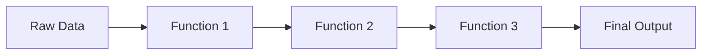

In procedural programming, **data flows through independent functions** — the data itself has no behavior of its own.

```java
class StudentData {
    String name;
    int marks;
}

void printStudent(StudentData s) {
    System.out.println(s.name + " scored " + s.marks);
}
```

> ⚠️ **Common Mistake**
> Beginners often think "procedural = bad, OOP = good." That's false. Procedural code is perfectly fine for small
> scripts, automation tools, and simple utilities. OOP becomes valuable as **scale and complexity** increase — explained
> in Chapter 2.

---

### 🏗️ Characteristics of Procedural Programming

| Characteristic       | Explanation                                                   |
|----------------------|---------------------------------------------------------------|
| Top-down design      | Big problem broken into smaller functions, called in sequence |
| Global / shared data | Data often accessible to many functions                       |
| Function-centric     | The function is the basic building block                      |
| Sequential execution | Code largely runs in the order it's written                   |
| No data hiding       | Any function can read/modify any data                         |

<details>
<summary>✅ Advantages of Procedural Programming</summary>

- Simple to understand for small programs
- Fast to write for one-off scripts
- Easier to trace linear flow for small codebases
- No object-creation overhead

</details>

<details>
<summary>❌ Limitations of Procedural Programming</summary>

- Data exposed everywhere → no protection from misuse
- Functions and data become tangled as programs grow
- Poor code reuse → leads to copy-paste duplication
- Hard to model real-world entities naturally
- Changing the data structure forces changes across many functions

</details>

> 📝 **Quick Revision — Chapter 1**
> - Paradigm = style of thinking, not a language
> - Procedural = data + functions kept separate
> - Works well for small programs, struggles at scale
> - Java is mainly OOP with some functional features

---

## Chapter 2 — 🚨 Why OOP Was Introduced

### ❓ Why It Exists

OOP wasn't invented for fun — it was a **direct response** to real pain points that procedural programming caused once
software started getting big, collaborative, and long-living.

### 📌 Problems with Procedural Programming

```java
class Account {
    int balance;
}

void withdraw(Account a, int amount) {
    a.balance -= amount;   // 🚨 No check! Anyone, anywhere, can break this.
}
```

Any part of the program — even unrelated code — can directly change `balance`. There's no enforced rule like *"balance
can never go negative."*

> ⚠️ **Common Mistake**
> Thinking the bug above is a "logic mistake." It's actually a **structural** problem — the language gives *no way* to
> protect this data, no matter how careful the team is.

---

### 🌍 Real-World Software Challenges

| Challenge                                        | Why Procedural Struggled                                           |
|--------------------------------------------------|--------------------------------------------------------------------|
| Multiple developers on one codebase              | Shared global data → conflicts, hidden bugs                        |
| Modeling real entities (orders, accounts, users) | Structs + free functions don't capture "data + behavior" naturally |
| Frequent changing requirements                   | One data change → ripple effect across many functions              |
| Massive codebases (millions of lines)            | No natural way to split code into independent, reusable units      |
| Sensitive data protection                        | No restriction on who can read/write critical data                 |

### 🏗️ Code Scalability Issues

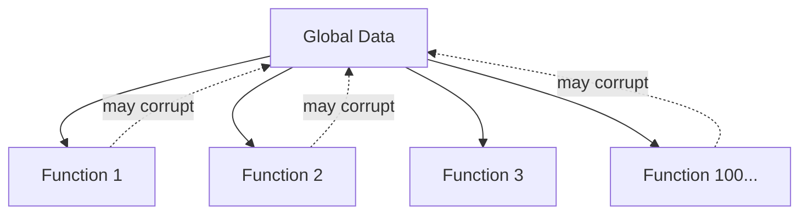

Every new function added is one more place that *might* unintentionally break shared data. This is called **tight
coupling** — a small change in one place can silently break something far away.

### 🛠️ Maintainability Issues

- If a `Student` struct changes (e.g., `marks` becomes subject-wise), **every** function touching `marks` must be
  manually found and fixed.
- No single place "owns" the logic for a `Student` — it's scattered across the codebase.
- New developers must read the *entire* program to understand data flow, since nothing is encapsulated.

### 🔐 Security Issues

- Data is **globally accessible** — any function (even buggy/malicious code) can directly modify sensitive fields like
  balance or passwords.
- No concept of "private" data restricted to specific code.
- One careless line anywhere in the program can corrupt critical data.

> 🎯 **Placement Tip**
> If an interviewer asks *"Why do we need OOP at all? Procedural code also works."* — answer with **scalability,
maintainability, and security**, not just "it's modern" or "it's better." Give the global-data example above; it shows
> you understand the *root cause*, not just the buzzword.

> 📝 **Quick Revision — Chapter 2**
> - Procedural breaks down with team size, complexity, and security needs
> - Root cause: data and behavior are disconnected and globally exposed
> - OOP's mission: bundle data + behavior together, and control access to it

---

## Chapter 3 — 🌱 Understanding OOP

### 📌 Definition of OOP

> **Object-Oriented Programming (OOP)** organizes a program as a collection of **objects**, each combining **data (
state)** and **behavior (methods)** into one unit, interacting with each other to produce results.

### ⚡ Core Idea Behind OOP

Procedural asks: *"What functions do I need?"*
OOP asks: **"What real-world things are involved, and what can they do?"**

Each "thing" becomes an **object** that:

1. Knows things about itself → **state / attributes**
2. Can do things → **behavior / methods**
3. Controls who can access its internals → **access control**

---

### 🌍 Real-World Analogy

| Real World                                                 | OOP Equivalent         |
|------------------------------------------------------------|------------------------|
| A car has color, speed, fuel level                         | **Attributes (data)**  |
| A car can accelerate, brake, honk                          | **Methods (behavior)** |
| You drive without knowing engine wiring                    | **Abstraction**        |
| You can't tamper with the engine via the steering wheel    | **Encapsulation**      |
| A Sports Car *is a* Car, with extras                       | **Inheritance**        |
| "Start" means different things for petrol vs electric cars | **Polymorphism**       |

> 🧠 **Intuition**
> OOP simply takes how humans *naturally* categorize the world — "things that have properties and can act" — and maps
> that directly into code.

---

### 🏗️ Building Software Using Objects

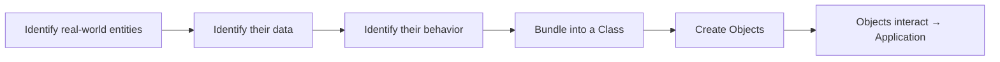

```java
class Account {
    private double balance;   // protected data

    public void withdraw(double amount) {
        if (amount <= balance) {
            balance -= amount;   // rule enforced INSIDE the class
        } else {
            System.out.println("Insufficient funds");
        }
    }
}
```

Now `balance` can **only** change through `withdraw()`, and that method enforces the rule. This single design choice
fixes the maintainability and security problems from Chapter 2.

> 📝 **Quick Revision — Chapter 3**
> - OOP = objects combining data + behavior
> - Mental shift: from "what functions?" to "what things, and what can they do?"
> - Real-world modeling is the foundation of clean OOP design

---

## Chapter 4 — 🏛️ The Four Pillars of OOP

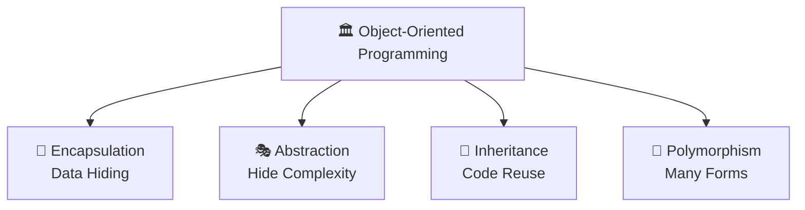

---

### 🔐 4.1 Encapsulation

#### 📌 Concept

Wrapping data and the code that operates on it into a **single unit (class)**, while **restricting direct access** to
that data from outside.

#### ❓ Why It Exists

To stop the procedural disaster of unrestricted, global data access. We need a way to say: *"Only this class's own
methods may touch this data."*

#### ⚡ Key Idea

Protect data → expose only safe, controlled entry points (getters/setters/methods).

#### 🌍 Real World Example

A **medicine capsule**: the medicine (data) sits sealed inside a cover (class). You consume it as a whole, the intended
way — you never touch the raw medicine directly. An ATM works the same way: you never reach into the bank's database —
you interact only through defined buttons.

#### 💻 Java Example

```java
class BankAccount {
    private double balance;   // hidden from outside

    public void deposit(double amount) {
        if (amount > 0) balance += amount;
    }

    public double getBalance() {   // controlled read access
        return balance;
    }
}

public class Main {
    public static void main(String[] args) {
        BankAccount acc = new BankAccount();
        acc.deposit(5000);
        // acc.balance = -9999;   ❌ compile error — balance is private
        System.out.println(acc.getBalance());   // ✅ controlled access
    }
}
```

#### 🏗️ Internal Working

- `private` restricts a member's scope to its own class — enforced by the **compiler**, at compile-time.
- Public getters/setters act as a **gateway**, so validation logic can run before data is read/changed.

> ⚠️ **Common Mistake**
> Writing a getter that returns a **mutable object directly** (e.g., returning the actual internal `List`). The caller
> can then modify it from outside, silently breaking encapsulation. Always return a copy or an unmodifiable view when
> needed.

#### 🔥 Interview Insight

<details>
<summary>Is encapsulation the same as data hiding?</summary>

No. Data hiding is a *result* of encapsulation. Encapsulation is the broader concept of bundling data and behavior
together; restricting access is one of its effects.
</details>

<details>
<summary>Does encapsulation guarantee security?</summary>

No. It improves controlled access, but it is not encryption or authentication — it's a design discipline, not a security
feature in the cryptographic sense.
</details>

> 📝 **Quick Revision — Encapsulation**
> - Bundle data + behavior, restrict direct data access
> - `private` fields + public methods = controlled gateway
> - Solves: global data exposure problem from Chapter 2

---

### 🎭 4.2 Abstraction

#### 📌 Concept

Hiding internal implementation details and showing only the **essential features** to the user.

#### ❓ Why It Exists

Users of a class shouldn't need to understand *how* it works internally to *use* it. Complexity must be hidden behind a
simple interface.

#### ⚡ Key Idea

Separate **"what to do"** from **"how it's done."**

#### 🌍 Real World Example

Driving a car: you use the steering wheel, accelerator, and brake (the **interface**). You don't need to understand the
combustion cycle or transmission gears (the **implementation**) to drive.

#### 💻 Java Example

```java
abstract class Shape {
    abstract double area();   // WHAT — no HOW
}

class Circle extends Shape {
    double radius;

    Circle(double r) {
        radius = r;
    }

    double area() {           // HOW it's actually calculated
        return Math.PI * radius * radius;
    }
}

public class Main {
    public static void main(String[] args) {
        Shape s = new Circle(5);
        System.out.println(s.area());   // caller doesn't care HOW
    }
}
```

| Tool             | Abstraction Level | Can have implementation?                      |
|------------------|-------------------|-----------------------------------------------|
| `abstract class` | Partial           | Yes — some methods can have a body            |
| `interface`      | (Mostly) Full     | Only `default` / `static` methods have a body |

#### 🏗️ Internal Working

- `abstract` methods have **no body** — the JVM defers actual execution to whichever subclass overrides it, decided at *
  *runtime**.
- The compiler enforces a contract: every concrete subclass **must** implement all abstract methods.

> 💡 **Important**
> Abstraction and Encapsulation are **not the same thing**, even though students often confuse them:
> - **Abstraction** → hides *complexity* (design-level decision: what to show)
> - **Encapsulation** → hides *data* (implementation-level decision: how to protect it)

#### 🔥 Interview Insight

<details>
<summary>Can we instantiate an abstract class?</summary>

No, not directly. You must create a subclass that implements all of its abstract methods, and instantiate that subclass
instead.
</details>

> 📝 **Quick Revision — Abstraction**
> - Hide "how", expose only "what"
> - Achieved via `abstract class` or `interface`
> - Lets implementation change later without breaking callers

---

### 🌳 4.3 Inheritance

#### 📌 Concept

A class (**child/subclass**) acquires the properties and behaviors of another class (**parent/superclass**).

#### ❓ Why It Exists

To enable **code reuse** and model natural "is-a" relationships found in the real world.

#### ⚡ Key Idea

Don't repeat shared logic — define it once in a parent, reuse it in every child.

#### 🌍 Real World Example

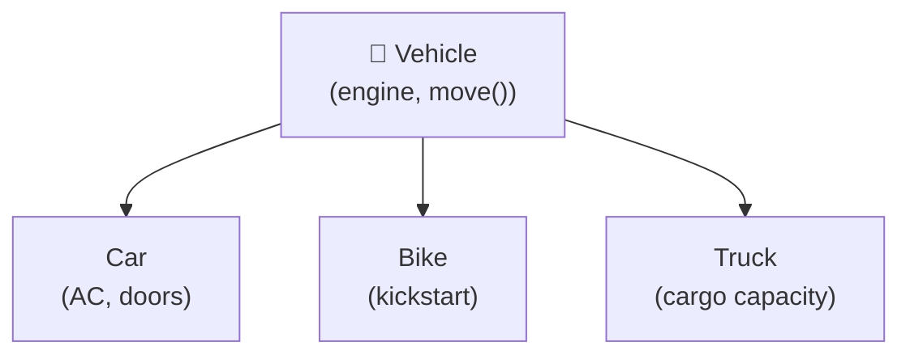

A **Vehicle** is a general category. **Car**, **Bike**, **Truck** are all vehicles — they share common features (engine,
can move) but also have specialized features.

#### 💻 Java Example

```java
class Vehicle {
    void move() {
        System.out.println("Vehicle is moving");
    }
}

class Car extends Vehicle {     // Car IS-A Vehicle
    void honk() {
        System.out.println("Car honks: Beep!");
    }
}

public class Main {
    public static void main(String[] args) {
        Car c = new Car();
        c.move();   // inherited from Vehicle
        c.honk();   // Car's own method
    }
}
```

#### 🏗️ Internal Working

The JVM maintains a class hierarchy. When `c.move()` is called, the JVM first checks `Car`'s own method table; if not
found there, it walks **up** to `Vehicle`.

> ⚠️ **Common Mistake**
> Assuming Java supports multiple inheritance with classes. It doesn't — Java allows only **single inheritance** for
> classes to avoid the **Diamond Problem** (ambiguity when two parents define the same method). Multiple inheritance of
*type* is allowed only through interfaces.

#### 🔥 Interview Insight

<details>
<summary>Is the constructor inherited?</summary>

No. Constructors are not inherited, but a subclass constructor can invoke the parent's constructor explicitly
using <code>super()</code>.
</details>

> 📝 **Quick Revision — Inheritance**
> - "is-a" relationship between parent and child
> - Reuses logic, avoids duplication
> - Single inheritance for classes, multiple via interfaces

---

### 🔄 4.4 Polymorphism

#### 📌 Concept

"Many forms" — the same method name or entity behaves differently depending on context.

#### ❓ Why It Exists

To let **one interface represent multiple implementations**, so code can be written generically and still work correctly
for many object types.

#### ⚡ Key Idea

One call, many possible behaviors — decided by *who* is actually being called.

#### 🌍 Real World Example

Press the **"start"** button:

- On a car → ignites the engine
- On a phone → boots the OS
- On a washing machine → begins a wash cycle

Same action name, different behavior depending on the object.

#### 💻 Java Example

```java
// 1. Compile-time (Static) Polymorphism — Method Overloading
class Calculator {
    int add(int a, int b) {
        return a + b;
    }

    double add(double a, double b) {
        return a + b;
    }
}

// 2. Runtime (Dynamic) Polymorphism — Method Overriding
class Animal {
    void sound() {
        System.out.println("Some sound");
    }
}

class Dog extends Animal {
    void sound() {
        System.out.println("Bark");
    }   // overridden
}

public class Main {
    public static void main(String[] args) {
        Calculator c = new Calculator();
        System.out.println(c.add(2, 3));        // 5    -> int version
        System.out.println(c.add(2.5, 3.5));     // 6.0  -> double version

        Animal a = new Dog();   // Reference type Animal, Object type Dog
        a.sound();              // "Bark" — decided at RUNTIME
    }
}
```

| Type                  | Decided at   | Mechanism          | Example                            |
|-----------------------|--------------|--------------------|------------------------------------|
| Compile-time (Static) | Compile time | Method Overloading | Same name, different parameters    |
| Runtime (Dynamic)     | Run time     | Method Overriding  | Subclass redefines parent's method |

#### 🏗️ Internal Working

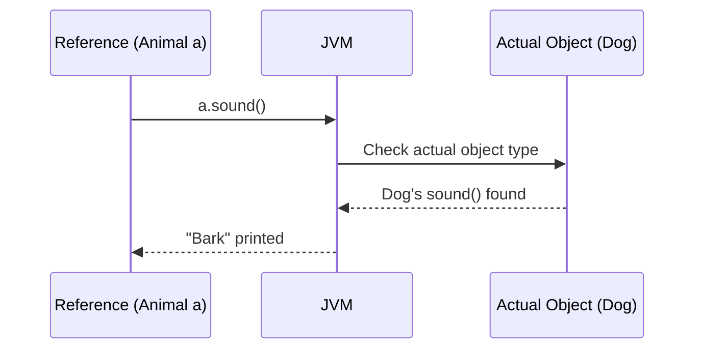

**Overloading** is resolved by the compiler using the method signature — a compile-time decision. **Overriding** uses *
*dynamic method dispatch**: the JVM checks the object's **actual type** at runtime (not the reference type) and calls
the correct overridden method.

> 💡 **Important**
> The reference type only decides **what you're allowed to call**; the actual object type decides **what code actually
runs**.

#### 🔥 Interview Insight

<details>
<summary>Can static methods be overridden?</summary>

No. Static methods are resolved at compile-time based on the reference type — this is called <b>method hiding</b>, not
overriding.
</details>

<details>
<summary>Can we overload methods by changing only the return type?</summary>

No. The parameter list must differ. Changing only the return type creates ambiguity and causes a compile error.
</details>

> 📝 **Quick Revision — Polymorphism**
> - "Many forms" of the same method/interface
> - Overloading = compile-time, same class, different parameters
> - Overriding = runtime, subclass, same signature, dynamic dispatch

---

## Chapter 5 — 🏗️ Class and Object

### 📌 Concept

| Term       | Definition                                                                                                                  |
|------------|-----------------------------------------------------------------------------------------------------------------------------|
| **Class**  | A blueprint/template defining what data and behavior its objects will have. Occupies no memory for instance data by itself. |
| **Object** | A real instance created from a class, occupying actual memory, with its own copy of the data.                               |

### 🧠 Intuition — Blueprint Analogy

```
   CLASS  = Building Blueprint (paper design)
   OBJECT = Actual building constructed from that blueprint

   One blueprint → many buildings can be built
   (same plan, but each building has its own address, furniture, residents)
```

### 💻 Java Example

```java
class Student {              // BLUEPRINT
    String name;
    int marks;

    void study() {
        System.out.println(name + " is studying");
    }
}

public class Main {
    public static void main(String[] args) {
        Student s1 = new Student();   // OBJECT 1
        s1.name = "Alice";
        s1.marks = 95;

        Student s2 = new Student();   // OBJECT 2 — same blueprint
        s2.name = "Rahul";
        s2.marks = 88;

        s1.study();   // "Alice is studying"
        s2.study();   // "Rahul is studying"
    }
}
```

### ⚡ Relationship Between Class and Object

| Class                        | Object                    |
|------------------------------|---------------------------|
| Logical / design-time entity | Physical / runtime entity |
| No memory for instance data  | Memory allocated on Heap  |
| Declared once                | Created many times        |
| Defines structure & behavior | Holds actual values       |

> 🎯 **Placement Tip**
> If asked *"Why do classes even exist if objects do all the real work?"* — answer: classes provide **reusable structure
and type-checking**; objects provide **actual runtime state**. Neither is useful for building real software alone.

> 📝 **Quick Revision — Chapter 5**
> - Class = blueprint, no memory for data
> - Object = real instance, memory allocated on heap
> - Many objects can be created from one class, each with independent state

---

## Chapter 6 — 🧠 Memory View

### 📌 Object Creation Process

```java
Student s1 = new Student();
```


### ⚡ The `new` Keyword

`new` does **three** things:

1. Allocates memory on the **heap** for the object.
2. Calls the class's **constructor** to initialize it.
3. Returns a **reference (address)** to that memory.

### 🏗️ Heap vs Stack

| Heap                                        | Stack                                               |
|---------------------------------------------|-----------------------------------------------------|
| Stores actual **objects** and instance data | Stores **method calls** and **reference variables** |
| Shared across the whole application         | Each method call gets its own frame                 |
| Cleaned by the **Garbage Collector**        | Frame destroyed when method returns                 |

### 🧠 ASCII Diagram — Reference Variables

```
STACK                          HEAP
┌────────────────┐            ┌─────────────────────────┐
│ s1 = 0x1A2B  ───┼───────────▶│ Student object @0x1A2B  │
└────────────────┘            │  name = "Alice"          │
                               │  marks = 95              │
                               └─────────────────────────┘
```

> ⚠️ **Common Mistake**
> Thinking `s1` *contains* the object. It doesn't — `s1` only holds the **address** where the object lives on the heap.
> This is why Java is described as using "reference semantics" for objects.

### 🧠 Multiple Objects from the Same Class

```java
Student s1 = new Student();
Student s2 = new Student();
Student s3 = s1;     // s3 points to the SAME object as s1 — no new object!
```

```
STACK                          HEAP
┌────────────────┐
│ s1 = 0x1A2B  ───┼──────┐     ┌─────────────────────────┐
│ s2 = 0x3F9C  ───┼──┐   └────▶│ Student @0x1A2B           │
│ s3 = 0x1A2B  ───┼──┼────────▶│  name="Alice", marks=95   │
└────────────────┘  │         └─────────────────────────┘
                     │
                     │         ┌─────────────────────────┐
                     └────────▶│ Student @0x3F9C           │
                               │  name="Rahul", marks=88   │
                               └─────────────────────────┘
```

> 🔥 **Interview Insight**
> "Does `s3 = s1` create a new object?" → **No.** It copies the **reference** (address), not the object. Both variables
> now point to the **same** heap memory — changing one affects the other.

> 📝 **Quick Revision — Chapter 6**
> - `new` = allocate heap memory + run constructor + return address
> - Heap → objects; Stack → method frames + reference variables
> - Assigning a reference copies the address only, not the object

---

## Chapter 7 — 📝 Summary Notes

> Use this section for rapid, last-minute revision before walking into an interview.

- **Paradigm** = a style/approach of programming, not a language.
- **Procedural programming** = data and functions are separate; fine for small programs; breaks down at scale due to
  global data and tight coupling.
- **OOP emerged** to fix scalability, maintainability, and security issues of procedural code by bundling data +
  behavior into objects.
- **OOP core idea**: model real-world entities as objects with state (data) and behavior (methods).
- **Four Pillars**
    - 🔐 **Encapsulation** → bundle + restrict access to data
    - 🎭 **Abstraction** → hide implementation, expose only essentials
    - 🌳 **Inheritance** → reuse and extend via parent-child relationships
    - 🔄 **Polymorphism** → same interface, many implementations
- **Class** = blueprint (no instance memory); **Object** = actual instance (heap memory).
- `new` keyword → allocates heap memory + calls constructor + returns reference.
- **Stack** holds method calls and reference variables; **Heap** holds actual objects.
- Assigning `s2 = s1` copies the **address**, not the object — both point to the same memory.
- **Overloading**: same name, different parameters, resolved at **compile-time**.
- **Overriding**: subclass redefines parent method, resolved at **runtime** via dynamic dispatch.
- Java supports **single inheritance** for classes, **multiple inheritance via interfaces**.
- **Static methods cannot be overridden** — only hidden (compile-time resolution).
- Encapsulation ≠ full security — it's about **controlled access**.
- Abstraction hides **complexity**; Encapsulation hides **data**.

> 💡 **Remember**
> Whenever you're confused between two OOP terms, ask: *"Is this about hiding implementation (abstraction), or about
protecting data (encapsulation)? Is this about reuse (inheritance), or about flexible behavior (polymorphism)?"* This
> single question resolves most confusion instantly.

---

## Chapter 8 — 🎯 Interview Questions

<details open>
<summary><b>Click to expand all 24 questions</b></summary>

| #  | Question                                                    | Answer                                                                                                                                                                                                                                                |
|----|-------------------------------------------------------------|-------------------------------------------------------------------------------------------------------------------------------------------------------------------------------------------------------------------------------------------------------|
| 1  | What is a programming paradigm?                             | A fundamental style/approach to structuring and writing code to solve problems (e.g., procedural, object-oriented, functional).                                                                                                                       |
| 2  | Why did procedural programming fail for large systems?      | Data and functions are separate and globally accessible, causing tight coupling, poor reuse, and maintainability/security issues as codebases grew.                                                                                                   |
| 3  | What is OOP in one line?                                    | A paradigm that organizes software as interacting objects, each combining data and behavior, modeled after real-world entities.                                                                                                                       |
| 4  | What are the four pillars of OOP?                           | Encapsulation, Abstraction, Inheritance, Polymorphism.                                                                                                                                                                                                |
| 5  | What is a class?                                            | A blueprint/template defining the structure (fields) and behavior (methods) its objects will have; it doesn't hold actual data itself.                                                                                                                |
| 6  | What is an object?                                          | A runtime instance of a class, with its own memory and actual values for the fields defined by the class.                                                                                                                                             |
| 7  | Where are objects stored in memory?                         | On the Heap. Reference variables pointing to them are stored on the Stack.                                                                                                                                                                            |
| 8  | What does the `new` keyword do internally?                  | Allocates heap memory for the object, invokes the constructor to initialize it, and returns the object's memory address into a reference variable.                                                                                                    |
| 9  | What is encapsulation?                                      | Bundling data and methods into a single unit (class) and restricting direct access to data using `private`, exposing controlled access via public methods.                                                                                            |
| 10 | What is abstraction?                                        | Hiding internal implementation details and exposing only essential functionality, typically via abstract classes or interfaces.                                                                                                                       |
| 11 | Difference between abstraction and encapsulation?           | Abstraction hides complexity/implementation at the design level; Encapsulation hides data at the implementation level.                                                                                                                                |
| 12 | What is inheritance and why use it?                         | A mechanism where a subclass acquires properties/behavior of a superclass; used for code reuse and to model "is-a" relationships.                                                                                                                     |
| 13 | Why doesn't Java support multiple inheritance with classes? | To avoid the Diamond Problem — ambiguity when two parent classes share a method signature. Interfaces avoid this since they don't carry conflicting state by default.                                                                                 |
| 14 | What is polymorphism?                                       | The ability of the same method name/interface to take many forms, behaving differently based on the object or arguments involved.                                                                                                                     |
| 15 | Difference between overloading and overriding?              | Overloading: same method name, different parameters, same class, compile-time. Overriding: subclass redefines a method with the exact same signature, resolved at runtime.                                                                            |
| 16 | Can we overload methods by changing only the return type?   | No. Parameter list must differ; changing only the return type causes ambiguity and a compile error.                                                                                                                                                   |
| 17 | Can static methods be overridden?                           | No. Static methods belong to the class, resolved at compile-time — this is method hiding, not overriding.                                                                                                                                             |
| 18 | What is dynamic method dispatch?                            | The JVM mechanism that decides, at runtime, which overridden method to invoke based on the actual object type, not the reference type.                                                                                                                |
| 19 | Difference between a reference variable and an object?      | A reference variable (on the stack) holds the memory address of an object; the object itself (on the heap) holds the actual data.                                                                                                                     |
| 20 | If `s2 = s1`, does it create a new object?                  | No. It copies the reference (address). Both `s1` and `s2` now point to the same object in heap memory.                                                                                                                                                |
| 21 | Difference between abstract class and interface?            | Abstract class can have both implemented and abstract methods, supports single inheritance, and can hold state. Interface defines method contracts (plus default/static methods), supports multiple inheritance of type, and favors pure abstraction. |
| 22 | Why are constructors not inherited?                         | A constructor initializes the specific class it belongs to; a subclass constructor can still reuse parent logic by calling `super()`.                                                                                                                 |
| 23 | What is the real benefit of OOP in large team projects?     | Each class encapsulates its own responsibility, so developers can work on different classes independently with minimal conflict, and changes stay localized.                                                                                          |
| 24 | What problem does polymorphism solve in real applications?  | It removes the need for long type-checking conditional chains, allowing new types/behaviors to be added without modifying existing calling code.                                                                                                      |

</details>

---

<div align="center">

# 📚 Java OOP Mastery

## Chapter 2: Classes, Objects & Constructors

### From Absolute Beginner → Placement Ready


</div>

---

## ⏪ Recap: Chapter 1 — OOP Foundation

> Before moving forward, here's a 30-second refresher of what we already covered:
>
> - **Procedural programming** keeps data and functions separate — this caused scalability, maintainability, and
    security problems as software grew.
> - **OOP** fixes this by bundling **data + behavior into objects**, modeled after real-world entities.
> - The **Four Pillars**: 🔐 Encapsulation, 🎭 Abstraction, 🌳 Inheritance, 🔄 Polymorphism.
> - A **Class** is a blueprint; an **Object** is a real instance built from that blueprint, living on the **Heap**.
>
> If any of this feels unfamiliar, revisit **README-01-OOP-Foundation.md** before continuing — this chapter builds
> directly on top of it.

---

## 🗺️ Table of Contents

| #    | Section                                                                   | What You'll Learn                   |
|------|---------------------------------------------------------------------------|-------------------------------------|
| 2.1  | [Understanding Classes](#21--understanding-classes)                       | Structure, fields, methods          |
| 2.2  | [Understanding Objects](#22--understanding-objects)                       | Identity, state, behavior           |
| 2.3  | [Instance vs Local Variables](#23--instance-variables-vs-local-variables) | Scope, lifetime, memory             |
| 2.4  | [Object Creation Internals](#24--object-creation-internals)               | Step-by-step `new` breakdown        |
| 2.5  | [Constructors](#25--constructors)                                         | What, why, rules                    |
| 2.6  | [Default Constructor](#26--default-constructor)                           | Compiler-generated                  |
| 2.7  | [Parameterized Constructor](#27--parameterized-constructor)               | Custom initialization               |
| 2.8  | [Constructor Overloading](#28--constructor-overloading)                   | Multiple constructors               |
| 2.9  | [`this` Keyword](#29--this-keyword)                                       | Self-reference, conflict resolution |
| 2.10 | [Constructor Chaining](#210--constructor-chaining)                        | Reusing constructor logic           |
| 2.11 | [Copy Constructor](#211--copy-constructor)                                | Cloning objects manually            |
| 2.12 | [Shallow Copy](#212--shallow-copy)                                        | Surface-level copying               |
| 2.13 | [Deep Copy](#213--deep-copy)                                              | Fully independent copying           |
| 2.14 | [Shallow vs Deep Copy](#214--shallow-copy-vs-deep-copy)                   | Detailed comparison                 |
| 2.15 | [Interview Questions](#215--constructor-interview-questions)              | 25 placement Q&As                   |
| —    | [Chapter Summary](#-chapter-summary)                                      | Cheat sheet + memory tricks         |

---

## 2.1 — 🏗️ Understanding Classes

### 📌 Concept

A **class** is a blueprint that defines what **data (fields)** and **behavior (methods)** its objects will have. The
class itself holds no actual data for any object — it's a design, not a thing.

### ❓ Why Classes Were Introduced

Before structured blueprints, programmers described entities loosely (structs in C, or just variables floating around).
As OOP demanded that data and behavior travel together (Encapsulation), there had to be a **single construct** that
defines both at once. That construct is the class.

### ⚡ Key Idea

Class = **structure** (fields) + **behavior** (methods), defined once, reused for unlimited objects.

### 🧠 Intuition — Blueprint Analogy

```
   CLASS = Architectural blueprint of a house
   OBJECT = An actual house built using that blueprint

   One blueprint can produce unlimited houses.
   Each house has its own address, paint color, furniture —
   but all follow the same structural design.
```

### 🏗️ Structure of a Class

```java
class Student {
    // 🔹 FIELDS (state) — describe the data
    String name;
    int rollNumber;
    double marks;

    // 🔹 METHODS (behavior) — describe the actions
    void study() {
        System.out.println(name + " is studying");
    }

    double getGrade() {
        return marks >= 90 ? 'A' : 'B';
    }
}
```

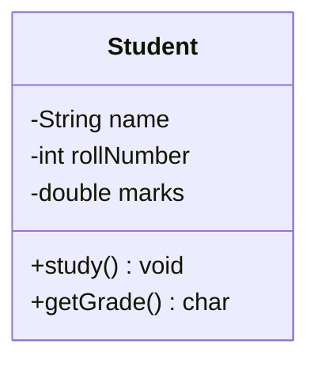

### ⚡ Fields vs Methods

| Component | Also Called                     | Represents                             | Example                 |
|-----------|---------------------------------|----------------------------------------|-------------------------|
| Fields    | Instance variables / attributes | **State** — what an object *knows*     | `name`, `marks`         |
| Methods   | Behaviors / functions           | **Behavior** — what an object *can do* | `study()`, `getGrade()` |

> 💡 **Important**
> **State vs Behavior** is the most fundamental split in OOP. Every single class you ever design boils down to answering
> two questions: *"What does this thing know about itself?"* (fields) and *"What can this thing do?"* (methods).

### 🌍 Real World Examples

| Real Entity | Fields (State)           | Methods (Behavior)    |
|-------------|--------------------------|-----------------------|
| Car         | color, speed, fuelLevel  | accelerate(), brake() |
| BankAccount | balance, accountNumber   | deposit(), withdraw() |
| Employee    | name, salary, department | work(), getPaySlip()  |

### 🏗️ Memory Perspective

> ⚠️ **Common Mistake**
> Students often think *"defining a class uses memory for its fields."* It does **not**. A class declaration only
> registers structure with the JVM (in an area called the **Method Area / Metaspace**). Memory for actual field values
> is
> allocated **only when an object is created** — covered in detail in section 2.4.

> 📝 **Quick Revision — 2.1**
> - Class = blueprint, defines fields (state) + methods (behavior)
> - No memory for instance data is used by the class declaration itself
> - One class → unlimited objects, each with independent state

---

## 2.2 — 🧬 Understanding Objects

### 📌 Concept

An **object** is a real, concrete instance of a class — it exists in memory (on the heap), with its own actual values
for the fields the class defines.

### ❓ Why Objects Exist

A class alone cannot run a program — it's just a design. Programs need **actual data to operate on**. Objects are what
bring a class to life: they hold real values and can actually be acted upon.

### ⚡ Relationship Between Class and Object

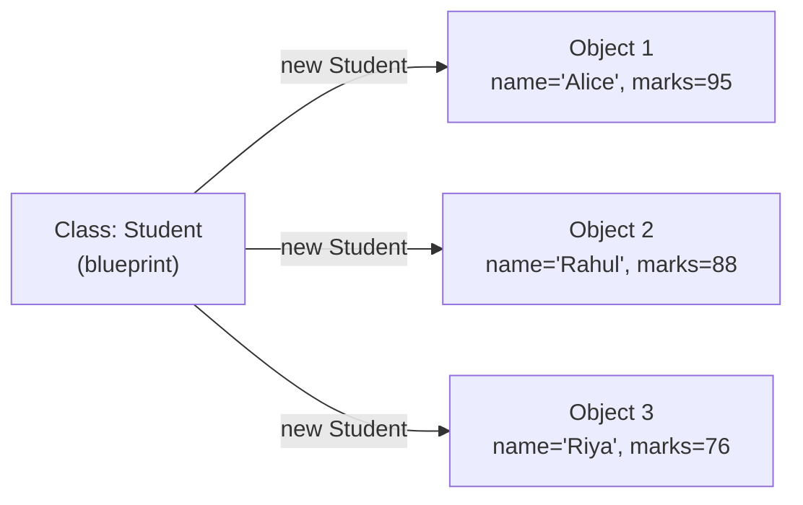

| Class                       | Object                   |
|-----------------------------|--------------------------|
| One definition              | Many instances possible  |
| No memory for instance data | Memory allocated on heap |
| Compile-time concept        | Runtime concept          |
| Defines what's *possible*   | Holds what's *actual*    |

### 💻 Creating Objects

```java
Student s1 = new Student();   // creates Object 1
s1.name ="Alice";
s1.marks =95;

Student s2 = new Student();   // creates Object 2 — independent of s1
s2.name ="Rahul";
s2.marks =88;
```

### 🧠 Object Identity, State & Behavior

| Property     | Meaning                                                                                                 | Example                                |
|--------------|---------------------------------------------------------------------------------------------------------|----------------------------------------|
| **Identity** | A unique existence in memory (its address) — even two objects with identical data are different objects | `s1` and `s2` are different identities |
| **State**    | The current values of its fields at a given moment                                                      | `s1.marks = 95`                        |
| **Behavior** | What it can do, defined by its methods                                                                  | `s1.study()`                           |

> 🧠 **Intuition — Memory Trick**
> Think **"I S B"** — **Identity, State, Behavior** — the three pillars that define *any* object, in *any* OOP language,
> forever. If you can name these three for any object, you understand it completely.

### 🏗️ Memory Diagram — Multiple Objects

```
STACK                           HEAP
┌─────────────────┐
│ s1 = 0xA1   ─────┼──────────▶ ┌──────────────────────────┐
│ s2 = 0xB2   ─────┼──────┐     │ Student @0xA1             │
└─────────────────┘      │     │  name="Alice", marks=95   │
                          │     └──────────────────────────┘
                          │     ┌──────────────────────────┐
                          └────▶│ Student @0xB2             │
                                │  name="Rahul", marks=88   │
                                └──────────────────────────┘
```

> 🔥 **Interview Insight**
> "Can two objects have identical field values but still be different objects?" — **Yes.** Identity is about the memory
> address, not the data inside. `s1.equals(s2)` (if overridden properly) might say they're "equal," but `s1 == s2` would
> say they are **not the same object**, since they live at different heap addresses.

> 📝 **Quick Revision — 2.2**
> - Object = real instance with its own memory and data
> - Identity ≠ State — two objects can have equal state but different identity
> - Every object can be described via Identity, State, Behavior (I-S-B)

---

## 2.3 — 🔍 Instance Variables vs Local Variables

### 📌 Concept

| Type                  | Declared Where                              | Belongs To                     |
|-----------------------|---------------------------------------------|--------------------------------|
| **Instance Variable** | Directly inside a class, outside any method | Each individual object         |
| **Local Variable**    | Inside a method, constructor, or block      | That specific method call only |

### 💻 Java Example

```java
class Employee {
    String name;          // 🔹 instance variable — belongs to the object

    void raiseSalary() {
        int bonus = 5000; // 🔹 local variable — exists only during this call
        System.out.println(name + " gets bonus: " + bonus);
    }
}
```

### ⚡ Comparison Table

| Property                 | Instance Variable                    | Local Variable                                 |
|--------------------------|--------------------------------------|------------------------------------------------|
| **Scope**                | Entire class (any method can use it) | Only within the method/block it's declared in  |
| **Lifetime**             | As long as the object exists         | Only during that single method call            |
| **Memory Location**      | Heap (inside the object)             | Stack (inside the method's stack frame)        |
| **Default Value**        | Yes (e.g., `0`, `null`, `false`)     | No — must be explicitly initialized before use |
| **Access Modifiers**     | Can use `private`, `public`, etc.    | Cannot use access modifiers                    |
| **Where it's destroyed** | When object is garbage collected     | When the method returns                        |

> ⚠️ **Common Mistake**
> Trying to use a local variable without initializing it:
> ```java
> void test() {
>     int x;
>     System.out.println(x);   // ❌ Compile Error: variable x might not have been initialized
> }
> ```
> Java refuses to compile this because local variables have **no default value** — unlike instance variables, which are
> auto-initialized.

### 🔥 Interview Insight

<details>
<summary>Why do instance variables get default values but local variables don't?</summary>

Instance variables live inside an object on the heap, and the JVM zeroes out that memory block when the object is
created — so a default value is guaranteed automatically. Local variables live on the stack, which is reused constantly
between method calls for performance — the JVM does not clear it for you, so uninitialized use could read garbage data.
Java prevents this entirely by forcing you to initialize local variables before use.
</details>

> 📝 **Quick Revision — 2.3**
> - Instance variable → tied to the object → heap → has default value
> - Local variable → tied to the method call → stack → no default value, must initialize

---

## 2.4 — ⚙️ Object Creation Internals

### 📌 Concept

What *really* happens when you write:

```java
Student s = new Student();
```

### 🏗️ Step-by-Step Internal Working

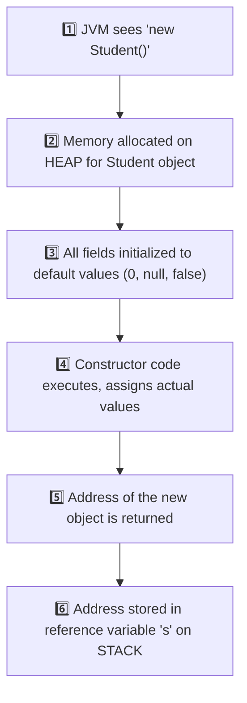

| Step | What Happens                                                                     |
|------|----------------------------------------------------------------------------------|
| 1    | JVM encounters the `new` keyword                                                 |
| 2    | Heap memory block is reserved, sized to fit the object's fields                  |
| 3    | All fields are zeroed out to default values **before** the constructor body runs |
| 4    | Constructor executes, assigning whatever values you provided                     |
| 5    | The memory address of the object is returned by the `new` expression             |
| 6    | That address is stored into the **reference variable** `s` on the stack          |

### 🧠 ASCII Diagram

```
STACK                          HEAP
┌────────────────┐            ┌─────────────────────────┐
│ s = 0x7F3A  ────┼───────────▶│ Student object @0x7F3A   │
└────────────────┘            │  name = null  (default)  │
                               │  marks = 0.0  (default)  │
                               └─────────────────────────┘
                                      ↓ constructor runs
                               ┌─────────────────────────┐
                               │  name = "Alice"          │
                               │  marks = 95.0            │
                               └─────────────────────────┘
```

> 💡 **Important**
> Fields are given default values **before** the constructor runs — not after. This is why, inside a constructor, you
> can safely read an uninitialized instance field (it'll just be `0`/`null`/`false`) — but you must never assume that
> local variables behave the same way.

> 🎯 **Placement Tip**
> If asked *"What is the exact sequence of memory events when an object is created?"* — always mention: **(1)** heap
> allocation, **(2)** default value initialization, **(3)** constructor execution, **(4)** reference returned to stack —
> in that order. Interviewers specifically check if you know default-value initialization happens *before* the
> constructor
> body.

> 📝 **Quick Revision — 2.4**
> - `new` = heap allocation → default values → constructor runs → reference returned
> - Reference variable (stack) only stores the address, never the object itself

---

## 2.5 — 🏛️ Constructors

### 📌 Concept

A **constructor** is a special block of code, with the **same name as the class**, that runs automatically **once** when
an object is created — used to initialize the object's state.

### ❓ Why Constructors Were Introduced

### 🚨 Problem Without Constructors

Imagine Java had no constructors. You'd have to manually initialize every object, every time:

```java
Student s1 = new Student();
s1.name ="Alice";
s1.marks =95;

Student s2 = new Student();
s2.name ="Rahul";
s2.marks =88;
// Forget to set marks for s3? It silently stays 0 — a bug waiting to happen.
```

This is repetitive, error-prone, and gives **no guarantee** that every object starts in a valid state.

### ⚡ Key Idea

A constructor guarantees: **"This object cannot exist without going through this exact initialization logic."**

### 🌍 Real World Example

Think of filling out a hospital admission form **at the moment a patient is registered** — name, age, blood group are
captured immediately, not added "whenever someone remembers." A constructor enforces the same discipline for objects.

### 💻 Java Example

```java
class Student {
    String name;
    double marks;

    Student(String n, double m) {   // CONSTRUCTOR
        name = n;
        marks = m;
    }
}

public class Main {
    public static void main(String[] args) {
        Student s1 = new Student("Alice", 95);  // forced to provide data
        System.out.println(s1.name + " - " + s1.marks);
    }
}
```

### 🏗️ Characteristics of Constructors

| Characteristic | Detail                                  |
|----------------|-----------------------------------------|
| Name           | Must exactly match the class name       |
| Return type    | **None at all** — not even `void`       |
| Invocation     | Called automatically and only via `new` |
| Purpose        | Initialize the newly created object     |
| Inheritance    | Not inherited by subclasses             |

### ⚡ Rules of Constructors

1. Constructor name **must** match the class name exactly (including case).
2. A constructor **cannot have a return type** — not even `void` (if you add `void`, it becomes a regular method, not a
   constructor!).
3. A constructor can use access modifiers (`public`, `private`, etc.) to control who can create objects.
4. A class can have **multiple constructors** (overloading — see 2.8).
5. If you don't write any constructor, the **compiler auto-generates one** (see 2.6).

> ⚠️ **Common Mistake**
> ```java
> class Student {
>     void Student() {   // ❌ This is NOT a constructor — it's a regular method!
>         System.out.println("Created");
>     }
> }
> ```
> The moment you add a return type (even `void`), Java treats it as a normal method with the same name as the class — *
*not** a constructor. It will never run automatically on `new Student()`.

### 🏗️ Constructor Execution Flow

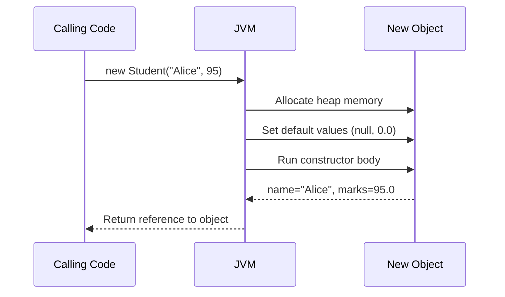

> 📝 **Quick Revision — 2.5**
> - Constructor = special init block, same name as class, no return type
> - Guarantees every object starts in a valid, fully-initialized state
> - Runs automatically and only through `new`

---

## 2.6 — 🤖 Default Constructor

### 📌 Concept

If you write **no constructor at all** in your class, the Java compiler **automatically inserts one** for you — called
the **default constructor**. It takes no parameters and does nothing beyond basic initialization.

### 💻 Compiler-Generated Example

```java
class Student {
    String name;
    double marks;
    // No constructor written here
}

// The compiler secretly generates:
// Student() {
//     super();   // calls the parent class's no-arg constructor
// }
```

```java
public class Main {
    public static void main(String[] args) {
        Student s = new Student();   // works! uses compiler-generated constructor
        System.out.println(s.name);   // prints "null" (default value)
    }
}
```

### ⚡ When It Appears

| Condition                                                    | Default Constructor Appears? |
|--------------------------------------------------------------|------------------------------|
| Class has **no** constructor written at all                  | ✅ Yes                        |
| Class has at least **one** constructor (of any kind) written | ❌ No                         |

> ⚠️ **Common Mistake**
> ```java
> class Student {
>     Student(String name) { this.name = name; }
> }
>
> Student s = new Student();   // ❌ Compile Error!
> ```
> The moment you write **any** constructor yourself, Java **stops** generating the default one. Since no no-argument
> constructor exists anymore, `new Student()` fails to compile. This is one of the most common beginner errors.

> 🔥 **Interview Insight**
> "Is the default constructor the same as a no-argument constructor you write yourself?" — **Not quite.** A "default
> constructor" specifically refers to the one the **compiler auto-generates** when you write none. If *you* manually
> write
> a no-argument constructor, it's technically called a "no-arg constructor," not a "default constructor" — though they
> behave similarly.

> 📝 **Quick Revision — 2.6**
> - No constructor written → compiler inserts a default, no-arg constructor automatically
> - Writing even one constructor removes this automatic behavior

---

## 2.7 — 🎛️ Parameterized Constructor

### 📌 Concept

A constructor that accepts **parameters**, allowing the object to be initialized with **specific values right at
creation time**.

### ❓ Why Needed

The default constructor gives every field a generic default (`0`, `null`). Real software almost always needs objects to
start with **meaningful, specific data** — a parameterized constructor makes this both possible and mandatory.

### 🌍 Real Use Cases

| Scenario                       | Why a Parameterized Constructor Helps             |
|--------------------------------|---------------------------------------------------|
| Creating a `Student`           | Must supply name and roll number immediately      |
| Creating a `Connection` object | Must supply host, port, credentials at creation   |
| Creating an `Order`            | Must supply customer ID, item list, price upfront |

### 💻 Java Example

```java
class Student {
    String name;
    int rollNumber;

    Student(String name, int rollNumber) {
        this.name = name;
        this.rollNumber = rollNumber;
    }
}

public class Main {
    public static void main(String[] args) {
        Student s1 = new Student("Alice", 101);
        Student s2 = new Student("Rahul", 102);
        System.out.println(s1.name + " - " + s1.rollNumber);
    }
}
```

> 💡 **Important**
> Once you define a parameterized constructor, Java does **not** automatically also give you a no-arg constructor (see
> 2.6's common mistake). If you need both, you must explicitly write both — or use constructor chaining (2.10).

> 📝 **Quick Revision — 2.7**
> - Parameterized constructor = forces meaningful initial values at object creation
> - Prevents objects from silently existing in an incomplete/default state

---

## 2.8 — 🔁 Constructor Overloading

### 📌 Concept

Defining **multiple constructors** in the same class, each with a **different parameter list** — so objects can be
created in different ways depending on what data is available.

### ❓ Why Needed

Sometimes you have full data, sometimes partial. Constructor overloading lets the same class support multiple creation
strategies without duplicating the whole class.

### ⚡ Rules

1. Each constructor must have a **different parameter list** (number, type, or order of parameters).
2. Return type doesn't apply here (constructors never have one), so you **cannot** overload by "return type" — only by
   parameters.
3. The compiler picks the correct constructor **at compile-time**, based on the arguments you pass.

### 💻 Java Example

```java
class Student {
    String name;
    int rollNumber;
    double marks;

    Student() {                                  // no-arg
        this.name = "Unknown";
    }

    Student(String name, int rollNumber) {        // 2 params
        this.name = name;
        this.rollNumber = rollNumber;
    }

    Student(String name, int rollNumber, double marks) {  // 3 params
        this.name = name;
        this.rollNumber = rollNumber;
        this.marks = marks;
    }
}

public class Main {
    public static void main(String[] args) {
        Student s1 = new Student();
        Student s2 = new Student("Rahul", 102);
        Student s3 = new Student("Riya", 103, 91.5);
    }
}
```

### 🏗️ Internal Working

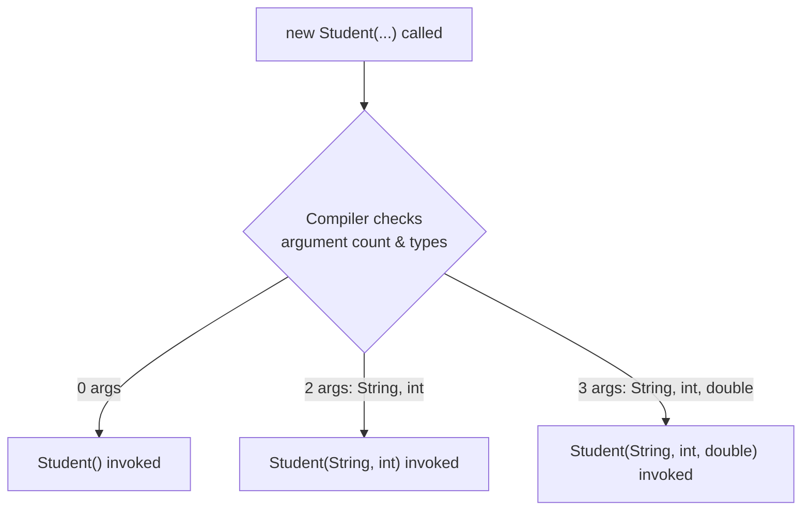

This matching happens entirely at **compile-time** — it's a form of **static (compile-time) polymorphism**, the same
concept as method overloading from Chapter 1.

### 🔥 Interview Insight

<details>
<summary>Can two constructors differ only by parameter names?</summary>

No. The compiler distinguishes constructors (and methods) by their **signature** — number, type, and order of
parameters — never by parameter *names*. `Student(String name)` and `Student(String fullName)` are considered identical
signatures and will cause a compile error if both exist.
</details>

<details>
<summary>Can constructor overloading be considered runtime polymorphism?</summary>

No. It's resolved entirely at compile-time based on the arguments provided — making it a form of **static polymorphism
**, same category as method overloading.
</details>

> 📝 **Quick Revision — 2.8**
> - Multiple constructors, different parameter lists, same class
> - Resolved at compile-time → static/compile-time polymorphism
> - Cannot overload using only different parameter names or return type

---

## 2.9 — 🪄 `this` Keyword

### 📌 Concept

`this` is a special reference variable that always points to the **current object** — the object whose method or
constructor is currently executing.

### ❓ Why `this` Exists

Without `this`, there'd be no clean way to tell apart a constructor's **parameter** from the class's **instance variable
** when they share the same name — a very common, intentional pattern in real code.

### ⚡ Resolving Naming Conflicts

```java
class Student {
    String name;

    Student(String name) {     // parameter also called "name"
        this.name = name;      // this.name = instance variable, name = parameter
    }
}
```

> ⚠️ **Common Mistake**
> ```java
> class Student {
>     String name;
>     Student(String name) {
>         name = name;   // ❌ BUG: assigns parameter to itself, instance variable stays null!
>     }
> }
> ```
> Without `this.`, Java resolves `name = name` as the **local parameter** being assigned to itself — the instance
> variable `name` is **never touched**, silently staying `null`. This is one of the most common real bugs in beginner
> Java
> code.

### 🧠 Memory Perspective

```
this  ────▶  always points to the SAME object that called the current method/constructor
```

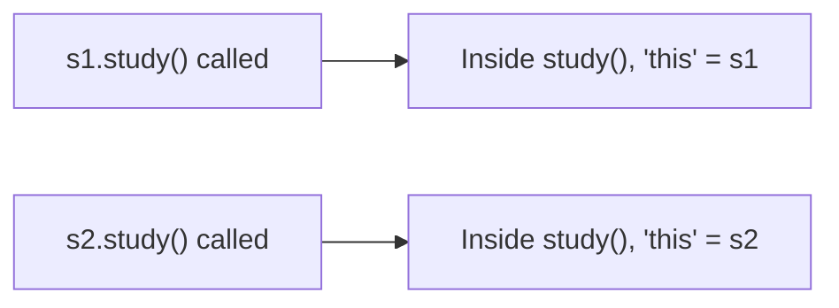

`this` is not a fixed variable — its value is determined **dynamically**, based on which object's method is currently
executing.

### ⚡ Calling Constructors Using `this()`

`this(...)` (with parentheses) is used to call **another constructor of the same class** — this is the mechanism behind
**Constructor Chaining**, covered fully in 2.10.

```java
class Student {
    String name;
    int rollNumber;

    Student() {
        this("Unknown", 0);   // calls the other constructor below
    }

    Student(String name, int rollNumber) {
        this.name = name;
        this.rollNumber = rollNumber;
    }
}
```

> 💡 **Important**
> `this` (no parentheses) → refers to the current object.
> `this(...)` (with parentheses) → calls another constructor in the same class.
> These are two completely different uses of the same keyword — a frequent interview trap.

> 📝 **Quick Revision — 2.9**
> - `this` = reference to the currently executing object
> - Resolves naming conflicts between parameters and instance variables
> - `this(...)` calls another constructor of the same class (must be the **first** line)

---

## 2.10 — 🔗 Constructor Chaining

### 📌 Concept

**Constructor chaining** is calling one constructor from another **within the same class** (using `this(...)`), so
shared initialization logic is written only **once**.

### ❓ Why Needed

Without chaining, multiple overloaded constructors often repeat the same initialization code, violating the principle of
**not repeating yourself**. Chaining lets simpler constructors delegate to more complete ones.

### 🏗️ Internal Flow

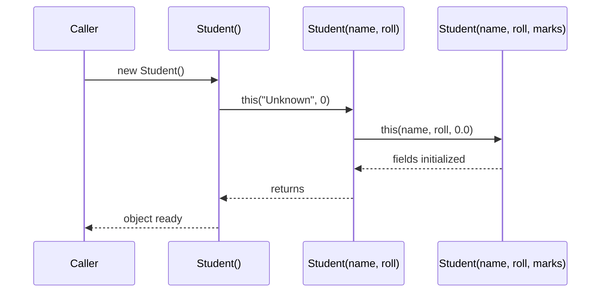

### 💻 Java Example

```java
class Student {
    String name;
    int rollNumber;
    double marks;

    Student() {
        this("Unknown", 0);                 // chains to 2-arg constructor
    }

    Student(String name, int rollNumber) {
        this(name, rollNumber, 0.0);         // chains to 3-arg constructor
    }

    Student(String name, int rollNumber, double marks) {
        this.name = name;
        this.rollNumber = rollNumber;
        this.marks = marks;
        System.out.println("Final initialization complete");
    }
}
```

### ⚠️ Common Mistakes

> ⚠️ **Common Mistake #1 — Wrong Position**
> ```java
> Student() {
>     System.out.println("Creating student");
>     this("Unknown", 0);   // ❌ Compile Error
> }
> ```
> `this(...)` **must be the very first statement** in a constructor. Java enforces this strictly — no code, not even a
> print statement, can come before it.

> ⚠️ **Common Mistake #2 — Circular Chaining**
> ```java
> Student() { this("A", 1); }
> Student(String n, int r) { this(); }   // ❌ Compile Error: circular chain
> ```
> Constructors calling each other in a loop are detected by the compiler and rejected immediately.

> 📝 **Quick Revision — 2.10**
> - Constructor chaining = one constructor calling another via `this(...)`
> - Must be the first statement; avoids duplicate initialization logic
> - Circular chains are caught and rejected at compile-time

---

## 2.11 — 📋 Copy Constructor

### 📌 Concept

A **copy constructor** is a constructor that creates a new object by **copying the field values of an existing object**
of the same class.

> 💡 **Important**
> Java does **not** provide a built-in copy constructor like C++ does. You must write it **yourself**, manually.

### ❓ Why Needed

Sometimes you need a new, independent object that **starts out identical** to an existing one — for example, duplicating
a configuration object before modifying it, so the original stays untouched.

### 🌍 Real World Uses

| Scenario                                                  | Why a Copy Constructor Helps         |
|-----------------------------------------------------------|--------------------------------------|
| Duplicating a `Settings` object before experiment changes | Keep the original safe               |
| Creating a backup `Order` snapshot before processing      | Preserve original state for rollback |
| Cloning a game character's stats for a new save slot      | Avoid shared mutable state bugs      |

### 💻 Syntax & Example

```java
class Student {
    String name;
    int rollNumber;

    Student(String name, int rollNumber) {
        this.name = name;
        this.rollNumber = rollNumber;
    }

    // COPY CONSTRUCTOR
    Student(Student original) {
        this.name = original.name;
        this.rollNumber = original.rollNumber;
    }
}

public class Main {
    public static void main(String[] args) {
        Student s1 = new Student("Alice", 101);
        Student s2 = new Student(s1);   // copy constructor used here

        s2.name = "Riya";   // changing s2 does NOT affect s1
        System.out.println(s1.name);   // "Alice"
        System.out.println(s2.name);   // "Riya"
    }
}
```

> 🔥 **Interview Insight**
> "Does Java have a built-in copy constructor?" — **No.** Unlike C++, Java leaves copying entirely up to the developer —
> via a manually written copy constructor, the `clone()` method, or third-party utilities. This is a frequently asked
> trap
> question.

> 📝 **Quick Revision — 2.11**
> - Copy constructor = manually written constructor that duplicates another object's fields
> - Java has no automatic copy constructor (unlike C++)
> - Useful for snapshotting/cloning objects safely

---

## 2.12 — 🌊 Shallow Copy

### 📌 Concept

A **shallow copy** copies an object's **primitive fields directly**, but for fields that are **references to other
objects**, it copies only the **reference (address)** — not the actual referenced object.

### 🏗️ Internal Working

```java
class Address {
    String city;

    Address(String city) {
        this.city = city;
    }
}

class Student {
    String name;
    Address address;     // reference type field

    Student(String name, Address address) {
        this.name = name;
        this.address = address;
    }

    // SHALLOW COPY constructor
    Student(Student original) {
        this.name = original.name;          // primitive-like copy (String is immutable anyway)
        this.address = original.address;    // ⚠️ copies the REFERENCE, not the Address object!
    }
}
```

### 🧠 Memory Representation

```
STACK                HEAP
                     ┌─────────────────────────┐
s1 ────────────────▶│ Student @0xA1             │
                     │  name = "Alice"           │
                     │  address ────────────┐    │
                     └──────────────────────┼────┘
                                             │
                     ┌──────────────────────▼────┐
                     │ Address @0xC1              │
                     │  city = "Pune"              │
                     └─────────────────────────────┘
                                             ▲
                     ┌──────────────────────┼────┐
s2 ────────────────▶│ Student @0xB2          │    │
                     │  name = "Alice"        │    │
                     │  address ──────────────┘    │
                     └──────────────────────────────┘
```

Both `s1.address` and `s2.address` point to the **same** `Address` object! Changing `s2.address.city` will also change
what `s1.address.city` shows.

```java
s2.address.city ="Mumbai";
        System.out.

println(s1.address.city);   // "Mumbai" too! ⚠️ Unexpected side effect
```

### ⚡ Advantages

- ✅ Fast — no need to recursively copy nested objects
- ✅ Less memory usage — shared objects aren't duplicated
- ✅ Simple to implement (often just field-by-field assignment, or `Object.clone()` default behavior)

### ⚡ Disadvantages

- ❌ Changes through one object's reference field **leak** into the other object
- ❌ Can cause subtle, hard-to-trace bugs in larger systems
- ❌ Breaks the assumption that a "copy" is fully independent

> ⚠️ **Common Mistake**
> Assuming `Object`'s default `clone()` method gives you a fully independent copy. By default, `clone()` performs a *
*shallow copy** — all reference fields still point to the same nested objects as the original.

> 📝 **Quick Revision — 2.12**
> - Shallow copy → primitives copied directly, reference fields share the SAME nested object
> - Fast and memory-light, but risky — changes can leak across "copies"

---

## 2.13 — 🏔️ Deep Copy

### 📌 Concept

A **deep copy** creates a fully **independent** duplicate — including separate copies of every nested object referenced
by the original, not just the top-level fields.

### 🏗️ Internal Working

```java
class Address {
    String city;

    Address(String city) {
        this.city = city;
    }
}

class Student {
    String name;
    Address address;

    Student(String name, Address address) {
        this.name = name;
        this.address = address;
    }

    // DEEP COPY constructor
    Student(Student original) {
        this.name = original.name;
        this.address = new Address(original.address.city);  // ✅ NEW Address object created
    }
}
```

### 🧠 Memory Representation

```
STACK                HEAP
s1 ────────────────▶ ┌─────────────────────────┐
                     │ Student @0xA1             │
                     │  name = "Alice"           │
                     │  address ───────┐         │
                     └─────────────────┼─────────┘
                                        ▼
                     ┌─────────────────────────┐
                     │ Address @0xC1             │
                     │  city = "Pune"             │
                     └─────────────────────────┘

s2 ────────────────▶ ┌─────────────────────────┐
                     │ Student @0xB2              │
                     │  name = "Alice"            │
                     │  address ───────┐           │
                     └─────────────────┼───────────┘
                                        ▼
                     ┌─────────────────────────┐
                     │ Address @0xD9   (DIFFERENT!) │
                     │  city = "Pune"             │
                     └─────────────────────────┘
```

Now `s1.address` and `s2.address` point to **completely different** `Address` objects.

```java
s2.address.city ="Mumbai";
        System.out.

println(s1.address.city);   // still "Pune" ✅ fully independent
```

### ⚡ Advantages

- ✅ True independence — modifying the copy never affects the original
- ✅ Safer for concurrent/multi-threaded use (no shared mutable state)
- ✅ Predictable behavior, easier to reason about

### ⚡ Disadvantages

- ❌ Slower — every nested object must be recursively copied
- ❌ Higher memory usage — duplicate objects everywhere
- ❌ More code to write and maintain, especially for deeply nested structures

> 🌍 **Real World Example**
> Cloning a video game save file for a "New Game+" mode: you want a **deep copy** so playing the new save never corrupts
> the original save's inventory, stats, or progress.

> 📝 **Quick Revision — 2.13**
> - Deep copy → every nested object is recursively duplicated → fully independent
> - Safer but costs more time and memory than a shallow copy

---

## 2.14 — ⚖️ Shallow Copy vs Deep Copy

### ⚡ Detailed Comparison Table

| Aspect                            | Shallow Copy                                               | Deep Copy                                                 |
|-----------------------------------|------------------------------------------------------------|-----------------------------------------------------------|
| Primitive fields                  | Copied directly                                            | Copied directly                                           |
| Reference fields                  | Same reference shared with original                        | New, independent object created                           |
| Speed                             | Faster                                                     | Slower                                                    |
| Memory usage                      | Lower                                                      | Higher                                                    |
| Independence                      | Partial — nested objects are shared                        | Full — completely independent                             |
| Risk of side effects              | High — changes can leak across copies                      | Low — changes stay isolated                               |
| Default `Object.clone()` behavior | This is the default                                        | Must be manually implemented                              |
| Best for                          | Simple objects, or when sharing nested data is intentional | Objects with mutable nested state that must stay isolated |

### 🧠 Visual Memory Trick

```
Shallow Copy  🌊  →  "Skims the surface" — top-level fields only, nested objects SHARED
Deep Copy     🏔️  →  "Goes all the way down" — every level duplicated, fully INDEPENDENT
```

### 🔥 Interview-Focused Discussion

> 🎯 **Placement Tip**
> A very common interview question: *"If a class has only primitive fields (int, double, boolean...), is there any
difference between shallow and deep copy?"*
> **Answer: No.** The shallow vs deep distinction **only matters when a class has reference-type fields** (objects,
> arrays, collections). With purely primitive fields, both approaches behave identically.

<details>
<summary>🔥 Why does Object.clone() give a shallow copy by default?</summary>

`Object.clone()` performs a simple, fast bit-by-bit copy of the object's memory layout. It has no way of knowing which
reference fields *should* be deeply duplicated versus intentionally shared — so Java takes the safe, fast default (
shallow), and leaves deep copying as something developers must explicitly implement based on their own object's needs.
</details>

<details>
<summary>🔥 How can you achieve a deep copy in real Java code?</summary>

Common approaches: (1) manually write a deep-copy constructor that recursively copies nested objects, (2) override
`clone()` and manually clone reference fields too, (3) use serialization (serialize then deserialize the object), or (4)
use a library like Apache Commons or Gson for JSON-based deep cloning.
</details>

> 📝 **Quick Revision — 2.14**
> - Difference only matters for reference-type fields
> - Shallow = shared nested objects (fast, risky); Deep = independent nested objects (safe, costly)

---

## 2.15 — 🎯 Constructor Interview Questions

<details open>
<summary><b>Click to expand all 25 questions</b></summary>

| #  | Question                                                                                                 | Answer                                                                                                                                                                                          |
|----|----------------------------------------------------------------------------------------------------------|-------------------------------------------------------------------------------------------------------------------------------------------------------------------------------------------------|
| 1  | What is a constructor?                                                                                   | A special block with the same name as the class, having no return type, that runs automatically when an object is created, to initialize it.                                                    |
| 2  | Why doesn't a constructor have a return type?                                                            | Because it doesn't "return" a value in the usual sense — it initializes the object that `new` is already in the process of creating and returning.                                              |
| 3  | What happens if you write `void` before a constructor-looking method?                                    | It stops being a constructor and becomes a normal method with the same name as the class — it will never run automatically on object creation.                                                  |
| 4  | What is a default constructor?                                                                           | A no-argument constructor automatically generated by the compiler when the class defines no constructor at all.                                                                                 |
| 5  | When does the compiler NOT generate a default constructor?                                               | As soon as the class defines any constructor of its own — parameterized or not.                                                                                                                 |
| 6  | What is a parameterized constructor?                                                                     | A constructor that accepts arguments, allowing the caller to supply specific initial values when creating the object.                                                                           |
| 7  | What is constructor overloading?                                                                         | Defining multiple constructors in the same class, each with a different parameter list, so objects can be created in different ways.                                                            |
| 8  | Can constructors be overloaded by return type?                                                           | No — constructors never have a return type, so overloading is based purely on the parameter list.                                                                                               |
| 9  | Is constructor overloading resolved at compile-time or runtime?                                          | Compile-time — it is a form of static (compile-time) polymorphism.                                                                                                                              |
| 10 | What is the `this` keyword used for?                                                                     | It refers to the current object — used to resolve naming conflicts between instance variables and parameters, and to call another constructor via `this(...)`.                                  |
| 11 | What is constructor chaining?                                                                            | One constructor calling another constructor within the same class using `this(...)`, to reuse shared initialization logic.                                                                      |
| 12 | What is the rule about `this(...)` placement?                                                            | It must be the very first statement inside the constructor — no other code can precede it.                                                                                                      |
| 13 | Can constructors call each other in a circular manner?                                                   | No — the compiler detects circular constructor chains and raises a compile-time error.                                                                                                          |
| 14 | What is a copy constructor?                                                                              | A constructor that creates a new object by copying field values from an existing object of the same class.                                                                                      |
| 15 | Does Java provide a built-in copy constructor like C++?                                                  | No. Java does not auto-generate a copy constructor; you must write one manually, or use `clone()`/serialization.                                                                                |
| 16 | What is a shallow copy?                                                                                  | A copy where primitive fields are duplicated directly, but reference-type fields still point to the SAME nested objects as the original.                                                        |
| 17 | What is a deep copy?                                                                                     | A copy where every nested object is also recursively duplicated, making the copy fully independent from the original.                                                                           |
| 18 | Does `Object.clone()` perform a shallow or deep copy by default?                                         | Shallow copy by default.                                                                                                                                                                        |
| 19 | When does the difference between shallow and deep copy NOT matter?                                       | When the class has only primitive fields and no reference-type fields.                                                                                                                          |
| 20 | What problem can shallow copies cause?                                                                   | Changes made through one object's reference field can unexpectedly affect the "copied" object too, since they share the same nested object.                                                     |
| 21 | Are instance variables initialized before or after the constructor runs?                                 | Before — fields are set to default values (0, null, false) first, and the constructor body then assigns the actual values.                                                                      |
| 22 | What's the difference between instance and local variables in terms of default values?                   | Instance variables get automatic default values; local variables do not and must be explicitly initialized before use.                                                                          |
| 23 | Why is `this.name = name` different from `name = name` inside a constructor with a same-named parameter? | `this.name = name` assigns the parameter to the instance variable; `name = name` (without `this`) assigns the parameter to itself, leaving the instance variable untouched — a common real bug. |
| 24 | Can a constructor be `private`?                                                                          | Yes — this is commonly used in Singleton design patterns to prevent external code from creating new instances directly.                                                                         |
| 25 | If `s2 = s1` (assignment, not a copy constructor), is that the same as creating a copy?                  | No. It simply makes `s2` point to the exact same object as `s1` — no new object is created at all, unlike a copy constructor which produces a genuinely separate object.                        |

</details>

> 🔥 **Frequently Asked Interview Trap**
> Interviewers love combining shallow copy + reference assignment in one tricky question: *"If I do `Student s2 = s1;`
and then modify `s2.name`, does `s1.name` change too?"* — **Yes**, because `s2` and `s1` are literally the same object (
> no copying happened at all — that's just reference assignment, not even a shallow copy). Don't confuse plain reference
> assignment with shallow copying — they are different concepts that interviewers intentionally blur together to test
> real
> understanding.

---

## 📝 Chapter Summary

### ✅ Quick Revision Notes

- A **class** defines structure (fields) and behavior (methods); an **object** is its real, memory-occupying instance.
- **Instance variables** belong to the object (heap, default values); **local variables** belong to a method call (
  stack, no default values).
- Object creation (`new`) = heap allocation → default values set → constructor runs → reference returned to stack.
- A **constructor** has the same name as the class, no return type, and runs automatically on `new`.
- **Default constructor** = compiler-generated, no-arg — disappears the moment you write any constructor yourself.
- **Parameterized constructor** = forces meaningful data at creation time.
- **Constructor overloading** = multiple constructors, different parameter lists, resolved at compile-time.
- **`this`** = reference to the current object; `this(...)` = call to another constructor (must be first statement).
- **Constructor chaining** = constructors calling each other via `this(...)` to avoid duplicate logic.
- **Copy constructor** = manually written, since Java has no built-in version (unlike C++).
- **Shallow copy** = reference fields shared with the original; **Deep copy** = reference fields fully duplicated.

### 🧠 Cheat Sheet

| Concept             | One-Line Memory Hook                                  |
|---------------------|-------------------------------------------------------|
| Class               | "Design, not a thing"                                 |
| Object              | "Thing, with an address"                              |
| Instance variable   | "Lives as long as the object"                         |
| Local variable      | "Lives as long as the method call"                    |
| Default constructor | "Compiler's gift, gone the moment you write your own" |
| `this`              | "Always means *me*, the current object"               |
| `this(...)`         | "Call my sibling constructor"                         |
| Shallow copy        | "Skims the surface — shares nested objects"           |
| Deep copy           | "Goes all the way down — fully independent"           |

### 💡 Important Formulas / Rules

- `this(...)` must be the **first line** of a constructor — no exceptions.
- A class can have unlimited constructors, but **no two can share the same parameter signature**.
- Default values only apply to **instance variables**, never to local variables.
- Shallow vs Deep copy only matters when a class has **reference-type fields**.

### ⚠️ Frequently Forgotten Points

- Writing **any** constructor removes the compiler's automatic default constructor.
- `name = name` (without `this.`) inside a constructor is a silent, hard-to-spot bug.
- Plain reference assignment (`s2 = s1`) is **not** copying — it's two variables pointing to the same object.
- `Object.clone()` is shallow by default — deep copying must be implemented manually.

---

<div align="center">

# 📚 Java OOP Mastery

## Chapter 3: Encapsulation & Access Modifiers

### From Absolute Beginner → Placement Ready


</div>

---

## ⏪ Recap: Chapters 1 & 2

> A 60-second refresher before we go deeper:
>
> **Chapter 1 — OOP Foundation**
> - Procedural code separates data and functions, which breaks down at scale.
> - OOP bundles data + behavior into **objects**, modeled after real-world entities.
> - Four Pillars: 🔐 Encapsulation, 🎭 Abstraction, 🌳 Inheritance, 🔄 Polymorphism.
>
> **Chapter 2 — Classes, Objects & Constructors**
> - A **class** is a blueprint; an **object** is a real instance living on the heap.
> - **Constructors** initialize objects automatically when `new` is called.
> - We learned **shallow copy** (shared nested objects) vs **deep copy** (fully independent objects).
>
> This chapter goes deep into the **first pillar** we only touched briefly: **Encapsulation** — and the access-control
> machinery (`private`, `default`, `protected`, `public`) that makes it actually work in Java.

---

## 🗺️ Table of Contents

| #    | Section                                                                   |
|------|---------------------------------------------------------------------------|
| 3.1  | [Why Encapsulation Was Introduced](#31--why-encapsulation-was-introduced) |
| 3.2  | [What is Encapsulation?](#32--what-is-encapsulation)                      |
| 3.3  | [Data Hiding](#33--data-hiding)                                           |
| 3.4  | [Access Modifiers](#34--access-modifiers)                                 |
| 3.5  | [Getters and Setters](#35--getters-and-setters)                           |
| 3.6  | [Validation using Setters](#36--validation-using-setters)                 |
| 3.7  | [Immutable Objects](#37--immutable-objects)                               |
| 3.8  | [Encapsulation vs Data Hiding](#38--encapsulation-vs-data-hiding)         |
| 3.9  | [Access Modifier Comparison](#39--access-modifier-comparison)             |
| 3.10 | [Common Design Mistakes](#310--common-design-mistakes)                    |
| 3.11 | [Coding Practice](#311--coding-practice)                                  |
| 3.12 | [Placement & Interview Questions](#312--placement--interview-questions)   |
| —    | [Chapter Wrap-Up](#-chapter-wrap-up)                                      |

---

## 3.1 — 🚨 Why Encapsulation Was Introduced

### 📌 Problem

Picture a simple `BankAccount` class with no protection at all:

```java
class BankAccount {
    double balance;   // wide open — anyone can touch this directly
}
```

```java
BankAccount acc = new BankAccount();
acc.balance =5000;
acc.balance =-99999;   // 😱 perfectly legal — nothing stops this
```

There is **no rule, no checkpoint, no gatekeeper**. Any line of code, anywhere in the entire application, can set
`balance` to anything — including impossible values.

### ❓ Why Java Needed This Feature

As programs grew from "a few hundred lines written by one person" to "millions of lines written by hundreds of
developers," a new category of bugs appeared — not logic bugs, but **structural** bugs: bugs that happen simply because
*nothing prevents* bad data from entering an object.

### 🚧 Existing Limitation

Without any access control, every field in every class behaves like a **global variable** scoped to the object. This
recreates the exact problem procedural programming had with global data (Chapter 1, Chapter 2) — except now it's hidden
*inside* objects, which makes it feel safe when it isn't.

### 🌍 Real-World Motivation

| Scenario                            | What Goes Wrong Without Encapsulation                                                                                                                                       |
|-------------------------------------|-----------------------------------------------------------------------------------------------------------------------------------------------------------------------------|
| **Data corruption**                 | `acc.balance = -99999` — nothing validates this is impossible                                                                                                               |
| **Security issues**                 | Any class in the codebase, even unrelated ones, can directly read or modify a user's password field                                                                         |
| **Maintainability issues**          | If `balance` needs to change from `double` to a `Money` object later, every single place that directly touched `.balance` across the whole codebase must be found and fixed |
| **Large-scale software challenges** | With 50 developers touching the same classes, nobody can guarantee an object stays in a valid state — there's no single place enforcing the rules                           |

> ⚠️ **Common Mistake**
> Beginners often think encapsulation is "just about making fields private to look more professional." It's not
> cosmetic — it exists specifically to **prevent invalid states and protect data integrity** at scale.

> 📝 **Quick Revision — 3.1**
> - No access control = fields behave like global variables inside the object
> - This causes data corruption, security gaps, and maintainability collapse as software scales
> - Encapsulation is the direct fix for all of this

---

## 3.2 — 🔐 What is Encapsulation?

### 📖 Introduction of the Feature

Java's answer to the problems above: bundle data and the methods that operate on it into one unit (a class), and *
*restrict direct access to that data from outside**, forcing all interaction to go through controlled, validated
methods.

### 📌 Definition

> **Encapsulation** is the practice of wrapping data (fields) and the code that operates on it (methods) into a single
> unit — a class — while restricting direct, external access to that data.

### ⚡ Core Idea

```
Outside World  ───X───▶  [ private data ]      ❌ blocked
Outside World  ───────▶  [ public method ] ──▶ [ private data ]   ✅ controlled
```

All access to sensitive data must pass through a **gatekeeper method** that can validate, log, transform, or reject the
request.

### 🧠 Intuition

> 🧠 **Real-World Analogy**
> A **vending machine**: you never reach inside and grab a snack directly. You insert money and press a button (the
> public interface) — the machine's internal mechanism (private logic) decides whether to dispense the item, give
> change,
> or reject your request. You interact *through* a controlled interface, never directly with the internals.

### 🏗️ Internal Working

```java
class BankAccount {
    private double balance;   // 🔒 hidden — compiler blocks external access

    public void deposit(double amount) {
        if (amount > 0) {
            balance += amount;
        }
    }

    public double getBalance() {
        return balance;
    }
}
```

```java
BankAccount acc = new BankAccount();
acc.

deposit(5000);
// acc.balance = -9999;   ❌ COMPILE ERROR — balance has private access in BankAccount
System.out.

println(acc.getBalance());   // ✅ 5000.0
```

The Java **compiler**, not just a coding convention, enforces this. Trying to access a `private` field from outside its
class produces a hard compile-time error — this is not optional discipline, it's a language-level guarantee.

### 🏛️ Why It's One of the Four Pillars

Encapsulation is foundational because the *other three* pillars depend on it:

- **Abstraction** needs a boundary to hide implementation behind — encapsulation provides that boundary.
- **Inheritance** needs controlled access (`protected`) to decide what a subclass can and can't touch.
- **Polymorphism** relies on objects exposing consistent public interfaces, regardless of internal differences — which
  only works if internals are hidden.

### ⚡ Benefits

| Benefit         | Explanation                                                              |
|-----------------|--------------------------------------------------------------------------|
| Data integrity  | Invalid states can be rejected before they ever happen                   |
| Flexibility     | Internal implementation can change freely without breaking external code |
| Maintainability | Logic lives in one place — the class itself                              |
| Security        | Sensitive fields are shielded from unintended access                     |
| Testability     | Behavior can be tested through a stable public interface                 |

### ⚡ Limitations

| Limitation            | Explanation                                                                   |
|-----------------------|-------------------------------------------------------------------------------|
| Boilerplate           | Requires writing getters/setters, which can feel repetitive                   |
| Not absolute security | Reflection can still bypass `private` in rare, intentional cases              |
| Overhead illusion     | Beginners sometimes over-encapsulate trivial data, adding needless complexity |

### 💼 Production Perspective

| Context                  | How Encapsulation Is Used                                                                                                                                                      |
|--------------------------|--------------------------------------------------------------------------------------------------------------------------------------------------------------------------------|
| **Spring Boot**          | Entity classes (`@Entity`) keep fields `private`, exposed via getters/setters that Spring/Hibernate use through reflection, while application code uses the controlled methods |
| **Android Apps**         | `ViewModel` classes expose `LiveData` as read-only to the UI, while keeping the mutable backing field private — preventing the UI from corrupting app state directly           |
| **Banking Systems**      | Account balance, transaction history are never public — every change goes through audited, validated methods                                                                   |
| **E-commerce Platforms** | `Cart` objects validate item quantity and price through methods, never allowing direct field manipulation that could create negative prices or quantities                      |
| **Library/API Design**   | Public APIs expose only stable methods; internal fields can be refactored freely across versions without breaking consumers of the library                                     |

### 👨‍💼 Interviewer's Perspective

> 🎯 **Why interviewers ask this:** To check if you understand encapsulation as a **design discipline that prevents
invalid states**, not just "making fields private."
> 🎯 **What they're testing:** Whether you can connect encapsulation to real consequences (bugs, security,
> maintainability) rather than reciting a textbook definition.
> 🎯 **Common follow-up:** *"Give an example where lack of encapsulation caused a real bug."*
> 🎯 **Common wrong answer:** "Encapsulation means making variables private." (Incomplete — it's about bundling +
> controlled access, not just hiding.)

> 📝 **Quick Revision — 3.2**
> - Encapsulation = bundle data + behavior, restrict direct access, expose controlled gateways
> - Enforced by the Java compiler via access modifiers, not just convention
> - It's the foundation pillar that the other three pillars depend on

---

## 3.3 — 🕵️ Data Hiding

### 📌 What is Data Hiding?

> **Data Hiding** is the specific technique of restricting access to an object's internal fields, typically using the
`private` modifier, so they cannot be accessed directly from outside the class.

### ❓ Why It's Important

Data hiding is the **mechanism**; encapsulation is the **philosophy**. Without data hiding, encapsulation would have no
teeth — it would just be "organizing code into classes" with no actual protection.

### ⚖️ Difference Between Data Hiding and Encapsulation

| Aspect                       | Encapsulation                                                  | Data Hiding                                                                         |
|------------------------------|----------------------------------------------------------------|-------------------------------------------------------------------------------------|
| Scope                        | Broad design principle                                         | A specific technique                                                                |
| What it does                 | Bundles data + behavior into a unit                            | Restricts access to that data                                                       |
| Tools used                   | Classes, methods, access modifiers                             | Primarily `private` (and other modifiers)                                           |
| Relationship                 | The "umbrella" concept                                         | One *consequence/tool* of encapsulation                                             |
| Can exist without the other? | Encapsulation can exist with weaker hiding (e.g., `protected`) | Data hiding can't exist meaningfully without some encapsulating structure (a class) |

> 🧠 **Intuition**
> Think of encapsulation as **"put the medicine in a sealed capsule"** (bundling), and data hiding as **"make sure no
one can open the capsule and touch the medicine directly"** (restriction). One is the container; the other is the lock.

### 🏗️ Internal Reasoning

```java
class Employee {
    private double salary;   // DATA HIDING — restricted via private

    public double getSalary() {
        return salary;        // controlled exposure
    }
}
```

The `private` keyword instructs the compiler: *"No code outside this exact class file is allowed to reference `salary`
directly."* This is checked and enforced entirely at **compile-time** — there's no runtime cost to this protection.

### 💻 Practical Example

```java
class Employee {
    private double salary;

    public Employee(double salary) {
        this.salary = salary;
    }

    public double getSalary() {
        return salary;
    }
}

public class Main {
    public static void main(String[] args) {
        Employee e = new Employee(50000);
        // e.salary = 999999;   ❌ Compile Error — salary is private
        System.out.println(e.getSalary());   // ✅ 50000.0
    }
}
```

> 📝 **Quick Revision — 3.3**
> - Data hiding = restricting field access, usually with `private`
> - It's the *mechanism*; encapsulation is the *bigger design philosophy*
> - Enforced entirely at compile-time by the Java compiler

---

## 3.4 — 🔑 Access Modifiers

Access modifiers are keywords that control **which parts of a program are allowed to see and use** a class, field,
method, or constructor.

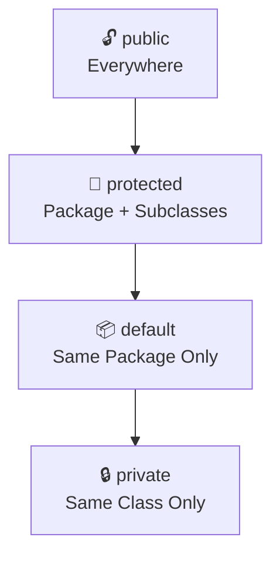

> 🧠 **Intuition — Memory Trick**
> Think of access modifiers as **security clearance levels** in a building:
> - `private` 🔒 → only people in *this exact room* (class)
> - `default` 📦 → anyone on *this floor* (package)
> - `protected` 🔐 → this floor, plus *family members who moved to other floors* (subclasses elsewhere)
> - `public` 🔓 → *anyone, anywhere*, no ID check

---

### 🔒 3.4.1 `private`

#### 📌 Definition

The most restrictive modifier — members marked `private` are accessible **only within the same class** where they're
declared.

#### ❓ Why It Exists

To enable genuine data hiding — an absolute guarantee that no outside code, not even a subclass, can directly touch the
member.

#### ⚡ Scope & Accessibility

| Accessed From                 | Allowed? |
|-------------------------------|----------|
| Same class                    | ✅ Yes    |
| Same package, different class | ❌ No     |
| Subclass (different package)  | ❌ No     |
| Subclass (same package)       | ❌ No     |
| Any other class anywhere      | ❌ No     |

#### 💻 Example

```java
class Wallet {
    private double cash;   // only Wallet itself can touch this

    private void logTransaction(String msg) {   // private method too
        System.out.println("[LOG] " + msg);
    }

    public void addCash(double amount) {
        cash += amount;
        logTransaction("Added " + amount);   // ✅ called from within same class
    }
}
```

#### 🌍 Real-World Use

Sensitive internal state — passwords, account balances, internal counters, caching structures — anything that must never
be touched except through the class's own controlled logic.

#### 🔥 Interview Insight

<details>
<summary>Can a subclass access a private member of its parent class?</summary>

No. `private` members are invisible even to direct subclasses — inheritance does not grant access to private members.
This is a very common misconception; many beginners assume "inherits everything," but `private` is the one thing that
truly never crosses class boundaries.
</details>

---

### 📦 3.4.2 `default` (Package-Private)

#### 📌 Definition

When **no modifier** is written at all, Java applies **default** access — visible to any class **within the same package
**, but invisible outside it.

#### ❓ Why It Exists

To allow related classes that work together closely (e.g., internal helper classes of a module) to freely cooperate,
while still hiding implementation details from the outside world — a "package-level encapsulation."

#### ⚡ Scope & Accessibility

| Accessed From                       | Allowed? |
|-------------------------------------|----------|
| Same class                          | ✅ Yes    |
| Same package, different class       | ✅ Yes    |
| Subclass in a **different** package | ❌ No     |
| Any class in a different package    | ❌ No     |

#### 💻 Example

```java
// File: com/app/Engine.java
package com.app;

class Engine {              // default access — visible only inside com.app
    void start() {
        System.out.println("Engine starting");
    }
}
```

```java
// File: com/app/Car.java
package com.app;

public class Car {
    void drive() {
        Engine e = new Engine();   // ✅ allowed — same package
        e.start();
    }
}
```

```java
// File: com/other/Test.java
package com.other;

import com.app.Engine;   // ❌ Compile Error — Engine is not public

public class Test {
    public static void main(String[] args) {
        Engine e = new Engine();   // would fail to compile
    }
}
```

#### 🌍 Real-World Use

Internal helper/utility classes meant to support a specific module or package, without being part of the module's public
API surface.

---

### 🔐 3.4.3 `protected`

#### 📌 Definition

Accessible within the same package, **plus** accessible from subclasses **even in different packages**.

#### ❓ Why It Exists

Inheritance often needs subclasses (possibly defined in entirely different packages, like a separate library extension)
to access certain parent fields/methods — but the general public still shouldn't have access. `protected` is the middle
ground designed specifically for this.

#### ⚡ Scope & Accessibility

| Accessed From                      | Allowed?                     |
|------------------------------------|------------------------------|
| Same class                         | ✅ Yes                        |
| Same package, different class      | ✅ Yes                        |
| Subclass, same package             | ✅ Yes                        |
| Subclass, **different** package    | ✅ Yes (via inheritance only) |
| Unrelated class, different package | ❌ No                         |

#### 💻 Example

```java
// package com.app
package com.app;

public class Vehicle {
    protected int speed;

    protected void accelerate() {
        speed += 10;
    }
}
```

```java
// package com.app.extensions
package com.app.extensions;

import com.app.Vehicle;

public class SportsCar extends Vehicle {
    public void boost() {
        accelerate();         // ✅ allowed — inherited protected method
        speed += 50;           // ✅ allowed — inherited protected field
    }
}
```

> ⚠️ **Common Mistake**
> Assuming a `protected` member is accessible by **any** class in a different package, as long as that class is "related
> somehow." It's **not** — it's accessible in a different package **only through inheritance** (i.e., only inside a
> subclass, and even then, typically only on the subclass's own inherited copy, not on an arbitrary other instance).

#### 🌍 Real-World Use

Framework base classes meant to be **extended** — e.g., abstract base classes in libraries that expose certain internals
specifically for subclasses to build upon, while keeping them hidden from regular API users.

---

### 🔓 3.4.4 `public`

#### 📌 Definition

The least restrictive modifier — accessible from **anywhere**: any class, any package, any module.

#### ❓ Why It Exists

Some parts of a class are meant to be the **official interface** that the rest of the world interacts with — public is
how Java marks "this is meant to be used by everyone."

#### ⚡ Scope & Accessibility

| Accessed From                      | Allowed? |
|------------------------------------|----------|
| Same class                         | ✅ Yes    |
| Same package                       | ✅ Yes    |
| Different package, subclass        | ✅ Yes    |
| Different package, unrelated class | ✅ Yes    |

#### 💻 Example

```java
public class Calculator {
    public int add(int a, int b) {   // intended for everyone to use
        return a + b;
    }
}
```

#### 🌍 Real-World Use

Public APIs, library entry points, controller classes in Spring Boot (`@RestController` methods must be public to be
reachable by HTTP requests), and any method meant to be the "front door" of a class.

> 🎯 **Placement Tip**
> A frequent interviewer question: *"Why not make everything `public` for simplicity?"* — Answer: making everything
> public **destroys encapsulation entirely**, removing the compiler's ability to protect internal state, and locks you
> into never being able to change internal implementation without risking breaking external code that depends on it.

### 📝 Quick Revision — 3.4

| Modifier    | Same Class | Same Package | Subclass (other package) | World |
|-------------|------------|--------------|--------------------------|-------|
| `private`   | ✅          | ❌            | ❌                        | ❌     |
| *(default)* | ✅          | ✅            | ❌                        | ❌     |
| `protected` | ✅          | ✅            | ✅                        | ❌     |
| `public`    | ✅          | ✅            | ✅                        | ✅     |

---

## 3.5 — 🛠️ Getters and Setters

### 📌 Why Getters and Setters Exist

Once fields are made `private` (data hiding), the class needs **some** way to let outside code read or update that data
safely — that's exactly what **getters** (read access) and **setters** (write access) provide.

### ❓ What Problem They Solve

They give you a **checkpoint** — a place to insert logic (validation, logging, transformation) **before** data is read
or changed, instead of allowing raw, unchecked access.

### ⚡ Encapsulation Through Methods

```mermaid
flowchart LR
    Outside["Outside Code"] -->|setSalary(amount)| Setter["Setter Method<br/>(validates input)"]
    Setter --> Field["private double salary"]
    Field --> Getter["Getter Method<br/>(controls output)"]
    Getter -->|getSalary()| Outside2["Outside Code"]
```

### 💻 Java Example

```java
class Employee {
    private double salary;

    public double getSalary() {        // GETTER
        return salary;
    }

    public void setSalary(double salary) {   // SETTER
        if (salary > 0) {
            this.salary = salary;
        } else {
            System.out.println("Invalid salary value rejected");
        }
    }
}
```

### ⚡ Read-Only and Write-Only Properties

| Pattern        | How                              | Use Case                                                                                            |
|----------------|----------------------------------|-----------------------------------------------------------------------------------------------------|
| **Read-only**  | Provide only a getter, no setter | A `Student`'s auto-generated `studentId`, set once in the constructor, never changed afterward      |
| **Write-only** | Provide only a setter, no getter | A `password` field — you can update it, but the application logic never exposes it back for reading |

```java
class Student {
    private final String studentId;   // read-only — no setter at all

    public Student(String id) {
        this.studentId = id;
    }

    public String getStudentId() {     // getter only
        return studentId;
    }
}
```

### 💼 Production Perspective

| Context                     | Use of Getters/Setters                                                                                                                                                |
|-----------------------------|-----------------------------------------------------------------------------------------------------------------------------------------------------------------------|
| **Spring Boot**             | Entity classes rely on getter/setter pairs so Hibernate/Jackson can read and populate fields via reflection during JSON serialization and database mapping            |
| **Android Apps**            | `ViewModel`s expose getters for UI observation while keeping setters internal/private to control state mutation flow                                                  |
| **Banking Systems**         | `getBalance()` is exposed; a direct `setBalance()` is usually **avoided** entirely — balance only changes through `deposit()`/`withdraw()` methods that enforce rules |
| **Enterprise Applications** | DTOs (Data Transfer Objects) commonly use plain getters/setters as a stable contract between layers (service ↔ controller ↔ client)                                   |

> ⚠️ **Common Mistake**
> Auto-generating a getter **and** setter for *every single field* without thinking. A `setBalance()` method that lets
> anyone set any value defeats the entire purpose of encapsulation — sometimes the right setter is **no setter at all
** (
> see 3.6 and 3.10).

> 📝 **Quick Revision — 3.5**
> - Getters/setters = controlled checkpoints for reading/writing private data
> - Not every field needs both — design read-only/write-only fields intentionally
> - Blindly generating both for everything quietly breaks encapsulation

---

## 3.6 — ✅ Validation using Setters

### 📌 Concept

Setters are the natural place to enforce **business rules** — conditions that must always hold true for an object to
remain valid.

### ❓ Why Validation Shouldn't Happen Directly on Fields

Fields cannot run logic. A `private double balance;` field has no way to refuse a negative assignment — only a method (
the setter) can intercept the value **before** it's stored and decide whether to accept, reject, or transform it.

### 💻 Java Example — Business Rule Enforcement

```java
class BankAccount {
    private double balance;

    public void setBalance(double balance) {
        if (balance < 0) {
            throw new IllegalArgumentException("Balance cannot be negative");
        }
        this.balance = balance;
    }
}
```

```java
class Employee {
    private int age;

    public void setAge(int age) {
        if (age < 18 || age > 65) {
            throw new IllegalArgumentException("Employee age must be between 18 and 65");
        }
        this.age = age;
    }
}
```

### 💼 Production Examples

| System                   | Validation Example                                                               |
|--------------------------|----------------------------------------------------------------------------------|
| **E-commerce Platform**  | `setQuantity(int qty)` rejects negative or zero quantities before adding to cart |
| **Banking System**       | `setPin(String pin)` rejects PINs that aren't exactly 4 digits                   |
| **Enterprise HR System** | `setSalary(double salary)` rejects values below a configured minimum wage        |

> 🎯 **Placement Tip**
> If asked *"Where should validation logic live — in the setter, or in the calling code?"* — the strong answer is: **in
the setter (or constructor)**, because that guarantees the rule is enforced **everywhere**, no matter who calls it or
> how many places in the codebase create/modify this object. Relying on every caller to "remember" to validate is
> fragile
> and will eventually be forgotten somewhere.

> 📝 **Quick Revision — 3.6**
> - Fields can't validate; only methods (setters/constructors) can
> - Putting validation in the setter guarantees the rule everywhere, every time
> - This is exactly why direct public field access is dangerous (see 3.10)

---

## 3.7 — 🧊 Immutable Objects

### 📌 What Are Immutable Objects?

> An **immutable object** is an object whose state **cannot be changed** after it is constructed. Every field is set
> once, during construction, and never modified again.

### ❓ Why Are They Important

Mutable objects shared across multiple parts of a program (especially across threads) can be changed unexpectedly by any
code holding a reference to them — causing bugs that are extremely hard to trace. Immutable objects eliminate this
entire category of problems by design: if it can never change, nothing can ever corrupt it.

### 🏗️ How to Build an Immutable Class in Java

```java
final class Point {                      // 1️⃣ class marked final — cannot be subclassed
    private final int x;                  // 2️⃣ fields marked final
    private final int y;

    public Point(int x, int y) {          // 3️⃣ values set ONLY in constructor
        this.x = x;
        this.y = y;
    }

    public int getX() {
        return x;
    }       // 4️⃣ only getters — NO setters at all

    public int getY() {
        return y;
    }
}
```

```java
Point p1 = new Point(3, 4);
// p1.x = 10;   ❌ Compile Error — x is private and final
Point p2 = new Point(p1.getX() + 1, p1.getY());   // ✅ create a NEW object instead of mutating
```

> 💡 **Important**
> To "change" an immutable object, you don't modify it — you create a **brand-new object** with the updated values,
> leaving the original untouched. This is exactly how `String` behaves in Java.

### 🌍 Real World Example — `String`

```java
String s1 = "Hello";
String s2 = s1.concat(" World");

System.out.

println(s1);   // "Hello"        — unchanged!
System.out.

println(s2);   // "Hello World"  — a brand-new String object
```

`String` is immutable in Java — every "modifying" method (`concat`, `toUpperCase`, `substring`, etc.) actually returns a
**new** `String` object, leaving the original exactly as it was.

```mermaid
flowchart LR
    A["s1 = 'Hello'"] -->|concat(' World')| B["New String: 'Hello World'"]
    A -.->|unchanged| A
    B --> C["s2 points to new object"]
```

### ⚡ Advantages

| Advantage           | Explanation                                                                                                     |
|---------------------|-----------------------------------------------------------------------------------------------------------------|
| Thread-safety       | Multiple threads can read the same immutable object with zero risk of conflicting modification                  |
| Predictability      | An object's state is guaranteed never to change unexpectedly mid-program                                        |
| Safe to share/cache | Immutable objects can be freely shared (e.g., reused, cached, used as `HashMap` keys) without defensive copying |
| Easier debugging    | You never need to ask "did something else change this object behind my back?"                                   |

### ⚡ Disadvantages

| Disadvantage                           | Explanation                                                                                                    |
|----------------------------------------|----------------------------------------------------------------------------------------------------------------|
| Memory overhead                        | Every "change" creates a brand-new object instead of updating one in place                                     |
| Verbosity                              | Classes need more constructor parameters and no convenient setters                                             |
| Not ideal for frequently-changing data | High-frequency mutation (e.g., a game's position updated every frame) is inefficient if forced to be immutable |

### 💼 Production Perspective

| Context                              | Use of Immutability                                                                                              |
|--------------------------------------|------------------------------------------------------------------------------------------------------------------|
| **Spring Boot**                      | DTOs and configuration value objects are often made immutable to avoid accidental mutation across service layers |
| **Banking Systems**                  | Transaction records are immutable once created — a financial transaction, once logged, must never change         |
| **Enterprise Applications**          | `record` types (Java 16+) are commonly used for immutable data carriers in modern enterprise code                |
| **Multi-threaded systems generally** | Immutability is the simplest, most reliable way to make data thread-safe with zero synchronization code          |

### 🔥 Interview Insight

<details>
<summary>Why is String immutable in Java?</summary>

Several reasons combine: (1) Security — Strings are used for class names, file paths, network connections; if mutable,
malicious code could change a String after a security check passed. (2) String pool caching — Java reuses identical
String literals safely only because they can never change underneath another reference. (3) Thread-safety — immutable
Strings can be freely shared across threads with no synchronization needed. (4) Safe use as hash keys — if a String used
as a HashMap key changed after insertion, its hash code would change and the map would become corrupted.
</details>

> 📝 **Quick Revision — 3.7**
> - Immutable = state fixed forever after construction (`final` class, `final` fields, no setters)
> - "Changing" an immutable object means creating a new object, not modifying the existing one
> - `String` is the most common real-world Java example
> - Trade-off: safety and predictability vs. memory overhead from constant object creation

---

## 3.8 — ⚖️ Encapsulation vs Data Hiding

### ⚡ Detailed Comparison Table

| Aspect            | Encapsulation                                      | Data Hiding                                                      |
|-------------------|----------------------------------------------------|------------------------------------------------------------------|
| Definition        | Bundling data + behavior into a single class unit  | Restricting direct access to data, usually via `private`         |
| Nature            | A broad design **principle**                       | A specific access-control **technique**                          |
| Goal              | Organize and protect related data + logic together | Prevent external code from directly touching internal fields     |
| Achieved using    | Classes, methods, access modifiers (combined)      | Mostly the `private` modifier                                    |
| Can exist alone?  | Yes, even with looser access (e.g., `protected`)   | Not meaningfully — needs a class structure to hide data *within* |
| Relationship      | The umbrella concept                               | One of the tools/results used to achieve encapsulation           |
| Interview framing | "What is the big design idea?"                     | "What is the specific mechanism?"                                |

### 🔥 Interview Differences

> 🎯 **Placement Tip**
> If an interviewer asks *"Are encapsulation and data hiding the same thing?"* — the safest, most precise answer is: **"
No — data hiding is one technique used to achieve encapsulation, but encapsulation is the broader principle of bundling
data and behavior together."** This shows you understand the *relationship*, not just both definitions in isolation.

> 📝 **Quick Revision — 3.8**
> - Encapsulation = the big idea (bundle + protect)
> - Data hiding = the specific tool (restrict access, usually `private`)

---

## 3.9 — 📊 Access Modifier Comparison

### ⚡ Full Comparison Table

| Modifier                      | Same Class | Same Package | Subclass (Different Package) | Different Package (Unrelated) |
|-------------------------------|------------|--------------|------------------------------|-------------------------------|
| `private`                     | ✅          | ❌            | ❌                            | ❌                             |
| *(default / package-private)* | ✅          | ✅            | ❌                            | ❌                             |
| `protected`                   | ✅          | ✅            | ✅ (via inheritance)          | ❌                             |
| `public`                      | ✅          | ✅            | ✅                            | ✅                             |

### 🧠 Visual Memory Trick

```
private    🔒  →  "Mine alone"
default    📦  →  "My team's" (same package)
protected  🔐  →  "Family only" (package + subclasses)
public     🔓  →  "Everyone"
```

### 🏗️ Inheritance-Specific Notes

| Modifier    | Inherited by Subclass?                                   | Directly Accessible in Subclass Code? |
|-------------|----------------------------------------------------------|---------------------------------------|
| `private`   | Technically exists in memory, but not accessible by name | ❌ No                                  |
| `default`   | Inherited only if subclass is in the same package        | ✅ (same package only)                 |
| `protected` | Inherited regardless of package                          | ✅ Yes                                 |
| `public`    | Inherited regardless of package                          | ✅ Yes                                 |

> ⚠️ **Common Mistake**
> Saying *"private members are not inherited at all."* Technically, a subclass object **does** contain the memory for
> inherited private fields (they exist as part of the object's layout) — but the subclass's own code simply has **no
permission to refer to them by name**. This subtle distinction is a favorite interview trap.

> 📝 **Quick Revision — 3.9**
> - Accessibility strictly increases in this order: `private` < `default` < `protected` < `public`
> - `protected` is specifically designed to support cross-package inheritance
> - Private fields exist in subclass objects but cannot be accessed by name from subclass code

---

## 3.10 — 🚫 Common Design Mistakes

### 🚫 Beginner Mistakes

> 🚫 **Mistake 1 — Public Fields**
> ```java
> class Student {
>     public String name;     // ❌ no protection at all
>     public double marks;
> }
> ```
> This completely removes the ability to validate, log, or control changes — it's functionally identical to the
> pre-encapsulation procedural problem from Chapter 1.

> 🚫 **Mistake 2 — Unnecessary Setters**
> ```java
> class Student {
>     private final String studentId;
>     public void setStudentId(String id) { this.studentId = id; }  // ❌ won't even compile (final), and conceptually wrong anyway
> }
> ```
> If a field should never change after creation, don't provide a setter at all — providing one "just in case" invites
> misuse and defeats the purpose of marking it `final`.

> 🚫 **Mistake 3 — Missing Validation**
> ```java
> public void setAge(int age) {
>     this.age = age;   // ❌ accepts -50, 99999, anything
> }
> ```
> A setter with no validation logic provides the **illusion** of encapsulation without any of its actual protective
> benefit.

> 🚫 **Mistake 4 — Breaking Encapsulation via Getters**
> ```java
> class Team {
>     private List<String> members = new ArrayList<>();
>     public List<String> getMembers() {
>         return members;   // ❌ returns the ACTUAL internal list — caller can modify it directly!
>     }
> }
> ```
> ```java
> Team t = new Team();
> t.getMembers().add("Unauthorized Entry");   // 😱 internal state mutated from outside, bypassing all class logic!
> ```
> **Fix:** return a copy or an unmodifiable view: `return Collections.unmodifiableList(members);` or
`return new ArrayList<>(members);`

> 🚫 **Mistake 5 — Overusing Getters/Setters**
> Generating a getter and setter for *every* field automatically, without thinking about whether each field should even
> be externally readable or writable, leads to classes that are technically "encapsulated" but practically behave like
> fully public data containers — encapsulation in name only.

> 📝 **Quick Revision — 3.10**
> - Public fields = no protection at all
> - Setters should exist **only** when mutation is actually intended and valid
> - Every setter should validate; every getter exposing a mutable object should defend against leaking the internal
    reference
> - "Encapsulated-looking" code can still be functionally unprotected if these rules are ignored

---

## 3.11 — 💻 Coding Practice

### 🟢 Easy Question

**Task:** Create a class `Rectangle` with private fields `length` and `width`. Add getters, and a setter for each that
rejects negative values.

<details>
<summary>💡 Hint</summary>

Use `if (value < 0) { ... reject ... }` inside each setter, similar to the `BankAccount` example in 3.6.
</details>

<details>
<summary>✅ Solution</summary>

```java
class Rectangle {
    private double length;
    private double width;

    public double getLength() {
        return length;
    }

    public void setLength(double length) {
        if (length < 0) throw new IllegalArgumentException("Length cannot be negative");
        this.length = length;
    }

    public double getWidth() {
        return width;
    }

    public void setWidth(double width) {
        if (width < 0) throw new IllegalArgumentException("Width cannot be negative");
        this.width = width;
    }

    public double area() {
        return length * width;
    }
}
```

**Explanation:** Both setters guard against invalid (negative) input, ensuring the `Rectangle` object can never
represent an impossible shape.
</details>

---

### 🟡 Medium Question

**Task:** Create an immutable class `Money` representing an amount and a currency code (e.g., 100, "USD"). It should
have no setters, and a method `add(Money other)` that returns a **new** `Money` object representing the sum (assume same
currency).

<details>
<summary>💡 Hint</summary>

Mark the class `final`, mark fields `private final`, initialize only via constructor, and make `add()` return
`new Money(...)` instead of modifying `this`.
</details>

<details>
<summary>✅ Solution</summary>

```java
final class Money {
    private final double amount;
    private final String currency;

    public Money(double amount, String currency) {
        this.amount = amount;
        this.currency = currency;
    }

    public double getAmount() {
        return amount;
    }

    public String getCurrency() {
        return currency;
    }

    public Money add(Money other) {
        if (!this.currency.equals(other.currency)) {
            throw new IllegalArgumentException("Currency mismatch");
        }
        return new Money(this.amount + other.amount, this.currency);   // NEW object
    }
}
```

**Explanation:** `add()` never modifies `this` or `other` — it always returns a brand-new `Money` instance, preserving
immutability exactly like `String.concat()`.
</details>

---

### 🔴 Interview-Level Question

**Task:** A `Team` class exposes a `List<String> getMembers()` getter that currently leaks its internal mutable list (
see Mistake 4 in 3.10). Fix the class so external code **cannot** modify the internal list, while still allowing read
access.

<details>
<summary>💡 Hint</summary>

Either return a defensive copy, or wrap the list using `Collections.unmodifiableList(...)`.
</details>

<details>
<summary>✅ Solution</summary>

```java
import java.util.*;

class Team {
    private List<String> members = new ArrayList<>();

    public void addMember(String name) {
        members.add(name);   // only this class controls mutation
    }

    public List<String> getMembers() {
        return Collections.unmodifiableList(members);   // ✅ read-only view returned
    }
}
```

```java
Team t = new Team();
t.

addMember("Rahul");
t.

getMembers().

add("Hacker");   // ❌ throws UnsupportedOperationException at runtime
```

**Explanation:** `Collections.unmodifiableList` wraps the original list in a view that throws an exception on any
modification attempt, while still allowing all read operations (`get`, `size`, iteration) to work normally.
</details>

---

## 3.12 — 🎯 Placement & Interview Questions

<details open>
<summary><b>Click to expand all 25 questions</b></summary>

| #  | Question                                                                 | Answer                                                                                                                                                                                                  |
|----|--------------------------------------------------------------------------|---------------------------------------------------------------------------------------------------------------------------------------------------------------------------------------------------------|
| 1  | What is encapsulation?                                                   | Bundling data and the methods that operate on it into a single class, while restricting direct external access to that data.                                                                            |
| 2  | What problem does encapsulation solve?                                   | It prevents uncontrolled, unvalidated access to an object's internal data, which otherwise leads to data corruption, security gaps, and maintainability issues.                                         |
| 3  | What is data hiding?                                                     | The specific technique (mainly via `private`) of restricting direct access to an object's fields from outside its class.                                                                                |
| 4  | Is data hiding the same as encapsulation?                                | No — data hiding is one mechanism used to achieve encapsulation; encapsulation is the broader principle of bundling data and behavior.                                                                  |
| 5  | Name the four access modifiers in Java.                                  | `private`, default (no modifier / package-private), `protected`, `public`.                                                                                                                              |
| 6  | What is the accessibility of a `private` member?                         | Accessible only within the exact class it is declared in — not even subclasses can access it directly.                                                                                                  |
| 7  | What is the accessibility of a `default` member?                         | Accessible within the same package only; invisible to classes outside that package.                                                                                                                     |
| 8  | What is special about `protected`?                                       | It allows access within the same package, plus access from subclasses even if those subclasses are in different packages.                                                                               |
| 9  | What is the accessibility of `public`?                                   | Accessible from anywhere — any class, any package.                                                                                                                                                      |
| 10 | Can a subclass directly access a private field of its superclass?        | No. Inheritance does not grant access to private members; this is one of the most common interview traps.                                                                                               |
| 11 | Are private fields inherited by a subclass?                              | They exist in the subclass object's memory layout, but the subclass code cannot refer to them by name — effectively "present but inaccessible."                                                         |
| 12 | Why use getters and setters instead of public fields?                    | They provide a controlled checkpoint where validation, logging, or transformation logic can run before data is read or modified.                                                                        |
| 13 | Should every field have both a getter and a setter?                      | No — fields should only have the accessors that match their intended use (read-only, write-only, or both), based on the design's actual needs.                                                          |
| 14 | Where should validation logic for an object's data live?                 | Inside setters (or constructors) — never relying on the calling code to remember to validate, since fields themselves cannot run logic.                                                                 |
| 15 | What is an immutable object?                                             | An object whose state cannot change after construction — all fields are set once and never modified again.                                                                                              |
| 16 | How do you make a class immutable in Java?                               | Mark the class `final`, make all fields `private final`, set them only in the constructor, and provide no setters.                                                                                      |
| 17 | Why is `String` immutable in Java?                                       | For security, safe string-pool caching, thread-safety, and safe use as keys in hash-based collections.                                                                                                  |
| 18 | If String is immutable, how does `concat()` appear to "modify" it?       | It doesn't modify the original — it creates and returns a brand-new `String` object with the combined value.                                                                                            |
| 19 | What is a real risk of returning a mutable field directly from a getter? | The caller receives a reference to the actual internal object and can mutate it directly, bypassing all of the class's own validation and control logic.                                                |
| 20 | How do you fix a getter that leaks a mutable collection?                 | Return a defensive copy of the collection, or wrap it using something like `Collections.unmodifiableList(...)`.                                                                                         |
| 21 | What's a disadvantage of immutability?                                   | Every "change" requires creating a new object, which can increase memory usage and overhead for frequently-changing data.                                                                               |
| 22 | Why might a class intentionally have only a getter and no setter?        | To make that specific field read-only after construction — useful for IDs or values that must never change once assigned.                                                                               |
| 23 | Why might a class have only a setter and no getter?                      | To make a field write-only, such as a password, where the application never needs to read the raw value back out.                                                                                       |
| 24 | What's wrong with making every field public "for simplicity"?            | It removes the compiler's ability to enforce validation or control, recreating the same uncontrolled global-data problem that OOP encapsulation was designed to solve.                                  |
| 25 | Can encapsulation alone guarantee complete security?                     | No — it guarantees controlled access at the language/compiler level, but it is not equivalent to security techniques like encryption or authentication, and can technically be bypassed via reflection. |

</details>

> 🔥 **Tricky Conceptual Question**
> *"If a class has a getter and setter for every field, is it still considered properly encapsulated?"*
> **Answer:** Technically yes, in the literal sense that data is private and accessed via methods — but in practice this
> is often called "encapsulation in name only," because if the setter has no validation and the getter exposes mutable
> internals unguarded, the class provides **no actual protection benefit** over public fields. True encapsulation is
> judged by whether invalid states are actually prevented, not just by whether `private` and methods are present.

---

## 📖 Chapter Wrap-Up

### 📖 What You Learned

- Why unrestricted data access breaks down at scale (data corruption, security, maintainability).
- The precise relationship between **encapsulation** (the principle) and **data hiding** (the mechanism).
- All four **access modifiers** — `private`, `default`, `protected`, `public` — and exactly where each one's visibility
  boundary lies.
- How to design **getters and setters** intentionally, including read-only and write-only fields.
- Why **validation belongs in setters/constructors**, never left to chance in calling code.
- What makes an object **immutable**, why `String` is immutable, and the real trade-offs involved.
- The most common ways encapsulation gets **accidentally broken** in real code — and how to fix each one.

### 🔑 Key Takeaways

- Encapsulation is a **compiler-enforced guarantee**, not just a coding convention.
- `protected` exists specifically to support cross-package inheritance.
- A getter that returns a mutable internal object **silently breaks** encapsulation.
- Immutability trades some performance/memory for massive gains in safety and predictability.

### 📝 Quick Revision Notes

- private < default < protected < public (in increasing order of accessibility)
- Validation → always in setters/constructors, never assumed by the caller
- Immutable class checklist: `final` class → `private final` fields → constructor-only assignment → no setters

### 🧠 Memory Tricks

```
🔒 private    → "Mine alone"
📦 default    → "My team's"
🔐 protected  → "Family only"
🔓 public     → "Everyone"
```

```
Encapsulation = the PRINCIPLE (bundle + protect)
Data Hiding   = the TOOL (mostly 'private')
```

### ⚡ Rapid Fire Interview Questions

1. private vs default? → class-only vs package-wide.
2. protected's special power? → cross-package subclass access.
3. Can private be inherited? → present in memory, not accessible by name.
4. Why no setter for studentId? → it should be read-only after creation.
5. Why is String immutable? → security, pooling, thread-safety, safe hashing.

### ❓ Self-Check Questions

1. Can you explain, without notes, why `acc.balance = -500;` being legal is a structural problem, not just a logic bug?
2. Can you write, from memory, a fully immutable `Money` class with an `add()` method?
3. Can you explain why a getter returning `this.list` directly is dangerous, and fix it two different ways?
4. Can you state the exact accessibility differences between all four access modifiers without hesitating?

### 🎯 Mini Coding Challenge

> Build a `Library` class that holds a private list of book titles. Provide:
> - `addBook(String title)` — rejects empty/null titles
> - `getBooks()` — returns a **read-only** view of the list
> - Make the class itself **not** extendable (`final`)
>
> Test that `getBooks().add(...)` throws an exception, confirming your encapsulation actually holds.

### ⚠️ Frequently Forgotten Points

- `private` members exist in subclass memory but are **not accessible by name** there.
- A setter with no validation gives **zero** real protection, despite "looking" encapsulated.
- Returning an internal mutable collection/object from a getter is one of the most common real-world encapsulation
  leaks.
- Immutability does not mean "no methods that look like they modify data" — it means those methods return **new**
  objects instead.

### 🔮 Preview of Next Chapter

Encapsulation taught us how a **single class** protects and organizes its own data. But real systems are built from *
*families of related classes** — a `SavingsAccount` and a `CurrentAccount` both being a kind of `Account`, sharing
common behavior while specializing their own. That relationship — reusing and extending behavior across related
classes — is exactly what **Inheritance** is built for, and it's where we go next.

---

<div align="center">

# 📚 Java OOP Mastery

## Chapter 4: Inheritance

### From Absolute Beginner → Placement Ready


</div>

---

## ⏪ Recap: Chapter 3 — Encapsulation & Access Modifiers

> A 60-second refresher before we go deeper:
>
> - **Encapsulation** bundles data + behavior into a class and restricts direct access to that data.
> - **Data hiding** (mainly via `private`) is the specific tool that makes encapsulation real.
> - The four access modifiers — `private`, default, `protected`, `public` — control visibility in increasing order.
> - `protected` exists specifically so that **subclasses**, even in other packages, can access certain inherited
    members.
> - **Getters/setters** give controlled, validated access to private data; **immutable objects** never change after
    construction.

### 🤔 Why Inheritance Is the Next Logical Step

Notice that `protected` access only made sense once we mentioned the word **subclass**. Chapter 3 quietly assumed you
already understood parent-child class relationships — but we never formally built that idea. Encapsulation taught you
how **one class** protects itself. Inheritance teaches you how **families of related classes** share and extend
behavior, without duplicating code or breaking that protection. It's the natural next pillar to study.

---

## 🗺️ Table of Contents

| #    | Section                                                       |
|------|---------------------------------------------------------------|
| 4.1  | [Why Inheritance?](#41--why-inheritance)                      |
| 4.2  | [Understanding Inheritance](#42--understanding-inheritance)   |
| 4.3  | [Types of Inheritance](#43--types-of-inheritance)             |
| 4.4  | [Constructor Inheritance](#44--constructor-inheritance)       |
| 4.5  | [The `super` Keyword](#45--the-super-keyword)                 |
| 4.6  | [Method Inheritance](#46--method-inheritance)                 |
| 4.7  | [Variable Hiding](#47--variable-hiding)                       |
| 4.8  | [Object Class Hierarchy](#48--object-class-hierarchy)         |
| 4.9  | [Composition vs Inheritance](#49--composition-vs-inheritance) |
| 4.10 | [Best Practices](#410--best-practices)                        |
| 4.11 | [Practice Section](#411--practice-section)                    |
| 4.12 | [Interview Section](#412--interview-section)                  |
| —    | [Chapter Wrap-Up](#-chapter-wrap-up)                          |

---

## 4.1 — 🚨 Why Inheritance?

### 📌 Problems Before Inheritance

Imagine modeling employees at a company without inheritance:

```java
class Manager {
    String name;
    double salary;

    void work() {
        System.out.println(name + " is managing the team");
    }

    void takeLeave() {
        System.out.println(name + " applied for leave");
    }
}

class Developer {
    String name;          // 🔁 duplicated
    double salary;        // 🔁 duplicated

    void work() {
        System.out.println(name + " is writing code");
    }

    void takeLeave() {
        System.out.println(name + " applied for leave");
    }  // 🔁 duplicated, identical
}
```

`name`, `salary`, and `takeLeave()` are copy-pasted across every employee type. Now imagine 20 employee types — and HR
policy changes how leave is calculated. You must fix it in **20 different places**, and you will inevitably miss one.

### ❓ Why Inheritance Was Introduced

Java needed a way to say: *"These classes are fundamentally the same kind of thing, with small specialized differences —
let me define the shared part once, and let each class add only what's unique to it."*

### ⚡ Code Reusability

```java
class Employee {
    String name;
    double salary;

    void takeLeave() {
        System.out.println(name + " applied for leave");
    }
}

class Manager extends Employee {
    void work() {
        System.out.println(name + " is managing the team");
    }
}

class Developer extends Employee {
    void work() {
        System.out.println(name + " is writing code");
    }
}
```

Now `name`, `salary`, and `takeLeave()` exist in **exactly one place** — `Employee`. Both `Manager` and `Developer` get
it for free.

### 🧩 Extensibility

Adding a new employee type (`Intern`, `Tester`) requires **zero changes** to existing classes — you simply write
`class Intern extends Employee { ... }` and inherit everything that's already proven to work.

### 🛠️ Maintainability

If HR changes how leave works, you fix `takeLeave()` **once**, inside `Employee` — every subclass automatically gets the
updated behavior the next time the program runs.

### 🌍 Real-World Motivation

> 🧠 **Real-World Analogy**
> Think of a **species hierarchy** in biology. A "Dog" and a "Cat" are both "Mammals" — they share traits (warm-blooded,
> has fur, breathes air) defined once at the Mammal level, while each adds its own specific behavior (Dog barks, Cat
> purrs). Nature doesn't redefine "warm-blooded" separately for every species — and neither should your code.

> 📝 **Quick Revision — 4.1**
> - Without inheritance: duplicated fields/methods across similar classes → maintenance nightmare
> - Inheritance solves: code reuse, extensibility (add new subclasses freely), and centralized maintenance
> - Define shared behavior once, in a common parent class

---

## 4.2 — 🌳 Understanding Inheritance

### 📌 Definition

> **Inheritance** is an OOP mechanism where one class (the **subclass**) acquires the fields and methods of another
> class (the **superclass**), enabling code reuse and modeling of "is-a" relationships.

### ⚡ Key Terms

| Term           | Also Called                | Meaning                                       |
|----------------|----------------------------|-----------------------------------------------|
| **Superclass** | Parent class, Base class   | The class being inherited *from*              |
| **Subclass**   | Child class, Derived class | The class that inherits *from* the superclass |

### 🔗 IS-A Relationship

Inheritance models the question: **"Is a `Manager` an `Employee`?"** — Yes. So `Manager` can correctly
`extends Employee`.

```
ASCII Diagram — IS-A Relationship

        Employee
       (superclass)
           ▲
           │  "is-a"
           │
        Manager
       (subclass)
```

> ⚠️ **Common Mistake**
> Using inheritance for a relationship that isn't truly "is-a." For example, `class Engine extends Car` is wrong — an
> Engine is **not a kind of** Car; an Engine is *part of* a Car. That's a HAS-A relationship, and belongs in
> Composition (
> covered in 4.9), not inheritance.

### 💻 Basic Syntax

```java
class Employee {                    // superclass
    String name;
    double salary;
}

class Manager extends Employee {    // subclass — "extends" keyword establishes inheritance
    String department;
}
```

```java
Manager m = new Manager();
m.name ="Alice";        // inherited field, accessible directly
m.department ="Sales";  // Manager's own field
```

### ⚡ Advantages

| Advantage               | Explanation                                             |
|-------------------------|---------------------------------------------------------|
| Code reuse              | Shared logic written once, used by many subclasses      |
| Extensibility           | New subclasses added without touching existing code     |
| Natural modeling        | Mirrors real-world categorization (is-a relationships)  |
| Polymorphism foundation | Makes runtime polymorphism possible (Chapter 5 preview) |

### ⚡ Limitations

| Limitation                 | Explanation                                                                |
|----------------------------|----------------------------------------------------------------------------|
| Tight coupling             | Subclasses depend heavily on superclass internals                          |
| Fragile Base Class Problem | Changing the parent can silently break every subclass (see 4.10)           |
| Forced hierarchy           | Real-world relationships don't always fit cleanly into strict "is-a" trees |
| Single inheritance limit   | Java classes can extend only one superclass directly                       |

> 📝 **Quick Revision — 4.2**
> - Superclass = parent, Subclass = child, relationship = IS-A
> - `extends` keyword establishes inheritance in Java
> - Powerful, but introduces coupling — use only for genuine IS-A relationships

---

## 4.3 — 🌲 Types of Inheritance

### 🔹 Single-Level Inheritance

One subclass inherits from exactly one superclass.

```
ASCII Diagram — Single-Level

      Employee
         │
         ▼
       Manager
```

```java
class Employee {
    void work() {
        System.out.println("Working");
    }
}

class Manager extends Employee {
    void approveLeave() {
        System.out.println("Leave approved");
    }
}
```

---

### 🔹 Multilevel Inheritance

A chain — a subclass becomes the superclass for another subclass.

```
ASCII Diagram — Multilevel

      Employee
         │
         ▼
       Manager
         │
         ▼
   SeniorManager
```

```java
class Employee {
    void work() {
        System.out.println("Working");
    }
}

class Manager extends Employee {
    void approveLeave() {
        System.out.println("Leave approved");
    }
}

class SeniorManager extends Manager {
    void setStrategy() {
        System.out.println("Setting team strategy");
    }
}
```

```java
SeniorManager sm = new SeniorManager();
sm.

work();          // from Employee (2 levels up)
sm.

approveLeave();  // from Manager (1 level up)
sm.

setStrategy();   // its own method
```

> 💡 **Important**
> A `SeniorManager` object inherits **everything** down the entire chain — not just from its immediate parent. The JVM
> walks up the full hierarchy until it finds the method.

---

### 🔹 Hierarchical Inheritance

Multiple subclasses inherit from the **same** single superclass.

```
ASCII Diagram — Hierarchical

              Employee
             /    |     \
            ▼     ▼      ▼
        Manager Developer Tester
```

```java
class Employee {
    void work() {
        System.out.println("Working");
    }
}

class Manager extends Employee {
}

class Developer extends Employee {
}

class Tester extends Employee {
}
```

Each subclass shares the common `Employee` logic but can specialize independently — changes to `Manager` don't affect
`Developer` or `Tester`.

---

### 🚫 Multiple Inheritance (Using Classes)

**Multiple inheritance** means one class inheriting from **two or more** superclasses simultaneously. Java **does not
allow this with classes.**

```java
class A {
    void show() {
        System.out.println("A");
    }
}

class B {
    void show() {
        System.out.println("B");
    }
}

class C extends A, B {
}   // ❌ COMPILE ERROR — Java does not allow this
```

### ❓ Why Java Doesn't Support Multiple Inheritance (with Classes)

### 💎 The Diamond Problem

```
ASCII Diagram — The Diamond Problem

            A
          (show())
          /      \
         ▼        ▼
        B          C
    (show())   (show())
         \        /
          ▼      ▼
            D
   D extends B, C  --> which show() does D inherit?? ❌ AMBIGUOUS
```

If both `B` and `C` override `show()` differently, and `D` inherits from both, the compiler has **no reliable way** to
decide which version `D` should get. This ambiguity is called the **Diamond Problem**, and Java sidesteps it entirely by
**disallowing multiple inheritance of classes**.

### 🧬 Hybrid Inheritance

Hybrid inheritance is a **combination** of two or more types above (e.g., hierarchical + multilevel together). Java
classes can freely form hybrid structures, **as long as** no single class tries to extend more than one class directly.

```
ASCII Diagram — Hybrid (Hierarchical + Multilevel)

           Employee
          /        \
         ▼          ▼
     Manager     Developer
        │
        ▼
  SeniorManager
```

### 🔌 How Interfaces Solve Multiple Inheritance

Java allows a class to **implement multiple interfaces**, because interfaces (traditionally) don't carry conflicting
state — only method *contracts*.

```java
interface Flyable {
    void fly();
}

interface Swimmable {
    void swim();
}

class Duck implements Flyable, Swimmable {   // ✅ multiple interfaces allowed
    public void fly() {
        System.out.println("Duck flying");
    }

    public void swim() {
        System.out.println("Duck swimming");
    }
}
```

> 💡 **Important**
> Even with `default` methods in interfaces (Java 8+), if two interfaces provide **conflicting default implementations
**, Java forces the implementing class to **explicitly override** the method and resolve the conflict itself — the
> ambiguity is never silently auto-resolved like the Diamond Problem would require.

> 📝 **Quick Revision — 4.3**
> - Single-level → one parent, one child
> - Multilevel → a chain of inheritance
> - Hierarchical → many children, one shared parent
> - Multiple inheritance of classes → not allowed in Java (Diamond Problem)
> - Multiple inheritance of *type* → allowed via interfaces

---

## 4.4 — 🏗️ Constructor Inheritance

### 📌 Constructor Execution Order

> 💡 **Important**
> Constructors are **not inherited**, but every subclass constructor **automatically calls its parent's constructor
first**, before running its own body — even if you never write `super()` explicitly.

### 🏗️ Why Parent Constructor Executes First

It must — a subclass object is built **on top of** its parent's structure. The parent's fields must be fully initialized
**before** the subclass adds its own specialized data; otherwise, the subclass might rely on half-built parent state.

### 💻 Java Example

```java
class Employee {
    Employee() {
        System.out.println("1. Employee constructor running");
    }
}

class Manager extends Employee {
    Manager() {
        System.out.println("2. Manager constructor running");
    }
}
```

```java
Manager m = new Manager();
// Output:
// 1. Employee constructor running
// 2. Manager constructor running
```

### 🏗️ Memory Flow During Object Creation

```
ASCII Diagram — Constructor Flow

new Manager()
     │
     ▼
[Step 1] JVM allocates heap memory for the FULL object (Employee part + Manager part)
     │
     ▼
[Step 2] Manager's constructor begins, but its FIRST action is implicitly calling super()
     │
     ▼
[Step 3] Employee's constructor runs completely, initializing Employee's fields
     │
     ▼
[Step 4] Control returns to Manager's constructor, which now runs ITS OWN body
     │
     ▼
[Step 5] Fully initialized Manager object ready, reference returned to caller
```

### 🔗 Constructor Chaining Across Inheritance

```java
class Employee {
    String name;

    Employee(String name) {
        this.name = name;
        System.out.println("Employee constructor: " + name);
    }
}

class Manager extends Employee {
    String department;

    Manager(String name, String department) {
        super(name);                 // explicitly calls Employee's constructor
        this.department = department;
        System.out.println("Manager constructor: " + department);
    }
}
```

```java
Manager m = new Manager("Alice", "Sales");
// Output:
// Employee constructor: Alice
// Manager constructor: Sales
```

> ⚠️ **Common Mistake**
> Assuming that if `Employee` has **no** no-argument constructor (only a parameterized one), `Manager`'s constructor
> will still compile without calling `super(...)` explicitly. It won't — if the parent has no no-arg constructor
> available, the subclass **must** explicitly call `super(arguments)` as its first statement, or the code fails to
> compile.

> 📝 **Quick Revision — 4.4**
> - Constructors aren't inherited, but the parent's constructor always runs first
> - This happens via an implicit or explicit `super()` call, always as the first statement
> - If the parent has no no-arg constructor, the subclass must explicitly call `super(...)`

---

## 4.5 — 🪄 The `super` Keyword

### 📌 Why `super` Exists

Once a subclass overrides a parent's method or hides a parent's field (4.7), there needs to be an explicit way to say *"
I specifically mean the parent's version of this, not mine."* `super` provides exactly that.

### ⚡ Accessing Parent Variables

```java
class Employee {
    double salary = 50000;
}

class Manager extends Employee {
    double salary = 80000;   // same name as parent — "hides" it (see 4.7)

    void showSalaries() {
        System.out.println("Manager's salary: " + this.salary);    // 80000
        System.out.println("Employee's salary: " + super.salary);  // 50000
    }
}
```

### ⚡ Calling Parent Methods

```java
class Employee {
    void work() {
        System.out.println("Employee is working");
    }
}

class Manager extends Employee {
    @Override
    void work() {
        super.work();   // explicitly run the parent's version first
        System.out.println("Manager is also approving leaves");
    }
}
```

### ⚡ Calling Parent Constructors

```java
class Manager extends Employee {
    Manager(String name) {
        super(name);   // must be the FIRST statement
    }
}
```

### ⚖️ `this` vs `super`

| Aspect                | `this`                                          | `super`                                         |
|-----------------------|-------------------------------------------------|-------------------------------------------------|
| Refers to             | The current object                              | The immediate parent class's part of the object |
| Used for variables    | Current class's own field                       | Parent class's (hidden) field                   |
| Used for methods      | Current class's own method                      | Parent class's (overridden) method              |
| Used for constructors | Calls another constructor in the **same** class | Calls a constructor in the **parent** class     |
| Placement rule        | Must be the first statement (`this(...)`)       | Must be the first statement (`super(...)`)      |

### ⚠️ Common Mistakes

> ⚠️ **Common Mistake 1**
> Using both `this(...)` and `super(...)` in the same constructor. Only **one** of them is allowed, since both must
> occupy the "first statement" position — you cannot have two first statements.

> ⚠️ **Common Mistake 2**
> Forgetting that `super.method()` calls the **immediate** parent's version — it does not let you skip further up a
> multilevel chain to a grandparent directly.

> 📝 **Quick Revision — 4.5**
> - `super` = explicit reference to the parent class's variables/methods/constructor
> - `super(...)` must be the first statement in a constructor (like `this(...)`)
> - `this` → current object/class; `super` → parent class's part of the object

---

## 4.6 — 🧬 Method Inheritance

### 📌 Inherited Methods

A subclass automatically gains access to all **non-private** methods of its superclass, as if they were written directly
inside the subclass.

```java
class Employee {
    public void work() {
        System.out.println("Working");
    }
}

class Manager extends Employee {
}   // no methods written here

Manager m = new Manager();
m.

work();   // ✅ inherited and callable directly
```

### ⚡ Access Modifier Effects on Inheritance

| Modifier on Parent Method | Inherited & Callable in Subclass?         |
|---------------------------|-------------------------------------------|
| `public`                  | ✅ Yes, from anywhere                      |
| `protected`               | ✅ Yes, including across packages          |
| default (package-private) | ✅ Only if subclass is in the same package |
| `private`                 | ❌ No — not accessible by name at all      |

### ⚡ Static Methods

Static methods are **not overridden** — they can only be **hidden**. The version that runs is decided by the **reference
type**, at compile-time, not the actual object type.

```java
class Employee {
    static void policy() {
        System.out.println("Employee policy");
    }
}

class Manager extends Employee {
    static void policy() {
        System.out.println("Manager policy");
    }   // hides, not overrides
}
```

```java
Employee e = new Manager();
e.

policy();   // prints "Employee policy" — decided by reference TYPE (Employee), not actual object
```

### ⚡ Final Methods

A method marked `final` in the parent **cannot be overridden** by any subclass at all — the compiler enforces this.

```java
class Employee {
    final void getEmployeeId() {
        System.out.println("EMP-001");
    }
}

class Manager extends Employee {
    // void getEmployeeId() { }   ❌ Compile Error — cannot override a final method
}
```

### ⚡ Private Methods

Private methods are **not inherited** in any usable sense — the subclass cannot see or call them by name. If a subclass
defines a method with the exact same signature, it's a **brand-new, unrelated** method, not an override.

### ⚖️ Constructor Inheritance vs Method Inheritance

| Aspect                 | Constructors                         | Methods                                                           |
|------------------------|--------------------------------------|-------------------------------------------------------------------|
| Inherited by subclass? | ❌ Never inherited                    | ✅ Inherited (unless `private`)                                    |
| Can be overridden?     | Not applicable (not inherited)       | ✅ Yes (unless `final`/`static`/`private`)                         |
| Automatically invoked? | ✅ Parent constructor auto-runs first | ❌ Must be explicitly called (unless polymorphic dispatch applies) |
| Accessed via           | `super(...)` only                    | Direct call, or `super.method()`                                  |

> 📝 **Quick Revision — 4.6**
> - Public/protected/default (same package) methods are inherited; private methods are not
> - `final` methods cannot be overridden; `static` methods can only be hidden, not overridden
> - Constructors are never inherited — methods usually are, with exceptions above

---

## 4.7 — 🎭 Variable Hiding

### 📌 What is Variable Hiding?

When a subclass declares a field with the **exact same name** as a field in its superclass, the subclass's field **hides
** the parent's field — it does not override it (fields are never "overridden" in Java).

### ❓ Why It Happens

Java resolves **field access based on reference type**, at **compile-time** — unlike methods, fields don't use dynamic
dispatch at all.

### 💻 Practical Example

```java
class Employee {
    String designation = "Employee";
}

class Manager extends Employee {
    String designation = "Manager";   // hides parent's field
}
```

```java
Employee e = new Manager();
System.out.

println(e.designation);          // "Employee" — reference TYPE decides
System.out.

println(((Manager) e).designation); // "Manager" — after explicit cast
```

### ⚖️ Variable Hiding vs Method Overriding

| Aspect               | Variable Hiding                        | Method Overriding                          |
|----------------------|----------------------------------------|--------------------------------------------|
| Applies to           | Fields                                 | Methods                                    |
| Resolved at          | Compile-time (based on reference type) | Runtime (based on actual object type)      |
| Mechanism            | Hiding                                 | Dynamic method dispatch                    |
| `super.field` access | Accesses the parent's hidden field     | `super.method()` accesses parent's version |

> 🔥 **Interview Insight**
> This is one of the most misunderstood areas in Java OOP: *fields never participate in runtime polymorphism — only
methods do.* Many students wrongly assume `e.designation` would print "Manager" just because the actual object is a
`Manager` — but field access is purely based on the **reference type** (`Employee`), unlike method calls.

> 📝 **Quick Revision — 4.7**
> - Variable hiding = subclass field with same name "hides" parent's field
> - Resolved at compile-time using **reference type**, never the actual object type
> - This is the #1 trap question distinguishing fields from methods in inheritance

---

## 4.8 — 🌐 Object Class Hierarchy

### 📌 `Object` as the Root Class

Every single class in Java — whether you write `extends` or not — ultimately inherits from `java.lang.Object`, either
directly or indirectly.

```
ASCII Diagram — The Universal Root

                  Object
                 /   |    \
                ▼    ▼     ▼
            Employee String  ArrayList
               │
               ▼
            Manager
```

### ❓ Why Every Class Extends `Object`

Java guarantees that **every** object — no matter what class it belongs to — has a baseline set of universal behaviors (
comparing, printing, hashing). This consistency is what allows generic mechanisms like `HashMap`, `toString()` logging,
and `equals()`-based comparisons to work on **any** object whatsoever.

### ⚡ Common Inherited Methods (Teaser)

| Method             | Purpose                                                           |
|--------------------|-------------------------------------------------------------------|
| `toString()`       | Returns a readable text representation of the object              |
| `equals(Object o)` | Defines what "equal" means for two objects of this class          |
| `hashCode()`       | Produces an integer used by hash-based collections like `HashMap` |

```java
class Employee {
}

Employee e = new Employee();
System.out.

println(e);   // calls Object's default toString() → something like "Employee@1b6d3586"
```

> 💡 **Important**
> These three methods are inherited from `Object` with **default behavior that is rarely useful** (e.g., default
`equals()` only checks if two references point to the *same* object). Overriding them correctly is a deep topic on its
> own — covered fully in a later chapter.

> 📝 **Quick Revision — 4.8**
> - Every Java class implicitly inherits from `Object`, directly or indirectly
> - This guarantees universal methods like `toString()`, `equals()`, `hashCode()` on every object
> - Default implementations are basic — overriding them properly is a topic for later

---

## 4.9 — 🔧 Composition vs Inheritance

### 📌 HAS-A vs IS-A

| Relationship        | Question Asked             | Example                   |
|---------------------|----------------------------|---------------------------|
| IS-A (Inheritance)  | "Is X a kind of Y?"        | `Manager` IS-A `Employee` |
| HAS-A (Composition) | "Does X have/contain a Y?" | `Car` HAS-A `Engine`      |

```
ASCII Diagram — Composition (HAS-A)

   Car
    │
    │ has-a
    ▼
  Engine
```

```java
class Engine {
    void start() {
        System.out.println("Engine starting");
    }
}

class Car {
    private Engine engine = new Engine();   // Car HAS-A Engine

    void start() {
        engine.start();   // delegates to the contained object
    }
}
```

### ⚡ Advantages of Composition

| Advantage            | Explanation                                                                     |
|----------------------|---------------------------------------------------------------------------------|
| Loose coupling       | `Car` depends only on `Engine`'s public interface, not its internals            |
| Flexible at runtime  | The `Engine` object can be swapped for a different implementation easily        |
| No fragile hierarchy | Changes to `Engine` rarely ripple unpredictably into `Car`                      |
| Avoids forced "is-a" | No need to twist unrelated classes into an artificial parent-child relationship |

### ⚡ Disadvantages of Composition

| Disadvantage              | Explanation                                                                           |
|---------------------------|---------------------------------------------------------------------------------------|
| More boilerplate          | You must manually write delegating methods (`engine.start()` wrappers)                |
| No automatic polymorphism | Composition alone doesn't give you the dynamic dispatch benefits inheritance provides |

### 🌍 Real-World Examples

| Scenario                       | Better Modeled As                                                                  |
|--------------------------------|------------------------------------------------------------------------------------|
| `SavingsAccount` and `Account` | Inheritance (SavingsAccount IS-A Account)                                          |
| `Car` and `Engine`             | Composition (Car HAS-A Engine)                                                     |
| `Order` and `PaymentMethod`    | Composition (Order HAS-A PaymentMethod)                                            |
| `Square` and `Rectangle`       | ⚠️ Tricky — looks like IS-A, but often violates behavioral expectations (see 4.10) |

### ⚡ "Favor Composition Over Inheritance"

This is a well-known software design principle. It doesn't mean "never use inheritance" — it means: **default to
composition unless there's a genuine, stable IS-A relationship**, because composition produces more flexible,
loosely-coupled designs that are easier to change later.

> 🎯 **Placement Tip**
> If an interviewer asks *"When would you prefer composition over inheritance?"* — a strong answer: *"When the
relationship is HAS-A rather than IS-A, when I need to swap implementations at runtime, or when I want to avoid tightly
coupling my class to a parent's internal implementation details."*

> 📝 **Quick Revision — 4.9**
> - IS-A → Inheritance; HAS-A → Composition
> - Composition = looser coupling, more flexibility, more boilerplate
> - "Favor composition over inheritance" = a default preference, not an absolute rule

---

## 4.10 — 🏛️ Best Practices

### 🚫 When NOT to Use Inheritance

- When the relationship is **HAS-A**, not IS-A (e.g., don't make `Car extends Engine`).
- When you only want to **reuse a bit of code**, without a true conceptual "is-a" relationship — use composition or
  utility classes instead.
- When the subclass would need to **override most parent behavior** just to "fit in" — that's a sign the hierarchy is
  wrong.

### 🔗 Tight Coupling

Inheritance creates one of the **tightest** possible couplings in OOP: a subclass's correctness can depend on the exact
internal implementation details of its parent — details the subclass author may not even know exist.

### 🏗️ The Fragile Base Class Problem

> A seemingly safe change to a superclass can silently break subclasses that depended on its old internal behavior —
> even though the subclass's own code never changed.

```java
class Employee {
    void work() {
        logStart();
        System.out.println("Working");
    }

    void logStart() {
        System.out.println("Start logged");
    }
}

class Manager extends Employee {
    @Override
    void logStart() {
        System.out.println("Manager-specific log");
        sendNotification();   // assumes this is always safe to call here
    }

    void sendNotification() {
        System.out.println("Notification sent");
    }
}
```

If `Employee.work()` is later changed to call `logStart()` **twice** for some unrelated reason, `Manager`'s
`sendNotification()` silently runs twice too — a bug introduced in the parent, surfacing inside the child, without the
child's code changing at all.

### 🏗️ Designing Maintainable Class Hierarchies

| Guideline                                            | Why                                                         |
|------------------------------------------------------|-------------------------------------------------------------|
| Keep hierarchies shallow (2–3 levels max)            | Deep chains make behavior hard to trace                     |
| Document what subclasses are allowed to override     | Prevents fragile-base-class surprises                       |
| Prefer `final` on methods not meant to be overridden | Locks down stable, critical behavior                        |
| Reconsider if a subclass overrides almost everything | Likely a sign the hierarchy is wrong — consider composition |

### 🚫 Common Beginner Mistakes

> 🚫 **Mistake 1** — Using inheritance purely to "reuse a method," ignoring whether an IS-A relationship genuinely
> exists.
> 🚫 **Mistake 2** — Forgetting that `super(...)` must be the first statement, causing confusing compile errors.
> 🚫 **Mistake 3** — Assuming fields are polymorphic like methods (forgetting variable hiding rules from 4.7).
> 🚫 **Mistake 4** — Building deep inheritance chains (5+ levels) that become impossible to safely modify.
> 🚫 **Mistake 5** — Overriding a method without understanding what the parent's version was responsible for, breaking
> assumptions the rest of the hierarchy relies on.

> 📝 **Quick Revision — 4.10**
> - Avoid inheritance for HAS-A relationships or pure code-reuse without true IS-A
> - The Fragile Base Class Problem: safe-looking parent changes can silently break children
> - Keep hierarchies shallow, document override contracts, use `final` where appropriate

---

## 4.11 — 💻 Practice Section

### 🧠 Conceptual Questions

1. Why does Java disallow multiple inheritance of classes?
2. What's the difference between IS-A and HAS-A relationships?
3. Why does the parent constructor always run before the child's constructor body?
4. Why can't static methods be overridden, only hidden?
5. Why are private methods not considered "inherited" in any meaningful sense?
6. What is the Fragile Base Class Problem, and why is it dangerous?
7. Why are fields resolved by reference type, while methods are resolved by actual object type?
8. Why can interfaces support multiple inheritance, but classes can't?
9. When would you choose composition over inheritance?
10. Why must `super(...)` or `this(...)` always be the first statement in a constructor?

### 💻 Coding Questions (Easy → Medium → Interview)

#### 🟢 Easy

**Task:** Create a superclass `Animal` with a method `eat()`, and a subclass `Dog` that adds a method `bark()`.
Demonstrate calling both methods on a `Dog` object.

<details>
<summary>💡 Hint</summary>

Use `class Dog extends Animal` and simply call both `eat()` and `bark()` on a `Dog` instance.
</details>

<details>
<summary>✅ Solution</summary>

```java
class Animal {
    void eat() {
        System.out.println("Animal is eating");
    }
}

class Dog extends Animal {
    void bark() {
        System.out.println("Dog is barking");
    }
}

public class Main {
    public static void main(String[] args) {
        Dog d = new Dog();
        d.eat();   // inherited
        d.bark();  // own method
    }
}
```

</details>

---

#### 🟡 Medium

**Task:** Create a 3-level hierarchy: `Vehicle` → `Car` → `ElectricCar`. Each level adds one new method. Demonstrate
constructor chaining by printing a message from each constructor, in the correct order.

<details>
<summary>💡 Hint</summary>

Each subclass constructor should implicitly or explicitly call `super()` as its first action — print messages in each
constructor and observe the order.
</details>

<details>
<summary>✅ Solution</summary>

```java
class Vehicle {
    Vehicle() {
        System.out.println("Vehicle created");
    }

    void move() {
        System.out.println("Vehicle moving");
    }
}

class Car extends Vehicle {
    Car() {
        System.out.println("Car created");
    }

    void honk() {
        System.out.println("Car honking");
    }
}

class ElectricCar extends Car {
    ElectricCar() {
        System.out.println("ElectricCar created");
    }

    void chargeBattery() {
        System.out.println("Charging battery");
    }
}

public class Main {
    public static void main(String[] args) {
        ElectricCar ec = new ElectricCar();
        // Output order:
        // Vehicle created
        // Car created
        // ElectricCar created
    }
}
```

</details>

---

#### 🔴 Interview-Level

**Task:** Demonstrate variable hiding: create `Employee` and `Manager` (extends `Employee`), both with a field named
`level`. Show that accessing `level` through an `Employee` reference pointing to a `Manager` object prints the *
*Employee's** value, not the Manager's — and explain why in a comment.

<details>
<summary>💡 Hint</summary>

Remember: fields are resolved by **reference type**, not actual object type — unlike overridden methods.
</details>

<details>
<summary>✅ Solution</summary>

```java
class Employee {
    String level = "Employee Level";
}

class Manager extends Employee {
    String level = "Manager Level";   // hides parent's field
}

public class Main {
    public static void main(String[] args) {
        Employee e = new Manager();
        System.out.println(e.level);
        // Prints "Employee Level" — because field access is resolved using the
        // REFERENCE TYPE (Employee) at compile-time, not the actual object type (Manager).
        // This is the opposite of how overridden methods behave.
    }
}
```

</details>

> 📝 **Quick Revision — 4.11**
> - Practice constructor chaining order, variable hiding, and basic hierarchy design
> - Always connect each coding answer back to *why* Java behaves that way internally

---

## 4.12 — 🎯 Interview Section

<details open>
<summary><b>Click to expand all 25 questions</b></summary>

| #  | Question                                                               | Answer                                                                                                                                                                     |
|----|------------------------------------------------------------------------|----------------------------------------------------------------------------------------------------------------------------------------------------------------------------|
| 1  | What is inheritance?                                                   | A mechanism where a subclass acquires the fields and methods of a superclass, enabling code reuse and modeling IS-A relationships.                                         |
| 2  | What is the IS-A relationship?                                         | A relationship where the subclass is genuinely a specialized kind of the superclass (e.g., Manager IS-A Employee).                                                         |
| 3  | What is the HAS-A relationship?                                        | A relationship where one class contains/uses another as a part, modeled via composition, not inheritance.                                                                  |
| 4  | Why doesn't Java support multiple inheritance with classes?            | To avoid the Diamond Problem — ambiguity when two parent classes provide conflicting versions of the same method.                                                          |
| 5  | How does Java achieve multiple inheritance of type?                    | Through interfaces — a class can implement multiple interfaces since they primarily define contracts, not conflicting state.                                               |
| 6  | What is the Diamond Problem?                                           | The ambiguity that arises when a class inherits from two classes that both define the same method differently, leaving the compiler unable to decide which version to use. |
| 7  | What is hybrid inheritance?                                            | A combination of multiple inheritance types (e.g., hierarchical plus multilevel) built using valid single-inheritance-per-class structures.                                |
| 8  | Which constructor runs first when a subclass object is created?        | The superclass's constructor always runs first, before the subclass constructor's own body executes.                                                                       |
| 9  | Are constructors inherited?                                            | No. Constructors are never inherited; the parent's constructor is invoked via an implicit or explicit `super()` call instead.                                              |
| 10 | What happens if the parent class has no no-argument constructor?       | The subclass must explicitly call `super(arguments)` as the first statement in its own constructor, or the code fails to compile.                                          |
| 11 | What is the `super` keyword used for?                                  | Accessing the parent class's hidden fields, calling the parent's overridden methods, and invoking the parent's constructor.                                                |
| 12 | Difference between `this` and `super`?                                 | `this` refers to the current object/class; `super` refers explicitly to the parent class's part of the object.                                                             |
| 13 | Can you use both `this(...)` and `super(...)` in the same constructor? | No — only one can occupy the required "first statement" position in a constructor.                                                                                         |
| 14 | Can private methods be overridden?                                     | No — private methods aren't inherited in any usable sense, so a same-signature method in a subclass is an entirely separate method, not an override.                       |
| 15 | Can static methods be overridden?                                      | No — static methods can only be hidden; the version called depends on the reference type at compile-time, not the actual object.                                           |
| 16 | Can `final` methods be overridden?                                     | No — `final` explicitly prevents any subclass from overriding that method.                                                                                                 |
| 17 | What is variable hiding?                                               | When a subclass declares a field with the same name as a superclass field, the subclass field hides (not overrides) the parent's field.                                    |
| 18 | How is variable hiding resolved differently from method overriding?    | Field access is resolved at compile-time based on the reference type; overridden method calls are resolved at runtime based on the actual object type.                     |
| 19 | Why does every Java class inherit from `Object`?                       | To guarantee a baseline set of universal behaviors (`toString()`, `equals()`, `hashCode()`) on every object in the language.                                               |
| 20 | What's the Fragile Base Class Problem?                                 | A situation where an apparently safe change to a superclass unexpectedly breaks subclass behavior that depended on the parent's previous internal implementation.          |
| 21 | When should you prefer composition over inheritance?                   | When the relationship is HAS-A rather than IS-A, when you need runtime flexibility, or when you want to avoid tight coupling to a parent's internals.                      |
| 22 | Give an example of incorrect inheritance usage.                        | Making `Stack extends ArrayList` purely to reuse list methods, even though a Stack isn't conceptually a kind of list with all of ArrayList's behavior exposed.             |
| 23 | Why are deep inheritance hierarchies discouraged?                      | They make behavior difficult to trace, increase fragility, and make safe changes to any single class increasingly risky.                                                   |
| 24 | What's a common interview trap involving field access and inheritance? | Asking what an inherited-but-hidden field prints when accessed via a superclass reference — testing whether you know fields don't participate in runtime polymorphism.     |
| 25 | What's the real benefit of "favor composition over inheritance"?       | It produces designs with looser coupling, making future changes safer and implementations easier to swap, without forcing artificial IS-A relationships.                   |

</details>

### 🔥 Frequently Asked Interview Traps

> 🔥 **Trap 1:** "If `Manager extends Employee` and both override `toString()`, what happens with
`Employee e = new Manager(); System.out.println(e);`?" — It prints `Manager`'s version, because method calls use *
*dynamic dispatch** based on the actual object, unlike fields.
>
> 🔥 **Trap 2:** "Does a subclass `import` give it access to a `private` field of its parent in the same file?" — No.
`private` blocks access strictly by **class boundary**, not by file, package, or inheritance relationship.

### 🎯 Real Placement Scenario

> An interviewer gives you a `Bird` class with `fly()`, and asks you to model a `Penguin`. A naive answer is
`class Penguin extends Bird`. The strong answer recognizes this **violates behavioral expectations** (a Penguin can't
> fly) — and instead proposes separating `fly()` into a `Flyable` interface that only flying birds implement,
> demonstrating awareness of design correctness beyond syntax.

---

## 📖 Chapter Wrap-Up

### 🔑 Key Takeaways

- Inheritance solves duplication by letting subclasses reuse and extend a superclass's fields and methods.
- The IS-A test is the deciding factor for whether inheritance is the right tool — HAS-A belongs to composition.
- Java disallows multiple inheritance of classes specifically to avoid the Diamond Problem; interfaces fill that gap
  safely.
- The parent constructor always executes before the child's constructor body, via implicit or explicit `super()`.
- `super` explicitly accesses the parent's variables, methods, and constructor; `this` refers to the current object.
- Fields are resolved by **reference type** (variable hiding); methods are resolved by **actual object type** (dynamic
  dispatch) — this asymmetry is a major interview theme.
- "Favor composition over inheritance" is a guideline, not an absolute law — use inheritance only for genuine, stable
  IS-A relationships.

### 📝 Quick Revision Notes

- Types: Single-level, Multilevel, Hierarchical — all valid in Java with single class inheritance.
- Multiple inheritance of classes → not allowed; multiple interfaces → allowed.
- `super(...)`/`this(...)` → must be the first statement in a constructor; never both together.
- `final` methods → cannot be overridden. `static` methods → can only be hidden, not overridden.
- `private` members/methods → not inherited in any accessible sense.

### 🧠 Memory Tricks

```
IS-A   → Inheritance  ("Manager IS-A Employee")
HAS-A  → Composition  ("Car HAS-A Engine")

Fields  → resolved by REFERENCE type (compile-time)
Methods → resolved by ACTUAL object type (runtime)
```

```
Constructor order in inheritance:
PARENT first, CHILD second — always, no exceptions.
("Grandparents are born before grandchildren.")
```

### ❓ Self-Check Questions

1. Can you explain, without notes, exactly why the Diamond Problem makes multiple class inheritance unsafe?
2. Can you write a 3-level inheritance chain and correctly predict the constructor execution order?
3. Can you explain why `Employee e = new Manager(); e.someField;` might print the wrong value compared to what beginners
   expect?
4. Can you justify, in an interview, when you would choose composition instead of inheritance?

### 🎯 Mini Coding Challenge

> Design a `Shape` hierarchy: `Shape` (superclass) → `Circle`, `Rectangle` (subclasses, hierarchical inheritance). Each
> subclass should override a method `area()`. Then write a `Main` class that creates an array of `Shape` references
> pointing to different subclass objects, and calls `area()` on each — observe that the correct subclass version runs
> every time, even though the array type is `Shape`. (This is your first hands-on glimpse of polymorphism — fully
> explained next chapter!)

### 🔮 Preview of Next Chapter

You just saw it in the Mini Challenge: an array of `Shape` references, each silently calling the *correct* subclass's
`area()` method — even though every reference in the array has the same declared type. That "correct version
automatically chosen at runtime" behavior is not magic — it's **Polymorphism**, the fourth pillar of OOP, and it exists
*because* of everything you just learned about inheritance and method overriding. Next chapter, we go deep into exactly
how and why this works.

---

<div align="center">

# 📚 Java OOP Mastery

## Chapter 5: Polymorphism

### From Absolute Beginner → Placement Ready


</div>

---

## ⏪ Recap: Chapter 4 — Inheritance

> A 60-second refresher before we go deeper:
>
> - **Inheritance** lets a subclass reuse and extend a superclass's fields and methods — modeling IS-A relationships.
> - The parent's **constructor always runs first**, via implicit or explicit `super()`.
> - **Fields** are resolved by **reference type** (variable hiding); this is different from how methods behave — and
    that difference is the seed of this entire chapter.
> - Java disallows multiple inheritance of classes (Diamond Problem), but allows it through interfaces.
> - In the Mini Challenge, an array of `Shape` references silently called the *correct* subclass's `area()` — even
    though every reference had the same declared type.

### 🤔 Why Polymorphism Is One of the Most Powerful OOP Features

That Mini Challenge wasn't a coincidence — it was your first live demo of **Polymorphism**. Inheritance gave us *shared
structure*; polymorphism gives us *flexible behavior on top of that structure*. It's the mechanism that lets you write
code **once**, against a general type, and have it correctly handle dozens of different specialized behaviors *
*automatically** — without a single `if-else` checking what type something actually is. This is what makes large
frameworks (Spring, Android, JDBC) extensible without ever touching their source code.

---

## 🗺️ Table of Contents

| #    | Section                                                                                      |
|------|----------------------------------------------------------------------------------------------|
| 5.1  | [Why Polymorphism?](#51--why-polymorphism)                                                   |
| 5.2  | [What is Polymorphism?](#52--what-is-polymorphism)                                           |
| 5.3  | [Compile-Time Polymorphism (Overloading)](#53--compile-time-polymorphism-method-overloading) |
| 5.4  | [Runtime Polymorphism (Overriding)](#54--runtime-polymorphism-method-overriding)             |
| 5.5  | [Rules of Method Overriding](#55--rules-of-method-overriding)                                |
| 5.6  | [Dynamic Method Dispatch](#56--dynamic-method-dispatch)                                      |
| 5.7  | [Upcasting and Downcasting](#57--upcasting-and-downcasting)                                  |
| 5.8  | [Covariant Return Types](#58--covariant-return-types)                                        |
| 5.9  | [Object Reference vs Object Creation](#59--object-reference-vs-object-creation)              |
| 5.10 | [Polymorphism in Real Projects](#510--polymorphism-in-real-projects)                         |
| 5.11 | [Best Practices](#511--best-practices)                                                       |
| 5.12 | [Common Beginner Mistakes](#512--common-beginner-mistakes)                                   |
| 5.13 | [Practice Section](#513--practice-section)                                                   |
| 5.14 | [Interview Section](#514--interview-section)                                                 |
| —    | [Chapter Wrap-Up](#-chapter-wrap-up)                                                         |

---

## 5.1 — 🚨 Why Polymorphism?

### 📌 Problems Before Polymorphism

Imagine processing payments without polymorphism:

```java
void pay(String type, double amount) {
    if (type.equals("CREDIT_CARD")) {
        System.out.println("Paying " + amount + " via Credit Card");
    } else if (type.equals("UPI")) {
        System.out.println("Paying " + amount + " via UPI");
    } else if (type.equals("NET_BANKING")) {
        System.out.println("Paying " + amount + " via Net Banking");
    }
    // ❌ Every new payment method = another else-if added HERE
}
```

Every time the business adds a new payment method, you must **edit this exact function** — risking breaking the
existing, already-tested branches. This single function becomes a permanent bottleneck for every future change.

### ❓ Why It Was Introduced

Java needed a way to let **each type handle its own behavior**, while the calling code stays **completely unaware** of
which specific type it's dealing with — calling the same method name, and trusting the right behavior to happen
automatically.

### ⚡ One Interface, Multiple Implementations

```java
abstract class Payment {
    abstract void pay(double amount);
}

class CreditCardPayment extends Payment {
    void pay(double amount) {
        System.out.println("Paying " + amount + " via Credit Card");
    }
}

class UpiPayment extends Payment {
    void pay(double amount) {
        System.out.println("Paying " + amount + " via UPI");
    }
}

void processPayment(Payment p, double amount) {
    p.pay(amount);   // ✅ works correctly for ANY current or future Payment subtype
}
```

Adding `NetBankingPayment` later requires **zero changes** to `processPayment()` — this is the direct payoff of
polymorphism.

### 🌍 Real-World Motivation

> 🧠 **Real-World Analogy**
> A universal remote's **"power"** button: pressing it sends the same signal-press action, but a TV powers on
> differently than a sound system, which powers on differently than an AC. The button (interface) is one; the actual
> internal behavior triggered (implementation) differs per device — and the person pressing it never needs to know how
> each device internally handles it.

### ⚡ Benefits in Large-Scale Software

| Benefit                        | Why It Matters at Scale                                     |
|--------------------------------|-------------------------------------------------------------|
| Extensibility                  | New types added without touching existing, tested code      |
| Reduced conditional complexity | No giant `if-else`/`switch` chains checking types           |
| Cleaner abstractions           | Calling code depends only on a general type's contract      |
| Easier testing                 | Each implementation can be tested and swapped independently |

> 📝 **Quick Revision — 5.1**
> - Without polymorphism: endless `if-else`/`switch` chains that grow forever and risk breaking on every change
> - Polymorphism lets each type handle its own behavior behind one shared method name
> - This is what allows large systems to grow without constantly editing old, stable code

---

## 5.2 — 🔄 What is Polymorphism?

### 📌 Definition

> **Polymorphism** ("many forms") is the ability of the same method name, or the same reference type, to produce
> different behavior depending on the actual object or arguments involved.

### 🧠 Meaning of "Many Forms"

The word comes from Greek: *poly* (many) + *morph* (forms). In Java, this translates to: **one name, many possible
behaviors**, decided by context.

### 🌍 Real-World Analogy

> Pressing **"start"**: on a car, it ignites the engine; on a phone, it boots the OS; on a washing machine, it begins a
> wash cycle. Same word, completely different real action — decided entirely by *which* object received the command.

### ⚡ Types of Polymorphism in Java

```
ASCII Diagram — Polymorphism Family Tree

                  Polymorphism
                 /             \
                ▼               ▼
     Compile-Time          Runtime
     (Static)              (Dynamic)
        │                      │
        ▼                      ▼
  Method Overloading     Method Overriding
```

### ⚖️ Compile-Time vs Runtime Polymorphism

| Aspect         | Compile-Time (Static)                    | Runtime (Dynamic)                  |
|----------------|------------------------------------------|------------------------------------|
| Achieved via   | Method Overloading                       | Method Overriding                  |
| Decided by     | Compiler, using the method signature     | JVM, using the actual object type  |
| When resolved  | At compile-time                          | At runtime                         |
| Class involved | Same class                               | Parent-child classes (inheritance) |
| Mechanism      | Signature matching                       | Dynamic Method Dispatch            |
| Also called    | Early binding                            | Late binding                       |
| Example        | `add(int, int)` vs `add(double, double)` | `Animal a = new Dog(); a.sound();` |

> 📝 **Quick Revision — 5.2**
> - Polymorphism = "many forms" — same name, different behavior, depending on context
> - Two types in Java: compile-time (overloading) and runtime (overriding)
> - Compile-time = early binding (decided by compiler); runtime = late binding (decided by JVM)

---

## 5.3 — ⚙️ Compile-Time Polymorphism (Method Overloading)

### 📌 What is Method Overloading?

> **Method overloading** is defining multiple methods in the same class with the **same name** but **different parameter
lists**.

### ❓ Why It Exists

It lets a single conceptual operation (e.g., "add") work naturally across different kinds of input, without inventing
awkward, separate names like `addInts`, `addDoubles`, `addThreeNumbers`.

### 💻 Java Example

```java
class Calculator {
    int add(int a, int b) {
        return a + b;
    }

    double add(double a, double b) {
        return a + b;
    }

    int add(int a, int b, int c) {
        return a + b + c;
    }
}
```

### ⚡ Rules of Method Overloading

| Rule            | Detail                                                    |
|-----------------|-----------------------------------------------------------|
| Method name     | Must be identical                                         |
| Parameter list  | Must differ in number, type, or order                     |
| Return type     | Can differ, but **alone is not enough** to overload       |
| Access modifier | Can be different — not a factor in overloading at all     |
| Class           | Must be in the same class (or via inheritance, see below) |

### ✅ Valid Overloading

```java
void show(int a) {
}

void show(int a, int b) {
}          // ✅ different parameter COUNT

void show(double a) {
}              // ✅ different parameter TYPE

void show(int a, double b) {
}       // ✅ different parameter ORDER/TYPE combo

void show(double a, int b) {
}       // ✅ valid — order of types differs
```

### ❌ Invalid Overloading

```java
int show(int a) {
    return a;
}

double show(int a) {
    return a;
}   // ❌ Compile Error — same signature, different return type ONLY
```

### ❓ Return Type Considerations

> ⚠️ **Common Mistake**
> Believing you can overload by changing **only** the return type. The compiler identifies a method by its **signature
** (name + parameter list) — return type is **not** part of the signature, so two methods differing only in return type
> are seen as duplicate, conflicting declarations.

### ❓ Can Constructors Be Overloaded?

**Yes.** Constructor overloading (Chapter 2) is a direct application of the same compile-time polymorphism concept —
multiple constructors, different parameter lists, resolved by the compiler.

### ❓ Can `main()` Be Overloaded?

**Yes**, technically:

```java
public class Main {
    public static void main(String[] args) {
        System.out.println("Standard main running");
        main(5);   // calling the overloaded version manually
    }

    public static void main(int x) {
        System.out.println("Overloaded main: " + x);
    }
}
```

> 💡 **Important**
> The JVM only ever **automatically** invokes the exact `public static void main(String[] args)` signature to start a
> program. Any other overloaded `main` must be called manually from within your own code — the JVM will never call it as
> the entry point.

### 🚫 Common Misconceptions

> 🚫 Overloading is **not** polymorphism in the "runtime, flexible behavior" sense most people associate with OOP — it's
> resolved entirely at **compile-time**, so some textbooks debate calling it "true" polymorphism at all, even though it
> is
> officially categorized as static polymorphism.

> 📝 **Quick Revision — 5.3**
> - Overloading = same method name, different parameter list, same class, resolved at compile-time
> - Return type alone never qualifies as valid overloading
> - Constructors can be overloaded; `main()` can technically be overloaded too, but the JVM only auto-calls the standard
    signature

---

## 5.4 — 🌀 Runtime Polymorphism (Method Overriding)

### 📌 What is Method Overriding?

> **Method overriding** occurs when a subclass provides its **own specific implementation** of a method that is already
> defined (with the exact same signature) in its superclass.

### ❓ Why It Exists

It allows a general type's interface to remain stable, while each specific subtype customizes *how* that interface's
behavior is actually carried out — this is precisely how `processPayment()` in 5.1 worked correctly for every payment
subtype.

### 💻 Java Example

```java
class Animal {
    void sound() {
        System.out.println("Some generic animal sound");
    }
}

class Dog extends Animal {
    @Override
    void sound() {
        System.out.println("Bark");
    }
}

class Cat extends Animal {
    @Override
    void sound() {
        System.out.println("Meow");
    }
}
```

```java
Animal a1 = new Dog();
Animal a2 = new Cat();
a1.

sound();   // "Bark"
a2.

sound();   // "Meow"
```

### 🏗️ Dynamic Method Dispatch (Preview)

The JVM decides **which** `sound()` to run by checking the object's **actual type**, not its reference type — this
mechanism is called **Dynamic Method Dispatch**, covered fully in 5.6.

### 🏗️ Runtime Binding

> 💡 **Important**
> Overriding is resolved using **late binding** (a.k.a. **runtime binding**) — the exact opposite of overloading's *
*early binding**. The compiler doesn't (and can't) know in advance which subclass object a reference will actually point
> to at runtime, so it defers the decision to the JVM, which checks at the moment the method is actually called.

### 🌍 Real-World Examples

| Scenario                    | Overridden Behavior                                                     |
|-----------------------------|-------------------------------------------------------------------------|
| `List.add()`                | `ArrayList` and `LinkedList` both override storage behavior differently |
| `Shape.area()`              | `Circle`, `Rectangle`, `Triangle` each compute area their own way       |
| `Employee.calculateBonus()` | `Manager` and `Developer` calculate bonus using different formulas      |

> 📝 **Quick Revision — 5.4**
> - Overriding = subclass redefines a parent method with the exact same signature
> - Resolved at runtime, using the actual object's type — this is late binding
> - This is what makes one general method call correctly handle many different subtypes

---

## 5.5 — 📐 Rules of Method Overriding

| Rule Category                | Requirement                                                                                                                                 |
|------------------------------|---------------------------------------------------------------------------------------------------------------------------------------------|
| **Method name & parameters** | Must be **exactly identical** to the parent's method                                                                                        |
| **Access modifiers**         | Subclass's overriding method **cannot be more restrictive** than the parent's (e.g., can't override a `public` method with a `private` one) |
| **Return type**              | Must be the same, or a **covariant** (subtype) return type — see 5.8                                                                        |
| **Exceptions**               | Cannot throw new or broader **checked** exceptions than the parent method declares                                                          |
| **`static` methods**         | Cannot be overridden — only hidden (resolved at compile-time by reference type)                                                             |
| **`final` methods**          | Cannot be overridden at all — enforced by the compiler                                                                                      |
| **`private` methods**        | Cannot be overridden — not visible to subclasses in the first place                                                                         |
| **Constructors**             | Cannot be overridden — they aren't inherited at all (Chapter 4)                                                                             |
| **Fields**                   | Never "overridden" — same-named fields are *hidden*, resolved by reference type (Chapter 4, section 4.7)                                    |

### 💻 Access Modifier Example

```java
class Employee {
    protected void work() {
        System.out.println("Working");
    }
}

class Manager extends Employee {
    @Override
    public void work() {
        System.out.println("Managing");
    }   // ✅ widening access is allowed
}
```

```java
class Employee {
    public void work() {
        System.out.println("Working");
    }
}

class Manager extends Employee {
    @Override
    private void work() {
        System.out.println("Managing");
    }   // ❌ Compile Error — cannot reduce visibility
}
```

### ⚖️ Summary Table — What Can and Cannot Be Overridden

| Member Type                                          | Can Be Overridden?                   |
|------------------------------------------------------|--------------------------------------|
| Instance method (non-final, non-private, non-static) | ✅ Yes                                |
| `static` method                                      | ❌ No (only hidden)                   |
| `final` method                                       | ❌ No                                 |
| `private` method                                     | ❌ No (not visible to subclass)       |
| Constructor                                          | ❌ No (not inherited)                 |
| Field/variable                                       | ❌ No (only hidden, never overridden) |

> 📝 **Quick Revision — 5.5**
> - Same signature, same/narrower exception list, same/wider access, same/covariant return type
> - `static`, `final`, `private` methods and constructors can never be overridden
> - Fields are never overridden — only hidden

---

## 5.6 — 🧠 Dynamic Method Dispatch

### 📌 What It Is

> **Dynamic Method Dispatch** is the mechanism the JVM uses to decide, **at runtime**, which overridden method
> implementation to actually execute — based on the object's **actual type**, not the type of the reference used to call
> it.

### ❓ Why Java Uses It

Without it, polymorphism (5.1's entire motivation) wouldn't work — calling code would be forced to know the exact
concrete type of every object it touches, recreating the giant `if-else` problem all over again.

### 🏗️ Runtime Method Resolution — Reference vs Actual Object

```java
class Animal {
    void sound() {
        System.out.println("Some sound");
    }
}

class Dog extends Animal {
    @Override
    void sound() {
        System.out.println("Bark");
    }
}
```

```java
Animal a = new Dog();   // Reference type: Animal | Actual object type: Dog
a.

sound();               // JVM checks ACTUAL object (Dog) → prints "Bark"
```

### 🏗️ Internal Working & Execution Flow

```
ASCII Diagram — Dynamic Method Dispatch Flow

a.sound()  called
     │
     ▼
[Step 1] Compiler checks: does REFERENCE TYPE (Animal) have a sound() method?
     │            (Yes — compiles successfully)
     ▼
[Step 2] At RUNTIME, JVM looks at the ACTUAL OBJECT in memory (Dog)
     │
     ▼
[Step 3] JVM checks Dog's method table for sound()
     │            (Found — Dog overrides it)
     ▼
[Step 4] JVM executes Dog's version of sound() → prints "Bark"
```

> 💡 **Important**
> The **compiler** only checks that the **reference type** has a method with that name (so your code is type-safe to
> compile). The **JVM**, at the actual moment of execution, checks the **real object's** method table to decide which
> version truly runs. This two-stage process — compile-time type-checking + runtime dispatch — is the complete picture
> of
> how overriding works.

### 🏗️ Memory Perspective

```
STACK                          HEAP
┌────────────────┐            ┌─────────────────────────┐
│ a = 0x9F1A  ────┼───────────▶│ Dog object @0x9F1A       │
└────────────────┘            │  [method table → Dog]    │
   (reference type: Animal)   └─────────────────────────┘
                                  (actual object type: Dog)
```

The reference variable `a` only ever knows it's "an `Animal`-shaped thing" — but the heap memory it points to clearly
knows it's a `Dog`, and carries `Dog`'s own method table, which the JVM consults at call-time.

> 📝 **Quick Revision — 5.6**
> - Dynamic dispatch = JVM picks the overridden method based on the actual object, at runtime
> - Compiler only validates the reference type has that method name; JVM decides which version runs
> - This is the exact mechanism that makes runtime polymorphism possible

---

## 5.7 — 🔀 Upcasting and Downcasting

### 📌 What is Upcasting?

> **Upcasting** is assigning a subclass object to a superclass-type reference — moving "up" the inheritance hierarchy.

```java
Dog d = new Dog();
Animal a = d;          // ✅ Upcasting — implicit, always safe
```

### ❓ Why Upcasting Is Safe

A `Dog` **is** guaranteed to have everything an `Animal` has (Chapter 4's IS-A relationship) — so treating it as "just
an Animal" can never fail. Java performs this conversion **implicitly**, with no special syntax needed.

### 📌 What is Downcasting?

> **Downcasting** is converting a superclass-type reference back to a more specific subclass type — moving "down" the
> hierarchy. It requires an **explicit cast**.

```java
Animal a = new Dog();      // upcast happened implicitly here
Dog d = (Dog) a;            // explicit downcast
d.

bark();                   // now Dog-specific methods are accessible
```

### ❓ Why Downcasting Can Be Dangerous

```java
Animal a = new Cat();
Dog d = (Dog) a;    // ❌ compiles fine, but throws ClassCastException at RUNTIME!
```

The compiler trusts you to know what you're doing — but if the actual object isn't really a `Dog` underneath, this fails
at **runtime**, not compile-time.

### ⚡ `instanceof` Operator — Safe Downcasting

```java
Animal a = new Cat();

if(a instanceof Dog){
Dog d = (Dog) a;   // only runs if the cast is actually safe
    d.

bark();
}else{
        System.out.

println("Not a Dog — skipping cast");
}
```

### 🚨 ClassCastException

```java
Animal a = new Cat();
Dog d = (Dog) a;   // throws: java.lang.ClassCastException: class Cat cannot be cast to class Dog
```

> ⚠️ **Common Mistake**
> Downcasting without checking `instanceof` first, assuming "it compiled, so it must be fine." Compilation only checks
> that the cast is **theoretically possible** within the class hierarchy — it says nothing about what the object *
*actually is** at runtime.

### 🧠 Memory Diagram — Upcast vs Downcast

```
ASCII Diagram — Upcasting (always safe)

   Dog object (heap)
         ▲
         │  Animal a = dogReference;
         │  (reference type WIDENED, object UNCHANGED)
     Animal reference (stack)


ASCII Diagram — Downcasting (risky)

   Cat object (heap)
         ▲
         │  Dog d = (Dog) animalReference;
         │  ❌ object is actually a Cat, not a Dog → ClassCastException
     Dog reference (attempted, stack)
```

> 📝 **Quick Revision — 5.7**
> - Upcasting → implicit, always safe, subclass treated as its superclass
> - Downcasting → explicit, risky, can throw `ClassCastException` at runtime
> - Always guard downcasting with `instanceof` unless you are absolutely certain of the actual type

---

## 5.8 — 🔁 Covariant Return Types

### 📌 What They Are

> A **covariant return type** allows an overriding method to return a **subtype** of the return type declared in the
> parent's method, instead of requiring the exact same type.

### ❓ Why Introduced

Before Java 5, overriding methods had to match the return type **exactly** — forcing unnecessary downcasting by callers.
Covariant return types let an override be **more specific** about what it returns, which is strictly more useful,
without breaking the overriding contract.

### 💻 Practical Example

```java
class Animal {
    Animal reproduce() {
        return new Animal();
    }
}

class Dog extends Animal {
    @Override
    Dog reproduce() {            // ✅ covariant return — Dog is a subtype of Animal
        return new Dog();
    }
}
```

```java
Dog d = new Dog();
Dog puppy = d.reproduce();   // no downcast needed — already returns Dog directly!
```

### ⚡ Benefits

| Benefit                      | Explanation                                                                      |
|------------------------------|----------------------------------------------------------------------------------|
| No manual downcasting needed | Callers get the precise subtype directly                                         |
| Better type safety           | The compiler guarantees the more specific return type                            |
| Cleaner APIs                 | Subclasses can promise more specific results without breaking the override rules |

> 📝 **Quick Revision — 5.8**
> - Covariant return = overriding method may return a subtype of the parent's declared return type
> - Eliminates unnecessary downcasting for callers, improves type safety

---

## 5.9 — 🧩 Object Reference vs Object Creation

### 📌 The Classic Confusing Line

```java
Animal animal = new Dog();
```

This single line has **two separate types** involved, and understanding both is essential for everything in this
chapter.

| Concept                | Value Here                    | Decides...                                                          |
|------------------------|-------------------------------|---------------------------------------------------------------------|
| **Reference Type**     | `Animal` (left side)          | What members are *visible* to the compiler (compile-time check)     |
| **Actual Object Type** | `Dog` (right side, via `new`) | What code *actually runs* for overridden methods (runtime dispatch) |

### ⚡ Accessible Members

```java
class Animal {
    void eat() {
        System.out.println("Eating");
    }
}

class Dog extends Animal {
    void eat() {
        System.out.println("Dog eating");
    }   // overridden

    void bark() {
        System.out.println("Barking");
    }      // Dog-only method
}
```

```java
Animal animal = new Dog();
animal.

eat();     // ✅ "Dog eating" — overridden method, runtime dispatch applies
animal.

bark();    // ❌ Compile Error — bark() is not part of the Animal reference type!
```

> 💡 **Important**
> Even though the actual object is fully a `Dog` (with a working `bark()` method sitting right there in memory), the *
*compiler only allows you to call what the reference type declares**. To call `bark()`, you'd need to downcast back to
`Dog` first (5.7).

### ⚡ Runtime Behavior Summary

```
ASCII Diagram — Reference vs Object

   Animal animal = new Dog();
        │                  │
        ▼                  ▼
  Reference Type:     Actual Object Type:
     Animal                 Dog
        │                  │
        ▼                  ▼
  Decides WHAT          Decides WHICH
  methods/fields        overridden version
  are CALLABLE          actually RUNS
  (compile-time)        (runtime)
```

> 📝 **Quick Revision — 5.9**
> - Reference type → what the compiler allows you to call
> - Actual object type → what the JVM actually executes for overridden methods
> - These two types can differ, and that difference is the entire foundation of polymorphism

---

## 5.10 — 💼 Polymorphism in Real Projects

| Context                     | How Polymorphism Is Used                                                                                                                                                                                             |
|-----------------------------|----------------------------------------------------------------------------------------------------------------------------------------------------------------------------------------------------------------------|
| **Spring Boot**             | Dependency Injection relies entirely on polymorphism — a `@Service` interface reference is injected with whatever concrete implementation is configured, and calling code never changes                              |
| **Collections Framework**   | `List<String> list = new ArrayList<>();` — your code uses `List`'s methods; the actual behavior (array-based vs linked-node-based) is decided by the real object underneath                                          |
| **JDBC**                    | `Connection`, `Statement`, `ResultSet` are all interfaces — your code is written once against them, while different database vendors (MySQL, PostgreSQL, Oracle) plug in completely different driver implementations |
| **Android**                 | `View.onClick()` callbacks are overridden per UI component; the Android framework calls the same method name on every view, letting each one respond differently                                                     |
| **Enterprise Applications** | Strategy-based business rules (e.g., different tax calculation per region) are implemented as overridden methods on a common interface, selected at runtime based on configuration                                   |
| **Design Patterns**         | Strategy, Factory, Template Method, and Observer patterns are all fundamentally **built on top of runtime polymorphism** — without it, none of these patterns would be possible                                      |

> 🎯 **Placement Tip**
> If asked *"Where have you seen polymorphism used in a real framework?"* — the **Collections Framework** and **JDBC**
> are the safest, most universally recognized answers, since virtually every Java developer has used `List`/`Connection`
> without ever touching the underlying implementation class directly.

> 📝 **Quick Revision — 5.10**
> - Polymorphism underlies dependency injection, collections, JDBC drivers, UI callbacks, and most classic design
    patterns
> - The common thread: code is written against a general type, while real behavior is supplied later by a specific
    implementation

---

## 5.11 — 🏛️ Best Practices

### ✅ When to Use Polymorphism

- When multiple types share a **common behavior contract** but implement it differently (payment methods, shapes, UI
  components).
- When you expect **new types to be added later**, and don't want to modify existing calling code each time.
- When you want to eliminate long `if-else`/`switch` chains based on type-checking.

### 🚫 When NOT to Use It

- When there's only ever going to be **one** implementation, forever — adding polymorphic structure here is unnecessary
  complexity.
- When the "shared behavior" is superficial and each type's actual logic has almost nothing in common — forcing a shared
  interface here creates a poor abstraction.

### ⚠️ Overusing Inheritance for Polymorphism

Polymorphism does **not** require classical inheritance — interfaces achieve the exact same dynamic dispatch benefits
with looser coupling (Chapter 4, "favor composition/interfaces over inheritance").

### 🔌 Favor Interfaces Where Appropriate

```java
interface PaymentMethod {
    void pay(double amount);
}

class UpiPayment implements PaymentMethod {
    public void pay(double amount) {
        System.out.println("Paying via UPI");
    }
}
```

Using an `interface` instead of an `abstract class` here avoids forcing unrelated payment types into a rigid class
hierarchy, while still getting full polymorphic behavior.

### 🛠️ Writing Maintainable Polymorphic Code

| Guideline                                                  | Why                                                                         |
|------------------------------------------------------------|-----------------------------------------------------------------------------|
| Keep overridden method contracts consistent                | Avoid surprising behavior differences between subtypes                      |
| Document expected behavior in the parent/interface         | Subclasses should know exactly what's expected of them                      |
| Avoid `instanceof` chains as a substitute for polymorphism | That recreates the exact `if-else` problem polymorphism was meant to remove |
| Prefer interfaces for pure behavior contracts              | Reduces coupling compared to abstract class hierarchies                     |

> 📝 **Quick Revision — 5.11**
> - Use polymorphism for shared contracts with genuinely different implementations, especially when new types are
    expected
> - Don't force polymorphic structure onto a single, permanent implementation
> - Interfaces often achieve the same dynamic dispatch benefits with less coupling than inheritance

---

## 5.12 — 🚫 Common Beginner Mistakes

> 🚫 **Mistake 1 — Confusing Overloading with Overriding**
> Many beginners use the terms interchangeably. Overloading = same class, different parameters, compile-time.
> Overriding = parent-child classes, same signature, runtime.

> 🚫 **Mistake 2 — Incorrect Method Signatures When "Overriding"**
> ```java
> class Animal { void sound() { } }
> class Dog extends Animal {
>     void sound(String type) { }   // ❌ this is OVERLOADING, not overriding — different signature!
> }
> ```
> This compiles fine but does **not** override `sound()` — it silently creates an unrelated overloaded method, which is
> rarely what the beginner intended.

> 🚫 **Mistake 3 — Wrong Assumptions About Object References**
> Assuming `animal.bark()` will work just because the actual object is a `Dog`. The compiler only checks the **reference
type** (`Animal`), regardless of what the real object can do.

> 🚫 **Mistake 4 — Unsafe Downcasting**
> Casting without `instanceof` checks, leading to `ClassCastException` at runtime in production — often in code paths
> rarely tested during development.

> 🚫 **Mistake 5 — Static Method Confusion**
> Believing static methods participate in runtime polymorphism. They don't — calling a static method through a reference
> is resolved at compile-time using the **reference type**, never the actual object (Chapter 4, section 4.6).

> 📝 **Quick Revision — 5.12**
> - Double-check signatures when attempting to override — a mismatch silently becomes overloading
> - Always validate before downcasting
> - Static methods are never part of runtime polymorphism

---

## 5.13 — 💻 Practice Section

### 🧠 Conceptual Questions

1. Why is overloading called "compile-time" polymorphism?
2. Why is overriding called "runtime" polymorphism?
3. Why can't return type alone distinguish overloaded methods?
4. Why must an overriding method's exceptions be the same or narrower than the parent's?
5. Why is upcasting always safe, but downcasting isn't?
6. What is the role of `instanceof` in safe downcasting?
7. Why can't static methods be overridden?
8. What does "reference type decides what's callable, object type decides what runs" mean?
9. Why are covariant return types useful?
10. Why is polymorphism considered essential for frameworks like Spring and JDBC?

### 💻 Coding Questions (Easy → Medium → Interview)

#### 🟢 Easy

**Task:** Overload a method `area()` in a `Shapes` class — one version for a square (1 parameter: side), one for a
rectangle (2 parameters: length, width).

<details>
<summary>💡 Hint</summary>

Same method name `area`, different parameter counts — this is purely compile-time overloading.
</details>

<details>
<summary>✅ Solution</summary>

```java
class Shapes {
    double area(double side) {
        return side * side;
    }

    double area(double length, double width) {
        return length * width;
    }
}

public class Main {
    public static void main(String[] args) {
        Shapes s = new Shapes();
        System.out.println(s.area(5));        // 25.0 (square)
        System.out.println(s.area(4, 6));      // 24.0 (rectangle)
    }
}
```

</details>

---

#### 🟡 Medium

**Task:** Create an `Animal` superclass with a method `sound()`, and three subclasses `Dog`, `Cat`, `Cow`, each
overriding it. Store all of them in a single `Animal[]` array and call `sound()` on each using a loop, demonstrating
runtime polymorphism.

<details>
<summary>💡 Hint</summary>

Declare the array as `Animal[]`, but fill it with different subclass objects — the loop should call `sound()`
identically on each element.
</details>

<details>
<summary>✅ Solution</summary>

```java
class Animal {
    void sound() {
        System.out.println("Some sound");
    }
}

class Dog extends Animal {
    void sound() {
        System.out.println("Bark");
    }
}

class Cat extends Animal {
    void sound() {
        System.out.println("Meow");
    }
}

class Cow extends Animal {
    void sound() {
        System.out.println("Moo");
    }
}

public class Main {
    public static void main(String[] args) {
        Animal[] animals = {new Dog(), new Cat(), new Cow()};
        for (Animal a : animals) {
            a.sound();   // correct overridden version runs each time
        }
    }
}
```

</details>

---

#### 🔴 Interview-Level

**Task:** Write code that demonstrates a `ClassCastException` happening due to unsafe downcasting, then fix it using
`instanceof` so the program runs safely instead of crashing.

<details>
<summary>💡 Hint</summary>

Upcast a `Cat` into an `Animal` reference, then attempt to downcast it to `Dog` — guard the cast with `instanceof` in
the fixed version.
</details>

<details>
<summary>✅ Solution</summary>

```java
class Animal {
}

class Dog extends Animal {
    void bark() {
        System.out.println("Bark");
    }
}

class Cat extends Animal {
}

public class Main {
    public static void main(String[] args) {
        Animal a = new Cat();

        // ❌ Unsafe — throws ClassCastException at runtime
        // Dog d = (Dog) a;

        // ✅ Safe version
        if (a instanceof Dog) {
            Dog d = (Dog) a;
            d.bark();
        } else {
            System.out.println("Cannot cast: actual object is not a Dog");
        }
    }
}
```

</details>

> 📝 **Quick Revision — 5.13**
> - Practice both forms of polymorphism, and always pair downcasting with `instanceof` in real code

---

## 5.14 — 🎯 Interview Section

<details open>
<summary><b>Click to expand all 30 questions</b></summary>

| #  | Question                                                                              | Answer                                                                                                                                                                                         |
|----|---------------------------------------------------------------------------------------|------------------------------------------------------------------------------------------------------------------------------------------------------------------------------------------------|
| 1  | What is polymorphism?                                                                 | The ability of the same method name or reference type to behave differently depending on the actual object or arguments involved.                                                              |
| 2  | What are the two types of polymorphism in Java?                                       | Compile-time (method overloading) and runtime (method overriding).                                                                                                                             |
| 3  | What is method overloading?                                                           | Defining multiple methods with the same name but different parameter lists within the same class.                                                                                              |
| 4  | What is method overriding?                                                            | A subclass providing its own implementation of a method already defined with the same signature in its superclass.                                                                             |
| 5  | Can methods be overloaded by return type alone?                                       | No — the parameter list must differ; return type alone causes a compile error.                                                                                                                 |
| 6  | Can constructors be overloaded?                                                       | Yes — multiple constructors with different parameter lists is a direct application of compile-time polymorphism.                                                                               |
| 7  | Can `main()` be overloaded?                                                           | Yes, technically, but the JVM only ever automatically calls the standard `public static void main(String[] args)` signature.                                                                   |
| 8  | What is early binding vs late binding?                                                | Early binding (overloading) is resolved at compile-time; late binding (overriding) is resolved at runtime based on the actual object.                                                          |
| 9  | What is Dynamic Method Dispatch?                                                      | The JVM mechanism that decides, at runtime, which overridden method to execute based on the object's actual type, not its reference type.                                                      |
| 10 | Can access modifiers change when overriding?                                          | Yes, but only to be equal or wider — never more restrictive than the parent's method.                                                                                                          |
| 11 | Can the return type change when overriding?                                           | It must be the same type, or a covariant (subtype) return type.                                                                                                                                |
| 12 | What's the rule about exceptions when overriding?                                     | The overriding method cannot throw new or broader checked exceptions than the parent's method declares.                                                                                        |
| 13 | Can static methods be overridden?                                                     | No — they can only be hidden, and are resolved by reference type at compile-time.                                                                                                              |
| 14 | Can final methods be overridden?                                                      | No — `final` explicitly blocks overriding in any subclass.                                                                                                                                     |
| 15 | Can private methods be overridden?                                                    | No — they aren't visible to subclasses at all, so a same-signature method in a subclass is unrelated.                                                                                          |
| 16 | Are fields polymorphic like methods?                                                  | No — fields are resolved by reference type (variable hiding), never by the actual object type.                                                                                                 |
| 17 | What is upcasting?                                                                    | Assigning a subclass object to a superclass-type reference; always implicit and safe.                                                                                                          |
| 18 | What is downcasting?                                                                  | Converting a superclass-type reference back to a more specific subclass type; requires an explicit cast and can fail at runtime.                                                               |
| 19 | What is a ClassCastException?                                                         | A runtime exception thrown when an invalid downcast is attempted on an object that isn't actually an instance of the target type.                                                              |
| 20 | How do you safely downcast?                                                           | Check with `instanceof` before casting, to confirm the actual object is genuinely compatible with the target type.                                                                             |
| 21 | What is a covariant return type?                                                      | When an overriding method returns a subtype of the return type declared by the parent's method, instead of the exact same type.                                                                |
| 22 | In `Animal a = new Dog();`, what decides which members are callable?                  | The reference type (`Animal`) — the compiler restricts you to what `Animal` declares, regardless of `Dog`'s extra methods.                                                                     |
| 23 | In `Animal a = new Dog();`, what decides which overridden method runs?                | The actual object type (`Dog`) — resolved at runtime via dynamic dispatch.                                                                                                                     |
| 24 | Why is overloading sometimes debated as "not true polymorphism"?                      | Because it's resolved entirely at compile-time with no runtime decision-making, unlike the dynamic, flexible behavior typically associated with polymorphism.                                  |
| 25 | Where is polymorphism used in the Collections Framework?                              | Code is written against interfaces like `List`/`Map`, while the actual implementation (`ArrayList`, `HashMap`, etc.) is plugged in and determines real behavior.                               |
| 26 | Where is polymorphism used in JDBC?                                                   | `Connection`, `Statement`, and `ResultSet` are interfaces; different database vendors provide different concrete implementations behind the same API.                                          |
| 27 | Why do design patterns like Strategy and Factory depend on polymorphism?              | They rely on calling a common method on a general type while the actual behavior executed depends on which concrete implementation was supplied at runtime.                                    |
| 28 | What's a common beginner mistake when trying to override a method?                    | Accidentally changing the parameter list, which silently turns the intended override into an unrelated overloaded method instead.                                                              |
| 29 | Why is it risky to overuse `instanceof` checks throughout a codebase?                 | Long `instanceof` chains recreate the same brittle, hard-to-extend type-checking problem polymorphism was specifically designed to eliminate.                                                  |
| 30 | When would you choose an interface over an abstract class for achieving polymorphism? | When the types involved don't share a true IS-A hierarchy or common state, but only need to share a behavior contract — interfaces give the same dynamic dispatch benefits with less coupling. |

</details>

### 🔥 Tricky Scenarios & Code Prediction

<details>
<summary>🔥 What does this print?</summary>

```java
class Animal {
    static void category() {
        System.out.println("Animal category");
    }
}

class Dog extends Animal {
    static void category() {
        System.out.println("Dog category");
    }
}

Animal a = new Dog();
a.

category();
```

**Answer:** `"Animal category"` — static methods are resolved by **reference type** at compile-time, never by the actual
object type. This is method hiding, not overriding.
</details>

<details>
<summary>🔥 What does this print?</summary>

```java
class Animal {
    void sound() {
        System.out.println("Generic sound");
    }
}

class Dog extends Animal {
    void sound(int volume) {
        System.out.println("Bark at " + volume);
    }
}

Animal a = new Dog();
a.

sound();
```

**Answer:** `"Generic sound"` — `Dog`'s `sound(int)` has a different signature, so it's an overload, not an override.
The original `Animal.sound()` remains completely untouched and is what actually runs.
</details>

---

## 📖 Chapter Wrap-Up

### 🔑 Key Takeaways

- Polymorphism lets one method name or reference type produce different behavior depending on context — eliminating
  endless type-checking conditionals.
- Compile-time polymorphism (overloading) is resolved by the **compiler** using the parameter list; runtime
  polymorphism (overriding) is resolved by the **JVM** using the actual object type.
- Dynamic Method Dispatch is the exact mechanism behind runtime polymorphism — reference type controls what's callable,
  actual object type controls what runs.
- Upcasting is always safe and implicit; downcasting is explicit and risky, and should always be guarded with
  `instanceof`.
- Covariant return types let overriding methods return more specific subtypes, removing the need for manual downcasting.
- Static, final, and private methods — along with constructors and fields — never participate in runtime polymorphism.

### 📝 Quick Revision Notes

- Overloading → same class, different parameters, compile-time, early binding
- Overriding → parent-child, same signature, runtime, late binding, Dynamic Method Dispatch
- `Animal a = new Dog();` → reference type decides what's callable; object type decides what runs
- Downcast safely with `instanceof`; unguarded downcasts risk `ClassCastException`

### 🧠 Memory Tricks

```
Overloading  → "Same room, different costumes"   (same class, different parameter lists)
Overriding   → "Same costume, different actor"   (same signature, different subclass behavior)

Reference Type → "What you're ALLOWED to ask for"
Object Type     → "Who ACTUALLY shows up to answer"
```

### ❓ Self-Check Questions

1. Can you explain, without notes, why `Animal a = new Dog(); a.bark();` fails to compile even though the real object is
   a `Dog`?
2. Can you correctly predict the output of a static method called through a superclass reference pointing to a subclass
   object?
3. Can you write a safe downcasting example using `instanceof`, and explain why skipping that check is risky?
4. Can you explain, in your own words, why overloading is "early binding" and overriding is "late binding"?

### 🎯 Mini Coding Challenge

> Build a small **notification system**: create an interface `Notification` with a method `send(String message)`.
> Implement `EmailNotification`, `SmsNotification`, and `PushNotification`, each printing a different style of message.
> Write a method `notifyUser(Notification n, String message)` that works correctly for **any** current or future
> implementation — then add a **fourth** implementation (`WhatsAppNotification`) without changing `notifyUser()` at all,
> proving true polymorphic extensibility.

### 🔮 Preview of Next Chapter

Polymorphism let different subclasses behave differently behind one shared method call — but so far, every parent class
we've written (`Animal`, `Payment`, `Shape`) has had to provide *some* default implementation, even when that
implementation made no real sense on its own (what does a generic "Animal" sound like, really?). The next chapter
introduces **Abstraction and Abstract Classes** — a way to define a method that **must** be overridden, with no default
body at all, formalizing the contract that polymorphism has been relying on this entire chapter. Abstraction is what
turns "this can be overridden" into "this **must** be implemented," giving your designs much cleaner, more enforceable
structure.

---

# 📘 Chapter 6: Abstraction & Abstract Classes

> *"Show only what matters. Hide the rest."*

---

## 🔄 Quick Recap: Polymorphism (Chapter 5)

In the last chapter, we learned that **Polymorphism** lets a single reference type behave differently depending on the
actual object it points to. A `Vehicle` reference could hold a `Car` or a `Bike`, and calling `vehicle.move()` would
automatically run the correct overridden version — decided at runtime via **dynamic method dispatch**.

Polymorphism answered: *"How can one interface produce many behaviors?"*

This chapter answers the next logical question:

> **"How do I force a common interface onto classes, while hiding *how* each one actually works?"**

That question is answered by **Abstraction**.

---

## 🧭 Table of Contents

1. Why Abstraction?
2. What is Abstraction?
3. Achieving Abstraction in Java
4. Abstract Classes
5. Abstract Methods
6. Abstract Class vs Concrete Class
7. Constructors in Abstract Classes
8. Real-World Design Examples
9. Best Practices
10. Common Beginner Mistakes
11. Practice Section
12. Interview Section
13. Key Takeaways & Revision

---

## 1️⃣ Why Abstraction?

### 🚧 The Problem Without Abstraction

Imagine Rahul is building a payment system:

```java
class PaymentProcessor {
    void processCreditCard() {
        // validate card number using Luhn algorithm
        // contact bank gateway
        // encrypt CVV
        // ...40 more lines
    }

    void processUPI() {
        // validate UPI ID
        // contact NPCI servers
        // generate QR
        // ...30 more lines
    }

    void processPayPal() {
        // OAuth handshake
        // currency conversion
        // ...25 more lines
    }
}
```

Every time Amit (a teammate) wants to add a new payment method, he has to:

- Open this **one giant class**
- Understand **all existing implementation details** just to add one more method
- Risk breaking existing payment logic while editing

This is **information overload** — every consumer of `PaymentProcessor` sees implementation details they don't need.

### 🧩 Problems Without Abstraction

| Problem                 | Effect                                                                                                              |
|-------------------------|---------------------------------------------------------------------------------------------------------------------|
| No common contract      | Every payment type has a differently named method (`processCreditCard`, `processUPI`...) — no polymorphism possible |
| Too much detail exposed | Callers must know internal steps of every payment type                                                              |
| Hard to scale           | Adding PayPal, Crypto, NetBanking means editing one bloated class                                                   |
| Tight coupling          | Client code depends on concrete implementation, not a contract                                                      |
| Difficult testing       | Can't mock/stub behavior without exposing real logic                                                                |

### 🌍 Real-World Motivation

Think about driving a car. You press the accelerator — the car moves. You don't need to know:

- How fuel injection timing works
- How the ECU calculates torque
- How the transmission shifts gears

You only need to know: **"Press pedal → car accelerates."** Everything else is **hidden complexity**.

Abstraction is the mechanism that lets software behave the same way — **expose the "what," hide the "how."**

---

## 2️⃣ What is Abstraction?

### 📖 Definition

> **Abstraction** is the process of hiding internal implementation details and exposing only the essential
> features/behavior of an object to the outside world.

In Java, abstraction is achieved primarily through:

- **Abstract classes**
- **Interfaces**

### 🚗 Real-World Analogy

| Real World                                                                               | Java Equivalent                          |
|------------------------------------------------------------------------------------------|------------------------------------------|
| ATM machine — you press "Withdraw," you don't see the internal cash-dispensing mechanics | Abstract method `withdraw()`             |
| TV remote — you press a button, you don't know the IR signal protocol                    | Public API hiding private logic          |
| Car steering wheel — turn it, wheels turn; you don't see the rack-and-pinion mechanism   | Abstract class hiding subclass internals |

### 🆚 Abstraction vs Encapsulation

This is one of the **most commonly confused pairs** in Java interviews. Let's separate them clearly.

| Aspect                | Abstraction                              | Encapsulation                                             |
|-----------------------|------------------------------------------|-----------------------------------------------------------|
| **Focus**             | Hides *implementation logic* (the "how") | Hides *internal data* (the "state")                       |
| **Goal**              | Show only relevant behavior              | Protect data from unauthorized access                     |
| **Achieved via**      | Abstract classes, Interfaces             | Access modifiers (`private`, `getters/setters`)           |
| **Level**             | Design-level (what should a class do)    | Object-level (how is data protected)                      |
| **Question answered** | "What does this object do?"              | "How is this object's data guarded?"                      |
| **Analogy**           | Car pedal hides engine mechanics         | Car's fuel tank is sealed, accessed only via the fuel cap |
| **Example**           | `abstract void pay();`                   | `private double balance;` with `getBalance()`             |

> 💡 **Memory Trick:** *Abstraction hides "how it works." Encapsulation hides "what it holds."*

They often work **together**: an abstract class exposes an abstract method (abstraction) while its concrete subclass
keeps its fields `private` (encapsulation).

### ✅ Benefits of Abstraction

- Reduces complexity for the caller
- Enforces a common contract across subclasses
- Improves maintainability — internal logic can change without affecting callers
- Enables polymorphism to actually be *useful* (common method signatures)
- Improves security by hiding sensitive implementation

### ⚠️ Limitations

- Overusing abstraction creates unnecessary layers (over-engineering)
- Can make debugging harder — you must trace through multiple layers
- Poorly designed abstractions can leak details anyway ("leaky abstraction")

---

## 3️⃣ Achieving Abstraction in Java

Java gives you **two tools** to achieve abstraction:

```
┌─────────────────────────────────────────────┐
│              ABSTRACTION IN JAVA             │
├───────────────────────┬───────────────────────┤
│    Abstract Class      │      Interface        │
│  (0-100% abstraction)  │  (100% abstraction*)  │
└───────────────────────┴───────────────────────┘
        *since Java 8, interfaces can have
         default/static methods too
```

### Abstract Classes (this chapter)

- Can mix abstract and concrete methods
- Used when subclasses share **common code + common contract**

### Interfaces (brief intro — full chapter next)

- Purely a **contract** (traditionally)
- Used when unrelated classes need to promise the **same behavior**
- A class can implement **multiple** interfaces (solves Java's single-inheritance limit)

### Why Does Java Provide Both?

| Need                                          | Best Tool      |
|-----------------------------------------------|----------------|
| Related classes sharing common state/code     | Abstract Class |
| Unrelated classes needing a common capability | Interface      |
| Multiple inheritance of behavior              | Interface      |
| Partial implementation + some enforced rules  | Abstract Class |

> 📌 We'll explore Interfaces deeply in **Chapter 7**. For now, just remember: *Abstract classes are for "is-a"
relationships with shared code. Interfaces are for "can-do" capabilities.*

---

## 4️⃣ Abstract Classes

### 📖 What is an Abstract Class?

> An **abstract class** is a class that **cannot be instantiated** on its own and is declared using the `abstract`
> keyword. It may contain both **abstract methods** (no body) and **concrete methods** (with body).

### 🎯 Why It Exists

- To provide a **partial implementation** that subclasses can reuse
- To **force** subclasses to implement certain behavior
- To represent a concept that is **too general to exist on its own** (e.g., "Shape" — what does a generic shape even
  look like?)

### ✍️ Syntax

```java
abstract class Shape {
    // abstract method — no body
    abstract double area();

    // concrete method — has body
    void displayInfo() {
        System.out.println("This is a shape with area: " + area());
    }
}
```

### 🧩 Features of Abstract Classes

| Feature                              | Allowed?                             |
|--------------------------------------|--------------------------------------|
| Abstract methods                     | ✅ Yes                                |
| Concrete (normal) methods            | ✅ Yes                                |
| Constructors                         | ✅ Yes                                |
| Instance variables                   | ✅ Yes                                |
| Static methods/variables             | ✅ Yes                                |
| Final methods/variables              | ✅ Yes                                |
| Direct instantiation (`new Shape()`) | ❌ No                                 |
| Can extend another class             | ✅ Yes (only one, single inheritance) |
| Can implement interfaces             | ✅ Yes (multiple)                     |

### 📏 Rules

1. Declared using the `abstract` keyword before `class`.
2. Cannot be instantiated directly — `new Shape()` is a **compile-time error**.
3. Can have **zero or more** abstract methods (an abstract class with zero abstract methods is legal, though unusual).
4. If a class has **even one** abstract method, the class itself **must** be declared `abstract`.
5. A subclass must implement **all** abstract methods, or **it too must be declared abstract**.

```java
abstract class Shape {
    abstract double area();
}

// ❌ Compile error — Circle must implement area() or be abstract
class Circle extends Shape {
}
```

### ❓ Can It Have Constructors?

**Yes.** Even though you can't do `new Shape()`, constructors exist to initialize common fields that every subclass will
need.

```java
abstract class Shape {
    String color;

    Shape(String color) {
        this.color = color;
        System.out.println("Shape constructor called");
    }

    abstract double area();
}

class Circle extends Shape {
    double radius;

    Circle(String color, double radius) {
        super(color); // calling abstract class's constructor
        this.radius = radius;
    }

    @Override
    double area() {
        return Math.PI * radius * radius;
    }
}
```

> 🔑 The constructor runs when a **subclass object** is created — never on its own.

### ❓ Can It Have Variables?

**Yes** — instance variables, static variables, final variables, constants — all allowed, exactly like a normal class.

```java
abstract class Employee {
    static final double PF_RATE = 0.12; // constant shared by all employees
    String name;
    double baseSalary;
}
```

### ❓ Can It Have Concrete Methods?

**Yes** — this is actually the **main advantage** abstract classes have over pre-Java-8 interfaces: shared, reusable
code.

```java
abstract class Employee {
    String name;

    Employee(String name) {
        this.name = name;
    }

    // concrete method — shared by all subclasses
    void checkIn() {
        System.out.println(name + " checked in at 9:00 AM");
    }

    // abstract method — each role calculates differently
    abstract double calculateSalary();
}
```

### ❓ Can It Have Static and Final Members?

**Yes**, both are fully supported:

```java
abstract class Vehicle {
    static int totalVehicles = 0;      // static variable
    final String category = "Land";    // final variable

    static void showTotal() {          // static method
        System.out.println("Total vehicles: " + totalVehicles);
    }

    final void honk() {                // final method — cannot be overridden
        System.out.println("Beep beep!");
    }

    abstract void move();
}
```

> ⚠️ Note: An abstract method **cannot** be `static`, `final`, or `private` — this is covered in detail in the next
> section.

---

## 5️⃣ Abstract Methods

### 📖 What Are They?

> An **abstract method** is a method declared **without a body**, ending with a semicolon, forcing every concrete
> subclass to provide its own implementation.

```java
abstract void move();  // no { }, just a signature
```

### 🎯 Why They Exist

- To **enforce a contract**: "Every subclass MUST provide this behavior."
- To enable **polymorphism**: calling `vehicle.move()` works correctly regardless of which subclass it is, because every
  subclass is *guaranteed* to have implemented it.

### 📏 Rules for Abstract Methods

1. Declared using the `abstract` keyword, no method body.
2. Must end with a semicolon `;`, not `{}`.
3. Can only exist inside an abstract class or interface.
4. **Cannot** be combined with:
    - `final` (final means "cannot override" — contradicts the purpose of abstract)
    - `static` (static methods aren't polymorphic/overridable)
    - `private` (private methods aren't visible to subclasses, so can't be overridden)

```java
abstract class Shape {
    // ❌ Illegal combinations:
    // abstract final double area();   // contradiction
    // abstract static double area();  // contradiction
    // abstract private double area(); // contradiction

    abstract double area(); // ✅ correct
}
```

### 🧬 Implementation in Subclasses

A subclass **must** override every abstract method it inherits, using the `@Override` annotation (recommended, not
mandatory):

```java
class Rectangle extends Shape {
    double length, width;

    Rectangle(double length, double width) {
        this.length = length;
        this.width = width;
    }

    @Override
    double area() {
        return length * width;
    }
}
```

If a subclass does **not** implement all abstract methods, **it must also be declared abstract**:

```java
abstract class Polygon extends Shape {
    // Doesn't implement area() — that's fine because Polygon is also abstract
    abstract int numberOfSides();
}
```

### ❌ Common Mistakes

| Mistake                                               | Why It's Wrong                                        |
|-------------------------------------------------------|-------------------------------------------------------|
| Giving an abstract method a body                      | Compile-time error — abstract methods can't have `{}` |
| Forgetting to override in a concrete subclass         | Compile-time error                                    |
| Marking abstract method as `private`/`static`/`final` | Compile-time error                                    |
| Assuming abstract class can't have constructors       | False — constructors are allowed and useful           |
| Trying to `new` an abstract class                     | Compile-time error                                    |

---

## 6️⃣ Abstract Class vs Concrete Class

| Aspect               | Abstract Class                                                                                                                                           | Concrete Class                                                                |
|----------------------|----------------------------------------------------------------------------------------------------------------------------------------------------------|-------------------------------------------------------------------------------|
| **Instantiation**    | ❌ Cannot create objects directly                                                                                                                         | ✅ Can create objects freely                                                   |
| **Abstract methods** | Can have (0 or more)                                                                                                                                     | Cannot have any                                                               |
| **Concrete methods** | Can have                                                                                                                                                 | Must have (all methods have bodies)                                           |
| **Constructors**     | Allowed (called via subclass)                                                                                                                            | Allowed (called directly)                                                     |
| **Variables**        | Instance, static, final — all allowed                                                                                                                    | Same, all allowed                                                             |
| **Use case**         | Base template for related subclasses                                                                                                                     | Fully usable, standalone objects                                              |
| **Performance**      | No extra runtime overhead — same JVM class loading                                                                                                       | Same                                                                          |
| **Purpose**          | Define a contract + share common code                                                                                                                    | Provide actual, ready-to-use functionality                                    |
| **Interview angle**  | "Why can't you instantiate it?" → incomplete definition, JVM can't create a meaningful object without knowing which behavior to run for abstract methods | "Why use concrete over abstract?" → when no shared partial behavior is needed |

> 🎯 **Interview Insight:** Performance-wise, there is **no difference** at runtime between calling a method through an
> abstract class reference vs a concrete class — both resolve via the same dynamic dispatch mechanism in the JVM. The "
> abstract" keyword is a **compile-time / design-time** restriction only.

---

## 7️⃣ Constructors in Abstract Classes

### 🎯 Why Constructors Are Allowed

An abstract class often holds **common fields** (like `name`, `color`, `id`) that every subclass needs initialized.
Constructors give a controlled, consistent way to set these up — even though the abstract class itself is never directly
instantiated.

### ⏱️ When They Execute

The abstract class's constructor runs **first**, as part of the subclass object's construction — because in Java, *
*every constructor chain starts from the topmost class (`Object`) down to the most derived class.**

```java
abstract class Employee {
    String name;

    Employee(String name) {
        this.name = name;
        System.out.println("Employee constructor: " + name);
    }

    abstract double calculateSalary();
}

class Developer extends Employee {
    double bonus;

    Developer(String name, double bonus) {
        super(name); // must call abstract class constructor
        this.bonus = bonus;
        System.out.println("Developer constructor: bonus = " + bonus);
    }

    @Override
    double calculateSalary() {
        return 50000 + bonus;
    }
}

public class Main {
    public static void main(String[] args) {
        Developer d = new Developer("Riya", 5000);
        System.out.println("Salary: " + d.calculateSalary());
    }
}
```

**Output:**

```
Employee constructor: Riya
Developer constructor: bonus = 5000.0
Salary: 55000.0
```

### 🔗 Constructor Chaining & Object Creation Flow

```
new Developer("Riya", 5000)
        │
        ▼
┌───────────────────────────┐
│ Developer(name, bonus)     │
│  calls super(name) first   │
└─────────────┬───────────────┘
              ▼
┌───────────────────────────┐
│ Employee(name)              │  ← abstract class constructor
│  runs completely first      │
└─────────────┬───────────────┘
              ▼
      returns control back
              │
              ▼
┌───────────────────────────┐
│ Developer(name, bonus)      │
│  resumes: sets this.bonus   │
└─────────────┬───────────────┘
              ▼
     Fully constructed
     Developer object
```

> 🔑 **Key Rule:** Even though `Employee` can never be instantiated on its own, its constructor **always** runs, exactly
> once, whenever any subclass object is created. This is enforced automatically by Java through implicit `super()`
> calls.

---

## 8️⃣ Real-World Design Examples

### 🚗 Example 1: Vehicle → Car, Bike

```java
abstract class Vehicle {
    String brand;

    Vehicle(String brand) {
        this.brand = brand;
    }

    abstract void move();

    void displayBrand() {
        System.out.println("Brand: " + brand);
    }
}

class Car extends Vehicle {
    Car(String brand) {
        super(brand);
    }

    @Override
    void move() {
        System.out.println(brand + " car drives on 4 wheels");
    }
}

class Bike extends Vehicle {
    Bike(String brand) {
        super(brand);
    }

    @Override
    void move() {
        System.out.println(brand + " bike rides on 2 wheels");
    }
}
```

**Why abstraction helps:** `displayBrand()` is written **once**, reused by every vehicle. `move()` is forced on every
subclass, guaranteeing polymorphic calls like `vehicle.move()` always work correctly, regardless of new vehicle types
added later (e.g., `Truck`).

### 👔 Example 2: Employee → Developer, Manager

```java
abstract class Employee {
    String name;

    Employee(String name) {
        this.name = name;
    }

    abstract double calculateSalary();

    void showPayslip() {
        System.out.println(name + "'s salary: " + calculateSalary());
    }
}

class Developer extends Employee {
    Developer(String name) {
        super(name);
    }

    @Override
    double calculateSalary() {
        return 60000;
    }
}

class Manager extends Employee {
    Manager(String name) {
        super(name);
    }

    @Override
    double calculateSalary() {
        return 90000;
    }
}
```

### 💳 Example 3: Payment → CreditCard, UPI, PayPal

```java
abstract class Payment {
    double amount;

    Payment(double amount) {
        this.amount = amount;
    }

    abstract boolean processPayment();

    void logTransaction() {
        System.out.println("Processing payment of ₹" + amount);
    }
}

class CreditCardPayment extends Payment {
    CreditCardPayment(double amount) {
        super(amount);
    }

    @Override
    boolean processPayment() {
        System.out.println("Validating card via Luhn algorithm...");
        return true;
    }
}

class UpiPayment extends Payment {
    UpiPayment(double amount) {
        super(amount);
    }

    @Override
    boolean processPayment() {
        System.out.println("Routing through NPCI...");
        return true;
    }
}
```

**Why abstraction helps:** Rahul's checkout code can now simply write:

```java
Payment payment = getSelectedPaymentMethod();
payment.

logTransaction();
payment.

processPayment();
```

No `if-else` chain checking payment type. Adding `PayPalPayment` later requires **zero changes** to the checkout code —
this is the **Open/Closed Principle** in action.

### ⚪ Example 4: Shape → Circle, Rectangle

```java
abstract class Shape {
    abstract double area();

    abstract double perimeter();
}

class Circle extends Shape {
    double radius;

    Circle(double radius) {
        this.radius = radius;
    }

    @Override
    double area() {
        return Math.PI * radius * radius;
    }

    @Override
    double perimeter() {
        return 2 * Math.PI * radius;
    }
}

class Rectangle extends Shape {
    double length, width;

    Rectangle(double length, double width) {
        this.length = length;
        this.width = width;
    }

    @Override
    double area() {
        return length * width;
    }

    @Override
    double perimeter() {
        return 2 * (length + width);
    }
}
```

### 🏆 Why Abstraction Improves All These Designs

| Without Abstraction                                       | With Abstraction                                   |
|-----------------------------------------------------------|----------------------------------------------------|
| `if(type.equals("car")) ... else if(type.equals("bike"))` | `vehicle.move()` — no conditionals                 |
| Adding a new type means editing existing code             | Adding a new type means only adding a new subclass |
| Client code tightly coupled to concrete types             | Client code depends only on the abstract contract  |
| Hard to unit test                                         | Easy to mock the abstract type in tests            |

---

## 9️⃣ Best Practices

### ✅ When to Use an Abstract Class

- When multiple subclasses share **common code** (fields, concrete methods) AND need a **common contract** (abstract
  methods)
- When you want to provide **default behavior** that most subclasses will reuse, with a few hooks that must be
  customized
- When there's a genuine **"is-a" relationship** (`Car` **is a** `Vehicle`)
- When you expect to **evolve** the base class over time and want subclasses to automatically inherit new concrete
  methods

### ❌ When NOT to Use One

- When unrelated classes just need to share a **capability**, not an identity → use an **interface** instead (e.g.,
  `Flyable` for both `Bird` and `Airplane`)
- When you need **multiple inheritance** of type — Java allows implementing many interfaces but extending only **one**
  class
- When there's no shared code at all — a pure interface is lighter and more flexible

### 🧠 Common Design Mistakes

| Mistake                                                         | Better Approach                                                                |
|-----------------------------------------------------------------|--------------------------------------------------------------------------------|
| Making every base class abstract "just in case"                 | Only abstract it if there's a genuine unimplementable/general concept          |
| Deep abstract class hierarchies (5+ levels)                     | Prefer composition or interfaces to avoid fragile inheritance chains           |
| Abstract class with no abstract methods                         | Consider whether you even need `abstract` — maybe a normal base class suffices |
| Forcing unrelated classes into one hierarchy just to reuse code | Extract shared logic into a helper/utility class instead                       |

### 🏗️ Designing Reusable Base Classes

1. Keep the **common state** (fields) and **common behavior** (concrete methods) in the abstract class.
2. Leave only the **genuinely varying behavior** as abstract methods.
3. Keep the number of abstract methods **small and focused** — a subclass shouldn't be forced to implement things it
   doesn't logically need.
4. Document *why* each abstract method exists — future maintainers (or Alice from the next team) will thank you.

---

## 🔟 Common Beginner Mistakes

### ❌ Mistake 1: Instantiating an Abstract Class

```java
abstract class Shape {
    abstract double area();
}

Shape s = new Shape(); // ❌ Compile-time error
```

✅ **Fix:** Instantiate a concrete subclass instead: `Shape s = new Circle(5);`

### ❌ Mistake 2: Forgetting to Implement an Abstract Method

```java
abstract class Shape {
    abstract double area();
}

class Triangle extends Shape {
    // forgot to override area()
} // ❌ Compile-time error: Triangle is not abstract and does not override area()
```

✅ **Fix:** Either implement `area()`, or explicitly mark `Triangle` as `abstract` too.

### ❌ Mistake 3: Confusing Abstraction with Encapsulation

A common wrong answer in interviews: *"Abstraction is making variables private."* That's **encapsulation**. Abstraction
is about **hiding the "how," not the data**. Review the comparison table in Section 2 if this feels shaky.

### ❌ Mistake 4: Misusing Abstract Classes for Unrelated Types

```java
abstract class Flyable {
    abstract void fly();
}

class Bird extends Flyable { ...
}

class Airplane extends Flyable { ...
} // Airplane "is-a" Flyable? Feels forced.
```

✅ **Fix:** `Bird` and `Airplane` aren't related by identity — they just share a **capability**. Use an **interface**
`Flyable` instead, which both can `implement` alongside their real class hierarchies.

---

## 1️⃣1️⃣ Practice Section

### 🧠 Conceptual Questions (10)

1. Why can't you instantiate an abstract class directly?
2. What happens if a subclass doesn't implement all abstract methods?
3. Can an abstract class exist with zero abstract methods? Why would you do that?
4. Why can't an abstract method be `static`?
5. Why can't an abstract method be `final`?
6. Why can't an abstract method be `private`?
7. How does abstraction relate to polymorphism?
8. Why does an abstract class support constructors if it can never be instantiated?
9. What's the difference between abstraction and encapsulation?
10. When would you choose an abstract class over an interface?

<details>
<summary>💡 Hints</summary>

1. Think about *incomplete definitions*.
2. Compile-time error.
3. Yes — for grouping shared code/constants.
4. Static methods bind at compile-time, not runtime — no polymorphism possible.
5. `final` means "no override," contradicting the purpose of `abstract`.
6. Private methods aren't inherited/visible for overriding.
7. Abstraction defines the contract; polymorphism executes it dynamically.
8. To initialize shared fields for every subclass.
9. Revisit Section 2's table.
10. Shared code + "is-a" relationship → abstract class.

</details>

### 💻 Coding Questions (10)

**Easy**

1. Create an abstract class `Animal` with an abstract method `sound()`. Implement `Dog` and `Cat`.
2. Create an abstract class `Shape` with a concrete method `printName()` and abstract method `area()`.
3. Show what compile error occurs when you try to instantiate an abstract class, then fix it.

**Medium**

4. Design an abstract class `BankAccount` with a constructor that sets `accountHolder`, a concrete method `deposit()`,
   and an abstract method `calculateInterest()`. Implement `SavingsAccount` and `CurrentAccount`.
5. Create an abstract class `Employee` with a `static` counter tracking total employees created. Implement `Developer`
   and `Tester`.
6. Demonstrate constructor chaining: create a 3-level hierarchy `Employee` (abstract) → `Manager` (abstract) →
   `SeniorManager` (concrete).

**Interview-Level**

7. Write code showing why marking an abstract method `final` causes a compile error.
8. Design a `Notification` abstract class with abstract method `send()`, implemented by `EmailNotification`,
   `SmsNotification`, and `PushNotification`. Write a `NotificationService` that accepts a `List<Notification>` and
   sends all of them polymorphically.
9. Explain (with code) what happens when an abstract class implements an interface but doesn't implement all its
   methods.
10. Predict the output: an abstract class with a constructor that calls an abstract method internally, overridden
    differently in two subclasses. (Hint: this reveals a subtle pitfall — the subclass's fields aren't initialized yet
    when the superclass constructor runs!)

<details>
<summary>💡 Hints for Interview-Level Questions</summary>

- Q7: The compiler flags `abstract final void x();` immediately — try it and read the exact error message.
- Q8: Use `for (Notification n : list) { n.send(); }` — this is a textbook polymorphism + abstraction combo.
- Q9: This is legal! A class implementing an interface can remain abstract and defer method implementation to its own
  subclasses.
- Q10: This is a classic **"calling overridable methods from constructors is dangerous"** trap — the subclass fields
  will still be at their default values (0, null, false) when the abstract constructor's call to the overridden method
  executes.

</details>

---

## 1️⃣2️⃣ Interview Section — 25 Questions with Answers

**Q1. What is an abstract class?**
A class declared with the `abstract` keyword that cannot be instantiated and may contain both abstract and concrete
methods.

**Q2. Can an abstract class have a constructor?**
Yes. It runs when a subclass object is instantiated, via implicit or explicit `super()`.

**Q3. Can you create an object of an abstract class?**
No — directly. But you can create an **anonymous subclass** instance in Java (e.g., `new Shape(){ ... }`), which is
technically instantiating a subclass, not the abstract class itself.

**Q4. Why would a class with zero abstract methods still be declared abstract?**
To prevent instantiation deliberately — e.g., a base class meant only to be extended, holding shared constants/utility
methods.

**Q5. What happens if a subclass doesn't override all abstract methods?**
Compile-time error, unless the subclass is also declared `abstract`.

**Q6. Can an abstract class extend a concrete class?**
Yes. An abstract class can extend any class, abstract or concrete.

**Q7. Can an abstract class have `final` methods?**
Yes — a `final` method (not abstract) prevents further overriding by subclasses while remaining fully implemented.

**Q8. Can an abstract class be `final`?**
No. `final` means "cannot be extended," which contradicts the entire purpose of an abstract class (which exists to be
extended).

**Q9. Is it mandatory for an abstract class to have at least one abstract method?**
No. It's legal but somewhat unusual — often used to prevent instantiation while sharing code.

**Q10. Can an abstract method have a method body?**
No — that would make it a concrete method by definition.

**Q11. Can constructors be `abstract`?**
No — constructors are never `abstract`, `static`, or `final`. They're a special category.

**Q12. What's the difference between abstraction and encapsulation? (Follow-up: give a code example)**
Abstraction hides implementation logic (`abstract void pay();`); encapsulation hides data (`private double balance;`).
Example: A `Shape` class hiding *how* area is computed (abstraction) while keeping its `radius` field `private` (
encapsulation).

**Q13. Can an abstract class implement an interface without implementing its methods?**
Yes — it can defer the responsibility to its own concrete subclasses.

**Q14. What's the output if a constructor calls an overridden method that's abstract?**
Undefined/dangerous behavior — subclass fields aren't initialized yet, so the overridden method may read default
values (0, null). This is a well-known Java gotcha.

**Q15. Can you have an abstract class with only `static` methods?**
Technically legal, but pointless — static methods don't need inheritance or an abstract wrapper; a `final` utility class
with a private constructor is the idiomatic choice instead.

**Q16. Why can't abstract methods be `private`?**
Private methods aren't visible/inheritable by subclasses, so they can never be overridden — contradicting the purpose of
an abstract method.

**Q17. Can an abstract class have multiple constructors (overloading)?**
Yes, just like any normal class.

**Q18. What is the JVM's role in "instantiation prevention" for abstract classes?**
It's purely a **compile-time** check — the Java compiler rejects `new AbstractClass()`. There's no special JVM
bytecode-level restriction beyond that.

**Q19. Follow-up: Does an abstract class get its own `.class` file?**
Yes — it's compiled into bytecode just like any class, just marked with the `ACC_ABSTRACT` flag, which the compiler
checks against.

**Q20. Can an abstract class have a `main` method and be run?**
Yes — a `main` method is `static`, so it can be defined in an abstract class and executed directly, even though the
class itself is never instantiated.

**Q21. How is abstraction related to the Open/Closed Principle (SOLID)?**
Abstraction lets you add new subclasses (extend behavior) without modifying existing client code that depends on the
abstract type — the essence of "open for extension, closed for modification."

**Q22. Tricky: Can two sibling subclasses of the same abstract class have completely different implementations of the
same abstract method, with different return behaviors?**
Yes, absolutely — that's the entire point of abstraction + polymorphism. `Circle.area()` and `Rectangle.area()` compute
completely differently.

**Q23. Can an abstract class have a `finalize()` or override `Object` class methods?**
Yes — it can override any method from `Object` (like `toString()`, `equals()`) just like a normal class.

**Q24. Code prediction:**

```java
abstract class A {
    A() {
        System.out.println("A constructor");
        display();
    }

    abstract void display();
}

class B extends A {
    int x = 10;

    void display() {
        System.out.println("x = " + x);
    }
}
new

B();
```

**What's the output?**

```
A constructor
x = 0
```

Because `display()` is called from `A`'s constructor **before** `B`'s field `x = 10` initializer has run — this is the
same trap as Q14.

**Q25. Placement tip: What's the fastest way to explain abstraction in one line during an interview?**
*"Abstraction defines WHAT an object should do; the concrete subclass defines HOW it does it."*

### 🔁 Common Follow-Up Questions

- "If abstract classes support concrete methods, why do we need interfaces at all?" → *(Teaser for Chapter 7 — multiple
  inheritance of type/behavior.)*
- "Can an abstract class have a `private` concrete method?" → Yes, private concrete methods are fine — only *abstract*
  methods can't be private.
- "What if two abstract methods have the same signature inherited from two different abstract classes?" → Not possible
  in Java for classes (single inheritance) — but relevant for interfaces (next chapter).

---

## 🧾 What You Learned

- Abstraction hides implementation, exposing only essential behavior
- Abstract classes mix abstract (contract) and concrete (shared code) methods
- Abstract classes support constructors, variables, static and final members
- Constructor chaining always runs the abstract class's constructor first
- Abstract classes shine when subclasses share both **identity** and **code**

## 🔑 Key Takeaways

| Concept          | One-Line Summary                                          |
|------------------|-----------------------------------------------------------|
| Abstraction      | Hides "how," shows "what"                                 |
| Abstract Class   | Cannot be instantiated; mixes abstract + concrete methods |
| Abstract Method  | No body; forces subclass implementation                   |
| Constructors     | Allowed; always run via subclass instantiation            |
| vs Encapsulation | Abstraction hides logic, encapsulation hides data         |

## ⚡ Quick Revision Notes

- `abstract class X { }` → cannot do `new X()`
- Abstract method = signature + `;`, no `{}`
- Abstract method **cannot** be `static`, `final`, or `private`
- One unimplemented abstract method → subclass must also be `abstract`
- Constructor of abstract class runs **first**, before subclass constructor body

## 🧠 Memory Tricks

> **"ASIC"** — **A**bstract classes: **S**hared code + **I**s-a relationship + **C**onstructors allowed.

> **"No NEW for Half-Built Houses"** — an abstract class is like a half-built house blueprint; you can't move into it (
`new`) until someone finishes building it (a concrete subclass).


---

## ➡️ Next Chapter: Interfaces

Abstract classes solved a lot — shared code, enforced contracts, constructors for common setup. So why did Java bother
introducing **interfaces** at all?

Because abstract classes have one hard limit: **a class can extend only one abstract (or any) class.** But real-world
objects often need to promise **multiple, unrelated capabilities**. A `Smartphone` might need to be `Chargeable`,
`Playable` (music), and `Connectable` (Bluetooth) — all at once, none of which share a common "is-a" identity.

---

# 📘 Chapter 7: Interfaces

> *"A class tells you what something IS. An interface tells you what something CAN DO."*

---

## 🔄 Quick Recap: Abstraction & Abstract Classes (Chapter 6)

In Chapter 6, we learned that **abstraction** hides implementation details and exposes only essential behavior. *
*Abstract classes** gave us a way to do this — mixing concrete (shared) code with abstract (enforced) methods, all
wrapped inside a genuine **"is-a"** relationship: `Car` **is a** `Vehicle`, `Developer` **is an** `Employee`.

But abstract classes came with one hard constraint we flagged at the end of the chapter:

> A class in Java can `extend` **only one** class — abstract or concrete.

This is fine when your hierarchy is naturally "is-a." But real-world software is full of objects that need to promise *
*multiple, unrelated capabilities** at once. A `Smartphone` isn't just "a device" — it's also `Chargeable`, `Playable`,
and `Connectable`, none of which share a common ancestor.

This chapter answers:

> **"How do I give a class multiple independent capabilities without forcing them into one rigid inheritance tree?"**

That's exactly what **Interfaces** solve.

---

## 🧭 Table of Contents

1. Why Interfaces?
2. What is an Interface?
3. Implementing Interfaces
4. Interface vs Abstract Class
5. Multiple Inheritance using Interfaces
6. Default Methods
7. Static Methods in Interfaces
8. Private Methods in Interfaces (Java 9+)
9. Functional Interfaces
10. Marker Interfaces
11. Real-World Usage
12. Best Practices
13. Common Beginner Mistakes
14. Practice Section
15. Interview Section
16. Key Takeaways & Revision

---

## 1️⃣ Why Interfaces?

### 🚧 Problems With Only Classes and Abstract Classes

Suppose Rahul is designing a system with these types:

- `Bird` (flies, makes sound)
- `Airplane` (flies, but is a machine)
- `Fish` (swims, makes sound)
- `Submarine` (swims, but is a machine)

If Rahul tries to model "flying" and "swimming" using **abstract classes**, he immediately hits a wall:

```java
abstract class Flyable {
    abstract void fly();
}

abstract class Swimmable {
    abstract void swim();
}

// ❌ Illegal! Java doesn't allow extending two classes
class Duck extends Flyable, Swimmable {
}
```

Java simply **does not compile** this. A class can only extend **one** superclass — abstract or not. This is called *
*single inheritance of type**, and it's a deliberate design decision in Java (unlike C++, which allows multiple class
inheritance and suffers from ambiguity issues as a result).

### 🎯 Why Java Introduced Interfaces

Java's designers wanted:

1. **Multiple inheritance of behavior/type** — without the ambiguity problems of C++'s multiple class inheritance
2. **100% abstraction** (originally) — a pure contract with zero implementation, forcing total decoupling between "what"
   and "how"
3. A way to group **unrelated classes** by shared **capability**, not shared **identity**

### 🌍 Real-World Motivation

Think about real-world roles: A person can be a `Student`, an `Employee`, and an `Athlete` — all at once. These aren't a
hierarchy ("Student" isn't a type of "Athlete"), they're **independent roles** a single entity can fulfill
simultaneously. Interfaces model exactly this kind of relationship in code.

### ✅ Achieving Complete Abstraction

Before Java 8, interfaces could **only** have abstract methods — 100% abstraction, zero implementation. This forced
implementing classes to define *every single detail* of behavior, with the interface acting purely as a *
*contract/promise**.

### 🧩 The Multiple Inheritance Problem — Solved

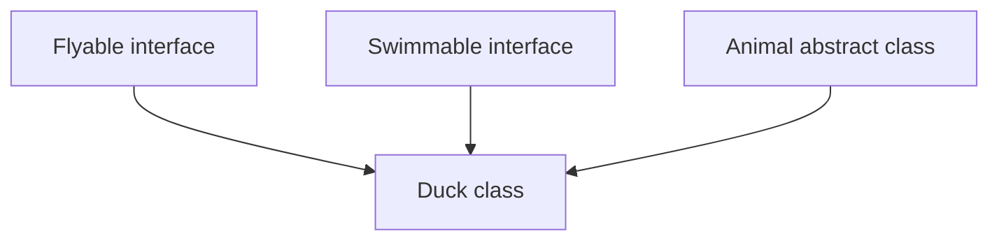

A class can `implement` **any number** of interfaces while `extending` only **one** class. This gives Java the
flexibility of multiple inheritance for *behavior contracts*, without the ambiguity risks of multiple inheritance for
*state/implementation*.

```java
class Duck extends Animal implements Flyable, Swimmable {
    // implements fly() from Flyable
    // implements swim() from Swimmable
    // inherits shared code from Animal
}
```

---

## 2️⃣ What is an Interface?

### 📖 Definition

> An **interface** in Java is a reference type, similar to a class, that can contain **abstract methods**, **default
methods**, **static methods**, **private methods**, and **constants** — but (traditionally) no instance state and no
> constructors. It defines a **contract** that implementing classes must fulfill.

### ✍️ Syntax

```java
interface Playable {
    void play(); // implicitly public and abstract
}
```

### 🧩 Characteristics & Features

| Feature                           | Supported?      | Notes                                |
|-----------------------------------|-----------------|--------------------------------------|
| Abstract methods                  | ✅ Yes           | Implicitly `public abstract`         |
| Default methods                   | ✅ Yes (Java 8+) | Must use `default` keyword           |
| Static methods                    | ✅ Yes (Java 8+) | Called via interface name            |
| Private methods                   | ✅ Yes (Java 9+) | Only for internal reuse              |
| Constants (`public static final`) | ✅ Yes           | Implicitly `public static final`     |
| Instance variables                | ❌ No            | Interfaces hold no object state      |
| Constructors                      | ❌ No            | Interfaces can never be instantiated |
| Instantiation (`new`)             | ❌ No            | Same restriction as abstract classes |

### 📏 Rules

1. Declared using the `interface` keyword.
2. All abstract methods are **implicitly `public abstract`** — you don't (and shouldn't) write those modifiers
   explicitly.
3. All variables are **implicitly `public static final`** — i.e., constants. You **must** initialize them at
   declaration.
4. An interface **can extend multiple other interfaces** (unlike classes, which extend only one).
5. A class implementing an interface must implement **all** abstract methods, or be declared `abstract` itself.

### 🔍 Default Behavior of Variables and Methods

```java
interface Config {
    int MAX_USERS = 100;   // implicitly: public static final int MAX_USERS = 100;

    void connect();          // implicitly: public abstract void connect();
}
```

```java
// This is what the compiler actually sees:
interface Config {
    public static final int MAX_USERS = 100;

    public abstract void connect();
}
```

> ⚠️ Because interface variables are always `final`, you **cannot** change their value later — they behave exactly like
> global constants.

### 🏷️ Interface Naming Conventions

| Convention                                       | Example                                            |
|--------------------------------------------------|----------------------------------------------------|
| Adjective ending in "-able"/"-ible" (capability) | `Runnable`, `Comparable`, `Serializable`           |
| Noun describing a role                           | `Payment`, `Repository`, `Service`                 |
| Prefix with `I` (some teams, not idiomatic Java) | `IPayment` *(uncommon in Java; more common in C#)* |

> 📌 Standard Java convention **avoids** the `I` prefix — the JDK itself uses plain nouns/adjectives (`List`, `Runnable`,
`Comparable`).

---

## 3️⃣ Implementing Interfaces

### 🔧 The `implements` Keyword

```java
interface Payment {
    boolean processPayment(double amount);
}

class UpiPayment implements Payment {
    @Override
    public boolean processPayment(double amount) {
        System.out.println("Processing UPI payment of ₹" + amount);
        return true;
    }
}
```

> 🔑 Note: When implementing an interface method, you **must** mark it `public` explicitly — Java doesn't let you narrow
> visibility (interface methods are always `public` by contract).

### 🧩 Multiple Interface Implementation

```java
interface Chargeable {
    void charge();
}

interface Connectable {
    void connect();
}

class Smartphone implements Chargeable, Connectable {
    @Override
    public void charge() {
        System.out.println("Charging via USB-C");
    }

    @Override
    public void connect() {
        System.out.println("Connecting via Bluetooth");
    }
}
```

### 🧬 Implementing Abstract Methods

A class implementing an interface must provide a concrete body for **every** abstract method, unless the class itself is
`abstract`:

```java
abstract class PartialPayment implements Payment {
    // Doesn't implement processPayment() — legal, because PartialPayment is abstract
    abstract void logAttempt();
}
```

### ❌ Common Mistakes

| Mistake                                       | Why It's Wrong                        | Fix                                       |
|-----------------------------------------------|---------------------------------------|-------------------------------------------|
| Forgetting `public` when overriding           | Interface methods are always `public` | Add `public` explicitly                   |
| Not implementing all abstract methods         | Compile-time error                    | Implement all, or mark class `abstract`   |
| Trying to add instance fields to an interface | Interfaces can't hold object state    | Move state into implementing classes      |
| Trying to instantiate an interface directly   | `new Payment()` is illegal            | Instantiate a concrete implementing class |

---

## 4️⃣ Interface vs Abstract Class

| Aspect                     | Interface                                                                                     | Abstract Class                                           |
|----------------------------|-----------------------------------------------------------------------------------------------|----------------------------------------------------------|
| **Purpose**                | Define a pure **capability/contract**                                                         | Define a **partial implementation** for related types    |
| **Methods**                | Abstract (default), default, static, private (9+)                                             | Abstract + concrete, freely mixed                        |
| **Variables**              | Only `public static final` constants                                                          | Any — instance, static, final                            |
| **Constructors**           | ❌ Not allowed                                                                                 | ✅ Allowed                                                |
| **Multiple inheritance**   | ✅ A class can implement many interfaces                                                       | ❌ A class can extend only one                            |
| **Instantiation**          | ❌ Never                                                                                       | ❌ Never (directly)                                       |
| **Performance**            | Same JVM dispatch cost as classes (modern JVMs)                                               | Same                                                     |
| **Use case**               | Unrelated classes needing shared capability                                                   | Related classes needing shared code + contract           |
| **Design philosophy**      | "Can-do" relationship                                                                         | "Is-a" relationship                                      |
| **Field access modifiers** | Always implicitly public                                                                      | Any modifier allowed                                     |
| **Interview angle**        | "Why would you choose it over abstract class?" → need multiple inheritance or unrelated types | "Why choose it over interface?" → need shared code/state |

> 🎯 **Interview Insight:** Since Java 8 introduced `default` and `static` methods, the *old* answer — "interfaces are
> 100% abstract, abstract classes aren't" — is **no longer fully true**. The real modern distinction is about **state
** (
> interfaces can't hold instance fields) and **inheritance model** (single class vs multiple interfaces), not about "
> abstract vs concrete methods" anymore.

---

## 5️⃣ Multiple Inheritance using Interfaces

### 🎯 Why Java Allows It (For Interfaces Only)

Multiple inheritance of **state** is dangerous (ambiguous fields, constructor order chaos). Multiple inheritance of *
*behavior contracts** is safe, because interfaces (pre-Java 8) had no state and no constructors — there was nothing to
conflict over except method signatures.

### ⚙️ How It Works

```java
interface Flyable {
    void fly();
}

interface Swimmable {
    void swim();
}

class Duck implements Flyable, Swimmable {
    @Override
    public void fly() {
        System.out.println("Duck flies short distances");
    }

    @Override
    public void swim() {
        System.out.println("Duck swims gracefully");
    }
}
```

### 🆚 Difference From Class Inheritance

| Class Inheritance                  | Interface Inheritance                             |
|------------------------------------|---------------------------------------------------|
| Single (`extends` one class only)  | Multiple (`implements` many interfaces)           |
| Inherits state (fields) + behavior | Inherits only method contracts (+ default bodies) |
| Constructor chaining involved      | No constructors, so no chaining                   |

### 💎 The Diamond Problem

The classic "Diamond Problem" occurs when a class inherits **conflicting implementations** of the same method from two
different parents:

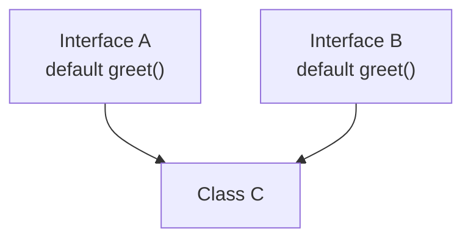

```java
interface A {
    default void greet() {
        System.out.println("Hello from A");
    }
}

interface B {
    default void greet() {
        System.out.println("Hello from B");
    }
}

// ❌ Compile-time error: class C inherits unrelated defaults for greet() from A and B
class C implements A, B {
}
```

Java **forces you to resolve this explicitly** — it will not silently pick one, unlike some languages.

### 🛠️ Conflict Resolution

```java
class C implements A, B {
    @Override
    public void greet() {
        A.super.greet(); // explicitly choose A's version
        // or B.super.greet();
        // or write entirely new logic here
        System.out.println("Hello from C (resolved)");
    }
}
```

### 📏 Method Resolution Rules

Java resolves ambiguity using these priority rules:

1. **Classes always win over interfaces.** If a superclass provides a concrete method and an interface provides a
   `default` method with the same signature, the **class's method wins** automatically — no conflict.
2. **More specific interfaces win.** If interface `B` extends interface `A` and overrides a default method, and a class
   implements both, `B`'s version wins.
3. **Direct conflicts must be resolved manually** using `InterfaceName.super.methodName()`, as shown above.

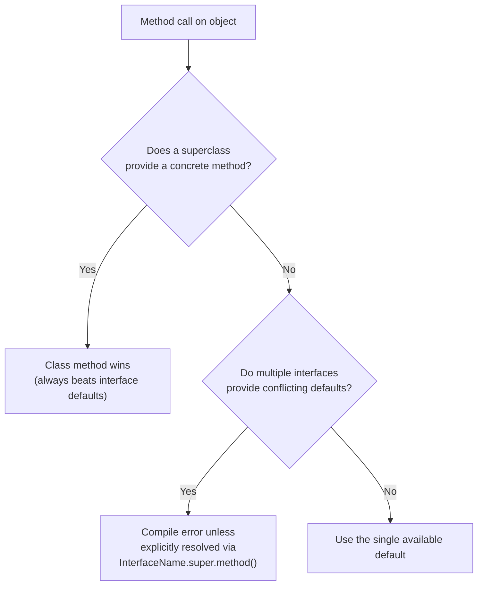

---

## 6️⃣ Default Methods

### 🎯 Why Introduced in Java 8

Before Java 8, adding **any** new method to an interface would break **every** existing implementing class (they'd all
suddenly fail to compile, missing the new method). This made evolving interfaces like `List` or `Collection` in the JDK
extremely painful.

**Default methods** solved this: you can add a new method to an interface **with a body**, and all existing implementing
classes continue to compile — they simply inherit the default behavior unless they choose to override it.

### ✍️ Syntax

```java
interface Vehicle {
    void move();

    default void honk() {
        System.out.println("Beep beep! (default horn sound)");
    }
}

class Car implements Vehicle {
    @Override
    public void move() {
        System.out.println("Car moving");
    }
    // honk() not overridden — uses the default
}
```

### ✅ Benefits

- Backward compatibility when evolving interfaces (this is *exactly* why Java 8 added `forEach()` to `Iterable` without
  breaking millions of existing classes)
- Provides sensible default behavior, reducing boilerplate in implementing classes
- Enables a limited form of "trait-like" code reuse across unrelated classes

### ⚔️ Conflict Resolution (Recap)

As shown in Section 5, when two interfaces provide the same default method, the implementing class **must** override it
and resolve manually with `InterfaceName.super.method()`.

### 🏗️ Best Practices for Default Methods

- Use them for **genuinely optional, sensible defaults** — not to smuggle heavy business logic into interfaces
- Avoid deep chains of default methods calling other default methods across many interfaces — it hurts readability
- Never use default methods to maintain **mutable state** — interfaces still can't hold instance fields

---

## 7️⃣ Static Methods in Interfaces

### 🎯 Why Introduced

Java 8 also allowed **static methods** inside interfaces — mainly to let related utility/helper logic live alongside the
interface it supports, instead of scattering it into separate "Utils" classes (e.g., `Collections` vs `Collection`).

### 📏 Rules

- Must include a method body
- Cannot be overridden by implementing classes (static methods aren't polymorphic)
- Called using the **interface name**, not through an object reference

### 📞 Invocation

```java
interface MathOperations {
    static int square(int x) {
        return x * x;
    }
}

// Usage:
int result = MathOperations.square(5); // called via interface name, NOT an object
```

### 💻 Practical Example

```java
interface Payment {
    boolean processPayment(double amount);

    static boolean isValidAmount(double amount) {
        return amount > 0;
    }
}

class CreditCardPayment implements Payment {
    @Override
    public boolean processPayment(double amount) {
        if (!Payment.isValidAmount(amount)) {
            System.out.println("Invalid amount!");
            return false;
        }
        System.out.println("Processing ₹" + amount);
        return true;
    }
}
```

---

## 8️⃣ Private Methods in Interfaces (Java 9+)

### 🎯 Why Introduced

Once interfaces could have `default` and `static` methods with real logic, a new problem appeared: **duplicate code**
between multiple default/static methods within the *same* interface. Java 9 introduced **private methods** to let
interfaces share internal helper logic **without exposing it** to implementing classes.

### 📏 Rules

- Must include a method body (never abstract)
- **Cannot** be overridden (not visible outside the interface at all)
- Can be called only from `default` or other `static`/`private` methods **within the same interface**
- Private **instance** methods (non-static) can only be called from default methods; private **static** methods can be
  called from both default and static methods

### ✅ Benefits / Internal Code Reuse

```java
interface Invoice {
    default void printDetailedInvoice(double amount, double taxRate) {
        double tax = calculateTax(amount, taxRate);
        System.out.println("Amount: " + amount + ", Tax: " + tax);
    }

    default void printSimpleInvoice(double amount) {
        double tax = calculateTax(amount, 0.05); // reusing shared private logic
        System.out.println("Amount: " + amount + ", Default Tax: " + tax);
    }

    // private helper — hidden from implementing classes entirely
    private double calculateTax(double amount, double rate) {
        return amount * rate;
    }
}
```

> 🔑 Without private methods, `calculateTax()` would have had to be a `static` or `default` method — exposing internal
> helper logic to every implementing class, cluttering the public contract.

---

## 9️⃣ Functional Interfaces

### 📖 Definition

> A **functional interface** is an interface with **exactly one abstract method** (regardless of how many default/static
> methods it has). This single method is called the **Single Abstract Method (SAM)**.

### 🎯 Single Abstract Method (SAM)

```java
interface Greetable {
    void greet(String name); // exactly ONE abstract method

    default void log() {
        System.out.println("Logging greet call");
    } // allowed — doesn't count against SAM rule
}
```

### 🏷️ `@FunctionalInterface`

```java

@FunctionalInterface
interface Greetable {
    void greet(String name);
}
```

This annotation is **optional** but strongly recommended — the compiler will throw an error if you accidentally add a *
*second** abstract method, catching mistakes early.

```java

@FunctionalInterface
interface Broken {
    void method1();

    void method2(); // ❌ Compile-time error: not functional, two abstract methods
}
```

### 🎯 Why Introduced

Functional interfaces exist to support **Lambda Expressions** — Java's way of treating a "block of behavior" as a value
that can be passed around, introduced in Java 8.

### 🔗 Relation to Lambda Expressions

```java
Greetable g = (name) -> System.out.println("Hello, " + name);
g.

greet("Riya"); // Output: Hello, Riya
```

The lambda `(name) -> System.out.println(...)` is essentially shorthand for implementing the interface's single abstract
method.

> 📌 **Note:** A full deep-dive into Lambda Expressions and the Stream API is **beyond the scope of this repository** —
> this section only introduces functional interfaces as the *foundation* that lambdas are built on. We're covering them
> here because they're a natural extension of interfaces, and interviewers commonly ask about the connection.

### 📦 Built-in Functional Interfaces (Brief Introduction)

| Interface       | Package              | SAM Signature           | Purpose                     |
|-----------------|----------------------|-------------------------|-----------------------------|
| `Runnable`      | `java.lang`          | `void run()`            | A task with no input/output |
| `Comparable<T>` | `java.lang`          | `int compareTo(T o)`    | Natural ordering            |
| `Comparator<T>` | `java.util`          | `int compare(T a, T b)` | Custom ordering             |
| `Function<T,R>` | `java.util.function` | `R apply(T t)`          | Transforms input to output  |
| `Predicate<T>`  | `java.util.function` | `boolean test(T t)`     | Boolean-valued check        |
| `Supplier<T>`   | `java.util.function` | `T get()`               | Supplies/produces a value   |

---

## 🔟 Marker Interfaces

### 📖 What Are They?

> A **marker interface** is an interface with **no methods at all** — it exists purely to "tag" or "mark" a class as
> having a certain property, which other code (often the JVM or a framework) checks for using `instanceof`.

### 🎯 Why They Exist

Before annotations existed in Java, marker interfaces were the **only** way to attach metadata to a class without adding
real behavior.

### 📚 Examples

```java
interface Serializable {
    // completely empty — no methods
}

class Employee implements Serializable {
    String name;
    double salary;
}
```

| Marker Interface | Purpose                                                             |
|------------------|---------------------------------------------------------------------|
| `Serializable`   | Tells the JVM this object's state can be converted to a byte stream |
| `Cloneable`      | Tells the JVM that `Object.clone()` is allowed on this class        |
| `Remote` (RMI)   | Marks a class as usable for remote method invocation                |

### 🔄 Modern Alternatives

Since Java 5, **annotations** (`@interface`) have largely replaced marker interfaces for new designs, because
annotations can carry **additional metadata** (values, parameters) that a plain marker interface cannot:

```java

@Entity  // annotation — can carry metadata, unlike a marker interface
class Employee {
}
```

> 🔑 `Serializable` and `Cloneable` remain marker interfaces today mostly for **historical/backward-compatibility reasons
** — if Java were designed today, these would likely be annotations instead.

---

## 1️⃣1️⃣ Real-World Usage

### 🌱 Spring Boot

Spring's entire architecture is interface-driven. You typically code against `interface UserRepository`, and Spring
generates or injects the concrete implementation at runtime — enabling **loose coupling** and easy testing (mock the
interface in unit tests).

### 💉 Dependency Injection

DI frameworks inject **interface types**, not concrete classes, into your components:

```java
class OrderService {
    private final PaymentGateway gateway; // interface, not a concrete class

    OrderService(PaymentGateway gateway) { // injected via constructor
        this.gateway = gateway;
    }
}
```

Swapping `RazorpayGateway` for `StripeGateway` requires **zero changes** to `OrderService`.

### 📦 Collections Framework

`List`, `Set`, `Map`, `Queue` are all interfaces. Your code should almost always reference the interface type (
`List<String> names = new ArrayList<>();`), so the underlying implementation (`ArrayList` vs `LinkedList`) can change
without breaking calling code.

### 🗄️ JDBC

`Connection`, `Statement`, and `ResultSet` are all interfaces defined in `java.sql`. Each database vendor (MySQL,
PostgreSQL, Oracle) provides its own concrete implementation — your code stays vendor-agnostic by coding against the
interface.

### 📱 Android Development

`OnClickListener` is a functional interface — you implement it (often via a lambda) to define what happens when a button
is tapped, without the Android framework needing to know your specific logic in advance.

### 🏢 Enterprise Applications

Layered architectures (Controller → Service → Repository) use interfaces at each layer boundary, allowing each layer to
be mocked, tested, and swapped independently.

### 🔌 API Design

Public APIs/SDKs expose interfaces rather than concrete classes, so internal implementation can evolve (or be replaced
entirely) without breaking client code that depends on the published contract.

### 🎨 Design Patterns

Nearly every classic design pattern relies on interfaces: **Strategy** (interchangeable algorithms), **Observer** (
`Listener` interfaces), **Factory** (returns an interface type), **Adapter**, **Decorator** — all depend on coding
against an abstraction rather than a concrete class.

---

## 1️⃣2️⃣ Best Practices

### ✅ When to Choose an Interface

- Unrelated classes need to share a **capability** (`Comparable`, `Flyable`)
- You need **multiple inheritance** of type
- You're designing a **public API/contract** that many teams/classes will implement differently
- You want maximum flexibility for future implementations (swap `MySQL` → `PostgreSQL` easily)

### ✅ When to Choose an Abstract Class

- Related classes share **significant common code**, not just a signature
- You need **constructors** to enforce initialization logic
- You need **instance state** (fields) shared across subclasses

### 🎯 Interface Segregation Principle (ISP)

> *"Clients should not be forced to depend on methods they do not use."* — the "I" in **SOLID**

**Bad design (fat interface):**

```java
interface Worker {
    void code();

    void design();

    void manageTeam();
}

class Developer implements Worker {
    public void code() { /* ... */ }

    public void design() {
        throw new UnsupportedOperationException();
    } // forced, unused

    public void manageTeam() {
        throw new UnsupportedOperationException();
    } // forced, unused
}
```

**Good design (segregated interfaces):**

```java
interface Codeable {
    void code();
}

interface Designable {
    void design();
}

interface Manageable {
    void manageTeam();
}

class Developer implements Codeable {
    public void code() { /* ... */ }
}
```

### 🧼 Designing Clean APIs

- Keep interfaces **small and focused** (ideally one clear responsibility)
- Prefer **many small interfaces** over one large interface
- Document the **contract's intent**, not just method signatures

### ⚠️ Avoiding Unnecessary Interfaces

Don't create an interface for a class that will **only ever have one implementation** and has no testing/mocking need —
this adds indirection without benefit. Interfaces earn their place when there's genuine variability or a need for
decoupling.

---

## 1️⃣3️⃣ Common Beginner Mistakes

### ❌ Mistake 1: Confusing Interfaces with Abstract Classes

Beginners often ask "should I use an interface or abstract class?" as if they're interchangeable. Remember: *
*interface = "can-do"** capability, **abstract class = "is-a"** shared identity + code.

### ❌ Mistake 2: Forgetting to Implement Methods

```java
interface Payment {
    boolean processPayment(double amount);
}

class UpiPayment implements Payment {
    // forgot processPayment() entirely
} // ❌ Compile-time error
```

### ❌ Mistake 3: Misusing Default Methods

```java
interface Vehicle {
    default void move() {
        // ❌ Bad practice: putting ALL core logic here instead of leaving it abstract
        System.out.println("Generic movement logic for every vehicle type");
    }
}
```

If every vehicle type genuinely moves differently, `move()` should be **abstract**, not a one-size-fits-all `default`.

### ❌ Mistake 4: Overusing Interfaces

Creating an interface for every single class "just in case," even when there's only one implementation and no plan for
more — this is **premature abstraction** and adds unnecessary indirection.

---

## 1️⃣4️⃣ Practice Section

### 🧠 Conceptual Questions (10)

1. Why can a class implement multiple interfaces but extend only one class?
2. What is the default access modifier for interface methods and variables?
3. Why were default methods introduced in Java 8?
4. What is the Diamond Problem, and how does Java avoid it for interfaces?
5. Can an interface have a constructor? Why or why not?
6. What is a functional interface, and why does the SAM rule matter?
7. What is a marker interface? Give two JDK examples.
8. Why can't interface variables be reassigned?
9. What's the difference between a private method and a default method in an interface?
10. Why does Java prevent instantiating an interface directly?