<div align="center">

# 📘 Java OOP Foundation

### From Absolute Beginner → Placement Ready

*A first-principles guide to Object-Oriented Programming in Java — built for Computer Engineering students preparing for
technical interviews.*


</div>

---

## 🗺️ Table of Contents

| # | Chapter                                                      | What You'll Learn                                     |
|---|--------------------------------------------------------------|-------------------------------------------------------|
| 1 | [Programming Paradigms](#chapter-1--programming-paradigms)   | What a paradigm is, procedural style                  |
| 2 | [Why OOP Was Introduced](#chapter-2--why-oop-was-introduced) | The real problems that created OOP                    |
| 3 | [Understanding OOP](#chapter-3--understanding-oop)           | Core philosophy and mental model                      |
| 4 | [Four Pillars of OOP](#chapter-4--the-four-pillars-of-oop)   | Encapsulation, Abstraction, Inheritance, Polymorphism |
| 5 | [Class and Object](#chapter-5--class-and-object)             | Blueprint vs Instance                                 |
| 6 | [Memory View](#chapter-6--memory-view)                       | Heap, Stack, References                               |
| 7 | [Summary Notes](#chapter-7--summary-notes)                   | Rapid revision                                        |
| 8 | [Interview Questions](#chapter-8--interview-questions)       | 24 placement-style Q&As                               |

---

## Chapter 1 — 🧩 Programming Paradigms

### 📌 Concept

A **programming paradigm** is a *style of thinking* about how to structure code to solve a problem. It's not a
language — it's a **mindset** a language encourages.

> 🧠 **Intuition**
> Cooking the same dish two ways:
> - Follow a strict recipe step-by-step → **Procedural**
> - Treat ingredients as independent "things" that know how to behave → **Object-Oriented**
>
> Same goal, different approach.

### ⚡ Key Idea

| Paradigm        | Core Idea                                      | Example Languages |
|-----------------|------------------------------------------------|-------------------|
| Procedural      | Program = sequence of functions acting on data | C, Pascal         |
| Object-Oriented | Program = objects interacting with each other  | Java, C++, Python |
| Functional      | Program = composition of pure functions        | Haskell, Scala    |
| Logical         | Program = facts + rules + inference            | Prolog            |

Java is primarily **Object-Oriented**, with functional features (lambdas, streams) layered on top since Java 8.

---

### 🌍 Real World Example - Procedural Style

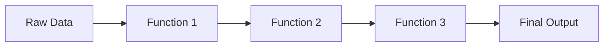

In procedural programming, **data flows through independent functions** — the data itself has no behavior of its own.

```java
class StudentData {
    String name;
    int marks;
}

void printStudent(StudentData s) {
    System.out.println(s.name + " scored " + s.marks);
}
```

> ⚠️ **Common Mistake**
> Beginners often think "procedural = bad, OOP = good." That's false. Procedural code is perfectly fine for small
> scripts, automation tools, and simple utilities. OOP becomes valuable as **scale and complexity** increase — explained
> in Chapter 2.

---

### 🏗️ Characteristics of Procedural Programming

| Characteristic       | Explanation                                                   |
|----------------------|---------------------------------------------------------------|
| Top-down design      | Big problem broken into smaller functions, called in sequence |
| Global / shared data | Data often accessible to many functions                       |
| Function-centric     | The function is the basic building block                      |
| Sequential execution | Code largely runs in the order it's written                   |
| No data hiding       | Any function can read/modify any data                         |

<details>
<summary>✅ Advantages of Procedural Programming</summary>

- Simple to understand for small programs
- Fast to write for one-off scripts
- Easier to trace linear flow for small codebases
- No object-creation overhead

</details>

<details>
<summary>❌ Limitations of Procedural Programming</summary>

- Data exposed everywhere → no protection from misuse
- Functions and data become tangled as programs grow
- Poor code reuse → leads to copy-paste duplication
- Hard to model real-world entities naturally
- Changing the data structure forces changes across many functions

</details>

> 📝 **Quick Revision — Chapter 1**
> - Paradigm = style of thinking, not a language
> - Procedural = data + functions kept separate
> - Works well for small programs, struggles at scale
> - Java is mainly OOP with some functional features

---

## Chapter 2 — 🚨 Why OOP Was Introduced

### ❓ Why It Exists

OOP wasn't invented for fun — it was a **direct response** to real pain points that procedural programming caused once
software started getting big, collaborative, and long-living.

### 📌 Problems with Procedural Programming

```java
class Account {
    int balance;
}

void withdraw(Account a, int amount) {
    a.balance -= amount;   // 🚨 No check! Anyone, anywhere, can break this.
}
```

Any part of the program — even unrelated code — can directly change `balance`. There's no enforced rule like *"balance
can never go negative."*

> ⚠️ **Common Mistake**
> Thinking the bug above is a "logic mistake." It's actually a **structural** problem — the language gives *no way* to
> protect this data, no matter how careful the team is.

---

### 🌍 Real-World Software Challenges

| Challenge                                        | Why Procedural Struggled                                           |
|--------------------------------------------------|--------------------------------------------------------------------|
| Multiple developers on one codebase              | Shared global data → conflicts, hidden bugs                        |
| Modeling real entities (orders, accounts, users) | Structs + free functions don't capture "data + behavior" naturally |
| Frequent changing requirements                   | One data change → ripple effect across many functions              |
| Massive codebases (millions of lines)            | No natural way to split code into independent, reusable units      |
| Sensitive data protection                        | No restriction on who can read/write critical data                 |

### 🏗️ Code Scalability Issues

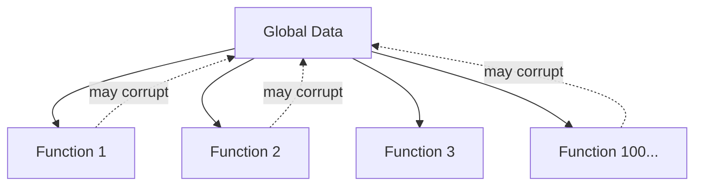

Every new function added is one more place that *might* unintentionally break shared data. This is called **tight
coupling** — a small change in one place can silently break something far away.

### 🛠️ Maintainability Issues

- If a `Student` struct changes (e.g., `marks` becomes subject-wise), **every** function touching `marks` must be
  manually found and fixed.
- No single place "owns" the logic for a `Student` — it's scattered across the codebase.
- New developers must read the *entire* program to understand data flow, since nothing is encapsulated.

### 🔐 Security Issues

- Data is **globally accessible** — any function (even buggy/malicious code) can directly modify sensitive fields like
  balance or passwords.
- No concept of "private" data restricted to specific code.
- One careless line anywhere in the program can corrupt critical data.

> 🎯 **Placement Tip**
> If an interviewer asks *"Why do we need OOP at all? Procedural code also works."* — answer with **scalability,
maintainability, and security**, not just "it's modern" or "it's better." Give the global-data example above; it shows
> you understand the *root cause*, not just the buzzword.

> 📝 **Quick Revision — Chapter 2**
> - Procedural breaks down with team size, complexity, and security needs
> - Root cause: data and behavior are disconnected and globally exposed
> - OOP's mission: bundle data + behavior together, and control access to it

---

## Chapter 3 — 🌱 Understanding OOP

### 📌 Definition of OOP

> **Object-Oriented Programming (OOP)** organizes a program as a collection of **objects**, each combining **data (
state)** and **behavior (methods)** into one unit, interacting with each other to produce results.

### ⚡ Core Idea Behind OOP

Procedural asks: *"What functions do I need?"*
OOP asks: **"What real-world things are involved, and what can they do?"**

Each "thing" becomes an **object** that:

1. Knows things about itself → **state / attributes**
2. Can do things → **behavior / methods**
3. Controls who can access its internals → **access control**

---

### 🌍 Real-World Analogy

| Real World                                                 | OOP Equivalent         |
|------------------------------------------------------------|------------------------|
| A car has color, speed, fuel level                         | **Attributes (data)**  |
| A car can accelerate, brake, honk                          | **Methods (behavior)** |
| You drive without knowing engine wiring                    | **Abstraction**        |
| You can't tamper with the engine via the steering wheel    | **Encapsulation**      |
| A Sports Car *is a* Car, with extras                       | **Inheritance**        |
| "Start" means different things for petrol vs electric cars | **Polymorphism**       |

> 🧠 **Intuition**
> OOP simply takes how humans *naturally* categorize the world — "things that have properties and can act" — and maps
> that directly into code.

---

### 🏗️ Building Software Using Objects

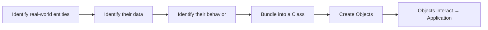

```java
class Account {
    private double balance;   // protected data

    public void withdraw(double amount) {
        if (amount <= balance) {
            balance -= amount;   // rule enforced INSIDE the class
        } else {
            System.out.println("Insufficient funds");
        }
    }
}
```

Now `balance` can **only** change through `withdraw()`, and that method enforces the rule. This single design choice
fixes the maintainability and security problems from Chapter 2.

> 📝 **Quick Revision — Chapter 3**
> - OOP = objects combining data + behavior
> - Mental shift: from "what functions?" to "what things, and what can they do?"
> - Real-world modeling is the foundation of clean OOP design

---

## Chapter 4 — 🏛️ The Four Pillars of OOP

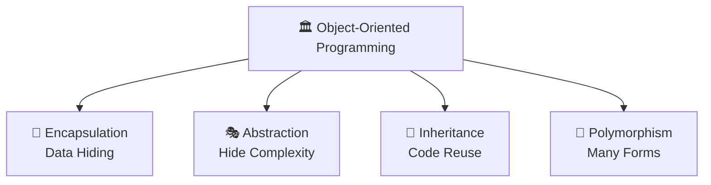

---

### 🔐 4.1 Encapsulation

#### 📌 Concept

Wrapping data and the code that operates on it into a **single unit (class)**, while **restricting direct access** to
that data from outside.

#### ❓ Why It Exists

To stop the procedural disaster of unrestricted, global data access. We need a way to say: *"Only this class's own
methods may touch this data."*

#### ⚡ Key Idea

Protect data → expose only safe, controlled entry points (getters/setters/methods).

#### 🌍 Real World Example

A **medicine capsule**: the medicine (data) sits sealed inside a cover (class). You consume it as a whole, the intended
way — you never touch the raw medicine directly. An ATM works the same way: you never reach into the bank's database —
you interact only through defined buttons.

#### 💻 Java Example

```java
class BankAccount {
    private double balance;   // hidden from outside

    public void deposit(double amount) {
        if (amount > 0) balance += amount;
    }

    public double getBalance() {   // controlled read access
        return balance;
    }
}

public class Main {
    public static void main(String[] args) {
        BankAccount acc = new BankAccount();
        acc.deposit(5000);
        // acc.balance = -9999;   ❌ compile error — balance is private
        System.out.println(acc.getBalance());   // ✅ controlled access
    }
}
```

#### 🏗️ Internal Working

- `private` restricts a member's scope to its own class — enforced by the **compiler**, at compile-time.
- Public getters/setters act as a **gateway**, so validation logic can run before data is read/changed.

> ⚠️ **Common Mistake**
> Writing a getter that returns a **mutable object directly** (e.g., returning the actual internal `List`). The caller
> can then modify it from outside, silently breaking encapsulation. Always return a copy or an unmodifiable view when
> needed.

#### 🔥 Interview Insight

<details>
<summary>Is encapsulation the same as data hiding?</summary>

No. Data hiding is a *result* of encapsulation. Encapsulation is the broader concept of bundling data and behavior
together; restricting access is one of its effects.
</details>

<details>
<summary>Does encapsulation guarantee security?</summary>

No. It improves controlled access, but it is not encryption or authentication — it's a design discipline, not a security
feature in the cryptographic sense.
</details>

> 📝 **Quick Revision — Encapsulation**
> - Bundle data + behavior, restrict direct data access
> - `private` fields + public methods = controlled gateway
> - Solves: global data exposure problem from Chapter 2

---

### 🎭 4.2 Abstraction

#### 📌 Concept

Hiding internal implementation details and showing only the **essential features** to the user.

#### ❓ Why It Exists

Users of a class shouldn't need to understand *how* it works internally to *use* it. Complexity must be hidden behind a
simple interface.

#### ⚡ Key Idea

Separate **"what to do"** from **"how it's done."**

#### 🌍 Real World Example

Driving a car: you use the steering wheel, accelerator, and brake (the **interface**). You don't need to understand the
combustion cycle or transmission gears (the **implementation**) to drive.

#### 💻 Java Example

```java
abstract class Shape {
    abstract double area();   // WHAT — no HOW
}

class Circle extends Shape {
    double radius;

    Circle(double r) {
        radius = r;
    }

    double area() {           // HOW it's actually calculated
        return Math.PI * radius * radius;
    }
}

public class Main {
    public static void main(String[] args) {
        Shape s = new Circle(5);
        System.out.println(s.area());   // caller doesn't care HOW
    }
}
```

| Tool             | Abstraction Level | Can have implementation?                      |
|------------------|-------------------|-----------------------------------------------|
| `abstract class` | Partial           | Yes — some methods can have a body            |
| `interface`      | (Mostly) Full     | Only `default` / `static` methods have a body |

#### 🏗️ Internal Working

- `abstract` methods have **no body** — the JVM defers actual execution to whichever subclass overrides it, decided at *
  *runtime**.
- The compiler enforces a contract: every concrete subclass **must** implement all abstract methods.

> 💡 **Important**
> Abstraction and Encapsulation are **not the same thing**, even though students often confuse them:
> - **Abstraction** → hides *complexity* (design-level decision: what to show)
> - **Encapsulation** → hides *data* (implementation-level decision: how to protect it)

#### 🔥 Interview Insight

<details>
<summary>Can we instantiate an abstract class?</summary>

No, not directly. You must create a subclass that implements all of its abstract methods, and instantiate that subclass
instead.
</details>

> 📝 **Quick Revision — Abstraction**
> - Hide "how", expose only "what"
> - Achieved via `abstract class` or `interface`
> - Lets implementation change later without breaking callers

---

### 🌳 4.3 Inheritance

#### 📌 Concept

A class (**child/subclass**) acquires the properties and behaviors of another class (**parent/superclass**).

#### ❓ Why It Exists

To enable **code reuse** and model natural "is-a" relationships found in the real world.

#### ⚡ Key Idea

Don't repeat shared logic — define it once in a parent, reuse it in every child.

#### 🌍 Real World Example

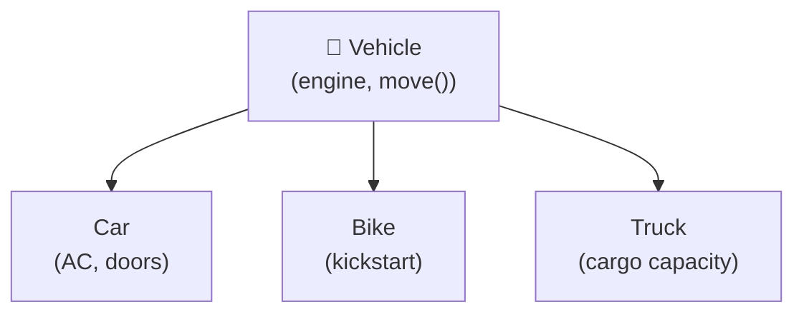

A **Vehicle** is a general category. **Car**, **Bike**, **Truck** are all vehicles — they share common features (engine,
can move) but also have specialized features.

#### 💻 Java Example

```java
class Vehicle {
    void move() {
        System.out.println("Vehicle is moving");
    }
}

class Car extends Vehicle {     // Car IS-A Vehicle
    void honk() {
        System.out.println("Car honks: Beep!");
    }
}

public class Main {
    public static void main(String[] args) {
        Car c = new Car();
        c.move();   // inherited from Vehicle
        c.honk();   // Car's own method
    }
}
```

#### 🏗️ Internal Working

The JVM maintains a class hierarchy. When `c.move()` is called, the JVM first checks `Car`'s own method table; if not
found there, it walks **up** to `Vehicle`.

> ⚠️ **Common Mistake**
> Assuming Java supports multiple inheritance with classes. It doesn't — Java allows only **single inheritance** for
> classes to avoid the **Diamond Problem** (ambiguity when two parents define the same method). Multiple inheritance of
*type* is allowed only through interfaces.

#### 🔥 Interview Insight

<details>
<summary>Is the constructor inherited?</summary>

No. Constructors are not inherited, but a subclass constructor can invoke the parent's constructor explicitly
using <code>super()</code>.
</details>

> 📝 **Quick Revision — Inheritance**
> - "is-a" relationship between parent and child
> - Reuses logic, avoids duplication
> - Single inheritance for classes, multiple via interfaces

---

### 🔄 4.4 Polymorphism

#### 📌 Concept

"Many forms" — the same method name or entity behaves differently depending on context.

#### ❓ Why It Exists

To let **one interface represent multiple implementations**, so code can be written generically and still work correctly
for many object types.

#### ⚡ Key Idea

One call, many possible behaviors — decided by *who* is actually being called.

#### 🌍 Real World Example

Press the **"start"** button:

- On a car → ignites the engine
- On a phone → boots the OS
- On a washing machine → begins a wash cycle

Same action name, different behavior depending on the object.

#### 💻 Java Example

```java
// 1. Compile-time (Static) Polymorphism — Method Overloading
class Calculator {
    int add(int a, int b) {
        return a + b;
    }

    double add(double a, double b) {
        return a + b;
    }
}

// 2. Runtime (Dynamic) Polymorphism — Method Overriding
class Animal {
    void sound() {
        System.out.println("Some sound");
    }
}

class Dog extends Animal {
    void sound() {
        System.out.println("Bark");
    }   // overridden
}

public class Main {
    public static void main(String[] args) {
        Calculator c = new Calculator();
        System.out.println(c.add(2, 3));        // 5    -> int version
        System.out.println(c.add(2.5, 3.5));     // 6.0  -> double version

        Animal a = new Dog();   // Reference type Animal, Object type Dog
        a.sound();              // "Bark" — decided at RUNTIME
    }
}
```

| Type                  | Decided at   | Mechanism          | Example                            |
|-----------------------|--------------|--------------------|------------------------------------|
| Compile-time (Static) | Compile time | Method Overloading | Same name, different parameters    |
| Runtime (Dynamic)     | Run time     | Method Overriding  | Subclass redefines parent's method |

#### 🏗️ Internal Working

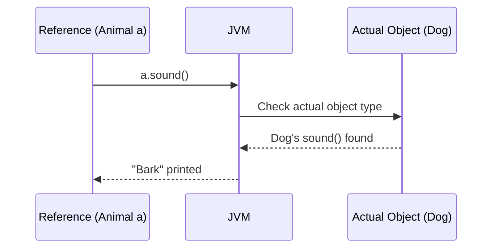

**Overloading** is resolved by the compiler using the method signature — a compile-time decision. **Overriding** uses *
*dynamic method dispatch**: the JVM checks the object's **actual type** at runtime (not the reference type) and calls
the correct overridden method.

> 💡 **Important**
> The reference type only decides **what you're allowed to call**; the actual object type decides **what code actually
runs**.

#### 🔥 Interview Insight

<details>
<summary>Can static methods be overridden?</summary>

No. Static methods are resolved at compile-time based on the reference type — this is called <b>method hiding</b>, not
overriding.
</details>

<details>
<summary>Can we overload methods by changing only the return type?</summary>

No. The parameter list must differ. Changing only the return type creates ambiguity and causes a compile error.
</details>

> 📝 **Quick Revision — Polymorphism**
> - "Many forms" of the same method/interface
> - Overloading = compile-time, same class, different parameters
> - Overriding = runtime, subclass, same signature, dynamic dispatch

---

## Chapter 5 — 🏗️ Class and Object

### 📌 Concept

| Term       | Definition                                                                                                                  |
|------------|-----------------------------------------------------------------------------------------------------------------------------|
| **Class**  | A blueprint/template defining what data and behavior its objects will have. Occupies no memory for instance data by itself. |
| **Object** | A real instance created from a class, occupying actual memory, with its own copy of the data.                               |

### 🧠 Intuition — Blueprint Analogy

```
   CLASS  = Building Blueprint (paper design)
   OBJECT = Actual building constructed from that blueprint

   One blueprint → many buildings can be built
   (same plan, but each building has its own address, furniture, residents)
```

### 💻 Java Example

```java
class Student {              // BLUEPRINT
    String name;
    int marks;

    void study() {
        System.out.println(name + " is studying");
    }
}

public class Main {
    public static void main(String[] args) {
        Student s1 = new Student();   // OBJECT 1
        s1.name = "Alice";
        s1.marks = 95;

        Student s2 = new Student();   // OBJECT 2 — same blueprint
        s2.name = "Rahul";
        s2.marks = 88;

        s1.study();   // "Alice is studying"
        s2.study();   // "Rahul is studying"
    }
}
```

### ⚡ Relationship Between Class and Object

| Class                        | Object                    |
|------------------------------|---------------------------|
| Logical / design-time entity | Physical / runtime entity |
| No memory for instance data  | Memory allocated on Heap  |
| Declared once                | Created many times        |
| Defines structure & behavior | Holds actual values       |

> 🎯 **Placement Tip**
> If asked *"Why do classes even exist if objects do all the real work?"* — answer: classes provide **reusable structure
and type-checking**; objects provide **actual runtime state**. Neither is useful for building real software alone.

> 📝 **Quick Revision — Chapter 5**
> - Class = blueprint, no memory for data
> - Object = real instance, memory allocated on heap
> - Many objects can be created from one class, each with independent state

---

## Chapter 6 — 🧠 Memory View

### 📌 Object Creation Process

```java
Student s1 = new Student();
```


### ⚡ The `new` Keyword

`new` does **three** things:

1. Allocates memory on the **heap** for the object.
2. Calls the class's **constructor** to initialize it.
3. Returns a **reference (address)** to that memory.

### 🏗️ Heap vs Stack

| Heap                                        | Stack                                               |
|---------------------------------------------|-----------------------------------------------------|
| Stores actual **objects** and instance data | Stores **method calls** and **reference variables** |
| Shared across the whole application         | Each method call gets its own frame                 |
| Cleaned by the **Garbage Collector**        | Frame destroyed when method returns                 |

### 🧠 ASCII Diagram — Reference Variables

```
STACK                          HEAP
┌────────────────┐            ┌─────────────────────────┐
│ s1 = 0x1A2B  ───┼───────────▶│ Student object @0x1A2B  │
└────────────────┘            │  name = "Alice"          │
                               │  marks = 95              │
                               └─────────────────────────┘
```

> ⚠️ **Common Mistake**
> Thinking `s1` *contains* the object. It doesn't — `s1` only holds the **address** where the object lives on the heap.
> This is why Java is described as using "reference semantics" for objects.

### 🧠 Multiple Objects from the Same Class

```java
Student s1 = new Student();
Student s2 = new Student();
Student s3 = s1;     // s3 points to the SAME object as s1 — no new object!
```

```
STACK                          HEAP
┌────────────────┐
│ s1 = 0x1A2B  ───┼──────┐     ┌─────────────────────────┐
│ s2 = 0x3F9C  ───┼──┐   └────▶│ Student @0x1A2B           │
│ s3 = 0x1A2B  ───┼──┼────────▶│  name="Alice", marks=95   │
└────────────────┘  │         └─────────────────────────┘
                     │
                     │         ┌─────────────────────────┐
                     └────────▶│ Student @0x3F9C           │
                               │  name="Rahul", marks=88   │
                               └─────────────────────────┘
```

> 🔥 **Interview Insight**
> "Does `s3 = s1` create a new object?" → **No.** It copies the **reference** (address), not the object. Both variables
> now point to the **same** heap memory — changing one affects the other.

> 📝 **Quick Revision — Chapter 6**
> - `new` = allocate heap memory + run constructor + return address
> - Heap → objects; Stack → method frames + reference variables
> - Assigning a reference copies the address only, not the object

---

## Chapter 7 — 📝 Summary Notes

> Use this section for rapid, last-minute revision before walking into an interview.

- **Paradigm** = a style/approach of programming, not a language.
- **Procedural programming** = data and functions are separate; fine for small programs; breaks down at scale due to
  global data and tight coupling.
- **OOP emerged** to fix scalability, maintainability, and security issues of procedural code by bundling data +
  behavior into objects.
- **OOP core idea**: model real-world entities as objects with state (data) and behavior (methods).
- **Four Pillars**
    - 🔐 **Encapsulation** → bundle + restrict access to data
    - 🎭 **Abstraction** → hide implementation, expose only essentials
    - 🌳 **Inheritance** → reuse and extend via parent-child relationships
    - 🔄 **Polymorphism** → same interface, many implementations
- **Class** = blueprint (no instance memory); **Object** = actual instance (heap memory).
- `new` keyword → allocates heap memory + calls constructor + returns reference.
- **Stack** holds method calls and reference variables; **Heap** holds actual objects.
- Assigning `s2 = s1` copies the **address**, not the object — both point to the same memory.
- **Overloading**: same name, different parameters, resolved at **compile-time**.
- **Overriding**: subclass redefines parent method, resolved at **runtime** via dynamic dispatch.
- Java supports **single inheritance** for classes, **multiple inheritance via interfaces**.
- **Static methods cannot be overridden** — only hidden (compile-time resolution).
- Encapsulation ≠ full security — it's about **controlled access**.
- Abstraction hides **complexity**; Encapsulation hides **data**.

> 💡 **Remember**
> Whenever you're confused between two OOP terms, ask: *"Is this about hiding implementation (abstraction), or about
protecting data (encapsulation)? Is this about reuse (inheritance), or about flexible behavior (polymorphism)?"* This
> single question resolves most confusion instantly.

---

## Chapter 8 — 🎯 Interview Questions

<details open>
<summary><b>Click to expand all 24 questions</b></summary>

| #  | Question                                                    | Answer                                                                                                                                                                                                                                                |
|----|-------------------------------------------------------------|-------------------------------------------------------------------------------------------------------------------------------------------------------------------------------------------------------------------------------------------------------|
| 1  | What is a programming paradigm?                             | A fundamental style/approach to structuring and writing code to solve problems (e.g., procedural, object-oriented, functional).                                                                                                                       |
| 2  | Why did procedural programming fail for large systems?      | Data and functions are separate and globally accessible, causing tight coupling, poor reuse, and maintainability/security issues as codebases grew.                                                                                                   |
| 3  | What is OOP in one line?                                    | A paradigm that organizes software as interacting objects, each combining data and behavior, modeled after real-world entities.                                                                                                                       |
| 4  | What are the four pillars of OOP?                           | Encapsulation, Abstraction, Inheritance, Polymorphism.                                                                                                                                                                                                |
| 5  | What is a class?                                            | A blueprint/template defining the structure (fields) and behavior (methods) its objects will have; it doesn't hold actual data itself.                                                                                                                |
| 6  | What is an object?                                          | A runtime instance of a class, with its own memory and actual values for the fields defined by the class.                                                                                                                                             |
| 7  | Where are objects stored in memory?                         | On the Heap. Reference variables pointing to them are stored on the Stack.                                                                                                                                                                            |
| 8  | What does the `new` keyword do internally?                  | Allocates heap memory for the object, invokes the constructor to initialize it, and returns the object's memory address into a reference variable.                                                                                                    |
| 9  | What is encapsulation?                                      | Bundling data and methods into a single unit (class) and restricting direct access to data using `private`, exposing controlled access via public methods.                                                                                            |
| 10 | What is abstraction?                                        | Hiding internal implementation details and exposing only essential functionality, typically via abstract classes or interfaces.                                                                                                                       |
| 11 | Difference between abstraction and encapsulation?           | Abstraction hides complexity/implementation at the design level; Encapsulation hides data at the implementation level.                                                                                                                                |
| 12 | What is inheritance and why use it?                         | A mechanism where a subclass acquires properties/behavior of a superclass; used for code reuse and to model "is-a" relationships.                                                                                                                     |
| 13 | Why doesn't Java support multiple inheritance with classes? | To avoid the Diamond Problem — ambiguity when two parent classes share a method signature. Interfaces avoid this since they don't carry conflicting state by default.                                                                                 |
| 14 | What is polymorphism?                                       | The ability of the same method name/interface to take many forms, behaving differently based on the object or arguments involved.                                                                                                                     |
| 15 | Difference between overloading and overriding?              | Overloading: same method name, different parameters, same class, compile-time. Overriding: subclass redefines a method with the exact same signature, resolved at runtime.                                                                            |
| 16 | Can we overload methods by changing only the return type?   | No. Parameter list must differ; changing only the return type causes ambiguity and a compile error.                                                                                                                                                   |
| 17 | Can static methods be overridden?                           | No. Static methods belong to the class, resolved at compile-time — this is method hiding, not overriding.                                                                                                                                             |
| 18 | What is dynamic method dispatch?                            | The JVM mechanism that decides, at runtime, which overridden method to invoke based on the actual object type, not the reference type.                                                                                                                |
| 19 | Difference between a reference variable and an object?      | A reference variable (on the stack) holds the memory address of an object; the object itself (on the heap) holds the actual data.                                                                                                                     |
| 20 | If `s2 = s1`, does it create a new object?                  | No. It copies the reference (address). Both `s1` and `s2` now point to the same object in heap memory.                                                                                                                                                |
| 21 | Difference between abstract class and interface?            | Abstract class can have both implemented and abstract methods, supports single inheritance, and can hold state. Interface defines method contracts (plus default/static methods), supports multiple inheritance of type, and favors pure abstraction. |
| 22 | Why are constructors not inherited?                         | A constructor initializes the specific class it belongs to; a subclass constructor can still reuse parent logic by calling `super()`.                                                                                                                 |
| 23 | What is the real benefit of OOP in large team projects?     | Each class encapsulates its own responsibility, so developers can work on different classes independently with minimal conflict, and changes stay localized.                                                                                          |
| 24 | What problem does polymorphism solve in real applications?  | It removes the need for long type-checking conditional chains, allowing new types/behaviors to be added without modifying existing calling code.                                                                                                      |

</details>

---

## ✅ Next Steps

Once this chapter feels solid, continue with:

- 🏗️ Constructors (default, parameterized, copy, constructor chaining)
- 🔑 Access Modifiers in depth (`private`, `default`, `protected`, `public`)
- 🔄 `this` vs `super`
- 🎭 Interfaces vs Abstract Classes (deep dive)
- ⚙️ `static` vs instance members
- 🧬 Object class methods (`equals()`, `hashCode()`, `toString()`)

<div align="center">

> 📌 **Keep this file as your Chapter 1 revision sheet.**
> Re-read **Chapter 7** and **Chapter 8** the night before any interview.

⭐ *If this helped you, consider starring the repo for quick future access.*

</div>

<div align="center">

# 📚 Java OOP Mastery

## Chapter 2: Classes, Objects & Constructors

### From Absolute Beginner → Placement Ready


</div>

---

## ⏪ Recap: Chapter 1 — OOP Foundation

> Before moving forward, here's a 30-second refresher of what we already covered:
>
> - **Procedural programming** keeps data and functions separate — this caused scalability, maintainability, and
    security problems as software grew.
> - **OOP** fixes this by bundling **data + behavior into objects**, modeled after real-world entities.
> - The **Four Pillars**: 🔐 Encapsulation, 🎭 Abstraction, 🌳 Inheritance, 🔄 Polymorphism.
> - A **Class** is a blueprint; an **Object** is a real instance built from that blueprint, living on the **Heap**.
>
> If any of this feels unfamiliar, revisit **README-01-OOP-Foundation.md** before continuing — this chapter builds
> directly on top of it.

---

## 🗺️ Table of Contents

| #    | Section                                                                   | What You'll Learn                   |
|------|---------------------------------------------------------------------------|-------------------------------------|
| 2.1  | [Understanding Classes](#21--understanding-classes)                       | Structure, fields, methods          |
| 2.2  | [Understanding Objects](#22--understanding-objects)                       | Identity, state, behavior           |
| 2.3  | [Instance vs Local Variables](#23--instance-variables-vs-local-variables) | Scope, lifetime, memory             |
| 2.4  | [Object Creation Internals](#24--object-creation-internals)               | Step-by-step `new` breakdown        |
| 2.5  | [Constructors](#25--constructors)                                         | What, why, rules                    |
| 2.6  | [Default Constructor](#26--default-constructor)                           | Compiler-generated                  |
| 2.7  | [Parameterized Constructor](#27--parameterized-constructor)               | Custom initialization               |
| 2.8  | [Constructor Overloading](#28--constructor-overloading)                   | Multiple constructors               |
| 2.9  | [`this` Keyword](#29--this-keyword)                                       | Self-reference, conflict resolution |
| 2.10 | [Constructor Chaining](#210--constructor-chaining)                        | Reusing constructor logic           |
| 2.11 | [Copy Constructor](#211--copy-constructor)                                | Cloning objects manually            |
| 2.12 | [Shallow Copy](#212--shallow-copy)                                        | Surface-level copying               |
| 2.13 | [Deep Copy](#213--deep-copy)                                              | Fully independent copying           |
| 2.14 | [Shallow vs Deep Copy](#214--shallow-copy-vs-deep-copy)                   | Detailed comparison                 |
| 2.15 | [Interview Questions](#215--constructor-interview-questions)              | 25 placement Q&As                   |
| —    | [Chapter Summary](#-chapter-summary)                                      | Cheat sheet + memory tricks         |

---

## 2.1 — 🏗️ Understanding Classes

### 📌 Concept

A **class** is a blueprint that defines what **data (fields)** and **behavior (methods)** its objects will have. The
class itself holds no actual data for any object — it's a design, not a thing.

### ❓ Why Classes Were Introduced

Before structured blueprints, programmers described entities loosely (structs in C, or just variables floating around).
As OOP demanded that data and behavior travel together (Encapsulation), there had to be a **single construct** that
defines both at once. That construct is the class.

### ⚡ Key Idea

Class = **structure** (fields) + **behavior** (methods), defined once, reused for unlimited objects.

### 🧠 Intuition — Blueprint Analogy

```
   CLASS = Architectural blueprint of a house
   OBJECT = An actual house built using that blueprint

   One blueprint can produce unlimited houses.
   Each house has its own address, paint color, furniture —
   but all follow the same structural design.
```

### 🏗️ Structure of a Class

```java
class Student {
    // 🔹 FIELDS (state) — describe the data
    String name;
    int rollNumber;
    double marks;

    // 🔹 METHODS (behavior) — describe the actions
    void study() {
        System.out.println(name + " is studying");
    }

    double getGrade() {
        return marks >= 90 ? 'A' : 'B';
    }
}
```

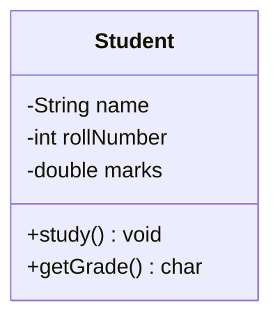

### ⚡ Fields vs Methods

| Component | Also Called                     | Represents                             | Example                 |
|-----------|---------------------------------|----------------------------------------|-------------------------|
| Fields    | Instance variables / attributes | **State** — what an object *knows*     | `name`, `marks`         |
| Methods   | Behaviors / functions           | **Behavior** — what an object *can do* | `study()`, `getGrade()` |

> 💡 **Important**
> **State vs Behavior** is the most fundamental split in OOP. Every single class you ever design boils down to answering
> two questions: *"What does this thing know about itself?"* (fields) and *"What can this thing do?"* (methods).

### 🌍 Real World Examples

| Real Entity | Fields (State)           | Methods (Behavior)    |
|-------------|--------------------------|-----------------------|
| Car         | color, speed, fuelLevel  | accelerate(), brake() |
| BankAccount | balance, accountNumber   | deposit(), withdraw() |
| Employee    | name, salary, department | work(), getPaySlip()  |

### 🏗️ Memory Perspective

> ⚠️ **Common Mistake**
> Students often think *"defining a class uses memory for its fields."* It does **not**. A class declaration only
> registers structure with the JVM (in an area called the **Method Area / Metaspace**). Memory for actual field values is
> allocated **only when an object is created** — covered in detail in section 2.4.

> 📝 **Quick Revision — 2.1**
> - Class = blueprint, defines fields (state) + methods (behavior)
> - No memory for instance data is used by the class declaration itself
> - One class → unlimited objects, each with independent state

---

## 2.2 — 🧬 Understanding Objects

### 📌 Concept

An **object** is a real, concrete instance of a class — it exists in memory (on the heap), with its own actual values
for the fields the class defines.

### ❓ Why Objects Exist

A class alone cannot run a program — it's just a design. Programs need **actual data to operate on**. Objects are what
bring a class to life: they hold real values and can actually be acted upon.

### ⚡ Relationship Between Class and Object

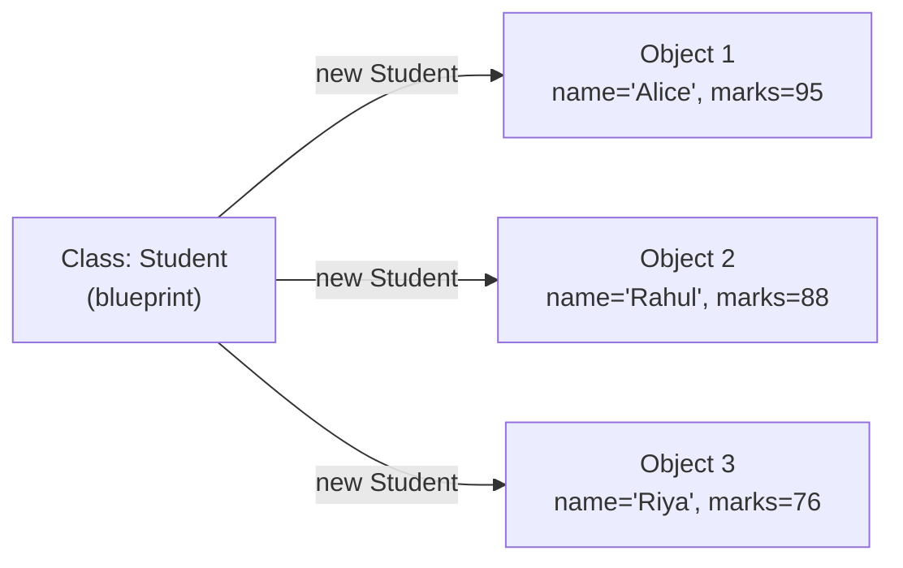

| Class                       | Object                   |
|-----------------------------|--------------------------|
| One definition              | Many instances possible  |
| No memory for instance data | Memory allocated on heap |
| Compile-time concept        | Runtime concept          |
| Defines what's *possible*   | Holds what's *actual*    |

### 💻 Creating Objects

```java
Student s1 = new Student();   // creates Object 1
s1.name ="Alice";
s1.marks =95;

Student s2 = new Student();   // creates Object 2 — independent of s1
s2.name ="Rahul";
s2.marks =88;
```

### 🧠 Object Identity, State & Behavior

| Property     | Meaning                                                                                                 | Example                                |
|--------------|---------------------------------------------------------------------------------------------------------|----------------------------------------|
| **Identity** | A unique existence in memory (its address) — even two objects with identical data are different objects | `s1` and `s2` are different identities |
| **State**    | The current values of its fields at a given moment                                                      | `s1.marks = 95`                        |
| **Behavior** | What it can do, defined by its methods                                                                  | `s1.study()`                           |

> 🧠 **Intuition — Memory Trick**
> Think **"I S B"** — **Identity, State, Behavior** — the three pillars that define *any* object, in *any* OOP language,
> forever. If you can name these three for any object, you understand it completely.

### 🏗️ Memory Diagram — Multiple Objects

```
STACK                           HEAP
┌─────────────────┐
│ s1 = 0xA1   ─────┼──────────▶ ┌──────────────────────────┐
│ s2 = 0xB2   ─────┼──────┐     │ Student @0xA1             │
└─────────────────┘      │     │  name="Alice", marks=95   │
                          │     └──────────────────────────┘
                          │     ┌──────────────────────────┐
                          └────▶│ Student @0xB2             │
                                │  name="Rahul", marks=88   │
                                └──────────────────────────┘
```

> 🔥 **Interview Insight**
> "Can two objects have identical field values but still be different objects?" — **Yes.** Identity is about the memory
> address, not the data inside. `s1.equals(s2)` (if overridden properly) might say they're "equal," but `s1 == s2` would
> say they are **not the same object**, since they live at different heap addresses.

> 📝 **Quick Revision — 2.2**
> - Object = real instance with its own memory and data
> - Identity ≠ State — two objects can have equal state but different identity
> - Every object can be described via Identity, State, Behavior (I-S-B)

---

## 2.3 — 🔍 Instance Variables vs Local Variables

### 📌 Concept

| Type                  | Declared Where                              | Belongs To                     |
|-----------------------|---------------------------------------------|--------------------------------|
| **Instance Variable** | Directly inside a class, outside any method | Each individual object         |
| **Local Variable**    | Inside a method, constructor, or block      | That specific method call only |

### 💻 Java Example

```java
class Employee {
    String name;          // 🔹 instance variable — belongs to the object

    void raiseSalary() {
        int bonus = 5000; // 🔹 local variable — exists only during this call
        System.out.println(name + " gets bonus: " + bonus);
    }
}
```

### ⚡ Comparison Table

| Property                 | Instance Variable                    | Local Variable                                 |
|--------------------------|--------------------------------------|------------------------------------------------|
| **Scope**                | Entire class (any method can use it) | Only within the method/block it's declared in  |
| **Lifetime**             | As long as the object exists         | Only during that single method call            |
| **Memory Location**      | Heap (inside the object)             | Stack (inside the method's stack frame)        |
| **Default Value**        | Yes (e.g., `0`, `null`, `false`)     | No — must be explicitly initialized before use |
| **Access Modifiers**     | Can use `private`, `public`, etc.    | Cannot use access modifiers                    |
| **Where it's destroyed** | When object is garbage collected     | When the method returns                        |

> ⚠️ **Common Mistake**
> Trying to use a local variable without initializing it:
> ```java
> void test() {
>     int x;
>     System.out.println(x);   // ❌ Compile Error: variable x might not have been initialized
> }
> ```
> Java refuses to compile this because local variables have **no default value** — unlike instance variables, which are
> auto-initialized.

### 🔥 Interview Insight

<details>
<summary>Why do instance variables get default values but local variables don't?</summary>

Instance variables live inside an object on the heap, and the JVM zeroes out that memory block when the object is
created — so a default value is guaranteed automatically. Local variables live on the stack, which is reused constantly
between method calls for performance — the JVM does not clear it for you, so uninitialized use could read garbage data.
Java prevents this entirely by forcing you to initialize local variables before use.
</details>

> 📝 **Quick Revision — 2.3**
> - Instance variable → tied to the object → heap → has default value
> - Local variable → tied to the method call → stack → no default value, must initialize

---

## 2.4 — ⚙️ Object Creation Internals

### 📌 Concept

What *really* happens when you write:

```java
Student s = new Student();
```

### 🏗️ Step-by-Step Internal Working

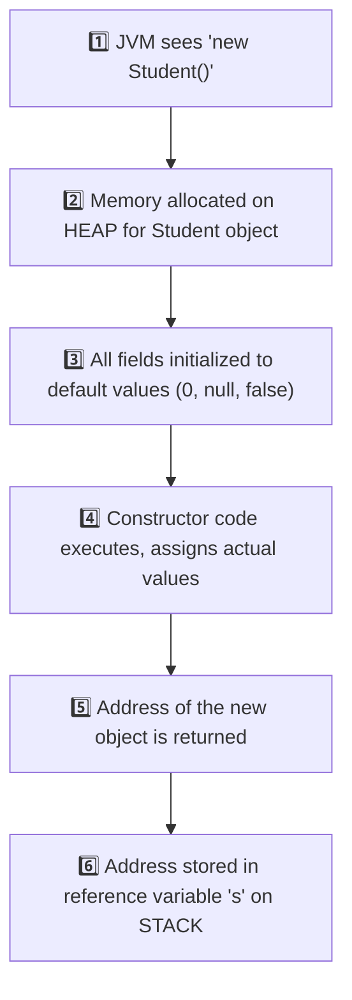

| Step | What Happens                                                                     |
|------|----------------------------------------------------------------------------------|
| 1    | JVM encounters the `new` keyword                                                 |
| 2    | Heap memory block is reserved, sized to fit the object's fields                  |
| 3    | All fields are zeroed out to default values **before** the constructor body runs |
| 4    | Constructor executes, assigning whatever values you provided                     |
| 5    | The memory address of the object is returned by the `new` expression             |
| 6    | That address is stored into the **reference variable** `s` on the stack          |

### 🧠 ASCII Diagram

```
STACK                          HEAP
┌────────────────┐            ┌─────────────────────────┐
│ s = 0x7F3A  ────┼───────────▶│ Student object @0x7F3A   │
└────────────────┘            │  name = null  (default)  │
                               │  marks = 0.0  (default)  │
                               └─────────────────────────┘
                                      ↓ constructor runs
                               ┌─────────────────────────┐
                               │  name = "Alice"          │
                               │  marks = 95.0            │
                               └─────────────────────────┘
```

> 💡 **Important**
> Fields are given default values **before** the constructor runs — not after. This is why, inside a constructor, you
> can safely read an uninitialized instance field (it'll just be `0`/`null`/`false`) — but you must never assume that
> local variables behave the same way.

> 🎯 **Placement Tip**
> If asked *"What is the exact sequence of memory events when an object is created?"* — always mention: **(1)** heap
> allocation, **(2)** default value initialization, **(3)** constructor execution, **(4)** reference returned to stack —
> in that order. Interviewers specifically check if you know default-value initialization happens *before* the constructor
> body.

> 📝 **Quick Revision — 2.4**
> - `new` = heap allocation → default values → constructor runs → reference returned
> - Reference variable (stack) only stores the address, never the object itself

---

## 2.5 — 🏛️ Constructors

### 📌 Concept

A **constructor** is a special block of code, with the **same name as the class**, that runs automatically **once** when
an object is created — used to initialize the object's state.

### ❓ Why Constructors Were Introduced

### 🚨 Problem Without Constructors

Imagine Java had no constructors. You'd have to manually initialize every object, every time:

```java
Student s1 = new Student();
s1.name ="Alice";
s1.marks =95;

Student s2 = new Student();
s2.name ="Rahul";
s2.marks =88;
// Forget to set marks for s3? It silently stays 0 — a bug waiting to happen.
```

This is repetitive, error-prone, and gives **no guarantee** that every object starts in a valid state.

### ⚡ Key Idea

A constructor guarantees: **"This object cannot exist without going through this exact initialization logic."**

### 🌍 Real World Example

Think of filling out a hospital admission form **at the moment a patient is registered** — name, age, blood group are
captured immediately, not added "whenever someone remembers." A constructor enforces the same discipline for objects.

### 💻 Java Example

```java
class Student {
    String name;
    double marks;

    Student(String n, double m) {   // CONSTRUCTOR
        name = n;
        marks = m;
    }
}

public class Main {
    public static void main(String[] args) {
        Student s1 = new Student("Alice", 95);  // forced to provide data
        System.out.println(s1.name + " - " + s1.marks);
    }
}
```

### 🏗️ Characteristics of Constructors

| Characteristic | Detail                                  |
|----------------|-----------------------------------------|
| Name           | Must exactly match the class name       |
| Return type    | **None at all** — not even `void`       |
| Invocation     | Called automatically and only via `new` |
| Purpose        | Initialize the newly created object     |
| Inheritance    | Not inherited by subclasses             |

### ⚡ Rules of Constructors

1. Constructor name **must** match the class name exactly (including case).
2. A constructor **cannot have a return type** — not even `void` (if you add `void`, it becomes a regular method, not a
   constructor!).
3. A constructor can use access modifiers (`public`, `private`, etc.) to control who can create objects.
4. A class can have **multiple constructors** (overloading — see 2.8).
5. If you don't write any constructor, the **compiler auto-generates one** (see 2.6).

> ⚠️ **Common Mistake**
> ```java
> class Student {
>     void Student() {   // ❌ This is NOT a constructor — it's a regular method!
>         System.out.println("Created");
>     }
> }
> ```
> The moment you add a return type (even `void`), Java treats it as a normal method with the same name as the class — *
*not** a constructor. It will never run automatically on `new Student()`.

### 🏗️ Constructor Execution Flow

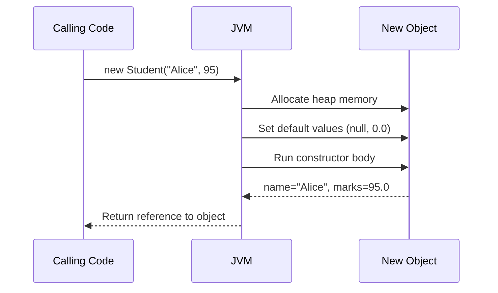

> 📝 **Quick Revision — 2.5**
> - Constructor = special init block, same name as class, no return type
> - Guarantees every object starts in a valid, fully-initialized state
> - Runs automatically and only through `new`

---

## 2.6 — 🤖 Default Constructor

### 📌 Concept

If you write **no constructor at all** in your class, the Java compiler **automatically inserts one** for you — called
the **default constructor**. It takes no parameters and does nothing beyond basic initialization.

### 💻 Compiler-Generated Example

```java
class Student {
    String name;
    double marks;
    // No constructor written here
}

// The compiler secretly generates:
// Student() {
//     super();   // calls the parent class's no-arg constructor
// }
```

```java
public class Main {
    public static void main(String[] args) {
        Student s = new Student();   // works! uses compiler-generated constructor
        System.out.println(s.name);   // prints "null" (default value)
    }
}
```

### ⚡ When It Appears

| Condition                                                    | Default Constructor Appears? |
|--------------------------------------------------------------|------------------------------|
| Class has **no** constructor written at all                  | ✅ Yes                        |
| Class has at least **one** constructor (of any kind) written | ❌ No                         |

> ⚠️ **Common Mistake**
> ```java
> class Student {
>     Student(String name) { this.name = name; }
> }
>
> Student s = new Student();   // ❌ Compile Error!
> ```
> The moment you write **any** constructor yourself, Java **stops** generating the default one. Since no no-argument
> constructor exists anymore, `new Student()` fails to compile. This is one of the most common beginner errors.

> 🔥 **Interview Insight**
> "Is the default constructor the same as a no-argument constructor you write yourself?" — **Not quite.** A "default
> constructor" specifically refers to the one the **compiler auto-generates** when you write none. If *you* manually write
> a no-argument constructor, it's technically called a "no-arg constructor," not a "default constructor" — though they
> behave similarly.

> 📝 **Quick Revision — 2.6**
> - No constructor written → compiler inserts a default, no-arg constructor automatically
> - Writing even one constructor removes this automatic behavior

---

## 2.7 — 🎛️ Parameterized Constructor

### 📌 Concept

A constructor that accepts **parameters**, allowing the object to be initialized with **specific values right at
creation time**.

### ❓ Why Needed

The default constructor gives every field a generic default (`0`, `null`). Real software almost always needs objects to
start with **meaningful, specific data** — a parameterized constructor makes this both possible and mandatory.

### 🌍 Real Use Cases

| Scenario                       | Why a Parameterized Constructor Helps             |
|--------------------------------|---------------------------------------------------|
| Creating a `Student`           | Must supply name and roll number immediately      |
| Creating a `Connection` object | Must supply host, port, credentials at creation   |
| Creating an `Order`            | Must supply customer ID, item list, price upfront |

### 💻 Java Example

```java
class Student {
    String name;
    int rollNumber;

    Student(String name, int rollNumber) {
        this.name = name;
        this.rollNumber = rollNumber;
    }
}

public class Main {
    public static void main(String[] args) {
        Student s1 = new Student("Alice", 101);
        Student s2 = new Student("Rahul", 102);
        System.out.println(s1.name + " - " + s1.rollNumber);
    }
}
```

> 💡 **Important**
> Once you define a parameterized constructor, Java does **not** automatically also give you a no-arg constructor (see
> 2.6's common mistake). If you need both, you must explicitly write both — or use constructor chaining (2.10).

> 📝 **Quick Revision — 2.7**
> - Parameterized constructor = forces meaningful initial values at object creation
> - Prevents objects from silently existing in an incomplete/default state

---

## 2.8 — 🔁 Constructor Overloading

### 📌 Concept

Defining **multiple constructors** in the same class, each with a **different parameter list** — so objects can be
created in different ways depending on what data is available.

### ❓ Why Needed

Sometimes you have full data, sometimes partial. Constructor overloading lets the same class support multiple creation
strategies without duplicating the whole class.

### ⚡ Rules

1. Each constructor must have a **different parameter list** (number, type, or order of parameters).
2. Return type doesn't apply here (constructors never have one), so you **cannot** overload by "return type" — only by
   parameters.
3. The compiler picks the correct constructor **at compile-time**, based on the arguments you pass.

### 💻 Java Example

```java
class Student {
    String name;
    int rollNumber;
    double marks;

    Student() {                                  // no-arg
        this.name = "Unknown";
    }

    Student(String name, int rollNumber) {        // 2 params
        this.name = name;
        this.rollNumber = rollNumber;
    }

    Student(String name, int rollNumber, double marks) {  // 3 params
        this.name = name;
        this.rollNumber = rollNumber;
        this.marks = marks;
    }
}

public class Main {
    public static void main(String[] args) {
        Student s1 = new Student();
        Student s2 = new Student("Rahul", 102);
        Student s3 = new Student("Riya", 103, 91.5);
    }
}
```

### 🏗️ Internal Working

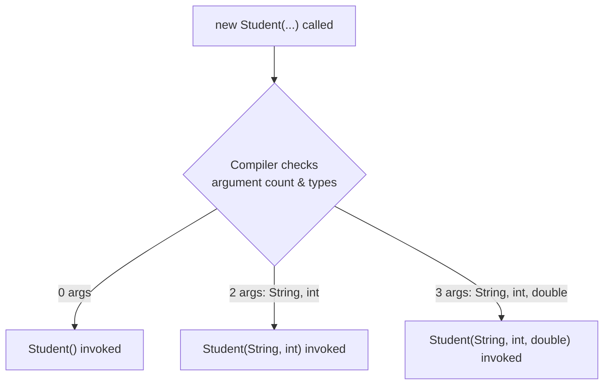

This matching happens entirely at **compile-time** — it's a form of **static (compile-time) polymorphism**, the same
concept as method overloading from Chapter 1.

### 🔥 Interview Insight

<details>
<summary>Can two constructors differ only by parameter names?</summary>

No. The compiler distinguishes constructors (and methods) by their **signature** — number, type, and order of
parameters — never by parameter *names*. `Student(String name)` and `Student(String fullName)` are considered identical
signatures and will cause a compile error if both exist.
</details>

<details>
<summary>Can constructor overloading be considered runtime polymorphism?</summary>

No. It's resolved entirely at compile-time based on the arguments provided — making it a form of **static polymorphism
**, same category as method overloading.
</details>

> 📝 **Quick Revision — 2.8**
> - Multiple constructors, different parameter lists, same class
> - Resolved at compile-time → static/compile-time polymorphism
> - Cannot overload using only different parameter names or return type

---

## 2.9 — 🪄 `this` Keyword

### 📌 Concept

`this` is a special reference variable that always points to the **current object** — the object whose method or
constructor is currently executing.

### ❓ Why `this` Exists

Without `this`, there'd be no clean way to tell apart a constructor's **parameter** from the class's **instance variable
** when they share the same name — a very common, intentional pattern in real code.

### ⚡ Resolving Naming Conflicts

```java
class Student {
    String name;

    Student(String name) {     // parameter also called "name"
        this.name = name;      // this.name = instance variable, name = parameter
    }
}
```

> ⚠️ **Common Mistake**
> ```java
> class Student {
>     String name;
>     Student(String name) {
>         name = name;   // ❌ BUG: assigns parameter to itself, instance variable stays null!
>     }
> }
> ```
> Without `this.`, Java resolves `name = name` as the **local parameter** being assigned to itself — the instance
> variable `name` is **never touched**, silently staying `null`. This is one of the most common real bugs in beginner Java
> code.

### 🧠 Memory Perspective

```
this  ────▶  always points to the SAME object that called the current method/constructor
```

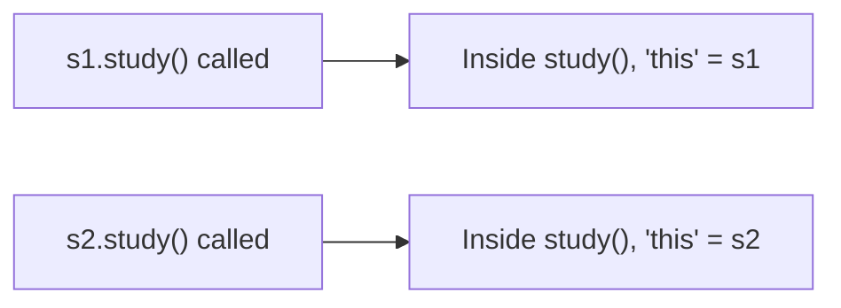

`this` is not a fixed variable — its value is determined **dynamically**, based on which object's method is currently
executing.

### ⚡ Calling Constructors Using `this()`

`this(...)` (with parentheses) is used to call **another constructor of the same class** — this is the mechanism behind
**Constructor Chaining**, covered fully in 2.10.

```java
class Student {
    String name;
    int rollNumber;

    Student() {
        this("Unknown", 0);   // calls the other constructor below
    }

    Student(String name, int rollNumber) {
        this.name = name;
        this.rollNumber = rollNumber;
    }
}
```

> 💡 **Important**
> `this` (no parentheses) → refers to the current object.
> `this(...)` (with parentheses) → calls another constructor in the same class.
> These are two completely different uses of the same keyword — a frequent interview trap.

> 📝 **Quick Revision — 2.9**
> - `this` = reference to the currently executing object
> - Resolves naming conflicts between parameters and instance variables
> - `this(...)` calls another constructor of the same class (must be the **first** line)

---

## 2.10 — 🔗 Constructor Chaining

### 📌 Concept

**Constructor chaining** is calling one constructor from another **within the same class** (using `this(...)`), so
shared initialization logic is written only **once**.

### ❓ Why Needed

Without chaining, multiple overloaded constructors often repeat the same initialization code, violating the principle of
**not repeating yourself**. Chaining lets simpler constructors delegate to more complete ones.

### 🏗️ Internal Flow

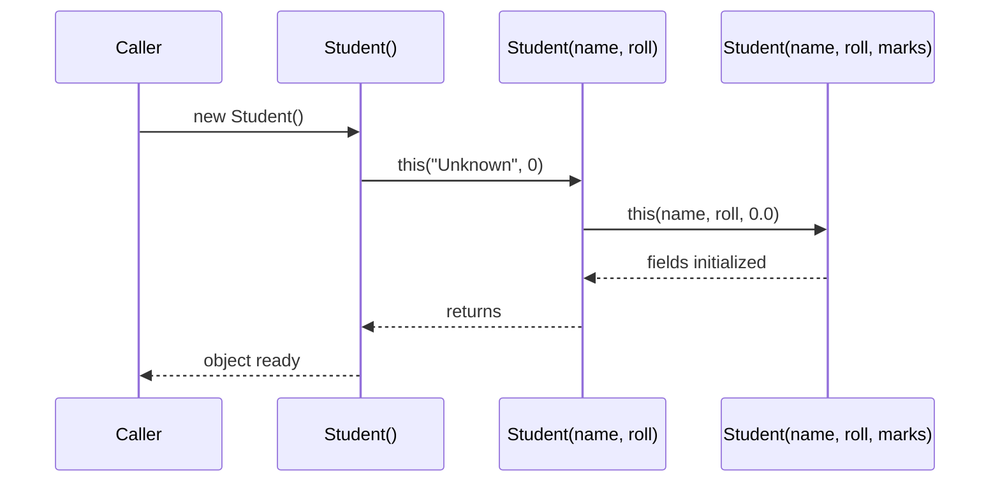

### 💻 Java Example

```java
class Student {
    String name;
    int rollNumber;
    double marks;

    Student() {
        this("Unknown", 0);                 // chains to 2-arg constructor
    }

    Student(String name, int rollNumber) {
        this(name, rollNumber, 0.0);         // chains to 3-arg constructor
    }

    Student(String name, int rollNumber, double marks) {
        this.name = name;
        this.rollNumber = rollNumber;
        this.marks = marks;
        System.out.println("Final initialization complete");
    }
}
```

### ⚠️ Common Mistakes

> ⚠️ **Common Mistake #1 — Wrong Position**
> ```java
> Student() {
>     System.out.println("Creating student");
>     this("Unknown", 0);   // ❌ Compile Error
> }
> ```
> `this(...)` **must be the very first statement** in a constructor. Java enforces this strictly — no code, not even a
> print statement, can come before it.

> ⚠️ **Common Mistake #2 — Circular Chaining**
> ```java
> Student() { this("A", 1); }
> Student(String n, int r) { this(); }   // ❌ Compile Error: circular chain
> ```
> Constructors calling each other in a loop are detected by the compiler and rejected immediately.

> 📝 **Quick Revision — 2.10**
> - Constructor chaining = one constructor calling another via `this(...)`
> - Must be the first statement; avoids duplicate initialization logic
> - Circular chains are caught and rejected at compile-time

---

## 2.11 — 📋 Copy Constructor

### 📌 Concept

A **copy constructor** is a constructor that creates a new object by **copying the field values of an existing object**
of the same class.

> 💡 **Important**
> Java does **not** provide a built-in copy constructor like C++ does. You must write it **yourself**, manually.

### ❓ Why Needed

Sometimes you need a new, independent object that **starts out identical** to an existing one — for example, duplicating
a configuration object before modifying it, so the original stays untouched.

### 🌍 Real World Uses

| Scenario                                                  | Why a Copy Constructor Helps         |
|-----------------------------------------------------------|--------------------------------------|
| Duplicating a `Settings` object before experiment changes | Keep the original safe               |
| Creating a backup `Order` snapshot before processing      | Preserve original state for rollback |
| Cloning a game character's stats for a new save slot      | Avoid shared mutable state bugs      |

### 💻 Syntax & Example

```java
class Student {
    String name;
    int rollNumber;

    Student(String name, int rollNumber) {
        this.name = name;
        this.rollNumber = rollNumber;
    }

    // COPY CONSTRUCTOR
    Student(Student original) {
        this.name = original.name;
        this.rollNumber = original.rollNumber;
    }
}

public class Main {
    public static void main(String[] args) {
        Student s1 = new Student("Alice", 101);
        Student s2 = new Student(s1);   // copy constructor used here

        s2.name = "Riya";   // changing s2 does NOT affect s1
        System.out.println(s1.name);   // "Alice"
        System.out.println(s2.name);   // "Riya"
    }
}
```

> 🔥 **Interview Insight**
> "Does Java have a built-in copy constructor?" — **No.** Unlike C++, Java leaves copying entirely up to the developer —
> via a manually written copy constructor, the `clone()` method, or third-party utilities. This is a frequently asked trap
> question.

> 📝 **Quick Revision — 2.11**
> - Copy constructor = manually written constructor that duplicates another object's fields
> - Java has no automatic copy constructor (unlike C++)
> - Useful for snapshotting/cloning objects safely

---

## 2.12 — 🌊 Shallow Copy

### 📌 Concept

A **shallow copy** copies an object's **primitive fields directly**, but for fields that are **references to other
objects**, it copies only the **reference (address)** — not the actual referenced object.

### 🏗️ Internal Working

```java
class Address {
    String city;

    Address(String city) {
        this.city = city;
    }
}

class Student {
    String name;
    Address address;     // reference type field

    Student(String name, Address address) {
        this.name = name;
        this.address = address;
    }

    // SHALLOW COPY constructor
    Student(Student original) {
        this.name = original.name;          // primitive-like copy (String is immutable anyway)
        this.address = original.address;    // ⚠️ copies the REFERENCE, not the Address object!
    }
}
```

### 🧠 Memory Representation

```
STACK                HEAP
                     ┌─────────────────────────┐
s1 ────────────────▶│ Student @0xA1             │
                     │  name = "Alice"           │
                     │  address ────────────┐    │
                     └──────────────────────┼────┘
                                             │
                     ┌──────────────────────▼────┐
                     │ Address @0xC1              │
                     │  city = "Pune"              │
                     └─────────────────────────────┘
                                             ▲
                     ┌──────────────────────┼────┐
s2 ────────────────▶│ Student @0xB2          │    │
                     │  name = "Alice"        │    │
                     │  address ──────────────┘    │
                     └──────────────────────────────┘
```

Both `s1.address` and `s2.address` point to the **same** `Address` object! Changing `s2.address.city` will also change
what `s1.address.city` shows.

```java
s2.address.city ="Mumbai";
        System.out.

println(s1.address.city);   // "Mumbai" too! ⚠️ Unexpected side effect
```

### ⚡ Advantages

- ✅ Fast — no need to recursively copy nested objects
- ✅ Less memory usage — shared objects aren't duplicated
- ✅ Simple to implement (often just field-by-field assignment, or `Object.clone()` default behavior)

### ⚡ Disadvantages

- ❌ Changes through one object's reference field **leak** into the other object
- ❌ Can cause subtle, hard-to-trace bugs in larger systems
- ❌ Breaks the assumption that a "copy" is fully independent

> ⚠️ **Common Mistake**
> Assuming `Object`'s default `clone()` method gives you a fully independent copy. By default, `clone()` performs a *
*shallow copy** — all reference fields still point to the same nested objects as the original.

> 📝 **Quick Revision — 2.12**
> - Shallow copy → primitives copied directly, reference fields share the SAME nested object
> - Fast and memory-light, but risky — changes can leak across "copies"

---

## 2.13 — 🏔️ Deep Copy

### 📌 Concept

A **deep copy** creates a fully **independent** duplicate — including separate copies of every nested object referenced
by the original, not just the top-level fields.

### 🏗️ Internal Working

```java
class Address {
    String city;

    Address(String city) {
        this.city = city;
    }
}

class Student {
    String name;
    Address address;

    Student(String name, Address address) {
        this.name = name;
        this.address = address;
    }

    // DEEP COPY constructor
    Student(Student original) {
        this.name = original.name;
        this.address = new Address(original.address.city);  // ✅ NEW Address object created
    }
}
```

### 🧠 Memory Representation

```
STACK                HEAP
s1 ────────────────▶ ┌─────────────────────────┐
                     │ Student @0xA1             │
                     │  name = "Alice"           │
                     │  address ───────┐         │
                     └─────────────────┼─────────┘
                                        ▼
                     ┌─────────────────────────┐
                     │ Address @0xC1             │
                     │  city = "Pune"             │
                     └─────────────────────────┘

s2 ────────────────▶ ┌─────────────────────────┐
                     │ Student @0xB2              │
                     │  name = "Alice"            │
                     │  address ───────┐           │
                     └─────────────────┼───────────┘
                                        ▼
                     ┌─────────────────────────┐
                     │ Address @0xD9   (DIFFERENT!) │
                     │  city = "Pune"             │
                     └─────────────────────────┘
```

Now `s1.address` and `s2.address` point to **completely different** `Address` objects.

```java
s2.address.city ="Mumbai";
        System.out.

println(s1.address.city);   // still "Pune" ✅ fully independent
```

### ⚡ Advantages

- ✅ True independence — modifying the copy never affects the original
- ✅ Safer for concurrent/multi-threaded use (no shared mutable state)
- ✅ Predictable behavior, easier to reason about

### ⚡ Disadvantages

- ❌ Slower — every nested object must be recursively copied
- ❌ Higher memory usage — duplicate objects everywhere
- ❌ More code to write and maintain, especially for deeply nested structures

> 🌍 **Real World Example**
> Cloning a video game save file for a "New Game+" mode: you want a **deep copy** so playing the new save never corrupts
> the original save's inventory, stats, or progress.

> 📝 **Quick Revision — 2.13**
> - Deep copy → every nested object is recursively duplicated → fully independent
> - Safer but costs more time and memory than a shallow copy

---

## 2.14 — ⚖️ Shallow Copy vs Deep Copy

### ⚡ Detailed Comparison Table

| Aspect                            | Shallow Copy                                               | Deep Copy                                                 |
|-----------------------------------|------------------------------------------------------------|-----------------------------------------------------------|
| Primitive fields                  | Copied directly                                            | Copied directly                                           |
| Reference fields                  | Same reference shared with original                        | New, independent object created                           |
| Speed                             | Faster                                                     | Slower                                                    |
| Memory usage                      | Lower                                                      | Higher                                                    |
| Independence                      | Partial — nested objects are shared                        | Full — completely independent                             |
| Risk of side effects              | High — changes can leak across copies                      | Low — changes stay isolated                               |
| Default `Object.clone()` behavior | This is the default                                        | Must be manually implemented                              |
| Best for                          | Simple objects, or when sharing nested data is intentional | Objects with mutable nested state that must stay isolated |

### 🧠 Visual Memory Trick

```
Shallow Copy  🌊  →  "Skims the surface" — top-level fields only, nested objects SHARED
Deep Copy     🏔️  →  "Goes all the way down" — every level duplicated, fully INDEPENDENT
```

### 🔥 Interview-Focused Discussion

> 🎯 **Placement Tip**
> A very common interview question: *"If a class has only primitive fields (int, double, boolean...), is there any
difference between shallow and deep copy?"*
> **Answer: No.** The shallow vs deep distinction **only matters when a class has reference-type fields** (objects,
> arrays, collections). With purely primitive fields, both approaches behave identically.

<details>
<summary>🔥 Why does Object.clone() give a shallow copy by default?</summary>

`Object.clone()` performs a simple, fast bit-by-bit copy of the object's memory layout. It has no way of knowing which
reference fields *should* be deeply duplicated versus intentionally shared — so Java takes the safe, fast default (
shallow), and leaves deep copying as something developers must explicitly implement based on their own object's needs.
</details>

<details>
<summary>🔥 How can you achieve a deep copy in real Java code?</summary>

Common approaches: (1) manually write a deep-copy constructor that recursively copies nested objects, (2) override
`clone()` and manually clone reference fields too, (3) use serialization (serialize then deserialize the object), or (4)
use a library like Apache Commons or Gson for JSON-based deep cloning.
</details>

> 📝 **Quick Revision — 2.14**
> - Difference only matters for reference-type fields
> - Shallow = shared nested objects (fast, risky); Deep = independent nested objects (safe, costly)

---

## 2.15 — 🎯 Constructor Interview Questions

<details open>
<summary><b>Click to expand all 25 questions</b></summary>

| #  | Question                                                                                                 | Answer                                                                                                                                                                                          |
|----|----------------------------------------------------------------------------------------------------------|-------------------------------------------------------------------------------------------------------------------------------------------------------------------------------------------------|
| 1  | What is a constructor?                                                                                   | A special block with the same name as the class, having no return type, that runs automatically when an object is created, to initialize it.                                                    |
| 2  | Why doesn't a constructor have a return type?                                                            | Because it doesn't "return" a value in the usual sense — it initializes the object that `new` is already in the process of creating and returning.                                              |
| 3  | What happens if you write `void` before a constructor-looking method?                                    | It stops being a constructor and becomes a normal method with the same name as the class — it will never run automatically on object creation.                                                  |
| 4  | What is a default constructor?                                                                           | A no-argument constructor automatically generated by the compiler when the class defines no constructor at all.                                                                                 |
| 5  | When does the compiler NOT generate a default constructor?                                               | As soon as the class defines any constructor of its own — parameterized or not.                                                                                                                 |
| 6  | What is a parameterized constructor?                                                                     | A constructor that accepts arguments, allowing the caller to supply specific initial values when creating the object.                                                                           |
| 7  | What is constructor overloading?                                                                         | Defining multiple constructors in the same class, each with a different parameter list, so objects can be created in different ways.                                                            |
| 8  | Can constructors be overloaded by return type?                                                           | No — constructors never have a return type, so overloading is based purely on the parameter list.                                                                                               |
| 9  | Is constructor overloading resolved at compile-time or runtime?                                          | Compile-time — it is a form of static (compile-time) polymorphism.                                                                                                                              |
| 10 | What is the `this` keyword used for?                                                                     | It refers to the current object — used to resolve naming conflicts between instance variables and parameters, and to call another constructor via `this(...)`.                                  |
| 11 | What is constructor chaining?                                                                            | One constructor calling another constructor within the same class using `this(...)`, to reuse shared initialization logic.                                                                      |
| 12 | What is the rule about `this(...)` placement?                                                            | It must be the very first statement inside the constructor — no other code can precede it.                                                                                                      |
| 13 | Can constructors call each other in a circular manner?                                                   | No — the compiler detects circular constructor chains and raises a compile-time error.                                                                                                          |
| 14 | What is a copy constructor?                                                                              | A constructor that creates a new object by copying field values from an existing object of the same class.                                                                                      |
| 15 | Does Java provide a built-in copy constructor like C++?                                                  | No. Java does not auto-generate a copy constructor; you must write one manually, or use `clone()`/serialization.                                                                                |
| 16 | What is a shallow copy?                                                                                  | A copy where primitive fields are duplicated directly, but reference-type fields still point to the SAME nested objects as the original.                                                        |
| 17 | What is a deep copy?                                                                                     | A copy where every nested object is also recursively duplicated, making the copy fully independent from the original.                                                                           |
| 18 | Does `Object.clone()` perform a shallow or deep copy by default?                                         | Shallow copy by default.                                                                                                                                                                        |
| 19 | When does the difference between shallow and deep copy NOT matter?                                       | When the class has only primitive fields and no reference-type fields.                                                                                                                          |
| 20 | What problem can shallow copies cause?                                                                   | Changes made through one object's reference field can unexpectedly affect the "copied" object too, since they share the same nested object.                                                     |
| 21 | Are instance variables initialized before or after the constructor runs?                                 | Before — fields are set to default values (0, null, false) first, and the constructor body then assigns the actual values.                                                                      |
| 22 | What's the difference between instance and local variables in terms of default values?                   | Instance variables get automatic default values; local variables do not and must be explicitly initialized before use.                                                                          |
| 23 | Why is `this.name = name` different from `name = name` inside a constructor with a same-named parameter? | `this.name = name` assigns the parameter to the instance variable; `name = name` (without `this`) assigns the parameter to itself, leaving the instance variable untouched — a common real bug. |
| 24 | Can a constructor be `private`?                                                                          | Yes — this is commonly used in Singleton design patterns to prevent external code from creating new instances directly.                                                                         |
| 25 | If `s2 = s1` (assignment, not a copy constructor), is that the same as creating a copy?                  | No. It simply makes `s2` point to the exact same object as `s1` — no new object is created at all, unlike a copy constructor which produces a genuinely separate object.                        |

</details>

> 🔥 **Frequently Asked Interview Trap**
> Interviewers love combining shallow copy + reference assignment in one tricky question: *"If I do `Student s2 = s1;`
and then modify `s2.name`, does `s1.name` change too?"* — **Yes**, because `s2` and `s1` are literally the same object (
> no copying happened at all — that's just reference assignment, not even a shallow copy). Don't confuse plain reference
> assignment with shallow copying — they are different concepts that interviewers intentionally blur together to test real
> understanding.

---

## 📝 Chapter Summary

### ✅ Quick Revision Notes

- A **class** defines structure (fields) and behavior (methods); an **object** is its real, memory-occupying instance.
- **Instance variables** belong to the object (heap, default values); **local variables** belong to a method call (
  stack, no default values).
- Object creation (`new`) = heap allocation → default values set → constructor runs → reference returned to stack.
- A **constructor** has the same name as the class, no return type, and runs automatically on `new`.
- **Default constructor** = compiler-generated, no-arg — disappears the moment you write any constructor yourself.
- **Parameterized constructor** = forces meaningful data at creation time.
- **Constructor overloading** = multiple constructors, different parameter lists, resolved at compile-time.
- **`this`** = reference to the current object; `this(...)` = call to another constructor (must be first statement).
- **Constructor chaining** = constructors calling each other via `this(...)` to avoid duplicate logic.
- **Copy constructor** = manually written, since Java has no built-in version (unlike C++).
- **Shallow copy** = reference fields shared with the original; **Deep copy** = reference fields fully duplicated.

### 🧠 Cheat Sheet

| Concept             | One-Line Memory Hook                                  |
|---------------------|-------------------------------------------------------|
| Class               | "Design, not a thing"                                 |
| Object              | "Thing, with an address"                              |
| Instance variable   | "Lives as long as the object"                         |
| Local variable      | "Lives as long as the method call"                    |
| Default constructor | "Compiler's gift, gone the moment you write your own" |
| `this`              | "Always means *me*, the current object"               |
| `this(...)`         | "Call my sibling constructor"                         |
| Shallow copy        | "Skims the surface — shares nested objects"           |
| Deep copy           | "Goes all the way down — fully independent"           |

### 💡 Important Formulas / Rules

- `this(...)` must be the **first line** of a constructor — no exceptions.
- A class can have unlimited constructors, but **no two can share the same parameter signature**.
- Default values only apply to **instance variables**, never to local variables.
- Shallow vs Deep copy only matters when a class has **reference-type fields**.

### ⚠️ Frequently Forgotten Points

- Writing **any** constructor removes the compiler's automatic default constructor.
- `name = name` (without `this.`) inside a constructor is a silent, hard-to-spot bug.
- Plain reference assignment (`s2 = s1`) is **not** copying — it's two variables pointing to the same object.
- `Object.clone()` is shallow by default — deep copying must be implemented manually.

---

<div align="center">

> 📌 **Keep this file as your Chapter 2 revision sheet.**
> Re-read **Section 2.15** and the **Chapter Summary** the night before any interview.

➡️ **Next Chapter:** [README-03-Encapsulation-Access-Modifiers.md] — *Encapsulation & Access Modifiers*

⭐ *If this helped you, consider starring the repo for quick future access.*

</div>