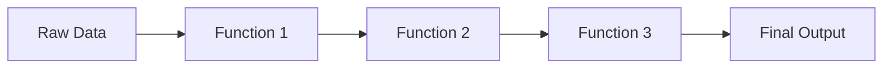
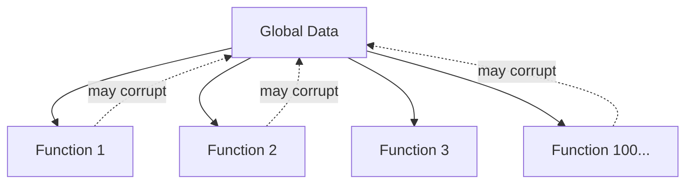
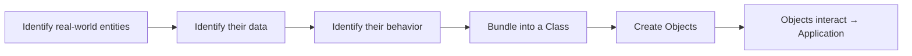
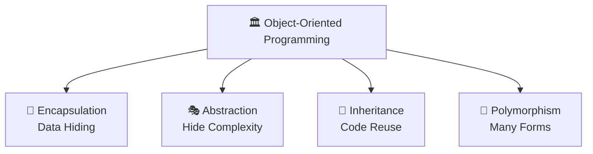
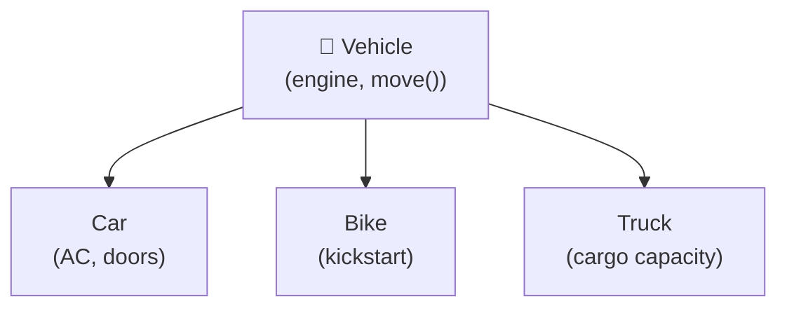
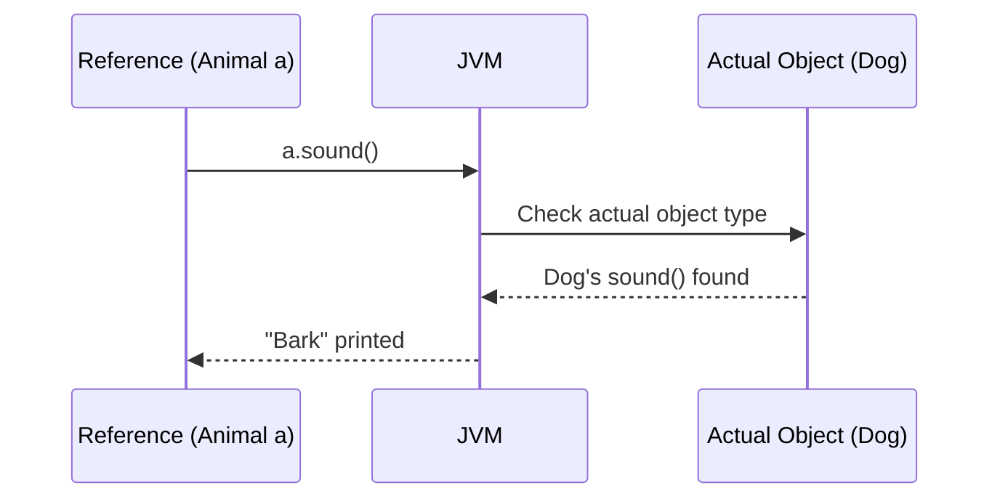
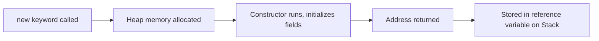

<div align="center">

# 📘 Java OOP Foundation

### From Absolute Beginner → Placement Ready

*A first-principles guide to Object-Oriented Programming in Java — built for Computer Engineering students preparing for
technical interviews.*


</div>

---

## 🗺️ Table of Contents

| # | Chapter                                                      | What You'll Learn                                     |
|---|--------------------------------------------------------------|-------------------------------------------------------|
| 1 | [Programming Paradigms](#chapter-1--programming-paradigms)   | What a paradigm is, procedural style                  |
| 2 | [Why OOP Was Introduced](#chapter-2--why-oop-was-introduced) | The real problems that created OOP                    |
| 3 | [Understanding OOP](#chapter-3--understanding-oop)           | Core philosophy and mental model                      |
| 4 | [Four Pillars of OOP](#chapter-4--the-four-pillars-of-oop)   | Encapsulation, Abstraction, Inheritance, Polymorphism |
| 5 | [Class and Object](#chapter-5--class-and-object)             | Blueprint vs Instance                                 |
| 6 | [Memory View](#chapter-6--memory-view)                       | Heap, Stack, References                               |
| 7 | [Summary Notes](#chapter-7--summary-notes)                   | Rapid revision                                        |
| 8 | [Interview Questions](#chapter-8--interview-questions)       | 24 placement-style Q&As                               |

---

## Chapter 1 — 🧩 Programming Paradigms

### 📌 Concept

A **programming paradigm** is a *style of thinking* about how to structure code to solve a problem. It's not a
language — it's a **mindset** a language encourages.

> 🧠 **Intuition**
> Cooking the same dish two ways:
> - Follow a strict recipe step-by-step → **Procedural**
> - Treat ingredients as independent "things" that know how to behave → **Object-Oriented**
>
> Same goal, different approach.

### ⚡ Key Idea

| Paradigm        | Core Idea                                      | Example Languages |
|-----------------|------------------------------------------------|-------------------|
| Procedural      | Program = sequence of functions acting on data | C, Pascal         |
| Object-Oriented | Program = objects interacting with each other  | Java, C++, Python |
| Functional      | Program = composition of pure functions        | Haskell, Scala    |
| Logical         | Program = facts + rules + inference            | Prolog            |

Java is primarily **Object-Oriented**, with functional features (lambdas, streams) layered on top since Java 8.

---

### 🌍 Real World Example - Procedural Style



In procedural programming, **data flows through independent functions** — the data itself has no behavior of its own.

```java
class StudentData {
    String name;
    int marks;
}

void printStudent(StudentData s) {
    System.out.println(s.name + " scored " + s.marks);
}
```

> ⚠️ **Common Mistake**
> Beginners often think "procedural = bad, OOP = good." That's false. Procedural code is perfectly fine for small
> scripts, automation tools, and simple utilities. OOP becomes valuable as **scale and complexity** increase — explained
> in Chapter 2.

---

### 🏗️ Characteristics of Procedural Programming

| Characteristic       | Explanation                                                   |
|----------------------|---------------------------------------------------------------|
| Top-down design      | Big problem broken into smaller functions, called in sequence |
| Global / shared data | Data often accessible to many functions                       |
| Function-centric     | The function is the basic building block                      |
| Sequential execution | Code largely runs in the order it's written                   |
| No data hiding       | Any function can read/modify any data                         |

<details>
<summary>✅ Advantages of Procedural Programming</summary>

- Simple to understand for small programs
- Fast to write for one-off scripts
- Easier to trace linear flow for small codebases
- No object-creation overhead

</details>

<details>
<summary>❌ Limitations of Procedural Programming</summary>

- Data exposed everywhere → no protection from misuse
- Functions and data become tangled as programs grow
- Poor code reuse → leads to copy-paste duplication
- Hard to model real-world entities naturally
- Changing the data structure forces changes across many functions

</details>

> 📝 **Quick Revision — Chapter 1**
> - Paradigm = style of thinking, not a language
> - Procedural = data + functions kept separate
> - Works well for small programs, struggles at scale
> - Java is mainly OOP with some functional features

---

## Chapter 2 — 🚨 Why OOP Was Introduced

### ❓ Why It Exists

OOP wasn't invented for fun — it was a **direct response** to real pain points that procedural programming caused once
software started getting big, collaborative, and long-living.

### 📌 Problems with Procedural Programming

```java
class Account {
    int balance;
}

void withdraw(Account a, int amount) {
    a.balance -= amount;   // 🚨 No check! Anyone, anywhere, can break this.
}
```

Any part of the program — even unrelated code — can directly change `balance`. There's no enforced rule like *"balance
can never go negative."*

> ⚠️ **Common Mistake**
> Thinking the bug above is a "logic mistake." It's actually a **structural** problem — the language gives *no way* to
> protect this data, no matter how careful the team is.

---

### 🌍 Real-World Software Challenges

| Challenge                                        | Why Procedural Struggled                                           |
|--------------------------------------------------|--------------------------------------------------------------------|
| Multiple developers on one codebase              | Shared global data → conflicts, hidden bugs                        |
| Modeling real entities (orders, accounts, users) | Structs + free functions don't capture "data + behavior" naturally |
| Frequent changing requirements                   | One data change → ripple effect across many functions              |
| Massive codebases (millions of lines)            | No natural way to split code into independent, reusable units      |
| Sensitive data protection                        | No restriction on who can read/write critical data                 |

### 🏗️ Code Scalability Issues



Every new function added is one more place that *might* unintentionally break shared data. This is called **tight
coupling** — a small change in one place can silently break something far away.

### 🛠️ Maintainability Issues

- If a `Student` struct changes (e.g., `marks` becomes subject-wise), **every** function touching `marks` must be
  manually found and fixed.
- No single place "owns" the logic for a `Student` — it's scattered across the codebase.
- New developers must read the *entire* program to understand data flow, since nothing is encapsulated.

### 🔐 Security Issues

- Data is **globally accessible** — any function (even buggy/malicious code) can directly modify sensitive fields like
  balance or passwords.
- No concept of "private" data restricted to specific code.
- One careless line anywhere in the program can corrupt critical data.

> 🎯 **Placement Tip**
> If an interviewer asks *"Why do we need OOP at all? Procedural code also works."* — answer with **scalability,
maintainability, and security**, not just "it's modern" or "it's better." Give the global-data example above; it shows
> you understand the *root cause*, not just the buzzword.

> 📝 **Quick Revision — Chapter 2**
> - Procedural breaks down with team size, complexity, and security needs
> - Root cause: data and behavior are disconnected and globally exposed
> - OOP's mission: bundle data + behavior together, and control access to it

---

## Chapter 3 — 🌱 Understanding OOP

### 📌 Definition of OOP

> **Object-Oriented Programming (OOP)** organizes a program as a collection of **objects**, each combining **data (
state)** and **behavior (methods)** into one unit, interacting with each other to produce results.

### ⚡ Core Idea Behind OOP

Procedural asks: *"What functions do I need?"*
OOP asks: **"What real-world things are involved, and what can they do?"**

Each "thing" becomes an **object** that:

1. Knows things about itself → **state / attributes**
2. Can do things → **behavior / methods**
3. Controls who can access its internals → **access control**

---

### 🌍 Real-World Analogy

| Real World                                                 | OOP Equivalent         |
|------------------------------------------------------------|------------------------|
| A car has color, speed, fuel level                         | **Attributes (data)**  |
| A car can accelerate, brake, honk                          | **Methods (behavior)** |
| You drive without knowing engine wiring                    | **Abstraction**        |
| You can't tamper with the engine via the steering wheel    | **Encapsulation**      |
| A Sports Car *is a* Car, with extras                       | **Inheritance**        |
| "Start" means different things for petrol vs electric cars | **Polymorphism**       |

> 🧠 **Intuition**
> OOP simply takes how humans *naturally* categorize the world — "things that have properties and can act" — and maps
> that directly into code.

---

### 🏗️ Building Software Using Objects



```java
class Account {
    private double balance;   // protected data

    public void withdraw(double amount) {
        if (amount <= balance) {
            balance -= amount;   // rule enforced INSIDE the class
        } else {
            System.out.println("Insufficient funds");
        }
    }
}
```

Now `balance` can **only** change through `withdraw()`, and that method enforces the rule. This single design choice
fixes the maintainability and security problems from Chapter 2.

> 📝 **Quick Revision — Chapter 3**
> - OOP = objects combining data + behavior
> - Mental shift: from "what functions?" to "what things, and what can they do?"
> - Real-world modeling is the foundation of clean OOP design

---

## Chapter 4 — 🏛️ The Four Pillars of OOP



---

### 🔐 4.1 Encapsulation

#### 📌 Concept

Wrapping data and the code that operates on it into a **single unit (class)**, while **restricting direct access** to
that data from outside.

#### ❓ Why It Exists

To stop the procedural disaster of unrestricted, global data access. We need a way to say: *"Only this class's own
methods may touch this data."*

#### ⚡ Key Idea

Protect data → expose only safe, controlled entry points (getters/setters/methods).

#### 🌍 Real World Example

A **medicine capsule**: the medicine (data) sits sealed inside a cover (class). You consume it as a whole, the intended
way — you never touch the raw medicine directly. An ATM works the same way: you never reach into the bank's database —
you interact only through defined buttons.

#### 💻 Java Example

```java
class BankAccount {
    private double balance;   // hidden from outside

    public void deposit(double amount) {
        if (amount > 0) balance += amount;
    }

    public double getBalance() {   // controlled read access
        return balance;
    }
}

public class Main {
    public static void main(String[] args) {
        BankAccount acc = new BankAccount();
        acc.deposit(5000);
        // acc.balance = -9999;   ❌ compile error — balance is private
        System.out.println(acc.getBalance());   // ✅ controlled access
    }
}
```

#### 🏗️ Internal Working

- `private` restricts a member's scope to its own class — enforced by the **compiler**, at compile-time.
- Public getters/setters act as a **gateway**, so validation logic can run before data is read/changed.

> ⚠️ **Common Mistake**
> Writing a getter that returns a **mutable object directly** (e.g., returning the actual internal `List`). The caller
> can then modify it from outside, silently breaking encapsulation. Always return a copy or an unmodifiable view when
> needed.

#### 🔥 Interview Insight

<details>
<summary>Is encapsulation the same as data hiding?</summary>

No. Data hiding is a *result* of encapsulation. Encapsulation is the broader concept of bundling data and behavior
together; restricting access is one of its effects.
</details>

<details>
<summary>Does encapsulation guarantee security?</summary>

No. It improves controlled access, but it is not encryption or authentication — it's a design discipline, not a security
feature in the cryptographic sense.
</details>

> 📝 **Quick Revision — Encapsulation**
> - Bundle data + behavior, restrict direct data access
> - `private` fields + public methods = controlled gateway
> - Solves: global data exposure problem from Chapter 2

---

### 🎭 4.2 Abstraction

#### 📌 Concept

Hiding internal implementation details and showing only the **essential features** to the user.

#### ❓ Why It Exists

Users of a class shouldn't need to understand *how* it works internally to *use* it. Complexity must be hidden behind a
simple interface.

#### ⚡ Key Idea

Separate **"what to do"** from **"how it's done."**

#### 🌍 Real World Example

Driving a car: you use the steering wheel, accelerator, and brake (the **interface**). You don't need to understand the
combustion cycle or transmission gears (the **implementation**) to drive.

#### 💻 Java Example

```java
abstract class Shape {
    abstract double area();   // WHAT — no HOW
}

class Circle extends Shape {
    double radius;

    Circle(double r) {
        radius = r;
    }

    double area() {           // HOW it's actually calculated
        return Math.PI * radius * radius;
    }
}

public class Main {
    public static void main(String[] args) {
        Shape s = new Circle(5);
        System.out.println(s.area());   // caller doesn't care HOW
    }
}
```

| Tool             | Abstraction Level | Can have implementation?                      |
|------------------|-------------------|-----------------------------------------------|
| `abstract class` | Partial           | Yes — some methods can have a body            |
| `interface`      | (Mostly) Full     | Only `default` / `static` methods have a body |

#### 🏗️ Internal Working

- `abstract` methods have **no body** — the JVM defers actual execution to whichever subclass overrides it, decided at *
  *runtime**.
- The compiler enforces a contract: every concrete subclass **must** implement all abstract methods.

> 💡 **Important**
> Abstraction and Encapsulation are **not the same thing**, even though students often confuse them:
> - **Abstraction** → hides *complexity* (design-level decision: what to show)
> - **Encapsulation** → hides *data* (implementation-level decision: how to protect it)

#### 🔥 Interview Insight

<details>
<summary>Can we instantiate an abstract class?</summary>

No, not directly. You must create a subclass that implements all of its abstract methods, and instantiate that subclass
instead.
</details>

> 📝 **Quick Revision — Abstraction**
> - Hide "how", expose only "what"
> - Achieved via `abstract class` or `interface`
> - Lets implementation change later without breaking callers

---

### 🌳 4.3 Inheritance

#### 📌 Concept

A class (**child/subclass**) acquires the properties and behaviors of another class (**parent/superclass**).

#### ❓ Why It Exists

To enable **code reuse** and model natural "is-a" relationships found in the real world.

#### ⚡ Key Idea

Don't repeat shared logic — define it once in a parent, reuse it in every child.

#### 🌍 Real World Example



A **Vehicle** is a general category. **Car**, **Bike**, **Truck** are all vehicles — they share common features (engine,
can move) but also have specialized features.

#### 💻 Java Example

```java
class Vehicle {
    void move() {
        System.out.println("Vehicle is moving");
    }
}

class Car extends Vehicle {     // Car IS-A Vehicle
    void honk() {
        System.out.println("Car honks: Beep!");
    }
}

public class Main {
    public static void main(String[] args) {
        Car c = new Car();
        c.move();   // inherited from Vehicle
        c.honk();   // Car's own method
    }
}
```

#### 🏗️ Internal Working

The JVM maintains a class hierarchy. When `c.move()` is called, the JVM first checks `Car`'s own method table; if not
found there, it walks **up** to `Vehicle`.

> ⚠️ **Common Mistake**
> Assuming Java supports multiple inheritance with classes. It doesn't — Java allows only **single inheritance** for
> classes to avoid the **Diamond Problem** (ambiguity when two parents define the same method). Multiple inheritance of
*type* is allowed only through interfaces.

#### 🔥 Interview Insight

<details>
<summary>Is the constructor inherited?</summary>

No. Constructors are not inherited, but a subclass constructor can invoke the parent's constructor explicitly
using <code>super()</code>.
</details>

> 📝 **Quick Revision — Inheritance**
> - "is-a" relationship between parent and child
> - Reuses logic, avoids duplication
> - Single inheritance for classes, multiple via interfaces

---

### 🔄 4.4 Polymorphism

#### 📌 Concept

"Many forms" — the same method name or entity behaves differently depending on context.

#### ❓ Why It Exists

To let **one interface represent multiple implementations**, so code can be written generically and still work correctly
for many object types.

#### ⚡ Key Idea

One call, many possible behaviors — decided by *who* is actually being called.

#### 🌍 Real World Example

Press the **"start"** button:

- On a car → ignites the engine
- On a phone → boots the OS
- On a washing machine → begins a wash cycle

Same action name, different behavior depending on the object.

#### 💻 Java Example

```java
// 1. Compile-time (Static) Polymorphism — Method Overloading
class Calculator {
    int add(int a, int b) {
        return a + b;
    }

    double add(double a, double b) {
        return a + b;
    }
}

// 2. Runtime (Dynamic) Polymorphism — Method Overriding
class Animal {
    void sound() {
        System.out.println("Some sound");
    }
}

class Dog extends Animal {
    void sound() {
        System.out.println("Bark");
    }   // overridden
}

public class Main {
    public static void main(String[] args) {
        Calculator c = new Calculator();
        System.out.println(c.add(2, 3));        // 5    -> int version
        System.out.println(c.add(2.5, 3.5));     // 6.0  -> double version

        Animal a = new Dog();   // Reference type Animal, Object type Dog
        a.sound();              // "Bark" — decided at RUNTIME
    }
}
```

| Type                  | Decided at   | Mechanism          | Example                            |
|-----------------------|--------------|--------------------|------------------------------------|
| Compile-time (Static) | Compile time | Method Overloading | Same name, different parameters    |
| Runtime (Dynamic)     | Run time     | Method Overriding  | Subclass redefines parent's method |

#### 🏗️ Internal Working



**Overloading** is resolved by the compiler using the method signature — a compile-time decision. **Overriding** uses *
*dynamic method dispatch**: the JVM checks the object's **actual type** at runtime (not the reference type) and calls
the correct overridden method.

> 💡 **Important**
> The reference type only decides **what you're allowed to call**; the actual object type decides **what code actually
runs**.

#### 🔥 Interview Insight

<details>
<summary>Can static methods be overridden?</summary>

No. Static methods are resolved at compile-time based on the reference type — this is called <b>method hiding</b>, not
overriding.
</details>

<details>
<summary>Can we overload methods by changing only the return type?</summary>

No. The parameter list must differ. Changing only the return type creates ambiguity and causes a compile error.
</details>

> 📝 **Quick Revision — Polymorphism**
> - "Many forms" of the same method/interface
> - Overloading = compile-time, same class, different parameters
> - Overriding = runtime, subclass, same signature, dynamic dispatch

---

## Chapter 5 — 🏗️ Class and Object

### 📌 Concept

| Term       | Definition                                                                                                                  |
|------------|-----------------------------------------------------------------------------------------------------------------------------|
| **Class**  | A blueprint/template defining what data and behavior its objects will have. Occupies no memory for instance data by itself. |
| **Object** | A real instance created from a class, occupying actual memory, with its own copy of the data.                               |

### 🧠 Intuition — Blueprint Analogy

```
   CLASS  = Building Blueprint (paper design)
   OBJECT = Actual building constructed from that blueprint

   One blueprint → many buildings can be built
   (same plan, but each building has its own address, furniture, residents)
```

### 💻 Java Example

```java
class Student {              // BLUEPRINT
    String name;
    int marks;

    void study() {
        System.out.println(name + " is studying");
    }
}

public class Main {
    public static void main(String[] args) {
        Student s1 = new Student();   // OBJECT 1
        s1.name = "Alice";
        s1.marks = 95;

        Student s2 = new Student();   // OBJECT 2 — same blueprint
        s2.name = "Rahul";
        s2.marks = 88;

        s1.study();   // "Alice is studying"
        s2.study();   // "Rahul is studying"
    }
}
```

### ⚡ Relationship Between Class and Object

| Class                        | Object                    |
|------------------------------|---------------------------|
| Logical / design-time entity | Physical / runtime entity |
| No memory for instance data  | Memory allocated on Heap  |
| Declared once                | Created many times        |
| Defines structure & behavior | Holds actual values       |

> 🎯 **Placement Tip**
> If asked *"Why do classes even exist if objects do all the real work?"* — answer: classes provide **reusable structure
and type-checking**; objects provide **actual runtime state**. Neither is useful for building real software alone.

> 📝 **Quick Revision — Chapter 5**
> - Class = blueprint, no memory for data
> - Object = real instance, memory allocated on heap
> - Many objects can be created from one class, each with independent state

---

## Chapter 6 — 🧠 Memory View

### 📌 Object Creation Process

```java
Student s1 = new Student();
```



### ⚡ The `new` Keyword

`new` does **three** things:

1. Allocates memory on the **heap** for the object.
2. Calls the class's **constructor** to initialize it.
3. Returns a **reference (address)** to that memory.

### 🏗️ Heap vs Stack

| Heap                                        | Stack                                               |
|---------------------------------------------|-----------------------------------------------------|
| Stores actual **objects** and instance data | Stores **method calls** and **reference variables** |
| Shared across the whole application         | Each method call gets its own frame                 |
| Cleaned by the **Garbage Collector**        | Frame destroyed when method returns                 |

### 🧠 ASCII Diagram — Reference Variables

```
STACK                          HEAP
┌────────────────┐            ┌─────────────────────────┐
│ s1 = 0x1A2B  ───┼───────────▶│ Student object @0x1A2B  │
└────────────────┘            │  name = "Alice"          │
                               │  marks = 95              │
                               └─────────────────────────┘
```

> ⚠️ **Common Mistake**
> Thinking `s1` *contains* the object. It doesn't — `s1` only holds the **address** where the object lives on the heap.
> This is why Java is described as using "reference semantics" for objects.

### 🧠 Multiple Objects from the Same Class

```java
Student s1 = new Student();
Student s2 = new Student();
Student s3 = s1;     // s3 points to the SAME object as s1 — no new object!
```

```
STACK                          HEAP
┌────────────────┐
│ s1 = 0x1A2B  ───┼──────┐     ┌─────────────────────────┐
│ s2 = 0x3F9C  ───┼──┐   └────▶│ Student @0x1A2B           │
│ s3 = 0x1A2B  ───┼──┼────────▶│  name="Alice", marks=95   │
└────────────────┘  │         └─────────────────────────┘
                     │
                     │         ┌─────────────────────────┐
                     └────────▶│ Student @0x3F9C           │
                               │  name="Rahul", marks=88   │
                               └─────────────────────────┘
```

> 🔥 **Interview Insight**
> "Does `s3 = s1` create a new object?" → **No.** It copies the **reference** (address), not the object. Both variables
> now point to the **same** heap memory — changing one affects the other.

> 📝 **Quick Revision — Chapter 6**
> - `new` = allocate heap memory + run constructor + return address
> - Heap → objects; Stack → method frames + reference variables
> - Assigning a reference copies the address only, not the object

---

## Chapter 7 — 📝 Summary Notes

> Use this section for rapid, last-minute revision before walking into an interview.

- **Paradigm** = a style/approach of programming, not a language.
- **Procedural programming** = data and functions are separate; fine for small programs; breaks down at scale due to
  global data and tight coupling.
- **OOP emerged** to fix scalability, maintainability, and security issues of procedural code by bundling data +
  behavior into objects.
- **OOP core idea**: model real-world entities as objects with state (data) and behavior (methods).
- **Four Pillars**
    - 🔐 **Encapsulation** → bundle + restrict access to data
    - 🎭 **Abstraction** → hide implementation, expose only essentials
    - 🌳 **Inheritance** → reuse and extend via parent-child relationships
    - 🔄 **Polymorphism** → same interface, many implementations
- **Class** = blueprint (no instance memory); **Object** = actual instance (heap memory).
- `new` keyword → allocates heap memory + calls constructor + returns reference.
- **Stack** holds method calls and reference variables; **Heap** holds actual objects.
- Assigning `s2 = s1` copies the **address**, not the object — both point to the same memory.
- **Overloading**: same name, different parameters, resolved at **compile-time**.
- **Overriding**: subclass redefines parent method, resolved at **runtime** via dynamic dispatch.
- Java supports **single inheritance** for classes, **multiple inheritance via interfaces**.
- **Static methods cannot be overridden** — only hidden (compile-time resolution).
- Encapsulation ≠ full security — it's about **controlled access**.
- Abstraction hides **complexity**; Encapsulation hides **data**.

> 💡 **Remember**
> Whenever you're confused between two OOP terms, ask: *"Is this about hiding implementation (abstraction), or about
protecting data (encapsulation)? Is this about reuse (inheritance), or about flexible behavior (polymorphism)?"* This
> single question resolves most confusion instantly.

---

## Chapter 8 — 🎯 Interview Questions

<details open>
<summary><b>Click to expand all 24 questions</b></summary>

| #  | Question                                                    | Answer                                                                                                                                                                                                                                                |
|----|-------------------------------------------------------------|-------------------------------------------------------------------------------------------------------------------------------------------------------------------------------------------------------------------------------------------------------|
| 1  | What is a programming paradigm?                             | A fundamental style/approach to structuring and writing code to solve problems (e.g., procedural, object-oriented, functional).                                                                                                                       |
| 2  | Why did procedural programming fail for large systems?      | Data and functions are separate and globally accessible, causing tight coupling, poor reuse, and maintainability/security issues as codebases grew.                                                                                                   |
| 3  | What is OOP in one line?                                    | A paradigm that organizes software as interacting objects, each combining data and behavior, modeled after real-world entities.                                                                                                                       |
| 4  | What are the four pillars of OOP?                           | Encapsulation, Abstraction, Inheritance, Polymorphism.                                                                                                                                                                                                |
| 5  | What is a class?                                            | A blueprint/template defining the structure (fields) and behavior (methods) its objects will have; it doesn't hold actual data itself.                                                                                                                |
| 6  | What is an object?                                          | A runtime instance of a class, with its own memory and actual values for the fields defined by the class.                                                                                                                                             |
| 7  | Where are objects stored in memory?                         | On the Heap. Reference variables pointing to them are stored on the Stack.                                                                                                                                                                            |
| 8  | What does the `new` keyword do internally?                  | Allocates heap memory for the object, invokes the constructor to initialize it, and returns the object's memory address into a reference variable.                                                                                                    |
| 9  | What is encapsulation?                                      | Bundling data and methods into a single unit (class) and restricting direct access to data using `private`, exposing controlled access via public methods.                                                                                            |
| 10 | What is abstraction?                                        | Hiding internal implementation details and exposing only essential functionality, typically via abstract classes or interfaces.                                                                                                                       |
| 11 | Difference between abstraction and encapsulation?           | Abstraction hides complexity/implementation at the design level; Encapsulation hides data at the implementation level.                                                                                                                                |
| 12 | What is inheritance and why use it?                         | A mechanism where a subclass acquires properties/behavior of a superclass; used for code reuse and to model "is-a" relationships.                                                                                                                     |
| 13 | Why doesn't Java support multiple inheritance with classes? | To avoid the Diamond Problem — ambiguity when two parent classes share a method signature. Interfaces avoid this since they don't carry conflicting state by default.                                                                                 |
| 14 | What is polymorphism?                                       | The ability of the same method name/interface to take many forms, behaving differently based on the object or arguments involved.                                                                                                                     |
| 15 | Difference between overloading and overriding?              | Overloading: same method name, different parameters, same class, compile-time. Overriding: subclass redefines a method with the exact same signature, resolved at runtime.                                                                            |
| 16 | Can we overload methods by changing only the return type?   | No. Parameter list must differ; changing only the return type causes ambiguity and a compile error.                                                                                                                                                   |
| 17 | Can static methods be overridden?                           | No. Static methods belong to the class, resolved at compile-time — this is method hiding, not overriding.                                                                                                                                             |
| 18 | What is dynamic method dispatch?                            | The JVM mechanism that decides, at runtime, which overridden method to invoke based on the actual object type, not the reference type.                                                                                                                |
| 19 | Difference between a reference variable and an object?      | A reference variable (on the stack) holds the memory address of an object; the object itself (on the heap) holds the actual data.                                                                                                                     |
| 20 | If `s2 = s1`, does it create a new object?                  | No. It copies the reference (address). Both `s1` and `s2` now point to the same object in heap memory.                                                                                                                                                |
| 21 | Difference between abstract class and interface?            | Abstract class can have both implemented and abstract methods, supports single inheritance, and can hold state. Interface defines method contracts (plus default/static methods), supports multiple inheritance of type, and favors pure abstraction. |
| 22 | Why are constructors not inherited?                         | A constructor initializes the specific class it belongs to; a subclass constructor can still reuse parent logic by calling `super()`.                                                                                                                 |
| 23 | What is the real benefit of OOP in large team projects?     | Each class encapsulates its own responsibility, so developers can work on different classes independently with minimal conflict, and changes stay localized.                                                                                          |
| 24 | What problem does polymorphism solve in real applications?  | It removes the need for long type-checking conditional chains, allowing new types/behaviors to be added without modifying existing calling code.                                                                                                      |

</details>

---

## ✅ Next Steps

Once this chapter feels solid, continue with:

- 🏗️ Constructors (default, parameterized, copy, constructor chaining)
- 🔑 Access Modifiers in depth (`private`, `default`, `protected`, `public`)
- 🔄 `this` vs `super`
- 🎭 Interfaces vs Abstract Classes (deep dive)
- ⚙️ `static` vs instance members
- 🧬 Object class methods (`equals()`, `hashCode()`, `toString()`)

<div align="center">

> 📌 **Keep this file as your Chapter 1 revision sheet.**
> Re-read **Chapter 7** and **Chapter 8** the night before any interview.

⭐ *If this helped you, consider starring the repo for quick future access.*

</div>